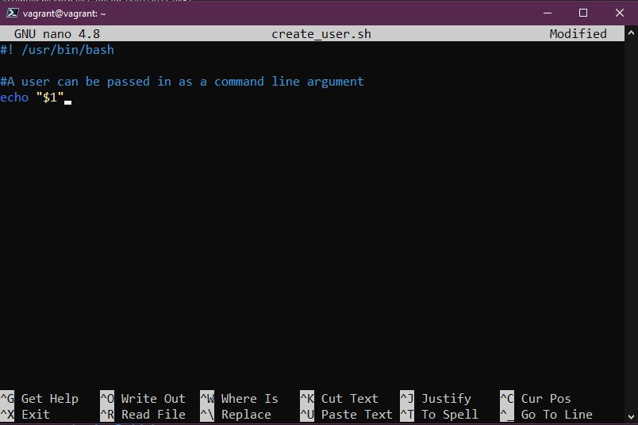

## Automate tasks with bash scripts

The shell that we are going to use today is the bash but we will cover another shell tomorrow when we dive into ZSH.

BASH - **B**ourne **A**gain **Sh**ell

We could almost dedicate a whole section of 7 days to shell scripting much like the programming languages, bash gives us the capability of working alongside other automation tools to get things done.

I still speak to a lot of people who have set up some complex shell scripts to make something happen and they rely on this script for some of the most important things in the business, I am not saying we need to understand shell/bash scripting for this purpose, this is not the way. But we should learn shell/bash scripting to work alongside our automation tools and for ad-hoc tasks.

An example of this that we have used in this section could be the VAGRANTFILE we used to create our VM, we could wrap this into a simple bash script that deleted and renewed this every Monday morning so that we have a fresh copy of our Linux VM every week, we could also add all the software stack that we need on said Linux machine and so on all through this one bash script.

I think another thing I am at least hearing is that hands-on scripting questions are becoming more and more apparent in all lines of interviews.

### Getting started

As with a lot of things we are covering in this whole 90 days, the only real way to learn is through doing. Hands-on experience is going to help soak all of this into your muscle memory.

First of all, we are going to need a text editor. On [Day 17](day17.md) we covered probably the two most common text editors and a little on how to use them.

Let's get straight into it and create our first shell script.

`touch 90DaysOfDevOps.sh`

Followed by `nano 90DaysOfDevOps.sh` this will open our new blank shell script in nano. Again you can choose your text editor of choice here.

The first line of all bash scripts will need to look something like this `#!/usr/bin/bash` this is the path to your bash binary.

You should however check this in the terminal by running `which bash` if you are not using Ubuntu then you might also try `whereis bash` from the terminal.

However, you may see other paths listed in already created shell scripts which could include:

- `#!/bin/bash`
- `#!/usr/bin/env bash`

In the next line in our script, I like to add a comment and add the purpose of the script or at least some information about me. You can do this by using the `#` This allows us to comment on particular lines in our code and provide descriptions of what the upcoming commands will be doing. I find the more notes the better for the user experience especially if you are sharing this.

I sometimes use figlet, a program we installed earlier in the Linux section to create some asci art to kick things off in our scripts.


All of the commands we have been through earlier in this Linux section ([Day15](day15.md)) could be used here as a simple command to test our script.

Let's add a simple block of code to our script.

```
mkdir 90DaysOfDevOps
cd 90DaysOfDevOps
touch Day19
ls
```

You can then save this and exit your text editor, if we run our script with `./90DaysOfDevOps.sh` you should get a permission denied message. You can check the permissions of this file using the `ls -al` command and you can see highlighted we do not have executable rights on this file.


We can change this using `chmod +x 90DaysOfDevOps.sh` and then you will see the `x` meaning we can now execute our script.


Now we can run our script again using `./90DaysOfDevOps.sh` after running the script has now created a new directory, changed into that directory and then created a new file.


Pretty basic stuff but you can start to see hopefully how this could be used to call on other tools as part of ways to make your life easier and automate things.

### Variables, Conditionals

A lot of this section is a repeat of what we covered when we were learning Golang but I think it's worth us diving in here again.

- ### Variables

Variables enable us to define once a particular repeated term that is used throughout a potentially complex script.

To add a variable you simply add it like this to a clean line in your script.

`challenge="90DaysOfDevOps"`

This way when and where we use `$challenge` in our code, if we change the variable it will be reflected throughout.


If we now run our `sh` script you will see the printout that was added to our script.


We can also ask for user input that can set our variables using the following:

```
echo "Enter your name"
read name
```

This would then define the input as the variable `$name` We could then use this later on.

- ### Conditionals

Maybe we want to find out who we have on our challenge and how many days they have completed, we can define this using `if` `if-else` `else-if` conditionals, this is what we have defined below in our script.

```
#!/bin/bash
#  ___   ___  ____                   ___   __ ____              ___
# / _ \ / _ \|  _ \  __ _ _   _ ___ / _ \ / _|  _ \  _____   __/ _ \ _ __  ___
#| (_) | | | | | | |/ _` | | | / __| | | | |_| | | |/ _ \ \ / / | | | '_ \/ __|
# \__, | |_| | |_| | (_| | |_| \__ \ |_| |  _| |_| |  __/\ V /| |_| | |_) \__ \
#   /_/ \___/|____/ \__,_|\__, |___/\___/|_| |____/ \___| \_/  \___/| .__/|___/
#                         |___/                                     |_|
#
# This script is to demonstrate bash scripting!

# Variables to be defined

ChallengeName=#90DaysOfDevOps
TotalDays=90

# User Input

echo "Enter Your Name"
read name
echo "Welcome $name to $ChallengeName"
echo "How Many Days of the $ChallengeName challenge have you completed?"
read DaysCompleted

if [ $DaysCompleted -eq 90 ]
then
  echo "You have finished, well done"
elif [ $DaysCompleted -lt 90 ]
then
  echo "Keep going you are doing great"
else
  echo "You have entered the wrong amount of days"
fi
```

You can also see from the above that we are running some comparisons or checking values against each other to move on to the next stage. We have different options here worth noting.

- `eq` - if the two values are equal will return TRUE
- `ne` - if the two values are not equal will return TRUE
- `gt` - if the first value is greater than the second value will return TRUE
- `ge` - if the first value is greater than or equal to the second value will return TRUE
- `lt` - if the first value is less than the second value will return TRUE
- `le` - if the first value is less than or equal to the second value will return TRUE

We might also use bash scripting to determine information about files and folders, this is known as file conditions.

- `-d file` True if the file is a directory
- `-e file` True if the file exists
- `-f file` True if the provided string is a file
- `-g file` True if the group id is set on a file
- `-r file` True if the file is readable
- `-s file` True if the file has a non-zero size

```
FILE="90DaysOfDevOps.txt"
if [ -f "$FILE" ]
then
  echo "$FILE is a file"
else
  echo "$FILE is not a file"
fi
```


Providing we have that file still in our directory we should get the first echo command back. But if we remove that file then we should get the second echo command.


You can hopefully see how this can be used to save you time when searching through a system for specific items.

I found this amazing repository on GitHub that has what seems to be an endless amount of scripts [DevOps Bash Tools](https://github.com/HariSekhon/DevOps-Bash-tools/blob/master/README.md)

### Example

**Scenario**: We have our company called "90DaysOfDevOps" and we have been running a while and now it is time to expand the team from 1 person to lots more over the coming weeks, I am the only one so far that knows the onboarding process so we want to reduce that bottleneck by automating some of these tasks.

**Requirements**:

- A user can be passed in as a command line argument.
- A user is created with the name of the command line argument.
- A password can be parsed as a command line argument.
- The password is set for the user
- A message of successful account creation is displayed.

Let's start with creating our shell script with `touch create_user.sh`

Before we move on let's also make this executable using `chmod +x create_user.sh`

then we can use `nano create_user.sh` to start editing our script for the scenario we have been set.

We can take a look at the first requirement "A user can be passed in as a command line argument" we can use the following

```
#! /usr/bin/bash

#A user can be passed in as a command line argument
echo "$1"
```



Go ahead and run this using `./create_user.sh Michael` replace Michael with your name when you run the script.


Next up we can take that second requirement "A user is created with the name of command line argument" this can be done with the `useradd` command. The `-m` option is to create the user home directory as /home/username

```
#! /usr/bin/bash

#A user can be passed in as a command line argument
echo "$1 user account being created."

#A user is created with the name of the command line argument
sudo useradd -m "$1"

```

Warning: If you do not provide a user account name then it will error as we have not filled the variable `$1`

We can then check this account has been created with the `awk -F: '{ print $1}' /etc/passwd` command.


Our next requirement is "A password can be parsed as a command line argument." First of all, we are not going to ever do this in production it is more for us to work through a list of requirements in the lab to understand.

```
#! /usr/bin/bash

#A user can be passed in as a command line argument
echo "$1 user account being created."

#A user is created with the name of the command line argument
sudo useradd -m "$1"

#A password can be parsed as a command line argument.
sudo chpasswd <<< "$1":"$2"
```

If we then run this script with the two parameters `./create_user.sh 90DaysOfDevOps password`

You can see from the below image that we executed our script it created our user and password and then we manually jumped into that user and confirmed with the `whoami` command.


The final requirement is "A message of successful account creation is displayed." We already have this in the top line of our code and we can see on the above screenshot that we have a `90DaysOfDevOps user account being created` shown. This was left from our testing with the `$1` parameter.

Now, this script can be used to quickly onboard and set up new users on to our Linux systems. But maybe instead of a few of the historic people having to work through this and then having to get other people their new usernames or passwords we could add some user input that we have previously covered earlier on to capture our variables.

```
#! /usr/bin/bash

echo "What is your intended username?"
read  username
echo "What is your password"
read  password

#A user can be passed in as a command line argument
echo "$username user account being created."

#A user is created with the name of the command line argument
sudo useradd -m $username

#A password can be parsed as a command line argument.
sudo chpasswd <<< $username:$password
```

With the steps being more interactive,


Just to finish this off maybe we do want to output a successful output to say that our new user account has finished being created.


One thing I did notice was that we are displaying the password on our input we can hide this by using the `-s` flag in the line of code `read -s password`


If you do want to delete the user you have created for lab purposes then you can do that with `sudo userdel test_user`

[Example Script](Linux/create-user.sh)

Once again I am not saying this is going to be something that you do create in your day to day but it was something I thought of that would highlight the flexibility of what you could use shell scripting for.

Think about any repeatable tasks that you do every day or week or month and how could you better automate that, first option is likely going to be using a bash script before moving into more complex territory.

I have created a very simple bash file that helps me spin up a Kubernetes cluster using minikube on my local machine along with data services and Kasten K10 to help demonstrate the requirements and needs around data management. [Project Pace](https://github.com/MichaelCade/project_pace/blob/main/singlecluster_demo.sh) But I did not feel this appropriate to raise here as we have not covered Kubernetes yet.

## Resources

- [Bash in 100 seconds](https://www.youtube.com/watch?v=I4EWvMFj37g)
- [Bash script with practical examples - Full Course](https://www.youtube.com/watch?v=TPRSJbtfK4M)
- [Client SSH GUI - Remmina](https://remmina.org/)
- [The Beginner's guide to SSH](https://www.youtube.com/watch?v=2QXkrLVsRmk)
- [Vim in 100 Seconds](https://www.youtube.com/watch?v=-txKSRn0qeA)
- [Vim tutorial](https://www.youtube.com/watch?v=IiwGbcd8S7I)
- [Learn the Linux Fundamentals - Part 1](https://www.youtube.com/watch?v=kPylihJRG70)
- [Linux for hackers (don't worry you don't need to be a hacker!)](https://www.youtube.com/watch?v=VbEx7B_PTOE)

See you on [Day20](day20.md)
