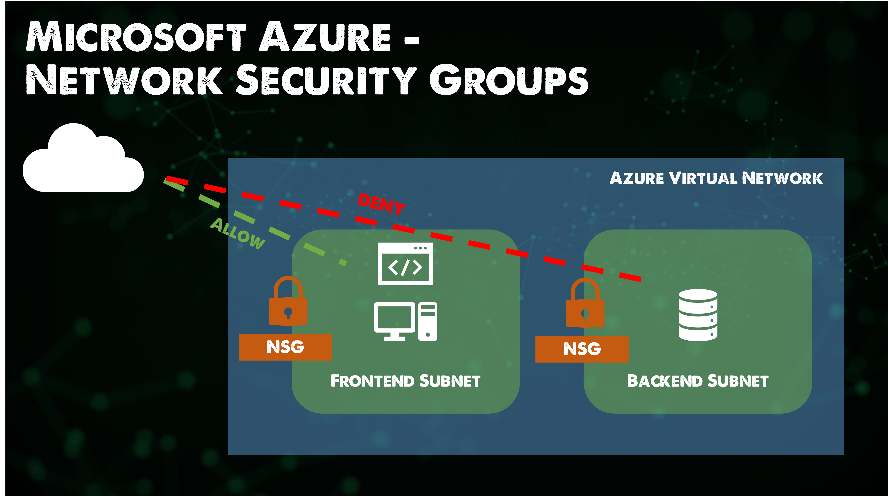
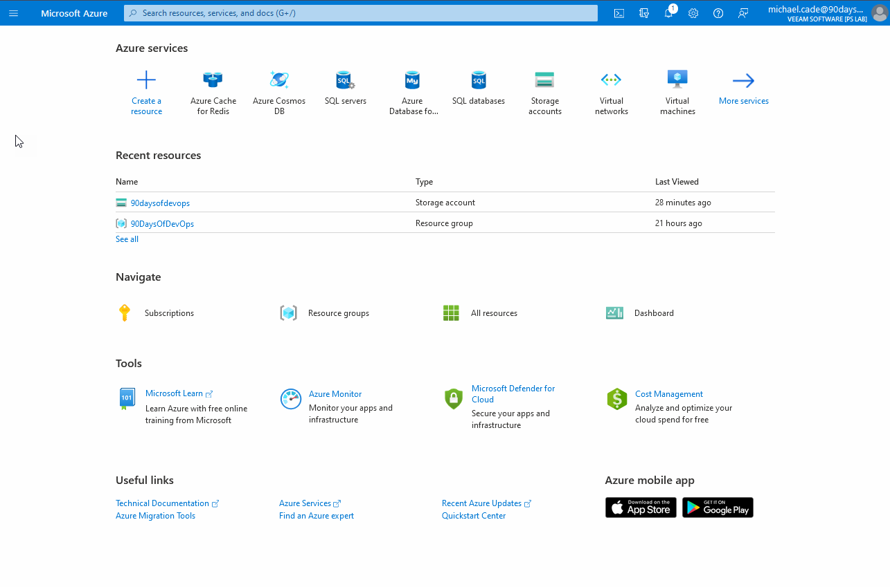
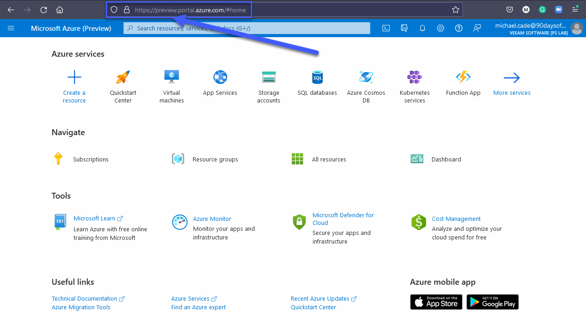
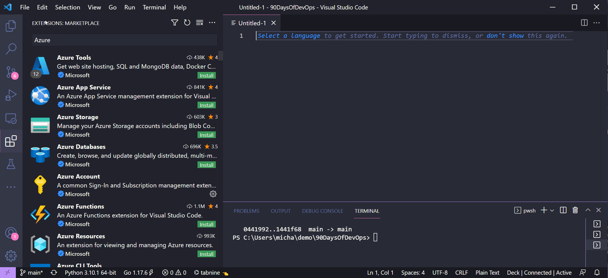

## Microsoft Azure Networking Models + Azure Management

As if today marks the anniversary of Microsoft Azure and its 12th Birthday! (1st February 2022) Anyway, we are going to cover the networking models within Microsoft Azure and some of the management options for Azure. So far we have only used the Azure portal but we have mentioned other areas that can be used to drive and create our resources within the platform.

## Azure Network Models

### Virtual Networks

- A virtual network is a construct created in Azure.
- A virtual network has one or more IP ranges assigned to it.
- Virtual networks live within a subscription within a region.
- Virtual subnets are created in the virtual network to break up the network range.
- Virtual machines are placed in virtual subnets.
- All virtual machines within a virtual network can communicate.
- 65,536 Private IPs per Virtual Network.
- Only pay for egress traffic from a region. (Data leaving the region)
- IPv4 & IPv6 Supported.
  - IPv6 for public-facing and within virtual networks.

We can liken Azure Virtual Networks to AWS VPCs. However, there are some differences to note:

- In AWS a default VNet is created that is not the case in Microsoft Azure, you have to create your first virtual network to your requirements.
- All Virtual Machines by default in Azure have NAT access to the internet. No NAT Gateways as per AWS.
- In Microsoft Azure, there is no concept of Private or Public subnets.
- Public IPs are a resource that can be assigned to vNICs or Load Balancers.
- The Virtual Network and Subnets have their own ACLs enabling subnet level delegation.
- Subnets across Availability Zones whereas in AWS you have subnets per Availability Zones.

We also have Virtual Network Peering. This enables virtual networks across tenants and regions to be connected using the Azure backbone. Not transitive but can be enabled via Azure Firewall in the hub virtual network. Using a gateway transit allows peered virtual networks to the connectivity of the connected network and an example of this could ExpressRoute to On-Premises.

### Access Control

- Azure utilises Network Security Groups, these are stateful.
- Enable rules to be created and then assigned to a network security group
- Network security groups applied to subnets or VMs.
- When applied to a subnet it is still enforced at the Virtual Machine NIC that it is not an "Edge" device.

- Rules are combined in a Network Security Group.
- Based on the priority, flexible configurations are possible.
- Lower priority number means high priority.
- Most logic is built by IP Addresses but some tags and labels can also be used.

| Description      | Priority | Source Address     | Source Port | Destination Address | Destination Port | Action |
| ---------------- | -------- | ------------------ | ----------- | ------------------- | ---------------- | ------ |
| Inbound 443      | 1005     | \*                 | \*          | \*                  | 443              | Allow  |
| ILB              | 1010     | Azure LoadBalancer | \*          | \*                  | 10000            | Allow  |
| Deny All Inbound | 4000     | \*                 | \*          | \*                  | \*               | DENY   |

We also have Application Security Groups (ASGs)

- Where NSGs are focused on the IP address ranges which may be difficult to maintain for growing environments.
- ASGs enable real names (Monikers) for different application roles to be defined (Webservers, DB servers, WebApp1 etc.)
- The Virtual Machine NIC is made a member of one or more ASGs.

The ASGs can then be used in rules that are part of Network Security Groups to control the flow of communication and can still use NSG features like service tags.

| Action | Name               | Source     | Destination | Port         |
| ------ | ------------------ | ---------- | ----------- | ------------ |
| Allow  | AllowInternettoWeb | Internet   | WebServers  | 443(HTTPS)   |
| Allow  | AllowWebToApp      | WebServers | AppServers  | 443(HTTPS)   |
| Allow  | AllowAppToDB       | AppServers | DbServers   | 1443 (MSSQL) |
| Deny   | DenyAllinbound     | Any        | Any         | Any          |

### Load Balancing

Microsoft Azure has two separate load balancing solutions. (the first party, there are third parties available in the Azure marketplace.) Both can operate with externally facing or internally facing endpoints.

- Load Balancer (Layer 4) supporting hash-based distribution and port-forwarding.
- App Gateway (Layer 7) supports features such as SSL offload, cookie-based session affinity and URL-based content routing.

Also with the App Gateway, you can optionally use the Web Application firewall component.

## Azure Management Tools

We have spent most of our theory time walking through the Azure Portal, I would suggest that when it comes to following a DevOps culture and process a lot of these tasks, especially around provisioning will be done via an API or a command-line tool. I wanted to touch on some of those other management tools that we have available to us as we need to know this for when we are automating the provisioning of our Azure environments.

### Azure Portal

The Microsoft Azure Portal is a web-based console, that provides an alternative to command-line tools. You can manage your subscriptions within the Azure Portal. Build, Manage, and Monitor everything from a simple web app to complex cloud deployments. Another thing you will find within the portal are these breadcrumbs, JSON as mentioned before is the underpinning of all Azure Resources, It might be that you start in the Portal to understand the features, services and functionality but then later understand the JSON underneath to incorporate into your automated workflows.

There is also the Azure Preview portal, this can be used to view and test new and upcoming services and enhancements.

### PowerShell

Before we get into Azure PowerShell it is worth introducing PowerShell first. PowerShell is a task automation and configuration management framework, a command-line shell and a scripting language. We might and dare I say this liken this to what we have covered in the Linux section around shell scripting. PowerShell was very much first found on Windows OS but it is now cross-platform.

Azure PowerShell is a set of cmdlets for managing Azure resources directly from the PowerShell command line.

We can see below that you can connect to your subscription using the PowerShell command `Connect-AzAccount`

Then if we wanted to find some specific commands associated with Azure VMs we can run the following command. You could spend hours learning and understanding more about this PowerShell programming language.

There are some great quickstarts from Microsoft on getting started and provisioning services from PowerShell [here](https://docs.microsoft.com/en-us/powershell/azure/get-started-azureps?view=azps-7.1.0)

### Visual Studio Code

Like many, and as you have all seen my go-to IDE is Visual Studio Code.

Visual Studio Code is a free source-code editor made by Microsoft for Windows, Linux and macOS.

You will see below that there are lots of integrations and tools built into Visual Studio Code that you can use to interact with Microsoft Azure and the services within.

### Cloud Shell

Azure Cloud Shell is an interactive, authenticated, browser-accessible shell for managing Azure resources. It provides the flexibility of choosing the shell experience that best suits the way you work.

You can see from the below when we first launch Cloud Shell within the portal we can choose between Bash and PowerShell.

To use the cloud shell you will have to provide a bit of storage in your subscription.

When you select to use the cloud shell it is spinning up a machine, these machines are temporary but your files are persisted in two ways; through a disk image and a mounted file share.

- Cloud Shell runs on a temporary host provided on a per-session, per-user basis
- Cloud Shell times out after 20 minutes without interactive activity
- Cloud Shell requires an Azure file share to be mounted
- Cloud Shell uses the same Azure file share for both Bash and PowerShell
- Cloud Shell is assigned one machine per user account
- Cloud Shell persists $HOME using a 5-GB image held in your file share
- Permissions are set as a regular Linux user in Bash

The above was copied from [Cloud Shell Overview](https://docs.microsoft.com/en-us/azure/cloud-shell/overview)

### Azure CLI

Finally, I want to cover the Azure CLI, The Azure CLI can be installed on Windows, Linux and macOS. Once installed you can type `az` followed by other commands to create, update, delete and view Azure resources.

When I initially came into my Azure learning I was a little confused by there being Azure PowerShell and the Azure CLI.

I would love some feedback from the community on this as well. But the way I see it is that Azure PowerShell is a module added to Windows PowerShell or PowerShell Core (Also available on other OS but not all) Whereas Azure CLI is a cross-platform command-line program that connects to Azure and executes those commands.

Both of these options have a different syntax, although they can from what I can see and what I have done do very similar tasks.

For example, creating a virtual machine from PowerShell would use the `New-AzVM` cmdlet whereas Azure CLI would use `az VM create`.

You saw previously that I have the Azure PowerShell module installed on my system but then I also have the Azure CLI installed that can be called through PowerShell on my Windows machine.

The takeaway here as we already mentioned is about choosing the right tool. Azure runs on automation. Every action you take inside the portal translates somewhere to code being executed to read, create, modify, or delete resources.

Azure CLI

- Cross-platform command-line interface, installable on Windows, macOS, Linux
- Runs in Windows PowerShell, Cmd, Bash and other Unix shells.

Azure PowerShell

- Cross-platform PowerShell module, runs on Windows, macOS, Linux
- Requires Windows PowerShell or PowerShell

If there is a reason you cannot use PowerShell in your environment but you can use .mdor bash then the Azure CLI is going to be your choice.

Next up we take all the theories we have been through and create some scenarios and get hands-on in Azure.

## Resources

- [Hybrid Cloud and MultiCloud](https://www.youtube.com/watch?v=qkj5W98Xdvw)
- [Microsoft Azure Fundamentals](https://www.youtube.com/watch?v=NKEFWyqJ5XA&list=WL&index=130&t=12s)
- [Google Cloud Digital Leader Certification Course](https://www.youtube.com/watch?v=UGRDM86MBIQ&list=WL&index=131&t=10s)
- [AWS Basics for Beginners - Full Course](https://www.youtube.com/watch?v=ulprqHHWlng&t=5352s)

See you on [Day 34](/90dayspractical/90DaysOfDevOps/2022/Days/day34.md)
