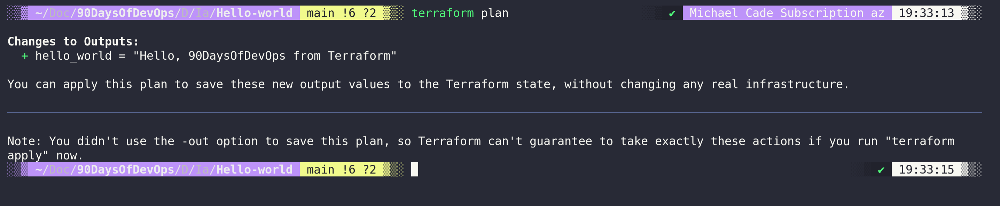

## HashiCorp Configuration Language (HCL)

Before we start making stuff with Terraform we have to dive a little into HashiCorp Configuration Language (HCL). So far during our challenge, we have looked at a few different scripting and programming languages and here is another one. We touched on the [Go programming language](day07.md) then [bash scripts](day19.md) we even touched on a little python when it came to [network automation](day27.md)

Now we must cover HashiCorp Configuration Language (HCL) if this is the first time you are seeing the language it might look a little daunting but it's quite simple and very powerful.

As we move through this section, we are going to be using examples that we can run locally on our system regardless of what OS you are using, we will be using VirtualBox, albeit not the infrastructure platform you would usually be using with Terraform. However running this locally, is free and will allow us to achieve what we are looking for in this post. We could also extend this post's concept to docker or Kubernetes as well.

In general, though, you would or should be using Terraform to deploy your infrastructure in the public cloud (AWS, Google, Microsoft Azure) but then also in your virtualisation environments such as (VMware, Microsoft Hyper-V, Nutanix AHV). In the public cloud Terraform allows for us to do a lot more than just Virtual Machine automated deployment, we can create all the required infrastructure such as PaaS workloads and all of the networking required assets such as VPCs and Security Groups.

There are two important aspects to Terraform, we have the code which we are going to get into in this post and then we also have the state. Both of these together could be called the Terraform core. We then have the environment we wish to speak to and deploy into, which is executed using Terraform providers, briefly mentioned in the last session, but we have an AWS provider, we have Azure providers etc. There are hundreds.

### Basic Terraform Usage

Let's take a look at a Terraform `.tf` file to see how they are made up. The first example we will walk through will be code to deploy resources to AWS, this would then also require the AWS CLI to be installed on your system and configured for your account.

### Providers

At the top of our `.tf` file structure, generally called `main.tf` at least until we make things more complex. Here we will define the providers that we have mentioned before. Our source of the AWS provider as you can see is `hashicorp/aws` this means the provider is maintained or has been published by hashicorp themselves. By default you will reference providers that are available from the [Terraform Registry](https://registry.terraform.io/), you also can write your providers, and use these locally, or self-publish to the Terraform Registry.

```
terraform {
  required_providers {
    aws = {
      source  = "hashicorp/aws"
      version = "~> 3.0"
    }
  }
}
```

We might also add in a region as well here to determine which AWS region we would like to provision to we can do this by adding the following:

```
provider "aws" {
  region = "ap-southeast-1" //region where resources need to be deployed
}
```

### Terraform Resources

- Another important component of a terraform config file which describes one or more infrastructure objects like EC2, Load Balancer, VPC, etc.

- A resource block declares a resource of a given type ("aws_instance") with a given local name ("90daysofdevops").

- The resource type and name together serve as an identifier for a given resource.

```
resource "aws_instance" "90daysofdevops" {
  ami               = data.aws_ami.instance_id.id
  instance_type     = "t2.micro"
  availability_zone = "us-west-2a"
  security_groups   = [aws_security_group.allow_web.name]
  user_data         = <<-EOF
                #! /bin/bash
                sudo yum update
                sudo yum install -y httpd
                sudo systemctl start httpd
                sudo systemctl enable httpd
                echo "
<h1>Deployed via Terraform</h1>

" | sudo tee /var/www/html/index.html
        EOF
  tags = {
    Name = "Created by Terraform"
  }
}
```

You can see from the above we are also running a `yum` update and installing `httpd` into our ec2 instance.

If we now look at the complete main.tf file it might look something like this.

```
terraform {
  required_providers {
    aws = {
      source  = "hashicorp/aws"
      version = "~> 3.27"
    }
  }

  required_version = ">= 0.14.9"
}

provider "aws" {
  profile = "default"
  region  = "us-west-2"
}

resource "aws_instance" "90daysofdevops" {
  ami           = "ami-830c94e3"
  instance_type = "t2.micro"
  availability_zone = "us-west-2a"
    user_data         = <<-EOF
                #! /bin/bash
                sudo yum update
                sudo yum install -y httpd
                sudo systemctl start httpd
                sudo systemctl enable httpd
                echo "
<h1>Deployed via Terraform</h1>

" | sudo tee /var/www/html/index.html
        EOF
  tags = {
    Name = "Created by Terraform"

  tags = {
    Name = "ExampleAppServerInstance"
  }
}
```

The above code will go and deploy a very simple web server as an ec2 instance in AWS, the great thing about this and any other configuration like this is that we can repeat this and we will get the same output every single time. Other than the chance that I have messed up the code there is no human interaction with the above.

We can take a look at a super simple example, one that you will likely never use but let's humour it anyway. Like with all good scripting and programming language we should start with a hello-world scenario.

```
terraform {
  # This module is now only being tested with Terraform 0.13.x. However, to make upgrading easier, we are setting
  # 0.12.26 as the minimum version, as that version added support for required_providers with source URLs, making it
  # forwards compatible with 0.13.x code.
  required_version = ">= 0.12.26"
}

# website::tag::1:: The simplest possible Terraform module: it just outputs "Hello, World!"
output "hello_world" {
  value = "Hello, 90DaysOfDevOps from Terraform"
}
```

You will find this file in the IAC folder under hello-world, but out of the box, this is not going to simply work there are some commands we need to run to use our terraform code.

In your terminal navigate to your folder where the main.tf has been created, this could be from this repository or you could create a new one using the code above.

When in that folder we are going to run `terraform init`

We need to perform this on any directory where we have or before we run any terraform code. Initialising a configuration directory downloads and installs the providers defined in the configuration, in this case, we have no providers but in the example above this would download the AWS provider for this configuration.


The next command will be `terraform plan`

The `terraform plan` command creates an execution plan, which lets you preview the changes that Terraform plans to make to your infrastructure.

You can simply see below that with our hello-world example we are going to see output if this was an AWS ec2 instance we would see all the steps that we will be creating.



At this point, we have initialised our repository and we have our providers downloaded where required, we have run a test walkthrough to make sure this is what we want to see so now we can run and deploy our code.

`terraform apply` allows us to do this there is a built-in safety measure to this command and this will again give you a plan view on what is going to happen which warrants a response from you to say yes to continue.


When we type in yes to enter a value, our code is deployed. Not that exciting but you can see we have the output that we defined in our code.


Now we have not deployed anything, we have not added, changed or destroyed anything but if we did then we would see that indicated also in the above. If however we had deployed something and we wanted to get rid of everything we deployed we can use the `terraform destroy` command. Again this has that safety where you have to type yes although you can use `--auto-approve` on the end of your `apply` and `destroy` commands to bypass that manual intervention. But I would advise only using this shortcut when learning and testing as everything will disappear sometimes faster than it was built.

From this, there are 4 commands we have covered from the Terraform CLI.

- `terraform init` = get your project folder ready with providers
- `terraform plan` = show what is going to be created, and changed during the next command based on our code.
- `terraform apply` = will go and deploy the resources defined in our code.
- `terraform destroy` = will destroy the resources we have created in our project

We also covered two important aspects of our code files.

- providers = how does terraform speak to the end platform via APIs
- resources = what it is we want to deploy with code

Another thing to note when running `terraform init` take a look at the tree on the folder before and after to see what happens and where we store providers and modules.

### Terraform state

We also need to be aware of the state file that is created also inside our directory and for this hello world example our state file is simple. This is a JSON file which is the representation of the world according to Terraform. The state will happily show off your sensitive data so be careful and as a best practice put your `.tfstate` files in your `.gitignore` folder before uploading to GitHub.

By default, the state file as you can see lives inside the same directory as your project code, but it can also be stored remotely as an option. In a production environment, this is likely going to be a shared location such as an S3 bucket.

Another option could be Terraform Cloud, this is a paid-for-managed service. (Free up to 5 users)

The pros for storing state in a remote location are that we get:

- Sensitive data encrypted
- Collaboration
- Automation
- However, it could bring increase the complexity

```JSON
{
  "version": 4,
  "terraform_version": "1.1.6",
  "serial": 1,
  "lineage": "a74296e7-670d-0cbb-a048-f332696ca850",
  "outputs": {
    "hello_world": {
      "value": "Hello, 90DaysOfDevOps from Terraform",
      "type": "string"
    }
  },
  "resources": []
}
```

## Resources

I have listed a lot of resources down below and I think this topic has been covered so many times out there, If you have additional resources be sure to raise a PR with your resources and I will be happy to review and add them to the list.

- [What is Infrastructure as Code? Difference of Infrastructure as Code Tools](https://www.youtube.com/watch?v=POPP2WTJ8es)
- [Terraform Tutorial | Terraform Course Overview 2021](https://www.youtube.com/watch?v=m3cKkYXl-8o)
- [Terraform explained in 15 mins | Terraform Tutorial for Beginners](https://www.youtube.com/watch?v=l5k1ai_GBDE)
- [Terraform Course - From BEGINNER to PRO!](https://www.youtube.com/watch?v=7xngnjfIlK4&list=WL&index=141&t=16s)
- [HashiCorp Terraform Associate Certification Course](https://www.youtube.com/watch?v=V4waklkBC38&list=WL&index=55&t=111s)
- [Terraform Full Course for Beginners](https://www.youtube.com/watch?v=EJ3N-hhiWv0&list=WL&index=39&t=27s)
- [KodeKloud - Terraform for DevOps Beginners + Labs: Complete Step by Step Guide!](https://www.youtube.com/watch?v=YcJ9IeukJL8&list=WL&index=16&t=11s)
- [Terraform Simple Projects](https://terraform.joshuajebaraj.com/)
- [Terraform Tutorial - The Best Project Ideas](https://www.youtube.com/watch?v=oA-pPa0vfks)
- [Awesome Terraform](https://github.com/shuaibiyy/awesome-terraform)

See you on [Day 59](day59.md)
