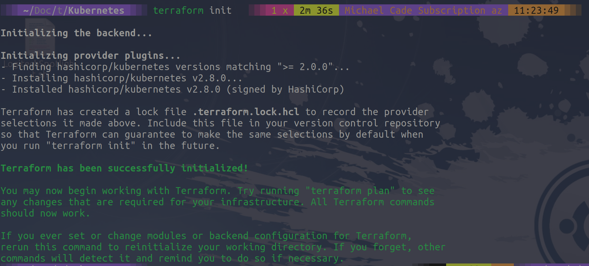

## Kubernetes & Multiple Environments

So far during this section on Infrastructure as code, we have looked at deploying virtual machines albeit to VirtualBox but the premise is the same really as we define in code what we want our virtual machine to look like and then we deploy. The same for Docker containers and in this session, we are going to take a look at how Terraform can be used to interact with resources supported by Kubernetes.

I have been using Terraform to deploy my Kubernetes clusters for demo purposes across the 3 main cloud providers and you can find the repository [tf_k8deploy](https://github.com/MichaelCade/tf_k8deploy)

However you can also use Terraform to interact with objects within the Kubernetes cluster, this could be using the [Kubernetes provider](https://registry.terraform.io/providers/hashicorp/kubernetes/latest/docs) or it could be using the [Helm provider](https://registry.terraform.io/providers/hashicorp/helm/latest) to manage your chart deployments.

Now we could use `kubectl` as we have shown in previous sections. But there are some benefits to using Terraform in your Kubernetes environment.

- Unified workflow - if you have used Terraform to deploy your clusters, you could use the same workflow and tool to deploy within your Kubernetes clusters

- Lifecycle management - Terraform is not just a provisioning tool, it's going to enable change, updates and deletions.

### Simple Kubernetes Demo

Much like the demo we created in the last session, we can now deploy nginx into our Kubernetes cluster, I will be using minikube here again for demo purposes. We create our Kubernetes.tf file and you can find this in the [folder](/Days/IaC/Kubernetes/Kubernetes.tf)

In that file we are going to define our Kubernetes provider, we are going to point to our kubeconfig file, create a namespace called nginx, and then we will create a deployment which contains 2 replicas and finally service.

```
terraform {
  required_providers {
    kubernetes = {
      source  = "hashicorp/kubernetes"
      version = ">= 2.0.0"
    }
  }
}
provider "kubernetes" {
  config_path = "~/.kube/config"
}
resource "kubernetes_namespace" "test" {
  metadata {
    name = "nginx"
  }
}
resource "kubernetes_deployment" "test" {
  metadata {
    name      = "nginx"
    namespace = kubernetes_namespace.test.metadata.0.name
  }
  spec {
    replicas = 2
    selector {
      match_labels = {
        app = "MyTestApp"
      }
    }
    template {
      metadata {
        labels = {
          app = "MyTestApp"
        }
      }
      spec {
        container {
          image = "nginx"
          name  = "nginx-container"
          port {
            container_port = 80
          }
        }
      }
    }
  }
}
resource "kubernetes_service" "test" {
  metadata {
    name      = "nginx"
    namespace = kubernetes_namespace.test.metadata.0.name
  }
  spec {
    selector = {
      app = kubernetes_deployment.test.spec.0.template.0.metadata.0.labels.app
    }
    type = "NodePort"
    port {
      node_port   = 30201
      port        = 80
      target_port = 80
    }
  }
}
```

The first thing we have to do in our new project folder is run the `terraform init` command.



And then before we run the `terraform apply` command, let me show you that we have no namespaces.


When we run our apply command this is going to create those 3 new resources, namespace, deployment and service within our Kubernetes cluster.


We can now take a look at the deployed resources within our cluster.


Now because we are using minikube as you will have seen in the previous section this has its limitations when we try and play with the docker networking for ingress. But if we simply issue the `kubectl port-forward -n nginx svc/nginx 30201:80` command and open a browser to `http://localhost:30201/` we should see our NGINX page.


If you want to try out more detailed demos with Terraform and Kubernetes then the [HashiCorp Learn site](https://learn.hashicorp.com/tutorials/terraform/kubernetes-provider) is fantastic to run through.

### Multiple Environments

If we wanted to take any of the demos we have run through but wanted to now have specific production, staging and development environments looking the same and leveraging this code there are two approaches to achieve this with Terraform

- `terraform workspaces` - multiple named sections within a single backend

- file structure - Directory layout provides separation, modules provide reuse.

Each of the above does have its pros and cons though.

### terraform workspaces

Pros

- Easy to get started
- Convenient terraform.workspace expression
- Minimises code duplication

Cons

- Prone to human error (we were trying to eliminate this by using TF)
- State stored within the same backend
- Codebase doesn't unambiguously show deployment configurations.

### File Structure

Pros

- Isolation of backends
  - improved security
  - decreased potential for human error
- Codebase fully represents deployed state

Cons

- Multiple terraform apply required to provision environments
- More code duplication, but can be minimised with modules.

## Resources

I have listed a lot of resources down below and I think this topic has been covered so many times out there, If you have additional resources be sure to raise a PR with your resources and I will be happy to review and add them to the list.

- [What is Infrastructure as Code? Difference of Infrastructure as Code Tools](https://www.youtube.com/watch?v=POPP2WTJ8es)
- [Terraform Tutorial | Terraform Course Overview 2021](https://www.youtube.com/watch?v=m3cKkYXl-8o)
- [Terraform explained in 15 mins | Terraform Tutorial for Beginners](https://www.youtube.com/watch?v=l5k1ai_GBDE)
- [Terraform Course - From BEGINNER to PRO!](https://www.youtube.com/watch?v=7xngnjfIlK4&list=WL&index=141&t=16s)
- [HashiCorp Terraform Associate Certification Course](https://www.youtube.com/watch?v=V4waklkBC38&list=WL&index=55&t=111s)
- [Terraform Full Course for Beginners](https://www.youtube.com/watch?v=EJ3N-hhiWv0&list=WL&index=39&t=27s)
- [KodeKloud - Terraform for DevOps Beginners + Labs: Complete Step by Step Guide!](https://www.youtube.com/watch?v=YcJ9IeukJL8&list=WL&index=16&t=11s)
- [Terraform Simple Projects](https://terraform.joshuajebaraj.com/)
- [Terraform Tutorial - The Best Project Ideas](https://www.youtube.com/watch?v=oA-pPa0vfks)
- [Awesome Terraform](https://github.com/shuaibiyy/awesome-terraform)

See you on [Day 62](day62.md)
