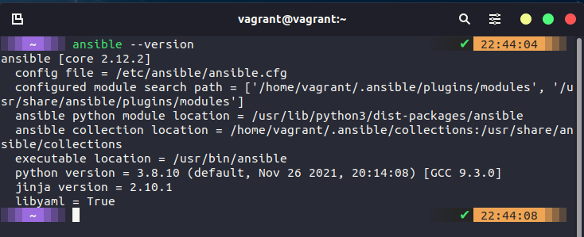
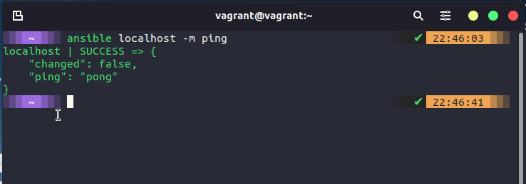
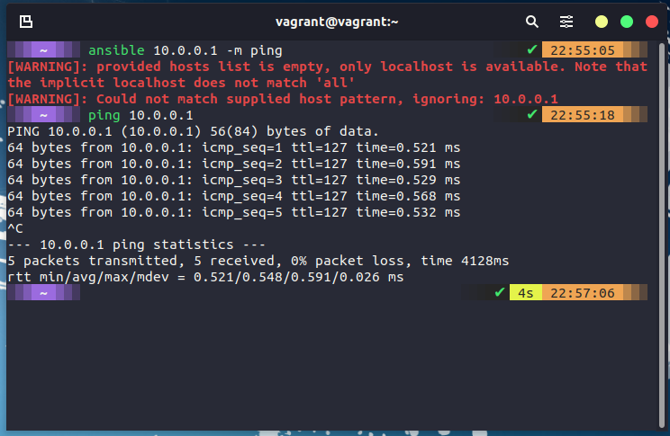
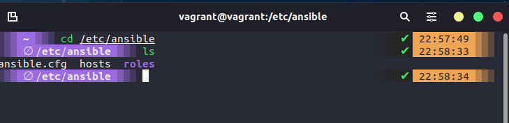
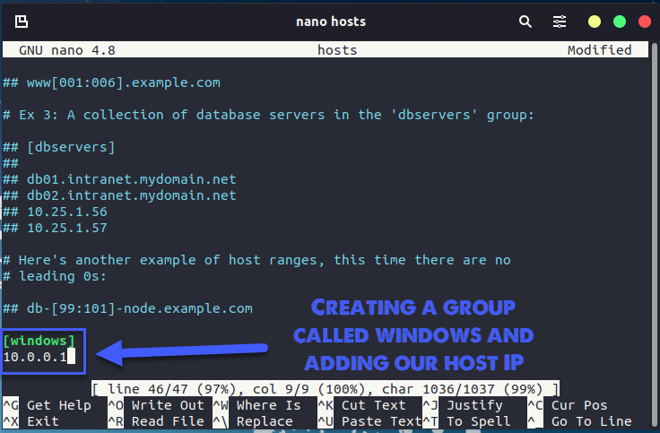

## Ansible: Getting Started

We covered a little about what Ansible is in the [big picture session yesterday](day63.md) But we are going to get started with a little more information on top of that here. Firstly Ansible comes from RedHat. Secondly, it is agentless, connects via SSH and runs commands. Thirdly it is cross-platform (Linux & macOS, WSL2) and open-source (there is also a paid-for enterprise option) Ansible pushes configuration vs other models.

### Ansible Installation

As you might imagine, RedHat and the Ansible team have done a fantastic job of documenting Ansible. This generally starts with the installation steps which you can find [here](https://docs.ansible.com/ansible/latest/installation_guide/intro_installation.html) Remember we said that Ansible is an agentless automation tool, the tool is deployed to a system referred to as a "Control Node" from this control node is manages machines and other devices (possibly network) over SSH.

It does state in the above-linked documentation that the Windows OS cannot be used as the control node.

For my control node and at least this demo, I am going to use the Linux VM we created way back in the [Linux section](day20.md) as my control node.

This system was running Ubuntu and the installation steps simply need the following commands.

```Shell
sudo apt update
sudo apt install software-properties-common
sudo add-apt-repository --yes --update ppa:ansible/ansible
sudo apt install ansible
```

Now we should have ansible installed on our control node, you can check this by running `ansible --version` and you should see something similar to this below.



Before we then start to look at controlling other nodes in our environment, we can also check the functionality of ansible by running a command against our local machine `ansible localhost -m ping` will use an [Ansible Module](https://docs.ansible.com/ansible/2.9/user_guide/modules_intro.html) and this is a quick way to perform a single task across many different systems. I mean it is not much fun with just the local host but imagines you wanted to get something or make sure all your systems were up and you had 1000+ servers and devices.



Or an actual real-life use for a module might be something like `ansible webservers --m service -a "name=httpd state=started"` this will tell us if all of our webservers have the httpd service running. I have glossed over the webservers term used in that command.

### hosts

The way I used localhost above to run a simple ping module against the system, I cannot specify another machine on my network, for example in the environment I am using my Windows host where VirtualBox is running has a network adapter with the IP 10.0.0.1 but you can see below that I can reach by pinging but I cannot use ansible to perform that task.



For us to specify our hosts or the nodes that we want to automate with these tasks, we need to define them. We can define them by navigating to the /etc/ansible directory on your system.



The file we want to edit is the host's file, using a text editor we can jump in and define our hosts. The host file contains lots of great instructions on how to use and modify the file. We want to scroll down to the bottom and we are going to create a new group called [windows] and we are going to add our `10.0.0.1` IP address for that host. Save the file.



However, remember I said you will need to have SSH available to enable Ansible to connect to your system. As you can see below when I run `ansible windows -m ping` we get an unreachable because things failed to connect via SSH.


I have now also started adding some additional hosts to our inventory, another name for this file as this is where you are going to define all of your devices, could be network devices, switches and routers for example also would be added here and grouped. In our hosts file though I have also added my credentials for accessing the Linux group of systems.


Now if we run `ansible Linux -m ping` we get success as per below.


We then have the node requirements, these are the target systems you wish to automate the configuration on. We are not installing anything for Ansible on these (I mean we might be installing software but there is no client from Ansible we need) Ansible will make a connection over SSH and send anything over SFTP. (If you so desire though and you have SSH configured you could use SCP vs SFTP.)

### Ansible Commands

You saw that we were able to run `ansible Linux -m ping` against our Linux machine and get a response, basically, with Ansible we can run many ad-hoc commands. But you can run this against a group of systems and get that information back. [ad hoc commands](https://docs.ansible.com/ansible/latest/user_guide/intro_adhoc.html)

If you find yourself repeating commands or even worse you are having to log into individual systems to run these commands then Ansible can help there. For example, the simple command below would give us the output of all the operating system details for all of the systems we add to our Linux group.
`ansible linux -a "cat /etc/os-release"`

Other use cases could be to reboot systems, copy files, and manage packers and users. You can also couple ad hoc commands with Ansible modules.

Ad hoc commands use a declarative model, calculating and executing the actions required to reach a specified final state. They achieve a form of idempotence by checking the current state before they begin and doing nothing unless the current state is different from the specified final state.

## Resources

- [What is Ansible](https://www.youtube.com/watch?v=1id6ERvfozo)
- [Ansible 101 - Episode 1 - Introduction to Ansible](https://www.youtube.com/watch?v=goclfp6a2IQ)
- [NetworkChuck - You need to learn Ansible right now!](https://www.youtube.com/watch?v=5hycyr-8EKs&t=955s)

See you on [Day 65](day65.md)
