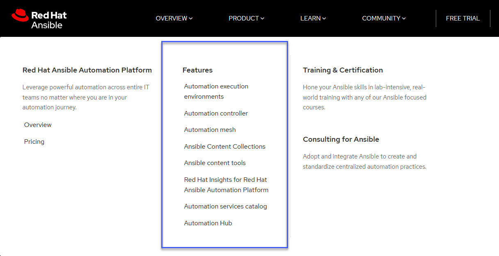

## All other things Ansible - Automation Controller (Tower), AWX, Vault

Rounding out the section on Configuration Management I wanted to have a look into the other areas that you might come across when dealing with Ansible.

There are a lot of products that make up the Ansible Automation platform.

Red Hat Ansible Automation Platform is a foundation for building and operating automation across an organization. The platform includes all the tools needed to implement enterprise-wide automation.



I will try and cover some of these in this post. But for more information then the official Red Hat Ansible site is going to have lots more information. [Ansible.com](https://www.ansible.com/?hsLang=en-us)

### Ansible Automation Controller | AWX

I have bundled these two together because the Automation Controller and AWX are very similar in what they offer.

The AWX project or AWX for short is an open-source community project, sponsored by Red Hat that enables you to better control your Ansible projects within your environments. AWX is the upstream project from which the automation controller component is derived.

If you are looking for an enterprise solution then you will be looking for the Automation Controller or you might have previously heard this as Ansible Tower. The Ansible Automation Controller is the control plane for the Ansible Automation Platform.

Both AWX and the Automation Controller bring the following features above everything else we have covered in this section thus far.

- User Interface
- Role-Based Access Control
- Workflows
- CI/CD integration

The Automation Controller is the enterprise offering where you pay for your support.

We are going to take a look at deploying AWX within our minikube Kubernetes environment.

### Deploying Ansible AWX

AWX does not need to be deployed to a Kubernetes cluster, the [github](https://github.com/ansible/awx) for AWX from ansible will give you that detail. However starting in version 18.0, the AWX Operator is the preferred way to install AWX.

First of all, we need a minikube cluster. We can do this if you followed along during the Kubernetes section by creating a new minikube cluster with the `minikube start --cpus=4 --memory=6g --addons=ingress` command.


The official [Ansible AWX Operator](https://github.com/ansible/awx-operator) can be found here. As stated in the install instructions you should clone this repository and then run through the deployment.

I forked the repo above and then ran `git clone https://github.com/MichaelCade/awx-operator.git` my advice is you do the same and do not use my repository as I might change things or it might not be there.

In the cloned repository you will find an awx-demo.yml file we need to change `NodePort` for `ClusterIP` as per below:

```Yaml
---
apiVersion: awx.ansible.com/v1beta1
kind: AWX
metadata:
  name: awx-demo
spec:
  service_type: ClusterIP
```

The next step is to define our namespace where we will be deploying the awx operator, using the `export NAMESPACE=awx` command then followed by `make deploy` we will start the deployment.


In checking we have our new namespace and we have our awx-operator-controller pod running in our namespace. `kubectl get pods -n awx`


Within the cloned repository you will find a file called awx-demo.yml we now want to deploy this into our Kubernetes cluster and our awx namespace. `kubectl create -f awx-demo.yml -n awx`


You can keep an eye on the progress with `kubectl get pods -n awx -w` which will keep a visual watch on what is happening.

You should have something that resembles the image you see below when everything is running.


Now we should be able to access our awx deployment after running in a new terminal `minikube service awx-demo-service --url -n $NAMESPACE` to expose this through the minikube ingress.


If we then open a browser to that address [] you can see we are prompted for username and password.


The username by default is admin, to get the password we can run the following command to get this `kubectl get secret awx-demo-admin-password -o jsonpath="{.data.password}" -n awx| base64 --decode`


This then gives you a UI to manage your playbook and configuration management tasks in a centralised location, it also allows you as a team to work together vs what we have been doing so far here where we have been running from one ansible control station.

This is another one of those areas where you could probably go and spend another length of time walking through the capabilities within this tool.

I will call out a great resource from Jeff Geerling, which goes into more detail on using Ansible AWX. [Ansible 101 - Episode 10 - Ansible Tower and AWX](https://www.youtube.com/watch?v=iKmY4jEiy_A&t=752s)

In this video, he also goes into great detail on the differences between Automation Controller (Previously Ansible Tower) and Ansible AWX (Free and Open Source).

### Ansible Vault

`ansible-vault` allows us to encrypt and decrypt Ansible data files. Throughout this section, we have skipped over and put some of our sensitive information in plain text.

Built into the Ansible binary is `ansible-vault` which allows us to mask away this sensitive information.


Secrets Management has progressively become another area in which more time should have been spent alongside tools such as HashiCorp Vault or the AWS Key Management Service. I will mark this as an area to dive deeper into.

I am going to link a great resource and demo to run through from Jeff Geerling again [Ansible 101 - Episode 6 - Ansible Vault and Roles](https://www.youtube.com/watch?v=JFweg2dUvqM)

### Ansible Galaxy (Docs)

Now, we have already used `ansible-galaxy` to create some of our roles and file structure for our demo project. But we also have [Ansible Galaxy documentation](https://galaxy.ansible.com/docs/)

"Galaxy is a hub for finding and sharing Ansible content."

### Ansible Testing

- [Ansible Molecule](https://molecule.readthedocs.io/en/latest/) - The molecule project is designed to aid in the development and testing of Ansible roles

- [Ansible Lint](https://ansible-lint.readthedocs.io/en/latest/) - CLI tool for linting playbooks, roles and collections

### Other Resource

- [Ansible Documentation](https://docs.ansible.com/ansible/latest/index.html)

## Resources

- [What is Ansible](https://www.youtube.com/watch?v=1id6ERvfozo)
- [Ansible 101 - Episode 1 - Introduction to Ansible](https://www.youtube.com/watch?v=goclfp6a2IQ)
- [NetworkChuck - You need to learn Ansible right now!](https://www.youtube.com/watch?v=5hycyr-8EKs&t=955s)
- [Your complete guide to Ansible](https://www.youtube.com/playlist?list=PLnFWJCugpwfzTlIJ-JtuATD2MBBD7_m3u)

This final playlist listed above is where a lot of the code and ideas came from for this section, a great resource and walkthrough in video format.

This post wraps up our look into configuration management, we next move into CI/CD Pipelines and some of the tools and processes that we might see and use out there to achieve this workflow for our application development and release.

See you on [Day 70](day70.md)
