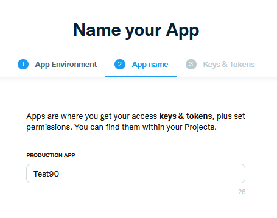

## Tuitea tu progreso con nuestra nueva App

Hoy es el último día viendo este lenguaje de programación. Apenas hemos tocado la superficie de Go pero es un inicio. Ahora debemos interesarnos, entusiasmarnos y sumergirnos más en él por nuestra cuenta.

Pero vamos a aprovechar el último día para agregar una funcionalidad a nuestra app. Aprovecharemos los paquetes creados y haremos que nuestra app, no solo te de la actualización de tu progreso en pantalla, sino que también envíe un tweet con los detalles del reto y tu estado. 😊

##  Añadir la capacidad de tuitear

Para que esto funcione, lo primero que tenemos que hacer es configurar nuestro acceso a la API para desarrolladores de Twitter.

Dirígete a la [Plataforma de Desarrolladores de Twitter](https://developer.twitter.com) e inicia sesión con tu nombre y datos de Twitter. Una vez dentro deberías ver algo como lo que se muestra a continuación sin la aplicación que ya he creado.


Desde aquí también se puede solicitar acceso más elevado, esto puede llevar algo de tiempo.

A continuación debemos seleccionar Projects & Apps y crear nuestra App. Los límites dependen del acceso de la cuenta que tengas, con essential solo tienes una app y un proyecto y con elevated puedes tener 3 apps.


Dale un nombre a tu aplicación



A continuación, se le dará estos tokens de la API. Debes guardarlos en algún lugar seguro, los necesitaremos más tarde con nuestra aplicación Go.(No te molestes en intentar usar los que se ven en la captura, esta aplicación ya se ha borrado).


Ahora tenemos nuestra aplicación creada, (se cambio el nombre de la aplicación (A cade90) ya que el de la captura anterior (test90) ya estaba tomado, estos nombres deben ser únicos).


Las claves que guardamos antes se conocen como nuestras consumer keys y también necesitaremos nuestro token de acceso y secrets. Podemos reunir esta información usando la pestaña "Keys & Tokens".


Bien, por ahora hemos terminado en el portal de desarrolladores de Twitter. Asegúrate de mantener tus claves a salvo porque las necesitaremos más adelante.

## Go Twitter Bot

Recuerda que el código que vamos a iniciar dentro de nuestra aplicación es el del fichero [day13_example1](Go/day13_example1.go) pero antes, tenemos que comprobar que tenemos el código correcto para hacer el tweet.

Ahora tenemos que pensar en el código para hacer llegar nuestra salida o mensaje a Twitter en forma de tweet. Vamos a utilizar la librería [go-twitter](https://github.com/dghubble/go-twitter) (Librería cliente de Go para la API de Twitter).

Para probar antes de ponerlo en nuestra aplicación principal, crea un nuevo directorio en la carpeta `src` llamado go-twitter-bot, emite el `go mod init github.com/michaelcade/go-Twitter-bot` en la carpeta que luego creará un archivo `go.mod`. Ahora podemos empezar a escribir el nuevo main.go y probarlo.

Necesitamos las claves, los tokens y los secrets que recogimos del portal de desarrolladores de Twitter. Vamos a establecerlos en nuestras variables de entorno. Esto dependerá del sistema operativo que estés ejecutando:

**Windows**

```cmd
set CONSUMER_KEY
set CONSUMER_SECRET
set ACCESS_TOKEN
set ACCESS_TOKEN_SECRET
```

**Linux / macOS**

```shell
export CONSUMER_KEY
export CONSUMER_SECRET
export ACCESS_TOKEN
export ACCESS_TOKEN_SECRET
```

En este punto, echa un vistazo al código del fichero [day13_example2](Go/day13_example2.go), verás que aquí se está usando una estructura para definir las claves, secretos y tokens.

Luego tenemos un `func` para analizar esas credenciales y hacer la conexión con la API de Twitter

Ahora sí, vamos a enviar un tweet. 🐦

```go
package main

import (
    // other imports
    "fmt"
    "log"
    "os"

    "github.com/dghubble/go-twitter/twitter"
    "github.com/dghubble/oauth1"
)

// Credentials stores all of our access/consumer tokens
// and secret keys needed for authentication against
// the twitter REST API.
type Credentials struct {
    ConsumerKey       string
    ConsumerSecret    string
    AccessToken       string
    AccessTokenSecret string
}

// getClient is a helper function that will return a twitter client
// that we can subsequently use to send tweets, or to stream new tweets
// this will take in a pointer to a Credential struct which will contain
// everything needed to authenticate and return a pointer to a twitter Client
// or an error
func getClient(creds *Credentials) (*twitter.Client, error) {
    // Pass in your consumer key (API Key) and your Consumer Secret (API Secret)
    config := oauth1.NewConfig(creds.ConsumerKey, creds.ConsumerSecret)
    // Pass in your Access Token and your Access Token Secret
    token := oauth1.NewToken(creds.AccessToken, creds.AccessTokenSecret)

    httpClient := config.Client(oauth1.NoContext, token)
    client := twitter.NewClient(httpClient)

    // Verify Credentials
    verifyParams := &twitter.AccountVerifyParams{
        SkipStatus:   twitter.Bool(true),
        IncludeEmail: twitter.Bool(true),
    }

    // we can retrieve the user and verify if the credentials
    // we have used successfully allow us to log in!
    user, _, err := client.Accounts.VerifyCredentials(verifyParams)
    if err != nil {
        return nil, err
    }

    log.Printf("User's ACCOUNT:\n%+v\n", user)
    return client, nil
}
func main() {
    fmt.Println("Go-Twitter Bot v0.01")
    creds := Credentials{
        AccessToken:       os.Getenv("ACCESS_TOKEN"),
        AccessTokenSecret: os.Getenv("ACCESS_TOKEN_SECRET"),
        ConsumerKey:       os.Getenv("CONSUMER_KEY"),
        ConsumerSecret:    os.Getenv("CONSUMER_SECRET"),
    }

    client, err := getClient(&creds)
    if err != nil {
        log.Println("Error getting Twitter Client")
        log.Println(err)
    }

    tweet, resp, err := client.Statuses.Update("A Test Tweet from the future, testing a #90DaysOfDevOps Program that tweets, tweet tweet", nil)
    if err != nil {
        log.Println(err)
    }
    log.Printf("%+v\n", resp)
    log.Printf("%+v\n", tweet)
}

```

Lo anterior puede que imprima en pantall un error basado explicando lo que sucedido, espero que no. O tendrá éxito, sin mensaje alguno, tendrás un tweet enviado con el mensaje señalado en el código.

## Emparejando los dos juntos. Go-Twitter-Bot + Nuestra App

Ahora tenemos que fusionarlo en el fichero `main.go`. Estoy seguro de que alguien por ahí está gritando que hay una mejor manera de hacer esto. Tan solo comentar que podría haber más de un archivo `.go` en un proyecto, podría tener sentido. Pero esto también funciona.

Puedes ver el código base fusionado en el fichero [day13_example3](Go/day13_example3.go) pero también se muestra a continuación.

```go
package main

import (
    // other imports
    "fmt"
    "log"
    "os"

    "github.com/dghubble/go-twitter/twitter"
    "github.com/dghubble/oauth1"
)

// Credentials stores all of our access/consumer tokens
// and secret keys needed for authentication against
// the twitter REST API.
type Credentials struct {
    ConsumerKey       string
    ConsumerSecret    string
    AccessToken       string
    AccessTokenSecret string
}

// getClient is a helper function that will return a twitter client
// that we can subsequently use to send tweets, or to stream new tweets
// this will take in a pointer to a Credential struct which will contain
// everything needed to authenticate and return a pointer to a twitter Client
// or an error
func getClient(creds *Credentials) (*twitter.Client, error) {
    // Pass in your consumer key (API Key) and your Consumer Secret (API Secret)
    config := oauth1.NewConfig(creds.ConsumerKey, creds.ConsumerSecret)
    // Pass in your Access Token and your Access Token Secret
    token := oauth1.NewToken(creds.AccessToken, creds.AccessTokenSecret)

    httpClient := config.Client(oauth1.NoContext, token)
    client := twitter.NewClient(httpClient)

    // Verify Credentials
    verifyParams := &twitter.AccountVerifyParams{
        SkipStatus:   twitter.Bool(true),
        IncludeEmail: twitter.Bool(true),
    }

    // we can retrieve the user and verify if the credentials
    // we have used successfully allow us to log in!
    user, _, err := client.Accounts.VerifyCredentials(verifyParams)
    if err != nil {
        return nil, err
    }

    log.Printf("User's ACCOUNT:\n%+v\n", user)
    return client, nil
}
func main() {
    creds := Credentials{
        AccessToken:       os.Getenv("ACCESS_TOKEN"),
        AccessTokenSecret: os.Getenv("ACCESS_TOKEN_SECRET"),
        ConsumerKey:       os.Getenv("CONSUMER_KEY"),
        ConsumerSecret:    os.Getenv("CONSUMER_SECRET"),
    }
    {
        const DaysTotal int = 90
        var remainingDays uint = 90
        challenge := "#90DaysOfDevOps"

        fmt.Printf("Welcome to the %v challenge.\nThis challenge consists of %v days\n", challenge, DaysTotal)

        var TwitterName string
        var DaysCompleted uint

        // asking for user input
        fmt.Println("Enter Your Twitter Handle: ")
        fmt.Scanln(&TwitterName)

        fmt.Println("How many days have you completed?: ")
        fmt.Scanln(&DaysCompleted)

        // calculate remaining days
        remainingDays = remainingDays - DaysCompleted

        //fmt.Printf("Thank you %v for taking part and completing %v days.\n", TwitterName, DaysCompleted)
        //fmt.Printf("You have %v days remaining for the %v challenge\n", remainingDays, challenge)
        // fmt.Println("Good luck")

        client, err := getClient(&creds)
        if err != nil {
            log.Println("Error getting Twitter Client, this is expected if you did not supply your Twitter API tokens")
            log.Println(err)
        }

        message := fmt.Sprintf("Hey I am %v I have been doing the %v for %v days and I have %v Days left", TwitterName, challenge, DaysCompleted, remainingDays)
        tweet, resp, err := client.Statuses.Update(message, nil)
        if err != nil {
            log.Println(err)
        }
        log.Printf("%+v\n", resp)
        log.Printf("%+v\n", tweet)
    }

}
```

El resultado de esto debería ser un tweet, pero si no suministraste las variables de entorno tendrás el siguiente error.


Una vez que hayas arreglado esto la salida del terminal en caso de éxito será similar a esta:


El tweet resultante debería tener un aspecto similar al siguiente


## ¿Cómo compilar para múltiples sistemas operativos?

Lo comentamos cuando describimos el lenguaje go en días anteriores: "¿Cómo compilar para múltiples Sistemas Operativos?" 

Lo bueno de Go es que puede compilar fácilmente para muchos sistemas operativos diferentes. Puedes obtener una lista completa ejecutando el siguiente comando:

```
go tool dist list
```

El uso de nuestros comandos `go build` hasta ahora es genial y utilizará las variables de entorno `GOOS` y `GOARCH` para determinar la máquina anfitriona y construirá el ejecutable en base a esto. Pero también podemos crear otros binarios para otros SO usando el código de abajo como ejemplo.

```go
GOARCH=amd64 GOOS=darwin go build -o ${BINARY_NAME}_0.1_darwin main.go
GOARCH=amd64 GOOS=linux go build -o ${BINARY_NAME}_0.1_linux main.go
GOARCH=amd64 GOOS=windows go build -o ${BINARY_NAME}_0.1_windows main.go
GOARCH=arm64 GOOS=linux go build -o ${BINARY_NAME}_0.1_linux_arm64 main.go
GOARCH=arm64 GOOS=darwin go build -o ${BINARY_NAME}_0.1_darwin_arm64 main.go
```

Esto dará los binarios solicitados en el directorio para todas las plataformas configuradas.

A continuación, puede coger este código y crear un makefile para construir los binarios cada vez que agregues nuevas características y funcionalidades al código. Echa un ojo al fichero [makefile](Go/makefile).

Esto es lo que se ha utilizado para crear las versiones que puedes ver en el [repositorio](https://github.com/MichaelCade/90DaysOfDevOps/releases)

## Recursos

- [StackOverflow 2021 Developer Survey](https://insights.stackoverflow.com/survey/2021)
- [Why we are choosing Golang to learn](https://www.youtube.com/watch?v=7pLqIIAqZD4&t=9s)
- [Jake Wright - Learn Go in 12 minutes](https://www.youtube.com/watch?v=C8LgvuEBraI&t=312s)
- [Techworld with Nana - Golang full course - 3 hours 24 mins](https://www.youtube.com/watch?v=yyUHQIec83I)
- [**NOT FREE** Nigel Poulton Pluralsight - Go Fundamentals - 3 hours 26 mins](https://www.pluralsight.com/courses/go-fundamentals)
- [FreeCodeCamp - Learn Go Programming - Golang Tutorial for Beginners](https://www.youtube.com/watch?v=YS4e4q9oBaU&t=1025s)
- [Hitesh Choudhary - Complete playlist](https://www.youtube.com/playlist?list=PLRAV69dS1uWSR89FRQGZ6q9BR2b44Tr9N)
- [A great repo full of all things DevOps & exercises](https://github.com/bregman-arie/devops-exercises)
- [GoByExample - Example based learning](https://gobyexample.com/)
- [go.dev/tour/list](https://go.dev/tour/list)
- [go.dev/learn](https://go.dev/learn/)

Con esto terminamos el lenguaje de programación, han pasado rápido los 7 días, no ha habido presión alguna y hemos aprendido conceptos para nuestro futuro profesional. Hay mucho más por aprender, muchísimo más, espero que continues dándole duro a los lenguajes de programación, sea go, python o el que elijas, ya que todo lo que aprendas lo podrás usar en un futuro si sigues tecleando. 

A continuación, nos centramos en Linux y en algunos de los fundamentos que todos deberíamos conocer allí. 🐧

Nos vemos en el [Día 14](day14.md).
