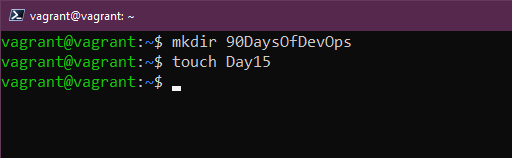
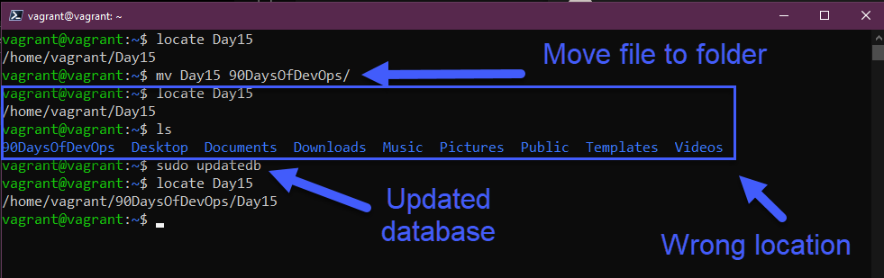

## Comandos de Linux para DevOps (en realidad son todos)

[Ayer](day14.md) se mencionó que vamos a pasar mucho tiempo en la terminal con algunos comandos para hacer cosas.

También mencioné que con nuestra MV aprovisionada con vagrant podemos usar `vagrant ssh` y acceder a nuestra caja. Necesitarás estar en el mismo directorio desde el que la aprovisionamos.

Para SSH no necesitarás el nombre de usuario y la contraseña, sólo lo necesitarás si decides entrar en la consola de Virtual Box.

Aquí es donde queremos estar según lo indicado a continuación:


## Comandos

Es imposible cubrir todos los comandos en una hora, durante 7 días, hay páginas y páginas de documentación que los cubren. Si alguna vez estás en tu terminal y sólo necesitas entender las opciones de un comando específico nos ayudarán las páginas `man` (abreviatura de manual). Podemos usar esto para ir a través de cada uno de los comandos que tocamos durante este post para encontrar más opciones para cada uno. Podemos ejecutar `man man` que nos dará la ayuda del comando del manual. Para salir de las páginas de manual hay que pulsar `q`.


`sudo` - Si estás familiarizado con Windows y el botón derecho `ejecutar como administrador` podemos pensar que `sudo` es algo parecido, teniendo en cuenta que no es lo mismo. Cuando ejecutes un comando con `sudo` lo estarás ejecutando como `root` y te pedirá la contraseña antes de ejecutar el comando.


Para trabajos puntuales como la instalación de aplicaciones o servicios, puedes necesitar el comando `sudo` pero ¿qué pasa si tienes varias tareas que realizar y quieres vivir como `sudo` durante un tiempo? Aquí es donde puedes usar `sudo su` que te llevará al prompt del usuario `root`. En una VM de prueba como la nuestra, esto está bien pero me parecería muy difícil que estuviéramos rodando como `root` durante periodos prolongados, pueden pasar cosas malas. Para salir de esta posición elevada simplemente hay que teclear `exit`.


Cada dos por tres estarás utilizando el comando `clear`. Hace exactamente lo que dice, limpiar la pantalla de todos los comandos anteriores, poniendo su prompt en la parte superior y dándole un espacio de trabajo agradable y limpio. 


Veamos ahora algunos comandos con los que podemos crear cosas dentro de nuestro sistema y luego visualizarlas en nuestra terminal. En primer lugar, tenemos `mkdir` que nos permitirá crear una carpeta en nuestro sistema. Con el siguiente comando, podemos crear una carpeta en nuestro directorio principal llamada Day15 `mkdir Day15`


Con `cd` podemos cambiar el directorio, por lo que para movernos a nuestro directorio recién creado podemos hacerlo con la pestaña `cd Day15`. También se puede utilizar para autocompletar el directorio disponible. Si queremos volver al punto de partida podemos utilizar `cd ..`


`rmdir` nos permite eliminar el directorio, si ejecutamos `rmdir Day15` entonces la carpeta será eliminada (ten en cuenta que esto sólo funcionará si no tienes nada en la carpeta)


A todos nos ha pasado que hemos navegado hasta las profundidades de nuestro sistema de archivos hasta un directorio muy anidado y no sabemos dónde estamos en este momento. Con `pwd` veremos el directorio de trabajo. 


Sabemos cómo crear carpetas y directorios, pero ¿cómo crear archivos? Podemos crear archivos usando el comando `touch` si ejecutáramos `touch Day15` esto crearía un archivo. 



`ls` - vas a usarlo muchas veces. Esto va a listar todos los archivos y carpetas en el directorio actual. Veamos si podemos ver el archivo que acabamos de crear.


¿Cómo podemos encontrar archivos en nuestro sistema Linux? `locate` nos va a permitir buscar en nuestro sistema de archivos. Si usamos `locate Day15` nos informará de la ubicación del archivo. La ventaja es que si sabes que el archivo existe pero obtienes un resultado en blanco, entonces ejecuta `sudo updatedb` que indexará todos los archivos en el sistema de archivos y luego ejecuta tu `locate` de nuevo. Si no tienes `locate` disponible, puedes instalarlo usando este comando `sudo apt install mlocate`


¿Qué pasa con el movimiento de archivos de una ubicación a otra? `mv` te va a permitir mover tus archivos. Ejemplo `mv Day15 90DaysOfDevOps` moverá tu archivo a la carpeta 90DaysOfDevOps.



Hemos movido nuestro archivo, pero ¿qué pasa si ahora queremos renombrarlo a otra cosa? Podemos hacerlo usando el comando `mv` de nuevo... Sí, podemos usar simplemente `mv Day15 day15` para cambiar a mayúsculas o podemos usar `mv day15 AnotherDay` para cambiarlo por completo, ahora usa `ls` para comprobar el archivo.


Ya es suficiente, ahora vamos a deshacernos (borrar) de nuestro archivo y quizás incluso de nuestro directorio si tenemos uno creado. `rm` simplemente `rm OtroDía` eliminará nuestro archivo. También usaremos bastante `rm -R` que trabajará recursivamente a través de una carpeta o ubicación. También podemos usar `rm -R -f` para forzar la eliminación de todos esos archivos. ¡Spoiler si ejecuta `rm -R -f /` añada sudo y podrá decir adiós a su sistema....!


Hemos visto cómo mover archivos, pero ¿qué pasa si sólo quiero copiar archivos de una carpeta a otra, simplemente es muy similar al comando `mv`, pero usamos `cp` por lo que ahora podemos decir `cp Day15 Desktop`


Hemos creado carpetas y archivos pero no hemos puesto ningún contenido en nuestra carpeta, podemos añadir contenido de varias maneras pero una manera fácil es `echo`. También podemos usar `echo` para imprimir muchas cosas en nuestro terminal, por ejemplo, las variables del sistema, para saber si están establecidas o no. Podemos usar `echo "Hello #90DaysOfDevOps" > Day15` y esto se añadirá a un archivo. También podemos añadir a nuestro archivo usando `echo "¡Los comandos son divertidos!" >> Día15`


¡Otro de esos comandos que usarás mucho! `cat` es la abreviatura de concatenar. Podemos usar `cat Day15` para ver el contenido dentro del archivo. Genial para leer rápidamente esos archivos de configuración.


Si tienes un archivo de configuración largo y complejo y quieres o necesitas encontrar algo rápidamente en ese archivo frente a leer cada línea entonces `grep` es tu amigo, esto nos permitirá buscar en tu archivo una palabra específica usando `cat Day15 | grep "#90DaysOfDevOps"`.


Si eres como yo y usas mucho el comando `clear` entonces puedes perderte algunos de los comandos ejecutados anteriormente, podemos usar `history` para encontrar todos esos comandos que hemos ejecutado anteriormente. El comando `history -c` eliminará el historial.

Cuando ejecutas `history` y quieres elegir un comando específico puedes usar `!3` para elegir el tercer comando de la lista.

También puede usar `history | grep "Command` para buscar algo específico.

En los servidores, para rastrear cuándo se ejecutó un comando, puede ser útil añadir la fecha y la hora a cada comando en el archivo del historial.

La siguiente variable del sistema controla este comportamiento:

```shell
HISTTIMEFORMAT="%d-%m-%Y %T "
```

Puedes añadir fácilmente a tu bash_profile:

```
echo 'export HISTTIMEFORMAT="%d-%m-%Y %T "' >> ~/.bash_profile
```

Es útil para permitir que el archivo de la historia pueda crecer más:

```
echo 'export HISTSIZE=100000' >> ~/.bash_profile
echo 'export HISTFILESIZE=10000000' >> ~/.bash_profile
```


¿Necesitas cambiar tu contraseña? `passwd` nos va a permitir cambiar nuestra contraseña. Ten en cuenta que cuando añades tu contraseña de esta manera cuando está oculta no se mostrará en el `history`. Sin embargo, si tu comando tiene `-p PASSWORD` será visible en tu `history`.


También podemos querer añadir nuevos usuarios a nuestro sistema, podemos hacerlo con `useradd` tenemos que añadir el usuario usando nuestro comando `sudo`, podemos añadir un nuevo usuario con `sudo useradd NewUser`


La creación de un grupo requiere nuevamente de `sudo` y podemos usar `sudo groupadd DevOps` luego si queremos agregar nuestro nuevo usuario a ese grupo podemos hacerlo ejecutando `sudo usermod -a -G DevOps`. `-a` es añadir y `-G` es el nombre del grupo.


Como añadimos usuarios al grupo `sudo`, esto sería una ocasión muy rara para que esto ocurra pero sería así: `usermod -a -G sudo NewUser`

### Permisos

leer, escribir y ejecutar son los permisos que tenemos en todos nuestros archivos y carpetas en nuestro sistema Linux.

Una lista completa:

- 0 = Ninguno `---`
- 1 = Solo ejecutar `--X`
- 2 = Solo escribir `-W-`
- 3 = Escribir y ejecutar `-WX`
- 4 = Solo leer `R--`
- 5 = Leer y ejecutar `R-X`
- 6 = Leer y escribir `RW-`
- 7 = Leer , escribir y ejecutar `RWX`

También verás `777` o `775` y estos representan los mismos números que la lista anterior pero cada uno representa **User - Group - Everyone**

Let's take a look at our file. `ls -al Day15` you can see the 3 groups mentioned above, user and group have read & write but everyone only has read.


Podemos cambiar esto usando `chmod`. Puedes encontrarte haciendo esto si estás creando binarios en tus sistemas, que necesitarás dar la capacidad de ejecutar esos binarios. Si quieres ejecutar esto para toda una carpeta, puedes usar `R` para hacerlo recursivamente.


¿Qué pasa con el cambio de propietario del archivo? Podemos usar `chown` para esta operación, si queremos cambiar la propiedad de nuestro `Day15` del usuario `vagrant` a `NewUser` podemos ejecutar `sudo chown NewUser Day15` de nuevo se puede usar `-R`.


Un comando que te encontrarás es `awk` que viene en uso real cuando tienes una salida de la que sólo necesitas datos específicos. Ejecutando `who` obtenemos líneas con información, pero tal vez sólo necesitamos los nombres. Podemos ejecutar `who | awk '{print $1}'` para obtener sólo una lista de esa primera columna.


Si lo que buscas es leer flujos de datos desde la entrada estándar, entonces genera y ejecuta líneas de comando; lo que significa que puede tomar la salida de un comando y pasarla como argumento de otro comando. `xargs` es una herramienta útil para este caso de uso. Si, por ejemplo, quiero una lista de todas las cuentas de usuario de Linux en el sistema, puedo ejecutar `cut -d: -f1 < /etc/passwd` y obtener la larga lista que vemos a continuación.


Si quiero compactar esa lista puedo hacerlo usando `xargs` en un comando como este `cut -d: -f1 < /etc/passwd | sort | xargs`


El anterior comando `cut` nos permite eliminar secciones de cada línea de un archivo. Se puede utilizar para cortar partes de una línea por posición de byte, carácter y campo. El comando `cut -d " " -f 2 list.txt` nos permite eliminar la primera letra que tenemos y sólo mostrar nuestros números. Hay tantas combinaciones que se pueden usar aquí con este comando, que estoy seguro que he pasado demasiado tiempo tratando de usar este comando cuando podría haber extraído los datos más rápidamente de forma manual.


También hay que tener en cuenta que si escribes un comando y ya no estás contento con él y quieres empezar de nuevo sólo tienes que pulsar control + c y esto cancelará esa línea y empezará de nuevo.

## Recursos

- [Learn the Linux Fundamentals - Part 1](https://www.youtube.com/watch?v=kPylihJRG70)
- [Linux for hackers (don't worry you don't need to be a hacker!)](https://www.youtube.com/watch?v=VbEx7B_PTOE)
- [Webminal](https://www.webminal.org/) 

Nos vemos el [Día 16](day16.md)

Esta es una lista bastante pesada, pero esos comandos se usan en el día a día, ya sea desde una administración de servidores Linux o en en un Desktop de Linux. Es muy fácil cuando estás en Windows o macOS navegar por la UI pero si quieres ser verdaderamente rápido y eficaz, este es el camino, gestionar todo a través de la terminal.