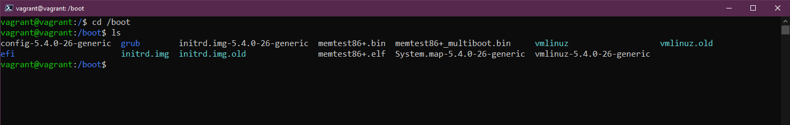

## Gestión de tu sistema Linux, sistema de archivos y almacenamiento

Hasta ahora hemos tenido una toma de contacto con Linux y DevOps. Tenemos nuestro entorno de laboratorio configurado con Vagrant [(Día 14)](day14.md) y tocamos una pequeña porción de comandos que estarán en nuestro kit de herramientas diarias para nuestras cositas en la terminal [(Día 15)](day15.md).

Hoy vamos a mirar en áreas clave a cuidar en los sistemas Linux con las actualizaciones, la instalación de software en general. También intentaremos explicar un poco sobre las carpetas del sistema y como se utilizan. Por último, echaremos un vistazo al almacenamiento.

## Gestión de Ubuntu y el Software

Lo primero que vamos a ver es cómo actualizar nuestro sistema operativo. Quizá estes familiarizado con este proceso en un sistema operativo Windows y macOS. Es ligeramente distinto en un Desktop o un servidor Linux.

Vamos a ver el gestor de paquetes apt, que es el que utilizaremos en nuestra MV Ubuntu para las actualizaciones y la instalación de software.

Generalmente, en las distribuciones derivadas de Debian, se ejecuta este comando para asegurarse de tener las últimas actualizaciones de los repositorios centrales, antes de cualquier instalación de software que pudiera provocar un conflicto de dependencias.

```shell
sudo apt-get update
```


Ahora tenemos una MV Ubuntu actualizada con las últimas actualizaciones del sistema operativo instaladas. Ahora queremos instalar algún software.

Vamos a elegir `figlet` que es un programa que genera banners de texto.

Si escribimos `figlet` en nuestro terminal vais a ver que no lo tenemos instalado en nuestro sistema.


Sin embargo, verás que nos da algunas opciones de instalación `apt` que podríamos probar. Esto es porque en los repositorios por defecto hay un programa llamado figlet. Probemos con `sudo apt install figlet`.


Instalado. Ahora ya lo podemos usar como puedes ver a continuación.


Si queremos eliminar esa o cualquier otro software también podemos hacerlo a través del gestor de paquetes `apt`.

```shell
sudo apt remove figlet
```


⚠️ _Ten cuidado con borrar cosas que no debes. Normalmente, las distribuciones te avisarán, puedes borrar todos los programas incluidos los que aparentemente no usas, pero en realidad son dependencias de otros._

Si quieres asegurarte de borrar el programa y todas sus dependencias puedes usar la opción `--purge`:

```shell
sudo apt --purge remove figlet
```

Podremos añadir repositorios de terceros, a los que tendremos acceso además de los repositorios por defecto de Ubuntu y de los oficiales.

Si por ejemplo, quisiéramos instalar vagrant en nuestra MV de Ubuntu no podríamos ahora mismo y esto lo podéis ver a continuación en el primer comando emitido. Añadimos la clave para confiar en el repositorio de HashiCorp, y luego añadimos el repositorio a nuestro sistema.


Una vez que tenemos el repositorio de HashiCorp añadido podemos seguir adelante y ejecutar `sudo apt install vagrant` y conseguir instalarlo en nuestro sistema.


Hay tantas opciones cuando se trata de la instalación de software, existen diferentes opciones de gestores de paquetes. Por ejemplo, en Ubuntu también podríamos utilizar snaps para nuestras instalaciones de software.

Esperemos que esto te dé una idea de cómo gestionar tu sistema operativo y las instalaciones de software en Linux.

## Explicación del sistema de archivos

Linux está hecho de archivos de configuración, si quieres cambiar algo entonces cambias estos archivos de configuración. ¡Una maravilla!

En Windows, tienes la unidad C: y eso es lo que consideramos la raíz. En Linux tenemos `/`, aquí es donde vamos a encontrar las carpetas importantes de nuestro sistema Linux.


- `/bin` - Abreviatura de binario, en esta carpeta es donde se encuentran los binarios que nuestro sistema necesita, los ejecutables y las herramientas.


- `/boot` - Todos los archivos que tu sistema necesita para arrancar, los que indican cómo arrancar y los que definen desde qué unidad arrancar.



- `/dev` - Aquí puedes encontrar información de dispositivos, es donde encontrarás punteros a tus unidades de disco `sda` será tu disco principal del SO.


- `/etc` Probablemente la carpeta que más navegarás de Linux. Es donde están la mayoría de archivos de configuración.


- `/home` - Aquí es donde encontrarás tus carpetas y archivos de usuario. Tenemos nuestra carpeta de usuario vagrant. Es donde te encontrarás las carpetas para tu Ubuntu Desktop como los `Documentos`, las `Descargas` y el `Escritorio`.


- `/lib` - Hemos mencionado que `/bin` es donde viven nuestros binarios y ejecutables, pues en `/lib` es donde encontrarás las librerías compartidas para estos.


- `/media` - Aquí es donde encontraremos los dispositivos extraíbles.


- `/mnt` - Este es un punto de montaje temporal. Cubriremos más sobre este en el siguiente apartado de almacenamiento, tienen bastante miga.


- `/opt` - Paquetes de software opcionales. Notarás que tenemos algunos programas de vagrant y virtual box almacenados aquí.


- `/proc` -  Información del kernel y de los procesos, similar a `/dev`. Es un sistema de archivos virtual que se crea sobre la marcha cuando el sistema arranca y se disuelve cuando se apaga. Me parece uno de los más importantes para trabajar si quieres dedicarte a la filosofía DevOps. La magía de la contenerización se entiende mejor si trabajas con el sistema de archivos que contiene `/proc`.

Contiene información útil sobre los procesos que se están ejecutando en ese momento, y se considera un centro de control e información para el núcleo. Puedes configurar directamente el kernel desde aquí, pues proporciona un medio de comunicación entre el espacio del kernel y el espacio del usuario.

En este [tutorial](https://prefapp.github.io/formacion/cursos/docker/es/#/./01_que_e_un_contedor_de_software/01_procesos_e_kernel) puedes trabajar con `/proc`


- `/root` - Para acceder a esta carpeta necesitarás sudo. Es la carpeta home para root.


- `/run` - Marcador de posición para los estados de la aplicación.


- `/sbin` - Sudo bin, similar a la carpeta bin pero estas herramientas están pensadas para privilegios elevados de superusuario en el sistema.


- `/tmp` - archivos temporales.


- `/usr` - Si como usuario estándar hemos instalado paquetes de software, generalmente se instalarán en la ubicación `/usr/bin`.


- `/var` - Nuestras aplicaciones se instalan en una carpeta `bin`. Necesitamos un lugar para almacenar todos los archivos de registro, este es `/var`.


## Almacenamiento

Cuando llegamos a un sistema Linux o a cualquier sistema podemos querer saber los discos disponibles y cuánto espacio libre tenemos en esos discos. Los siguientes comandos nos ayudarán a identificar, utilizar y gestionar el almacenamiento.

- `lsblk` Lista los dispositivos de bloque. `sda` es nuestro disco físico y luego `sda1, sda2, sda3` son nuestras particiones en ese disco.


- `df` nos da un poco más de detalle sobre las particiones: el total, el usado y el disponible. Puedes usar opciones interesante como `df -h` para darnos una salida humana de los datos.


Si usted estuviera añadiendo un nuevo disco a su sistema, y esto es lo mismo en Windows, necesitarías formatear el disco en la administración de discos. En la terminal de Linux puedes hacerlo usando 
```shell
sudo mkfs -t ext4 /dev/sdb
``` 
Nos deberemos asegurar que sdb es realmente nuestro disco recién añadido y el que queremos formatear, porque es lo que hará, borrarlo y darle un formato ext4 al disco.

A continuación, tendríamos que montar nuestro disco recién formateado para poderlo utilizar. Esto lo hacemos en nuestra carpeta `/mnt` que mencionamos anteriormente. Creamos un directorio allí con 
```shell
sudo mkdir /mnt/NewDisk
``` 
Para montar el disco en esa ubicación usaremos el siguiente comando.

```shell
sudo mount /dev/sdb newdisk
```

También es posible que necesites desmontar el almacenamiento del sistema de forma segura. Lo podemos hacer con 
```shell
sudo umount /dev/sdb
```

Si no quieres desmontar ese disco y vas a usarlo para, por ejemplo, una base de datos o algún otro uso persistente, querrás que esté ahí cuando reinicies tu sistema. Para que persista necesitamos añadir este disco a nuestro archivo de configuración `/etc/fstab`. Si no lo haces no estará dispobible cuando la máquina se reinicie y tendrás que pasar por el proceso manual de nuevo. Los datos seguirán estando en el disco pero no se montará automáticamente a menos que añadas la configuración al archivo mencionado.

Una vez que hayas editado el archivo de configuración `fstab` ppodrás comprobar su funcionamiento con `sudo mount -a`. Si no hay errores significa que los cambios serán persistentes a través de los reinicios.

Veremos cómo editar un archivo usando un editor de texto en una futura sesión.

## Recursos

- [Learn the Linux Fundamentals - Part 1](https://www.youtube.com/watch?v=kPylihJRG70)
- [Linux for hackers (don't worry you don't need to be a hacker!)](https://www.youtube.com/watch?v=VbEx7B_PTOE)
- [Webminal](https://www.webminal.org/) 

Nos vemos el [Día 17](day17.md).
