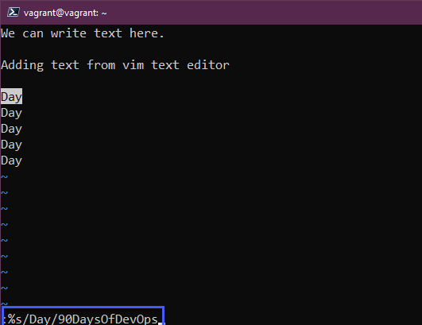

## Editores de texto - nano vs vim

La mayoría de tus sistemas Linux van a ser servidores y estos no van a tener una GUI. El último día también mencioné que Linux se compone principalmente de archivos de configuración, para hacer cambios vas a necesitar ser capaz de editar esos archivos de configuración para cambiar cualquier cosa en el sistema.

Hay muchas opciones por ahí pero creo que deberíamos cubrir probablemente los dos editores de texto de terminal más comunes. `nano` es más fácil de aprender a manejar pero cuando se trata de cambios rápidos y de posibilidades ilimitadas, tenemos que manejar `vim`. No obstante, el pico de aprendizaje de vim es mucho mayor, ya que tendrás que aprender muchísimos comandos.

- Encuesta [nano vs vim](https://t.me/seguridadinformatic4/3635).

### nano

- No está disponible en todos los sistemas.
- Es genial para empezar con los editores en shell.

Si ejecutamos 
```shell
nano 90DaysOfDevOps.txt
``` 
Crearemos un nuevo archivo vacío y entraremos directamente al editor. Desde aquí podemos añadir nuestro texto y, en la parte de abajo, tenemos las instrucciones básicas para la gestión del fichero.


Ahora podemos utilizar `control x + enter` y luego ejecutar `ls` para ver nuestro primer archivo de texto.


También podemos ejecutar `cat` con ese archivo como argumento para que muestre en pantalla lo que tenga. Luego podemos usar el mismo `nano 90DaysOfDevOps.txt` para volver a entrar en el editor y añadir texto adicional o modificar el archivo.

`nano` es súper fácil cuando se trata de hacer pequeños cambios en los archivos de configuración.

### vim

Posiblemente el editor de texto más común. Un hermano del editor de texto de UNIX, vi, de 1976, con el que obtenemos muchas funcionalidades.

- Es compatible con todas las distribuciones de Linux.
- Increíblemente potente. Es factible encontrar cursos completos de vim de 7 horas.
- Tiene muchas posibles extensiones.

Podemos entrar a vim con el comando `vim` o si queremos editar nuestro nuevo archivo txt anterior podemos ejecutar 
```shell
vim 90DaysOfDevOps.txt
``` 
Lo primero, comparando con `nano`, vas a ver la ausencia de menús de ayuda. Con lo que la primera pregunta podría ser "¿Cómo salgo de vim?" 😳

Primero asegurate de que no has entrado en ningún modo con `escape` y, si no hemos hecho ningún cambio, entonces `:q` nos sacará sin problemas. Si tenemos algún cambio pero igual queremos salir podemos forzar con `:q!`.


Cuando entras estás en modo `normal` pero hay otros modos como `command, normal, visual, insert`. Si queremos añadir texto tendremos que cambiar de `normal` a `insert` y lo podemos hacer pulsando `i`. Añades el texto que quieras y para guardar estos cambios y salir del editor podemos utilizar `escape` para salir al modo normal y luego `:wq`. También se puede forzar con `:wq!`, por ejemplo, en el caso de que se este editando desde varios shells.


Puedes comprobar el texto introducido con el comando `cat`.

Hay algunas funcionalidades rápidas y geniales con vim que te permiten hacer tareas menores muy rápidamente si conoces los atajos. Digamos que hemos añadido una lista de palabras repetidas y ahora necesitamos cambiar eso, tal vez es un archivo de configuración y repetimos un nombre de red y ahora esto ha cambiado y queremos cambiarlo rápidamente. En la captura se ve un ejemplo con la palabra "Day"".


Ahora queremos sustituir esa palabra por 90DaysOfDevOps, podemos hacerlo pulsando `ESC` y escribiendo `:%s/Day/90DaysOfDevOps`.



 Cuando pulsemos intro se efectuará la magía. El resultado es que todas las palabras "Day" se han sustituido por 90DaysOfDevOps.


Copiar y pegar es la clave para entender la potencia de este editor. Copiar no se copia sino que se tira. Podemos copiar usando `yy` en nuestro teclado en modo normal. `p` pegar en la misma línea, `P` pegar en una nueva línea. Así de fácil.

También puedes borrar una línea fácilmente con `dd`.

Y atención, si marcas un número y utilizas justo después `yy` o `dd`, respectivamente, se copiarán o borrarán el número de líneas que hayas elegido. Impresionante.

También es probable que alguna vez necesites buscar en un archivo, podemos usar `grep` como se mencionó en una sesión anterior pero también podemos usar vim usando `/palabra-a-buscar` y esto encontrará la primera coincidencia, para navegar a través de las siguientes coincidencias usarás la tecla `n`.

Si utilizas vim siempre que sea posible, conseguirás ser todo un experto aprendiendo poco a poco.

Una pregunta común en las entrevistas es cuál es tu editor de texto favorito en Linux y yo me aseguraría de que tienes al menos el conocimiento de `vim` y `nano` poder responder con críterio. Existen muchos más, pero ya verás como estos son omnipresentes. 

Está bien decir `nano` porque es simple. Al menos demuestras competencia en la comprensión de lo que es un editor de texto. Pero ponte manos a la obra con ambos para ser más competente.

Otro puntero que podemos utilizar para navegar en vim es `H,J,K,L`, además de nuestras teclas de dirección. Podrás ver algo más completo, aunque también básico, en el recurso en español ["Guía básica de Vim"](https://gitea.vergaracarmona.es/man-linux/Guia-VIM).

## Recursos

- [Vim in 100 Seconds](https://www.youtube.com/watch?v=-txKSRn0qeA)
- [Vim tutorial](https://www.youtube.com/watch?v=IiwGbcd8S7I)
- [Learn the Linux Fundamentals - Part 1](https://www.youtube.com/watch?v=kPylihJRG70)
- [Linux for hackers (don't worry you don't need to be a hacker!)](https://www.youtube.com/watch?v=VbEx7B_PTOE)
- [Guía básica de Vim](https://gitea.vergaracarmona.es/man-linux/Guia-VIM)

Nos vemos en el [Día 18](day18.md).
