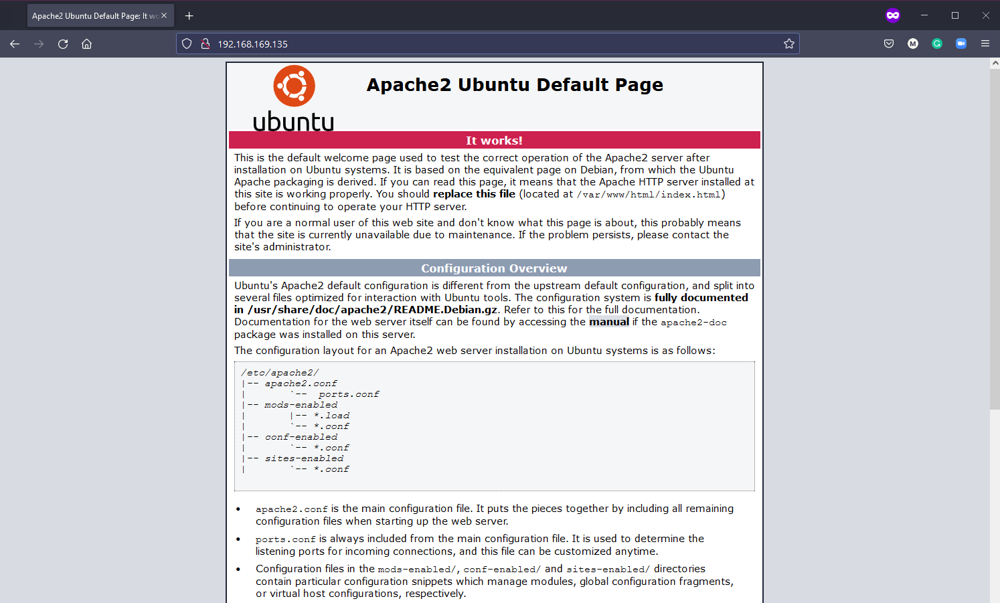

## SSH & Web Server

Como hemos mencionado a lo largo de este artículo, lo más probable es que estés administrando muchos servidores Linux remotos. Debido a esto necesitarás asegurarte de que tu conectividad a estos servidores remotos sea la más segura posible. En esta sección, veremos algunos de los fundamentos de SSH que todo el mundo debería conocer y que te ayudarán con un túnel seguro a los sistemas remotos.

- Estableciendo una conexión con SSH.
- Transferencia de archivos.
- Crear su clave privada.

### introducción a SSH

- Shell seguro.
- Protocolo de red.
- Permite comunicaciones seguras.
- Puede asegurar cualquier servicio de red.
- Normalmente se utiliza para el acceso remoto a la línea de comandos.

Si has estado siguiendo los días anteriore recordarás que ya hemos utilizado SSH. Lo que pasa que fue configurado y automatizado a través de vagrant, por lo que sólo tuvimos que ejecutar `vagrant ssh` y obtuvimos acceso a la máquina virtual remota.

Si nuestra máquina remota no estuviera en nuestro propio sistema y estuviera en una ubicación remota, por ejemplo, basado en la nube o ejecutado en un centro de datos al que sólo pudiéramos acceder a través de Internet, necesitaríamos una forma segura de poder acceder al sistema para gestionarlo.

Así que nos ayudaremos del protocolo SSH que proporcionará un túnel seguro entre el cliente y el servidor para que nada pueda ser interceptado por malos actores.


El servidor tiene un servicio SSH del lado del servidor siempre en ejecución y escuchando en un puerto TCP específico (22).

Si usamos nuestro cliente para conectarnos con las credenciales correctas o la clave SSH, entonces obtendremos acceso a ese servidor.

### Añadiendo un adaptador de red puenteado a nuestro sistema

Para poder simular esto con nuestra MV de VirtualBox, necesitamos añadir un adaptador de red puenteado a nuestra máquina.

Asegurate de que la máquina virtual este apagada, haz clic con el botón derecho en sobre la máquina dentro de VirtualBox y selecciona configuración. En la nueva ventana, selecciona red.


Ahora vuelva a encender su máquina y tendrá una dirección IP en su máquina local. Puedes confirmarlo con el comando `IP addr`.

### Confirmando que el servidor SSH está funcionando

Sabemos que SSH ya está configurado en nuestra máquina ya que lo hemos estado usando con vagrant pero podemos confirmarlo ejecutando

```shell
sudo systemctl status ssh
```


Si tu sistema no tiene el servidor SSH puedes instalarlo con este comando 

```shell
sudo apt install OpenSSH-server
```

A continuación, debe asegurarse de que nuestro SSH está permitido por el firewall, si este se está ejecutando. Por ejemplo, en el caso de que el firewall sea ufw, tendríamos que habilitar el protocolo con el siguiente comando. 

```shell
sudo ufw allow ssh
``` 
En nuestra MV no es necesario ya que automatizamos esto con nuestro aprovisionamiento vagrant.

### Acceso Remoto - Contraseña SSH

Ahora que tenemos nuestro servidor SSH escuchando en el puerto 22 para cualquier solicitud de conexión entrante y hemos añadido la red puente, en Windows, podemos usar putty o cualquier otro cliente SSH en la máquina anfitriona para conectarnos a nuestro sistema usando SSH.


A continuación pulsamos abrir, si es la primera vez que nos conectamos a este sistema a través de esta dirección IP nos aparecerá este aviso. Sabemos que este es nuestro sistema, así que puedes elegir que sí.


Ahora se nos pide nuestro nombre de usuario (vagrant) y contraseña (contraseña por defecto - vagrant). Después verás como nuestro cliente SSH (Putty) se conecta a nuestra MV.


¡All rigth! Estamos conectados a nuestra VM desde nuestro cliente remoto y podemos emitir nuestros comandos en nuestro sistema.

Ahora, desde otro Linux podemos usar directamente la shell con el comando ssh. La sintaxis es la siguiente:

```shell
ssh <nombre-usuario>@<IP-equipo-remoto>
```

En el caso de que la ip de nuestra MV fuese la 192.168.169.135 tendríamos que usar el siguiente comando:

```shell
ssh vagrant@192.168.169.135
```

Nos pedirá la contraseña y luego nos pedirá que aceptemos el certificado automático de ssh.

### Acceso remoto - Clave SSH

El modo que hemos visto es una forma fácil y rápida de obtener acceso a sus sistemas, sin embargo, todavía se basa en el nombre de usuario y la contraseña. Con lo cual, si algún actor malicioso pudiese tener acceso a esta información y a la dirección pública o IP de su sistema, nuestra seguridad estaría comprometida. Para reducir este vector de vulnerabilidad podemos utilizar las claves SSH.

Las claves SSH proporciona un par de claves, tanto para el cliente como para el servidor, así pueden saber con seguridad de que se trata de un dispositivo de confianza.

Crear una clave es fácil. En nuestra máquina local (Tanto en Windows o Linux) podemos emitir los certificados con el siguiente comando. 

```shell
ssh-keygen -t ed25519
```

No entraremos en lo que es `ed25519` pero puedes hacer una búsqueda si quieres aprender más sobre [criptografía](https://es.wikipedia.org/wiki/EdDSA#Ed25519). ¡Es apasionante!


En este punto, tenemos nuestra clave SSH creada almacenada en `C:\sers\micha/.ssh/` en Windows o en `$HOME/.ssh` en el caso de Linux.

Pero para enlazar esto con nuestra MV Linux necesitamos copiar la clave. Podemos hacerlo utilizando el `ssh-copy-id vagrant@192.168.169.135` en la shell.

En Windows puedes utilizar Powershell para crear las claves en Windows pero no hay `ssh-copy-id` disponible aquí. Hay maneras de hacer esto en Windows y una pequeña búsqueda en línea le encontrará una alternativa, pero voy usaremos [git bash](https://gitforwindows.org/) en Windows para hacer la copia.


Ahora podemos volver a Powershell para probar que nuestra conexión funciona con nuestras Claves SSH y no se requiere ninguna contraseña, utilizando el comando que mencionamos antes para usar desde la shell de un Linux cliente.

```shell
ssh vagrant@192.168.169.135
```


Podríamos asegurar esto aún más si fuera necesario usando una frase de contraseña. También podríamos ir un paso más allá diciendo que no hay contraseñas en absoluto, lo que significa que sólo se permitirían pares de claves a través de SSH. Puedes hacer esto en el siguiente archivo de configuración de la máquina remota, de nuestra MV.

```shell
sudo nano /etc/ssh/sshd_config
```

Encontrarás una línea con `PasswordAuthentication yes` esto tendrá un `#` por delante, estará comentado. Tan solo descomenta y cambia el sí a no. Entonces tendrá que recargar el servicio SSH con el siguiente comando:

```shell
sudo systemctl reload sshd
```

Y ya hemos mejorado la seguridad. Se podría mejorar más, hasta [niveles conspiranoicos](https://vidatecno.net/como-personalizar-la-configuracion-de-ssh-para-obtener-la-maxima-seguridad/), pero con esto tenemos suficiente para empezar.

## Configuración de un servidor web

Ya que tenemos nuestra MV Linux para nuestro patio de recreo, vamos a aprovecharla un poco más. Vamos a añadirle un servidor web apache para que podamos alojar una página web simple que se podrá ver en la red local. Tenga en cuenta que esta página web no será accesible desde Internet, esto no se recomienda pero se puede hacer, pero no lo veremos aquí. Una [pista](https://www.noip.com/). 

También puedes ver esto como LAMP stack.

- **L**inux Operating System
- **A**pache Web Server
- **m**ySQL database
- **P**HP

### Apache2

Apache2 es un servidor HTTP de código abierto. Podemos instalar apache2 con el siguiente comando.

```shell
sudo apt-get install apache2
```

Para confirmar que apache2 está instalado correctamente podemos ejecutar

```shell
sudo service apache2 restart
```

A continuación, utilizaremos la dirección de red de nuestra máquina remota que vimos en el apartado de SSH. Abre un navegador y comprueba la dirección. La del ejemplo que teníamos era `http://192.168.169.135/`.



### mySQL

MySQL es una base de datos en la que vamos a almacenar nuestros datos para nuestro sencillo sitio web. Para instalar MySQL debemos utilizar el siguiente comando.

```shell
sudo apt-get install mysql-server
```

### PHP

PHP es un lenguaje de programación del lado del servidor. Lo utilizaremos para interactuar con la base de datos MySQL. La instalación final es conseguir instalar PHP y sus dependencias usando.

```shell
sudo apt-get install php libapache2-mod-php php-mysql
```

El primer cambio de configuración que queremos hacer es que apache deje de usar `index.html` para usar en cambio `index.php`.

Vamos a usar el comando.

```shell
sudo nano /etc/apache2/mods-enabled/dir.conf
``` 
Y en el listado moveremos `index.php` al primer elemento de la lista.


Reiniciamos el servicio apache2 

```shell
sudo systemctl restart apache2
```

Ahora vamos a confirmar que nuestro sistema está configurado correctamente para PHP. Cree el siguiente archivo usando este comando, esto abrirá un archivo en blanco en nano.

```shell
sudo nano /var/www/html/90Days.php
```

Luego copie lo siguiente dentro del documento y, como ya aprendimos, usando control + x salimos y guardamos el archivo.

```php
<?php
phpinfo();
?>
```

Ahora navega a la IP de tu MV Linux de nuevo con el adicional 90Days.php al final de la URL: `http://192.168.169.135/90Days.php`. Deberías ver algo similar a lo siguiente si PHP está configurado correctamente.


### Instalación de WordPress

A continuación, he seguido este tutorial para instalar WordPress en nuestra LAMP stack. 

```shell
sudo mysql -u root -p
```

```mysql
CREATE DATABASE wordpressdb;

CREATE USER 'admin-user'@'localhost' IDENTIFIED BY 'password';

GRANT ALL PRIVILEGES ON wordpressdb.* TO 'admin-user'@'localhost';

FLUSH PRIVILEGES;

EXIT;
```

```shell
sudo apt install php-curl php-gd php-mbstring php-xml php-xmlrpc php-soap php-intl php-zip
```
```shell
sudo systemctl restart apache2
```

```shell
cd /var/www
```

```shell
sudo curl -O https://wordpress.org/latest.tar.gz
```

```shell
sudo tar -xvf latest.tar.gz
```

```shell
sudo rm latest.tar.gz
```

En este punto se encuentra en el paso 4 del artículo ["How to install WordPress on Ubuntu with LAMP"](https://blog.ssdnodes.com/blog/how-to-install-wordpress-on-ubuntu-18-04-with-lamp-tutorial/), tendrá que seguir los pasos para asegurarse de que todos los permisos correctos están en su lugar para el directorio de WordPress.

Debido a que esto es interno, no es necesario "generar claves de seguridad" en este paso. Vaya al paso 5 que es cambiar la configuración de Apache a WordPress.

Entonces, si todo está configurado correctamente, podrá acceder a través de su dirección de red interna y ejecutar la instalación de WordPress.

## Recursos

- [Client SSH GUI - Remmina](https://remmina.org/)
- [The Beginner's guide to SSH](https://www.youtube.com/watch?v=2QXkrLVsRmk)
- [Vim in 100 Seconds](https://www.youtube.com/watch?v=-txKSRn0qeA)
- [Vim tutorial](https://www.youtube.com/watch?v=IiwGbcd8S7I)
- [Learn the Linux Fundamentals - Part 1](https://www.youtube.com/watch?v=kPylihJRG70)
- [Linux for hackers (don't worry you don't need to be a hacker!)](https://www.youtube.com/watch?v=VbEx7B_PTOE)
- [Webminal](https://www.webminal.org/) 
- [Guía básica de Vim](https://gitea.vergaracarmona.es/man-linux/Guia-VIM)

Nos vemos en el [Día 19](day19.md).
