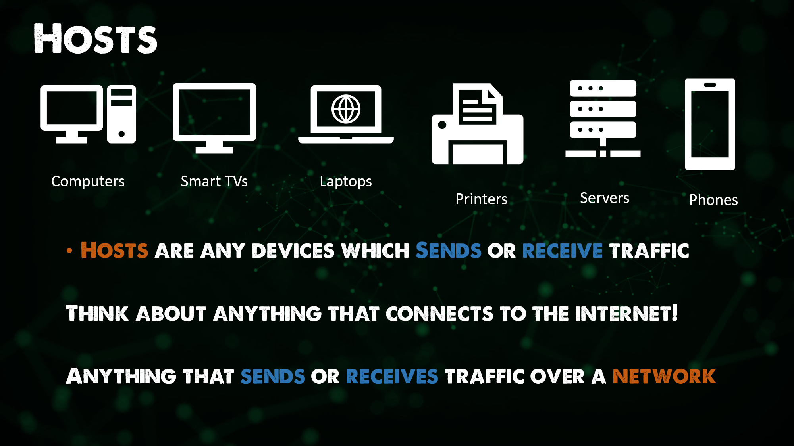

## El panorama: DevOps & Networking

Como en todas las secciones, se están utilizando materiales de formación abiertos y gratuitos. Gran parte del contenido se puede atribuir a otros. En el caso de la sección de redes una gran mayoría del contenido mostrado es gratuito de [Practical Networking](https://www.practicalnetworking.net/) y [Networking Fundamentals series](https://www.youtube.com/playlist?list=PLIFyRwBY_4bRLmKfP1KnZA6rZbRHtxmXi). Se menciona en los recursos, así como un enlace, pero es apropiado destacar esto desde el punto de vista de la comunidad. Se ha aprovechado este curso para ayudarme a entender más acerca de las áreas particulares de las tecnologías. Este repositorio sirve para que yo tome notas y para que la comunidad pueda beneficiarse de esto y de los recursos enumerados.  

¡Bienvenidos al Día 21! Vamos a ver la creación de redes en los próximos 7 días. En DevOps es necesario adquirir algunos conocimientos básicos sobre la creación de redes para poder defendernos en cualquier puesto de ingeniero de plataforma.

En última instancia, como hemos dicho anteriormente, DevOps se trata de un cambio de cultura y proceso dentro de las organizaciones, hemos visto que pudiera ser con máquinas virtuales, con contenedores o con Kubernetes. Pues también puede ser con la red. Si estamos utilizando los principios DevOps para nuestra infraestructura tiene que incluir la red con un punto de vista DevOps, valga la redundancia. También necesitas saber acerca de la red como las diferentes topologías, herramientas de red y los posibles stacks que tenemos disponibles.

Lo recomendable es tener nuestros dispositivos de red configurados utilizando la infraestructura como código ([IaC](https://es.wikipedia.org/wiki/Infraestructura_como_c%C3%B3digo)), ya hemos comentado alguna vez que significa esto. También debemos tener todo automatizado como lo haríamos con nuestras máquinas virtuales, pero para hacer esto deberíamos adquirir una buena comprensión de lo que estamos automatizando.

Al lío.

### ¿Qué es NetDevOps | Network DevOps?

Dentro de la cultura cloud escucharás términos como Network DevOps o NetDevOps. Tal vez ya seas ingeniero de redes y tengas un gran dominio de los componentes de red dentro de la infraestructura, entonces comprenderás los elementos utilizados en torno a las redes, como DHCP, DNS, NAT, etc, además de la importancia que tienen todos estos elementos. Por lo tanto, también tendrás un buen conocimiento de las opciones de redes definidas por hardware o software, switches, routers, etc.

En el caso de que no seas un ingeniero de redes, probablemente necesites una ayudita para alcanzar unos conocimientos básicos de esta área y así poder entender el objetivo final de Network DevOps.

En lo que respecta a los términos NetDevOps o Network DevOps, podemos pensarlos como la aplicación de los principios y prácticas de DevOps a la red, aplicando herramientas de control de versiones y automatización a la creación, testing, monitorización y despliegue de la red.

Si pensamos en DevOps de Red como algo que tiene que requerir automatización, tenemos que volver atrás a cuando mencionamos DevOps como rompedor de silos entre equipos. Si los equipos de redes no cambian a un modelo y proceso similares, entonces se convierten en el cuello de botella o incluso en el fracaso general.

Utilizar los principios de automatización en torno al aprovisionamiento, la configuración, el testing, el control de versiones y el despliegue es un gran comienzo. En general, la automatización va a permitir mejorar la agilidad y velocidad en los despliegues, consiguiendo estabilidad de la infraestructura de red y la mejora consecuente, así como el proceso que se comparte a través de múltiples entornos una vez que han sido probados. Por ejemplo, una política de red totalmente probada en un entorno puede utilizarse rápidamente en otra ubicación, ya que se trata de un código y no de un proceso manual.
Un buen punto de vista y resumen de este pensamiento se puede encontrar aquí: [Network DevOps](https://www.thousandeyes.com/learning/techtorials/network-devops).

## Lo básico de Networking

Vamos a olvidarnos del punto de vista DevOps durante un rato y miraremos muy brevemente algunos fundamentos de red.

*Si prefieres este contenido en forma de vídeo, echa un vistazo a estos vídeos de Practical Networking:*

* [*Network Devices - Hosts, IP Addresses, Networks - Networking Fundamentals - Lesson 1a*](https://www.youtube.com/watch?v=bj-Yfakjllc&list=PLIFyRwBY_4bRLmKfP1KnZA6rZbRHtxmXi&index=1)
* [*Network Devices - Hub, Bridge, Switch, Router - Networking Fundamentals - Lesson 1b*](https://www.youtube.com/watch?v=H7-NR3Q3BeI&list=PLIFyRwBY_4bRLmKfP1KnZA6rZbRHtxmXi&index=2)

### Dispositivos de red

**Host** - Son todos los dispositivos que envían o reciben tráfico.

**Dirección IP** - La identidad de cada host.

**Network** - Es lo que transporta el tráfico entre los hosts. Si no tuviéramos redes, ¡habría mucho movimiento manual de datos!

Un grupo lógico de hosts que requieren una conectividad similar.

**Switches** - Facilitan la comunicación dentro de una red. Reenvía paquetes de datos entre hosts y envía paquetes directamente a los hosts.

- Network: Agrupación de hosts que requieren una conectividad similar.
- Los hosts de una red comparten el mismo espacio de direcciones IP.

> *Los más avanzados pueden actuar como un router, salvando las distancias. Podrían enrutar entre dispositivos con las mismas características pero no tendrían todos los protocolos de enrutamiento que puede ofrecer un router.*

1
**Router** - Facilita la comunicación entre redes. Hemos dicho que un switch se ocupa de la comunicación dentro de una red, pues bien, el router nos permite unir estas redes o al menos dar acceso entre ellas si está permitido.

> *No estamos hablando del router que conocemos en nuestras casas. Estamos hablando solo del aparato que se ocupar en enrutar. Lo que conocemos actualmente como routers, los que nos proveen las [ISP](https://es.wikipedia.org/wiki/Proveedor_de_servicios_de_internet), a mi parecer defectuosos, realmente se componen de 4 elementos: Router, switch, punto de acceso y modem. Se debe tener en cuenta esta diferencia de dispositivos para entender mejor los conceptos que tratamos.*

Un router puede proporcionar un punto de control del tráfico (seguridad, filtrado, redireccionamiento) Cada vez son más los conmutadores que también proporcionan algunas de estas funciones.

Los routers aprenden a qué redes están conectados. Una routing table contiene el conjunto de redes que conoce un router.

Un router tiene una dirección IP en las redes a las que está conectado. Esta IP también va a ser la salida de cada host de su red local, también conocida como puerta de enlace (gateway).

Los routers también crean la jerarquía en las redes que he mencionado antes.

> *Los más avanzados pueden actuar con funcionalidades idénticas de un switch*

## Switches vs Routers

**Routing**  es el proceso de mover datos entre redes.

- Un router es un dispositivo cuyo propósito principal es el enrutamiento.

**Switching** es el proceso de mover datos dentro de una red.

- Un switch es un dispositivo cuya función principal es la conmutación.

Hemos dado un vistazo general de algunos dispositivos pero debemos saber que existen muchos más con otras funcionalidades en la red, como:

- Puntos de acceso.
- Firewalls (físicos, de hardware).
- Load Balancers (físicos, de hardware).
- Switches de capa 3.
- IDS / IPS.
- Proxies.
- Switches virtuales (lógicos, de software).
- Routers virtuales (lógicos, de software).

Aunque todos los dispositivos anteriores van a realizar de una u otra forma el Routing y/o el Switching.

En los próximos días vamos a conocer un poco más:

- Modelo OSI.
- Protocolos de red.
- DNS (Domain Name System)
- NAT
- DHCP
- Subnets

Son conceptos muy importantes ya que serán la base para conocer las redes. Si no conoces los términos lo mejor es que sigas con los siguientes días de red. Si los conoces, puedes repasarlos o ir directamente al siguiente tema: [Cloud Provider](day28.md)

## Rercursos

* [Networking Fundamentals](https://www.youtube.com/playlist?list=PLIFyRwBY_4bRLmKfP1KnZA6rZbRHtxmXi)
* [Computer Networking full course](https://www.youtube.com/watch?v=IPvYjXCsTg8)

Nos vemos en el [Día 22](day22.md).
