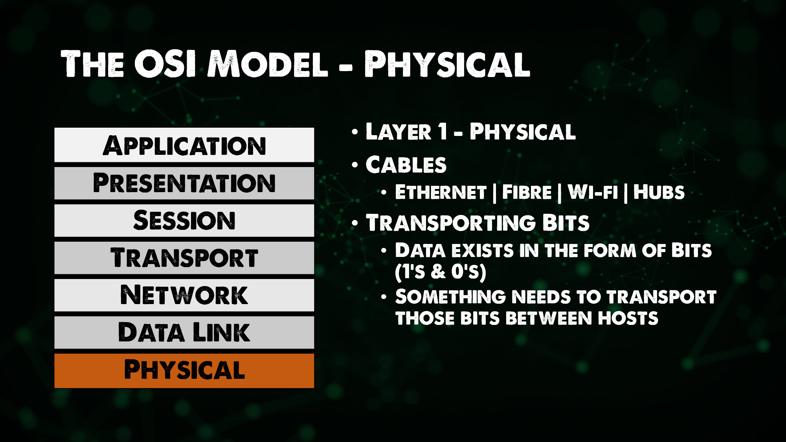

El contenido que figura a continuación procede en su mayor parte de Practical Networking [Networking Fundamentals series](https://www.youtube.com/playlist?list=PLIFyRwBY_4bRLmKfP1KnZA6rZbRHtxmXi). Si prefieres este contenido en forma de vídeo, echa un vistazo a estos dos vídeos:

* [The OSI Model: A Practical Perspective - Layers 1 / 2 / 3](https://www.youtube.com/watch?v=LkolbURrtTs&list=PLIFyRwBY_4bRLmKfP1KnZA6rZbRHtxmXi&index=3)
* [The OSI Model: A Practical Perspective - Layers 4 / 5+](https://www.youtube.com/watch?v=0aGqGKrRE0g&list=PLIFyRwBY_4bRLmKfP1KnZA6rZbRHtxmXi&index=4)

## El Modelo OSI - Las 7 Capas

El propósito general de las redes como industria es permitir que dos hosts compartan datos entre ellos. Antes de la conexión en red, si se necesitaba trasladar datos de un host a otro, se tenía que conectar algo en el primer host, llevarlo al otro host y conectarlo allí para conseguir nuestro propósito. Nos ha solucionado muchos aspectos de la vida siendo una revolución industrial, social y creando incluso una [cultura](https://es.wikipedia.org/wiki/Cibercultura) propia. 

La conexión en red nos permite automatizar el proceso mencionados, permitiendo que un host comparta datos automáticamente a través de la conexión, sea por cable o por redes inalámbricas. Para que estos hosts puedan realizar esta labor, es necesario que sigan un conjunto de reglas comunes.

Esto no es diferente de cualquier idioma. El inglés tiene una serie de reglas que deben seguir dos angloparlantes. El español tiene sus propias reglas. El francés tiene sus propias reglas, y el trabajo en red también tiene las suyas.

Las reglas de las redes actualmente más utilizadas se dividen en siete capas diferentes y esas capas se conocen como el modelo OSI. Aunque existen otros modelos, este es el más extendido y el que ha creado un estándar.

### Introducción al Modelo OSI

El modelo OSI (Open Systems Interconnection Model) es un marco utilizado para describir las funciones de un sistema de red. El modelo OSI caracteriza las funciones informáticas en un conjunto universal de reglas y requisitos para apoyar la interoperabilidad entre diferentes productos y software. En el modelo de referencia OSI, las comunicaciones entre un sistema informático se dividen en siete capas de abstracción diferentes:

- **Física**
- **Enlace de Datos**
- **Red**
- **Transporte**
- **Sesión**
- **Presentación**
- **Aplicación**.

Veamos un poco sobre estas capas.

### Física

Capa 1 en el modelo OSI se conoce como la capa física, la premisa de ser capaz de obtener datos de un host a otro a través de un medio ya sea el cable físico o también podríamos considerar los medios inalámbricos como el Wi-Fi en esta capa. Algo más de hardware heredado de esta capa son los hubs y los repetidores para transportar los datos de un host a otro.

### Enlace de datos

En la capa 2, el enlace de datos permite una transferencia de nodo a nodo donde los datos se empaquetan en tramas. También hay un nivel de corrección de errores que podría haber ocurrido en la capa física. Aquí es donde introducimos o vemos por primera vez las direcciones MAC.

Los switches que describimos en el [Día 21](day21.md) trabajan principalmente en esta capa.

### Red

Es probable que hayas oído el término switches de capa 3 o switches de capa 2. En nuestro modelo OSI Capa 3, la Red tiene como objetivo una entrega de extremo a extremo, aquí es donde vemos nuestras direcciones IP también mencionadas en el resumen del [Día 21](day21.md).

Los Routers y los hosts se ubican en la capa 3, recuerda que el router es la capacidad de enrutar entre múltiples redes. Cualquier dispositivo con IP podría considerarse de Capa 3.

Entonces, ¿por qué necesitamos esquemas de direccionamiento en las Capas 2 y 3? (Direcciones MAC vs Direcciones IP)

Si pensamos en la transmisión de datos de un host a otro, cada host tiene una dirección IP, pero hay varios switches y routers entre ellos. Cada uno de los dispositivos tiene una dirección MAC de capa 2.

La dirección MAC de capa 2 sólo irá de host a switch/router, se centra en los saltos mientras que las direcciones IP de capa 3 permanecerán con ese paquete de datos hasta que llegue a su host final. (De extremo a extremo)

> Direcciones IP - Capa 3 = Entrega de extremo a extremo.

> Direcciones MAC - Capa 2 = Entrega de Salto a Salto.

Un protocolo de red que veremos, pero no hoy, es el ARP (Protocolo de Resolución de Direcciones) el cuál enlaza nuestras direcciones de Capa3 y Capa2.

### Transporte

Entrega de Servicio a Servicio, la Capa 4 está ahí para distinguir los flujos de datos. De la misma manera que la Capa 3 y la Capa 2 tenían sus esquemas de direccionamiento, en la Capa 4 tenemos puertos.

### Sesión, Presentación, Aplicación

La distinción entre las Capas 5, 6 y 7 es, o había llegado a ser, algo difusa.

Merece la pena consultar el [TCP IP Model](https://www.geeksforgeeks.org/tcp-ip-model/) para obtener una comprensión más reciente.

Intentemos comprender qué ocurre cuando los hosts se comunican entre sí utilizando el modelo OSI. El primer host tiene una aplicación que va a generar datos que están destinados a ser enviados a otro host.

El host de origen va a pasar por lo que se conoce como proceso de encapsulación. Esos datos serán enviados primero a la capa 4.

La capa 4 va a añadir una cabecera a esos datos que puede facilitar el objetivo de la capa 4 que es la entrega de servicio a servicio. Se trata de un puerto TCP o UDP. También incluirá el puerto de origen y el puerto de destino. Esto se conoce como segmento (datos y puerto).

Este segmento bajará por la pila OSI hasta la capa 3, la capa de red, y la capa de red añadirá otra cabecera a estos datos.
Esta cabecera va a facilitar el objetivo de la capa 3 que es la entrega de extremo a extremo, lo que significa que en esta cabecera tendrás una dirección IP de origen y una IP de destino, la cabecera más los datos también pueden ser referidos como un paquete.

La capa 3 tomará ese paquete y se lo pasará a la capa 2, la capa 2 añadirá otra cabecera a esos datos para cumplir el objetivo de la capa 2 de entrega de salto a salto, lo que significa que esta cabecera incluirá una dirección mac de origen y de destino. Esto se conoce como trama cuando se tiene la cabecera de capa 2 y los datos.

Esa trama luego se convierte en unos y ceros y se envía a través de la capa 1 de cable físico o wifi. 

¡No es increíble!

La aplicación que envía los datos está siendo enviada a alguna parte por lo que la recepción es algo a la inversa para conseguir que vuelva a la pila y en el host receptor. Es decir, llega a la capa física, sigue por la capa de enlace de datos, la de red, la de transporte hasta la de sesión.

Esto en cada pequeña transmisión de datos que efectuamos en la red. ¿Es tan apasionante para mí como para tí? Pues sigamos al siguiente día.

## Recursos

* [Networking Fundamentals](https://www.youtube.com/playlist?list=PLIFyRwBY_4bRLmKfP1KnZA6rZbRHtxmXi)
- [Computer Networking full course](https://www.youtube.com/watch?v=IPvYjXCsTg8)

Nos vemos en el [Día 23](day23.md).
