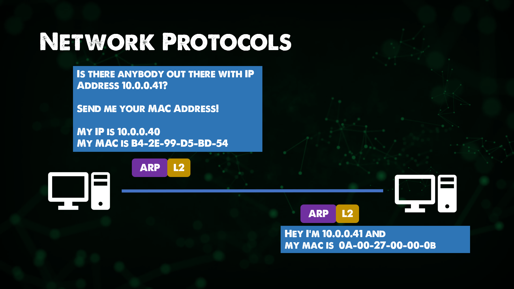
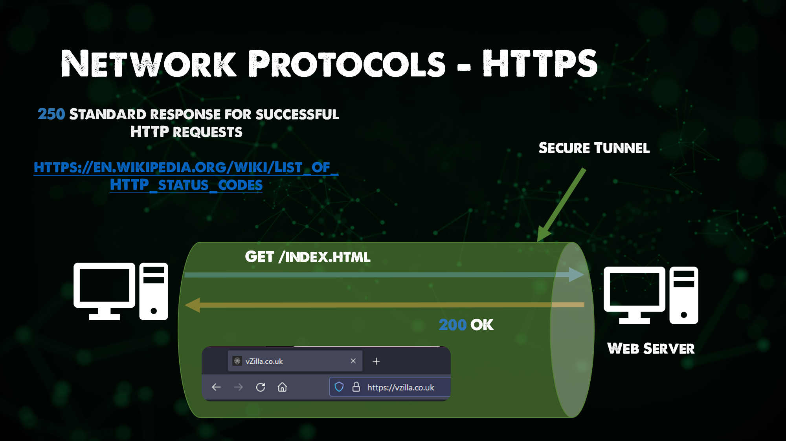
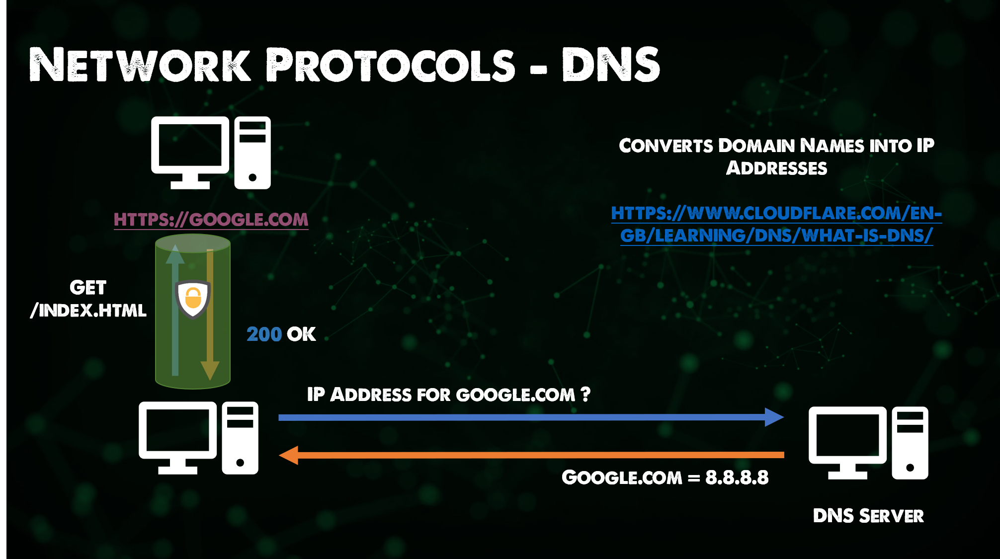

El contenido que figura a continuación procede en su mayor parte de Practical Networking [Networking Fundamentals series](https://www.youtube.com/playlist?list=PLIFyRwBY_4bRLmKfP1KnZA6rZbRHtxmXi). Si prefieres este contenido en forma de vídeo, echa un vistazo a este vídeo:

* [Network Protocols - ARP, FTP, SMTP, HTTP, SSL, TLS, HTTPS, DNS, DHCP](https://www.youtube.com/watch?v=E5bSumTAHZE&list=PLIFyRwBY_4bRLmKfP1KnZA6rZbRHtxmXi&index=12)

## Protocolos de red

Conjunto de reglas y mensajes que forman un estándar de Internet.

- ARP - Address Resolution Protocol (Protocolo de resolución de direcciones)

Si quieres profundizar en ARP puedes leer el estándar de Internet [RFC 826](https://datatracker.ietf.org/doc/html/rfc826).

Básicamente, conecta direcciones IP a direcciones de máquinas físicas fijas, también conocidas como direcciones MAC, a través de una red de capa 2.

- FTP - File Transfer Protocol (Protocolo de transferencia de archivos)

Permite la transferencia de archivos de origen a destino. Generalmente, este proceso es autenticado pero existe la posibilidad, si se configura, de utilizar acceso anónimo. Ahora es más frecuente ver FTPS, que proporciona conectividad SSL/TLS a servidores FTP desde el cliente para una mayor seguridad. Este protocolo se encuentra en la capa de Aplicación del Modelo OSI.

- SMTP - Simple Mail Transfer Protocol (Protocolo simple de transferencia de correo)

Utilizado para la transmisión de correo electrónico, los servidores de correo utilizan SMTP para enviar y recibir mensajes de correo. Incluso con Microsoft 365 se sigue utilizando el protocolo SMTP para el mismo fin.

- HTTP - Hyper Text Transfer Protocol (Protocolo de transferencia de hipertexto)

HTTP es la base de Internet y de la navegación de contenidos. Nos permite acceder fácilmente a nuestros sitios web favoritos. HTTP todavía se utiliza mucho, pero HTTPS se utiliza más o debería utilizarse en la mayoría de tus sitios favoritos.

- SSL - Secure Sockets Layer (Capa de sockets seguros) | TLS - Transport Layer Security (Seguridad de la capa de transporte)

TLS ha tomado el relevo de SSL, TLS es un **Protocolo Criptográfico** que proporciona seguridad a las comunicaciones a través de una red. Lo puedes encontrar en el correo, en la mensajería instantánea y en otras aplicaciones, pero más comúnmente se utiliza para asegurar HTTPS. Más arriba se mencionó la nomenclatura de cada capa de encabezado y datos, pero esto también es.

- HTTPS -  HTTP securizado con SSL/TLS

Una extensión de HTTP, utilizada para comunicaciones seguras a través de una red, HTTPS está encriptado con TLS como se mencionó anteriormente. El objetivo es aportar autenticación, privacidad e integridad al intercambio de datos entre hosts.

- DNS - Domain Name System (Sistema de Nombres de Dominio)

Todos conocemos [google.com](https://google.com) pero si abriéramos un navegador y pusiéramos [8.8.8.8](https://8.8.8.8) obtendríamos Google tal y como lo conocemos. No podríamos recordar todas las direcciones IP de todos los sitios web que nos interesan, aun utilizando un buscador como Google o DuckDuckGo para buscar información, necesitamos que las direcciones sean fáciles de recordar.

Aquí es donde entra en juego el DNS, que garantiza que los hosts, servicios y otros recursos sean accesibles para humanos.

En todos los hosts, si requieren conectividad a Internet, entonces deben tener DNS para poder resolver esos nombres de dominio. Las DNS son un área en la que podrías pasar años aprendiendo. También diría por experiencia que las DNS son la causa más común de todos los errores cuando se trata de redes. Aunque no estoy seguro de que un ingeniero de redes esté de acuerdo.

- DHCP - Dynamic Host Configuration Protocol (Protocolo de configuración dinámica de host)

Hemos hablado mucho de los protocolos necesarios para que nuestros hosts funcionen, ya sea accediendo a Internet o transfiriendo archivos entre ellos. Pues bien, necesitamos al menos 4 elementos en cada host para que sea capaz de realizar ambas tareas:

- Dirección IP
- Máscara de subred
- Puerta de enlace predeterminada
- DNS

Ya hemos visto la **dirección IP**, que es una dirección única para tu host en la red en la que reside, podemos pensar en ella como el número de nuestra casa.

La **máscara de subred** la veremos en breve, pero podemos pensar en ella como en un código postal.

Una **puerta de enlace** predeterminada, generalmente en nuestra red, es la IP de nuestro router que nos proporciona la conectividad de capa 3. Podría verse como la puerta de enlace única. Y, buscando un posible símil, se podría ver como la única carretera que nos permite salir de nuestra calle.

Luego tenemos la DNS, como hemos visto, es la forma de ayudarnos a convertir direcciones IP públicas difíciles de recordar en nombres de dominio más adecuados. Podríamos verlos como una gigantesca oficina de clasificación para asegurarnos de que recibimos el correo correcto.

Como hemos visto, cada host requiere de estos 4 elementos, si tienes 1000 o 10.000 hosts entonces eso te va a llevar mucho tiempo para determinar cada uno individualmente. Es aquí donde DHCP entra en juego y le permite determinar un alcance para su red que este protocolo distribuirá a todos los hosts disponibles en su red de forma dinámica.

Otro ejemplo: entras en una cafetería, coges un café y te sientas con tu portátil o tu teléfono. Conectas tu host al WiFi de la cafetería y obtienes acceso a Internet, los mensajes y el correo empiezan a llegar y puedes navegar por páginas web y redes sociales. Cuando te conectas a la WiFi de la cafetería, tu máquina habrá recogido una dirección DHCP de un servidor DHCP dedicado o, muy probablemente, del router, que también gestiona DHCP. (No estamos recomendando la wifi de las cafeterías, todos sabemos lo que pasa en esas redes.)

### Subnetting (Subredes)

Una subred es una subdivisión lógica de una red IP. Dividen las redes grandes en redes más pequeñas y manejables para que sean más eficientes.

Cada subred es una subdivisión lógica de la red más grande. Los dispositivos conectados con una subred comparten identificadores de dirección IP comunes, lo que les permite comunicarse entre sí.

Los routers gestionan la comunicación entre subredes.

El tamaño de una subred depende de los requisitos de conectividad y de la tecnología de red utilizada.

Una organización es responsable de determinar el número y tamaño de las subredes dentro de los límites del espacio de direcciones disponibles, y los detalles quedan en manos de esa organización. Las subredes también pueden segmentarse en subredes aún más pequeñas, por ejemplo para enlaces punto a punto o subredes que soporten unos pocos dispositivos.

Entre otras ventajas, segmentar subredes permite la reasignación y descongestiona la red, agilizando la comunicación y la eficiencia.

Las subredes también pueden mejorar la seguridad de la red. Si una sección de una red se ve comprometida, puede ponerse en cuarentena, lo que dificulta que los actores maliciosos se muevan por la red más grande.

## Recursos

- [Networking Fundamentals](https://www.youtube.com/playlist?list=PLIFyRwBY_4bRLmKfP1KnZA6rZbRHtxmXi)
- [Subnetting Mastery](https://www.youtube.com/playlist?list=PLIFyRwBY_4bQUE4IB5c4VPRyDoLgOdExE)
- [Computer Networking full course](https://www.youtube.com/watch?v=IPvYjXCsTg8)

Nos vemos en el [Día 24](day24.md).
