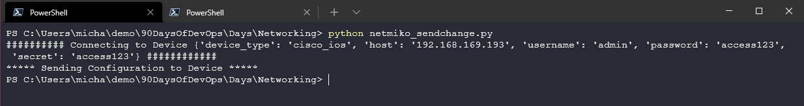
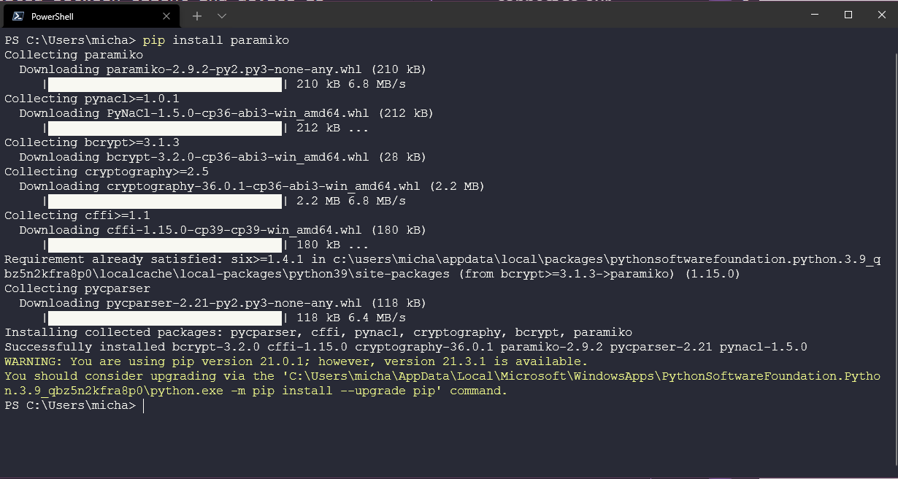

## Manos a la obra con Python y Redes

En esta sección final de Fundamentos de Redes, vamos a cubrir algunas tareas y herramientas de automatización con nuestro entorno de laboratorio creado el [Día 26](day26.md).

En esta sección final de Fundamentos de Redes, vamos a cubrir algunas tareas y herramientas de automatización con nuestro entorno de laboratorio creado el [Día 26](day18.md).

## Acceder a nuestro entorno virtual emulado

Para interactuar con nuestros switches necesitamos una workstation dentro de la red EVE-NG o puedes desplegar una caja Linux allí con Python instalado para realizar tu automatización ([Recurso para configurar Linux dentro de EVE-NG](https://www.youtube.com/watch?v=3Qstk3zngrY)) o puedes hacer algo como yo y definir una nube para acceder desde tu estación de trabajo.


Para hacer esto, hemos hecho click con el botón derecho del ratón en nuestro lienzo y hemos seleccionado red y luego "Gestión(Nube0)" esto hará de puente con nuestra red doméstica.


Sin embargo, no tenemos nada dentro de esta red por lo que necesitamos añadir conexiones desde la nueva red a cada uno de nuestros dispositivos. (Mis conocimientos de redes necesitan más atención y me parece que sólo podría hacer este paso siguiente al router superior y luego tener conectividad con el resto de la red a través de este único cable...).

A continuación, he iniciado sesión en cada uno de nuestros dispositivos y he corrido a través de los siguientes comandos para las interfaces aplicables a donde entra la nube.

```
enable
config t
int gi0/0
IP add DHCP
no sh
exit
exit
sh ip int br
```

El último paso nos da la dirección DHCP de nuestra red doméstica. La lista de red de mi dispositivo es la siguiente:

| Node    | IP Address   | Home Network IP |
| ------- | ------------ | --------------- |
| Router  | 10.10.88.110 | 192.168.169.115 |
| Switch1 | 10.10.88.111 | 192.168.169.178 |
| Switch2 | 10.10.88.112 | 192.168.169.193 |
| Switch3 | 10.10.88.113 | 192.168.169.125 |
| Switch4 | 10.10.88.114 | 192.168.169.197 |

### SSH a un dispositivo de red

Con lo anterior en su lugar, ahora podemos conectarnos a nuestros dispositivos en nuestra red doméstica utilizando nuestra estación de trabajo. Estoy usando Putty pero también tengo acceso a otras terminales como git bash que me dan la capacidad de SSH a nuestros dispositivos.

A continuación se puede ver que tenemos una conexión SSH a nuestro dispositivo router. (R1)


### Usando Python para recopilar información de nuestros dispositivos

El primer ejemplo de cómo podemos aprovechar Python es para recopilar información de todos nuestros dispositivos y, en particular, quiero ser capaz de conectarme a cada uno y ejecutar un comando simple que me proporcione la configuración de la interfaz y los ajustes. He almacenado este script aquí [netmiko_con_multi.py](Networking/netmiko_con_multi.py)

Ahora cuando ejecuto esto puedo ver la configuración de cada puerto sobre todos mis dispositivos.


Esto puede ser útil si tienes muchos dispositivos diferentes, crea este script para que puedas controlar de forma centralizada y entender rápidamente todas las configuraciones en un solo lugar.

### Usando Python para configurar nuestros dispositivos

Lo anterior es útil, pero ¿qué pasa con el uso de Python para configurar nuestros dispositivos, en nuestro escenario tenemos un puerto troncalizado entre `SW1` y `SW2` de nuevo imaginar si esto se iba a hacer a través de muchos de los mismos interruptores que queremos automatizar y no tener que conectarse manualmente a cada interruptor para hacer el cambio de configuración.

Podemos usar [netmiko_sendchange.py](Networking/netmiko_sendchange.py) para lograr esto. Esto se conectará por SSH y realizará ese cambio en nuestro `SW1` que también cambiará al `SW2`.



Ahora para los que miren el código, verán que aparece el mensaje y nos dice `sending configuration to device` pero no hay confirmación de que esto haya ocurrido podríamos añadir código adicional a nuestro script para realizar esa comprobación y validación en nuestro switch o podríamos modificar nuestro script de antes para que nos muestre esto. [netmiko_con_multi_vlan.py](Networking/netmiko_con_multi_vlan.py)


### copia de seguridad de las configuraciones de tus dispositivos

Otro caso de uso sería capturar nuestras configuraciones de red y asegurarnos de que las tenemos respaldadas, pero de nuevo no queremos estar conectándonos a cada dispositivo que tenemos en nuestra red así que también podemos automatizar esto usando [backup.py](Networking/backup.py). También necesitarás rellenar [backup.txt](Networking/backup.txt) con las direcciones IP de las que quieres hacer copia de seguridad.

Ejecute su script y debería ver algo como lo siguiente.


Los archivos de respaldo.


### Paramiko

Un módulo de Python ampliamente utilizado para SSH. Puedes encontrar más información en el enlace oficial de GitHub [aquí](https://github.com/paramiko/paramiko)

Podemos instalar este módulo usando el comando `pip install paramiko`.



Podemos verificar la instalación entrando en la shell de Python e importando el módulo paramiko.


### Netmiko

El módulo netmiko apunta específicamente a dispositivos de red mientras que paramiko es una herramienta más amplia para manejar conexiones SSH en general.

Netmiko que hemos usado arriba junto con paramiko puede ser instalado usando `pip install netmiko`.

Netmiko soporta muchos proveedores y dispositivos de red, puedes encontrar una lista de dispositivos soportados en la [Página GitHub](https://github.com/ktbyers/netmiko#supports)

### Otros módulos

También vale la pena mencionar algunos otros módulos que no hemos tenido la oportunidad de ver pero que dan mucha más funcionalidad cuando se trata de automatización de redes.

`netaddr` se utiliza para trabajar y manipular direcciones IP, de nuevo la instalación es sencilla con `pip install netaddr`

Puede que quieras almacenar gran parte de la configuración de tu switch en una hoja de cálculo excel, `xlrd` permitirá a tus scripts leer el libro de excel y convertir las filas y columnas en una matriz. `pip install xlrd` para instalar el módulo.

Algunos otros casos de uso en los que la automatización de redes puede ser utilizada y que no he tenido la oportunidad de mirar se pueden encontrar [aquí](https://github.com/ktbyers/pynet/tree/master/presentations/dfwcug/examples)

Aquí terminamos nuestra sección de Redes de los #90DaysOfDevOps. Las redes es un área muy extensa, espero que estos apuntes y recursos compartidos sean útiles para tener una base de conocimientos.

## Recursos

- [Free Course: Introduction to EVE-NG](https://www.youtube.com/watch?v=g6B0f_E0NMg)
- [EVE-NG - Creating your first lab](https://www.youtube.com/watch?v=9dPWARirtK8)
- [3 Necessary Skills for Network Automation](https://www.youtube.com/watch?v=KhiJ7Fu9kKA&list=WL&index=122&t=89s)
- [Computer Networking full course](https://www.youtube.com/watch?v=IPvYjXCsTg8)
- [Practical Networking](http://www.practicalnetworking.net/)
- [Python Network Automation](https://www.youtube.com/watch?v=xKPzLplPECU&list=WL&index=126)

La mayoría de los ejemplos utilizados aquí provienen de este extenso libro que no es gratuito, pero ha sido utilizado algunos de los escenarios planteados.

- [Hands-On Enterprise Automation with Python (Book)](https://www.packtpub.com/product/hands-on-enterprise-automation-with-python/9781788998512)

Nos vemos el[Día 28](day28.md) donde veremos la computación en nube para una buena comprensión de los conocimientos básicos necesarios.
