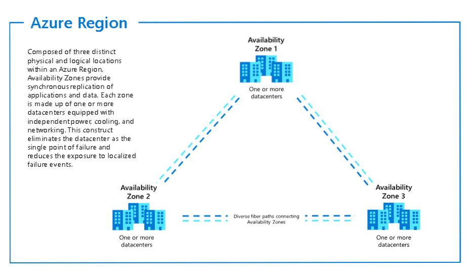
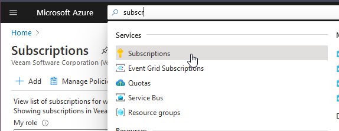

## Fundamentos de Microsoft Azure

Antes de empezar, el ganador de la encuesta de Twitter fue Microsoft Azure, de ahí el título de la página. Ha estado reñido y también ha sido muy interesante ver los resultados a lo largo de las 24 horas.

Yo diría que en términos de cubrir este tema me va a dar una mejor comprensión y actualización en torno a los servicios disponibles en Microsoft Azure, me inclino hacia Amazon AWS cuando se trata de mi día a día. Sin embargo, he dejado recursos que había alineado para los tres principales proveedores de nube.

Me doy cuenta de que hay más y la encuesta sólo incluía estos 3 y, en particular, hubo algunos comentarios sobre Oracle Cloud. Me encantaría saber más acerca de otros proveedores de nube que se utilizan, podéis dejar comentarios.

### Lo básico

- Proporciona servicios de nube pública
- Distribuidos geográficamente (más de 60 regiones en todo el mundo)
- Acceso a través de Internet y/o conexiones privadas
- Modelo multiinquilino
- Facturación basada en el consumo - Pay as you go (Pague a medida que avanza) | Pay as you grow (Pague a medida que crece)
- Un gran número de tipos de servicio y ofertas para diferentes requisitos.

[Microsoft Azure Global Infrastructure](https://infrastructuremap.microsoft.com/explore)

Aunque ya hemos hablado de SaaS y de la nube híbrida, no vamos a tratar esos temas aquí.

La mejor manera de empezar es haciendo clic en el siguiente enlace que permite crear una [Cuenta gratuita de Microsoft Azure](https://azure.microsoft.com/en-gb/free/)

### Regiones

He enlazado el mapa interactivo más arriba, pero podemos ver en la imagen de abajo la amplitud de regiones que se ofrecen en la plataforma Microsoft Azure en todo el mundo.

_imagen tomada de [Microsoft Docs - 01/05/2021](https://docs.microsoft.com/en-us/azure/networking/microsoft-global-network)_

También verás varias nubes "soberanas", lo que significa que no están vinculadas o no pueden hablar con las otras regiones, por ejemplo, éstas estarían asociadas con gobiernos como `AzureUSGovernment`, `AzureChinaCloud` y otras.

Cuando estemos desplegando nuestros servicios dentro de Microsoft Azure elegiremos una región para casi todo. Sin embargo, es importante tener en cuenta que no todos los servicios están disponibles en todas las regiones. Puedes ver [Productos disponibles por región](https://azure.microsoft.com/en-us/global-infrastructure/services/?products=all) en el momento de escribir esto que en West Central US no podemos usar Azure Databricks.

También se mencionó arriba que hay ciertos servicios que están ligados a la región como Azure Bot Services, Bing Speech, Azure Virtual Desktop, Static Web Apps, y algunos más.

Entre bastidores, una región puede estar formada por más de un centro de datos. Estos se denominarán Zonas de Disponibilidad.

En la siguiente imagen, extraída de la documentación oficial de Microsoft, se describe qué es una región y cómo se compone de zonas de disponibilidad. Sin embargo no todas las regiones tienen múltiples Zonas de Disponibilidad.

La documentación de Microsoft es muy buena, y puedes obtener mucha más información sobre [Regiones y zonas de disponibilidad](https://docs.microsoft.com/en-us/azure/availability-zones/az-overview).

### Suscripciones

Recuerda que mencionamos que Microsoft Azure es una nube de modelo de consumo que encontrará que todos los principales proveedores de nube siguen este modelo.

Si tienes una empresa, entonces es posible que desee tener un acuerdo de empresa establecido con Microsoft para permitir servicios especializados de Azure.

Si usted es como yo y está utilizando Microsoft Azure para la educación, entonces tenemos algunas otras opciones.

Tenemos la [Cuenta gratuita de Microsoft Azure](https://azure.microsoft.com/en-gb/free/) que generalmente te da varios créditos de nube gratuitos para gastar en Azure durante algún tiempo.

También existe la posibilidad de utilizar una suscripción a Visual Studio que te da algunos créditos gratuitos cada mes junto con tu suscripción anual a Visual Studio, esto era comúnmente conocido como MSDN hace años. [Visual Studio](https://azure.microsoft.com/en-us/pricing/member-offers/credit-for-visual-studio-subscribers/)

Por último, está el modelo de pago por uso con tarjeta de crédito. [Pago por uso](https://azure.microsoft.com/en-us/pricing/purchase-options/pay-as-you-go/)

Una suscripción puede verse como un límite entre diferentes suscripciones potencialmente centros de costes pero entornos completamente diferentes. Una suscripción es donde se crean los recursos.

### Grupos de gestión

Los grupos de gestión nos dan la capacidad de segregar el control a través de nuestro Azure Active Directory (AD) o nuestro entorno de inquilinos. Los grupos de gestión nos permiten controlar las políticas, el control de acceso basado en roles (RBAC) y los presupuestos.

Las suscripciones pertenecen a estos grupos de gestión por lo que podría tener muchas suscripciones en su Azure AD Tenant, estas suscripciones a continuación, también puede controlar las políticas, RBAC, y los presupuestos.

### Administrador de recursos y grupos de recursos

#### Gestor de Recursos Azure

- API basada en JSON que se basa en proveedores de recursos.
- Los recursos pertenecen a un grupo de recursos y comparten un ciclo de vida común.
- Paralelismo
- Los despliegues basados en JSON son declarativos, idempotentes y comprenden las dependencias entre recursos para gobernar la creación y el orden.

#### Grupos de recursos

- Cada recurso de Azure Resource Manager existe en uno y sólo un grupo de recursos.
- Los grupos de recursos se crean en una región que puede contener recursos de fuera de la región.
- Los recursos pueden moverse entre grupos de recursos
- Los grupos de recursos no están aislados de otros grupos de recursos, puede haber comunicación entre grupos de recursos.
- Los grupos de recursos también pueden controlar políticas, RBAC y presupuestos.

### Manos a la obra

Vamos a conectarnos y a asegurarnos de que tenemos una **Suscripción** disponible. Podemos marcar nuestro simple **Grupo de Gestión**, podemos ir y crear un nuevo **Grupo de Recursos** dedicado en nuestra **Región** preferida.

La primera vez que iniciemos sesión en nuestro [portal Azure](https://portal.azure.com/#home) veremos en la parte superior la posibilidad de buscar recursos, servicios y documentos.

Vamos a ver primero nuestra suscripción, verás aquí que estoy usando una suscripción Visual Studio Professional que me da algo de crédito gratis cada mes.

Si entramos en ella obtendremos una visión más amplia a lo que está sucediendo y a lo que se puede hacer con la suscripción, podemos ver información de facturación con funciones de control a la izquierda donde se puede definir el Control de Acceso IAM y más abajo hay más recursos disponibles.

Podría haber un escenario en el que tienes varias suscripciones y deseas gestionarla todas bajo una cuenta, aquí puedes utilizar los grupos de gestión para segregar por grupos de responsabilidad. Abajo puedes ver que hay sólo un grupo raíz de inquilino con la suscripción.

También verás en la imagen anterior que el grupo de gestión padre es el mismo ID utilizado en el grupo raíz del inquilino.

A continuación tenemos los grupos de recursos, aquí es donde combinamos nuestros recursos y podemos gestionarlos fácilmente en un solo lugar. Hay algunos creados para otros proyectos.

En los próximos días vamos a crear un grupo de recursos. Esto se hace fácilmente en esta consola pulsando la opción crear de la imagen anterior.

Se produce un paso de validación y luego tienes la oportunidad de revisar tu creación antes de crear. También verás abajo "Descargar una plantilla para automatización" esto nos permite tomar en formato JSON una plantilla que podremos utilizar de forma automatizada más adelante, lo veremos más adelante también.

Pulsamos crear. Ahora en nuestra lista de grupos de recursos tenemos nuestro grupo "90DaysOfDevOps" listo para lo que hagamos en las siguientes sesiones.

## Recursos

- [Hybrid Cloud and MultiCloud](https://www.youtube.com/watch?v=qkj5W98Xdvw)
- [Microsoft Azure Fundamentals](https://www.youtube.com/watch?v=NKEFWyqJ5XA&list=WL&index=130&t=12s)
- [Google Cloud Digital Leader Certification Course](https://www.youtube.com/watch?v=UGRDM86MBIQ&list=WL&index=131&t=10s)
- [AWS Basics for Beginners - Full Course](https://www.youtube.com/watch?v=ulprqHHWlng&t=5352s)

Nos vemos en el [Día 30](day30.md)
