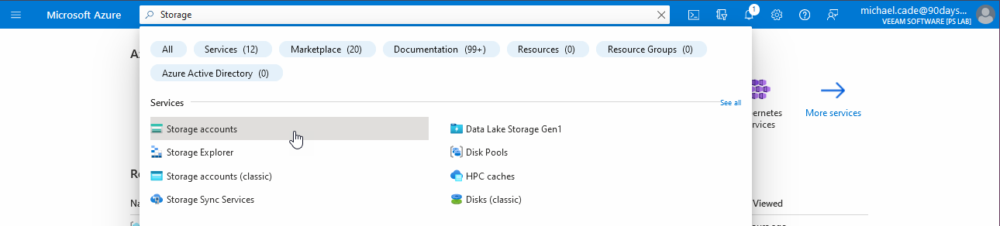

## Modelos de almacenamiento de Microsoft Azure

### Servicios de almacenamiento

- Los servicios de almacenamiento de Azure se proporcionan mediante cuentas de almacenamiento.
- A las cuentas de almacenamiento se accede principalmente a través de la API REST.
- Una cuenta de almacenamiento debe tener un nombre único que forme parte de un nombre DNS `<Nombre de la cuenta de almacenamiento>.core.windows.net`.
- Varias opciones de replicación y cifrado.
- Se encuentra dentro de un grupo de recursos

Podemos crear nuestro grupo de almacenamiento simplemente buscando Storage Group en la barra de búsqueda de la parte superior del Azure Portal.

A continuación, podemos ejecutar los pasos para crear nuestra cuenta de almacenamiento recordando que este nombre tiene que ser único y también tiene que ser todo en minúsculas, sin espacios, pero puede incluir números.

También podemos elegir el nivel de redundancia que queremos para nuestra cuenta de almacenamiento y para todo lo que guardemos aquí. Cuanto más abajo de la lista más cara es la opción, pero también la dispersión de sus datos.

Incluso la opción de redundancia por defecto nos da 3 copias de nuestros datos.

[Azure Storage Redundancy](https://docs.microsoft.com/en-us/azure/storage/common/storage-redundancy)

Resumen del enlace anterior:

- **Almacenamiento redundante local**: replica los datos tres veces en un único centro de datos de la región primaria.
- **Almacenamiento georredundante**: copia los datos de forma sincrónica tres veces en una única ubicación física de la región principal mediante LRS.
- **Almacenamiento redundante en zonas**: replica los datos de Azure Storage de forma sincrónica en tres zonas de disponibilidad de Azure en la región principal.
- **Almacenamiento georredundante**: combina la alta disponibilidad proporcionada por la redundancia entre zonas de disponibilidad con la protección contra interrupciones regionales proporcionada por la georreplicación. Los datos de una cuenta de almacenamiento GZRS se copian en tres zonas de disponibilidad de Azure en la región principal y también se replican en una segunda región geográfica para protegerlos de desastres regionales.

Volviendo a las opciones de rendimiento. Podemos elegir entre Estándar y Premium. Hemos elegido Estándar en el tutorial, pero Premium te da algunas opciones específicas.

A continuación, en el menú desplegable, puedes ver que tenemos estas tres opciones para elegir.

Hay muchas más opciones avanzadas disponibles para su cuenta de almacenamiento, pero por ahora, no necesitamos entrar en estas áreas. Estas opciones están relacionadas con el cifrado y la protección de datos.

### Discos gestionados

El acceso al almacenamiento puede realizarse de varias formas.

Acceso autenticado mediante:
- Una clave compartida para un control total.
- Firma de acceso compartido para un acceso delegado y granular.
- Azure Active Directory (cuando esté disponible)

Acceso público:
- El acceso público también se puede conceder para permitir el acceso anónimo, incluso a través de HTTP.
- Un ejemplo de esto podría ser alojar contenido básico y archivos en un blob de bloques para que un navegador pueda ver y descargar estos datos.

Si accede a su almacenamiento desde otro servicio Azure, el tráfico permanece dentro de Azure.

Cuando se trata del rendimiento del almacenamiento tenemos dos tipos diferentes:

- **Estándar** - Número máximo de IOPS
- **Premium** - Número garantizado de IOPS

IOPS => Operaciones de entrada/salida por segundo.

También hay que tener en cuenta la diferencia entre discos no gestionados y gestionados a la hora de elegir el almacenamiento adecuado para la tarea que tenemos.

### Almacenamiento de Máquinas Virtuales

- Los discos del sistema operativo de la máquina virtual suelen almacenarse en un almacenamiento persistente.
- Algunas cargas de trabajo sin estado no requieren almacenamiento persistente y la reducción de la latencia es un beneficio mayor.
- Hay máquinas virtuales que soportan discos efímeros gestionados por el SO que se crean en el almacenamiento local del nodo.
  - Estos también se pueden utilizar con VM Scale Sets.

Los discos gestionados son un almacenamiento en bloque duradero que puede utilizarse con las máquinas virtuales Azure. Pueden tener Ultra Disk Storage, Premium SSD, Standard SSD o Standard HDD. También tienen algunas características.

- Compatibilidad con instantáneas e imágenes
- Movimiento sencillo entre SKUs
- Mejor disponibilidad cuando se combina con conjuntos de disponibilidad
- Facturación basada en el tamaño del disco, no en el almacenamiento consumido.

## Almacenamiento de archivos

- **Cool Tier** - Está disponible para bloquear y anexar blobs.
  - Menor coste de almacenamiento
  - Mayor coste de transacción.
- **Archive Tier** - Está disponible para bloques BLOB.
  - Se configura para cada BLOB.
  - Coste más bajo, latencia de recuperación de datos más larga.
  - Misma durabilidad de datos que el almacenamiento Azure normal.
  - Se pueden habilitar niveles de datos personalizados según sea necesario.

### Compartir Archivos

A partir de la creación anterior de nuestra cuenta de almacenamiento podemos crear archivos compartidos.

Esto proporcionará recursos compartidos de archivos SMB2.1 y 3.0 en Azure.

Utilizable dentro de Azure y externamente a través de SMB3 y el puerto 445 abierto a Internet.

Proporciona almacenamiento compartido de archivos en Azure.

Se puede asignar utilizando clientes SMB estándar además de la API REST.

Consultar [Azure NetApp Files](https://vzilla.co.uk/vzilla-blog/azure-netapp-files-how) (SMB y NFS).

### Almacenamiento en caché y servicios multimedia

Azure Content Delivery Network proporciona una caché de contenido web estático con ubicaciones en todo el mundo.

Azure Media Services, proporciona tecnologías de transcodificación de medios además de servicios de reproducción.

## Modelos de bases de datos de Microsoft Azure

En el [Día 28](day28.md) vimos varias opciones de servicio. Una de ellas era PaaS (Platform as a Service), en la que se abstrae gran parte de la infraestructura y el sistema operativo y se deja el control de la aplicación o, en este caso, de los modelos de bases de datos.

### Bases de datos relacionales

Azure SQL Database proporciona una base de datos relacional como servicio basada en Microsoft SQL Server.

Se trata de SQL que ejecuta la última rama de SQL con un nivel de compatibilidad de base de datos disponible cuando se requiere una versión de funcionalidad específica.

Hay algunas opciones sobre cómo esto se puede configurar, podemos proporcionar una única base de datos que proporciona una base de datos en la instancia, mientras que un pool elástico permite múltiples bases de datos que comparten un pool de capacidad y escalan colectivamente.

Se puede acceder a estas instancias de base de datos como a instancias SQL normales.

Ofertas gestionadas adicionales para MySQL, PostgreSQL y MariaDB.

### NoSQL Solutions

Azure Cosmos DB es una implementación NoSQL de esquema agnóstico.

99.99% SLA

Base de datos distribuida globalmente con latencias de un solo dígito en el porcentaje 99 en cualquier parte del mundo con homing automático.

Partition key aprovechada para la partición/sharding/distribución de datos.

Admite varios modelos de datos (documentos, clave-valor, gráfico, amigable con las columnas).

Soporta varias APIs (DocumentDB SQL, MongoDB, Azure Table Storage y Gremlin)

Existen varios modelos de consistencia basados en el [teorema CAP](https://es.wikipedia.org/wiki/Teorema_CAP).

### Caché

Sin entrar en la maleza sobre los sistemas de almacenamiento en caché como Redis quería incluir que Microsoft Azure tiene un servicio llamado Azure Cache para Redis.

Azure Cache for Redis proporciona un almacén de datos en memoria basado en el software Redis.

- Se trata de una implementación de la caché Redis de código abierto.
  - Una instancia de caché Redis alojada y segura.
  - Diferentes niveles disponibles
  - La aplicación debe actualizarse para aprovechar la caché.
  - Dirigido a aplicaciones que requieren más lecturas que escrituras.
  - Basado en almacén clave-valor.

Los últimos días han sido un montón de teorías y tomar notas sobre Microsoft Azure, pero ahora ya tenemos cubierto los bloques de construcción antes de entrar en los aspectos prácticos de cómo estos componentes se unen y trabajan.

Solo queda un poco más de teoría sobre redes para que podamos ponernos en marcha con despliegues de servicios basados en escenarios reales. También echaremos un vistazo a algunas de las diferentes formas en que podemos interactuar con Microsoft Azure.

## Recursos

- [Hybrid Cloud and MultiCloud](https://www.youtube.com/watch?v=qkj5W98Xdvw)
- [Microsoft Azure Fundamentals](https://www.youtube.com/watch?v=NKEFWyqJ5XA&list=WL&index=130&t=12s)
- [Google Cloud Digital Leader Certification Course](https://www.youtube.com/watch?v=UGRDM86MBIQ&list=WL&index=131&t=10s)
- [AWS Basics for Beginners - Full Course](https://www.youtube.com/watch?v=ulprqHHWlng&t=5352s)

Nos vemos en el [Día  33](day33.md).
