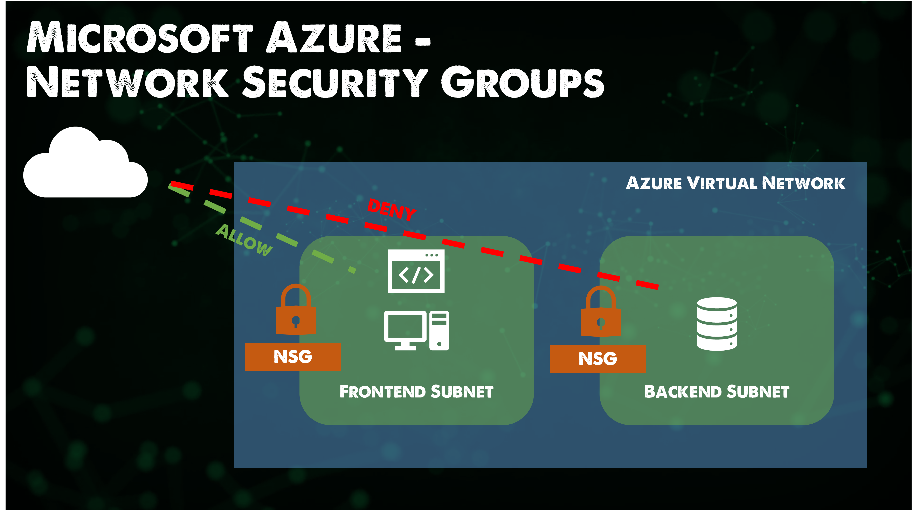
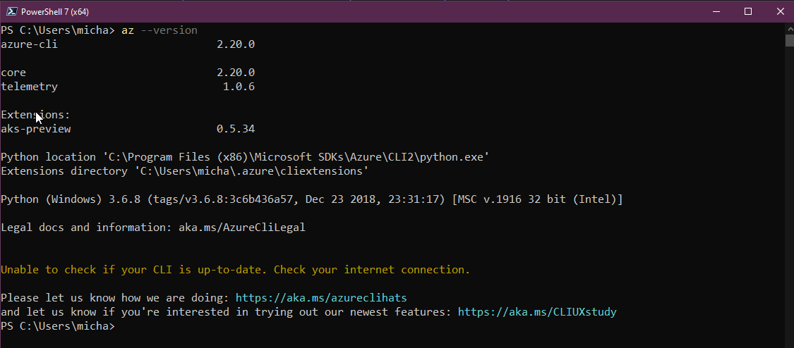

## Modelos de red de Microsoft Azure + Gestión de Azure

Vamos a cubrir los modelos de red dentro de Microsoft Azure y algunas de las opciones de gestión de Azure. Hasta ahora solo hemos utilizado el portal de Azure pero hemos mencionado otras áreas que pueden ser utilizadas para manejar y crear nuestros recursos dentro de la plataforma.

## Modelos de Red Azure

### Redes Virtuales

- Una red virtual es una construcción creada en Azure.
- Una red virtual tiene uno o más rangos de IP asignados.
- Las redes virtuales viven dentro de una suscripción dentro de una región.
- Se crean subredes virtuales en la red virtual para dividir el rango de red.
- Las máquinas virtuales se colocan en subredes virtuales.
- Todas las máquinas virtuales dentro de una red virtual pueden comunicarse.
- 65.536 IPs privadas por red virtual.
- Sólo se paga por el tráfico de salida de una región. (Datos que salen de la región)
- Soporta IPv4 e IPv6.
  - IPv6 para redes virtuales de cara al público y dentro de ellas.

Podemos comparar las redes virtuales de Azure con las VPC de AWS. Sin embargo, hay algunas diferencias a tener en cuenta:

- En AWS se crea una VNet por defecto que no es el caso en Microsoft Azure, tienes que crear tu primera red virtual a tu medida.
- Todas las máquinas virtuales por defecto en Azure tienen acceso NAT a Internet. No hay NAT Gateways como en AWS.
- En Microsoft Azure no existe el concepto de subredes Privadas o Públicas.
- Las IPs Públicas son un recurso que puede ser asignado a vNICs o Balanceadores de Carga.
- La red virtual y las subredes tienen sus propias ACL que permiten la delegación a nivel de subred.
- Subredes a través de Zonas de Disponibilidad mientras que en AWS tienes subredes por Zonas de Disponibilidad.

También tenemos Virtual Network Peering. Esto permite la conexión de redes virtuales entre inquilinos y regiones utilizando la red troncal de Azure. No es transitivo, pero puede activarse a través de Azure Firewall en la red virtual central. El uso de una pasarela de tránsito permite a las redes virtuales peered la conectividad de la red conectada y un ejemplo de esto podría ser [ExpressRoute](https://learn.microsoft.com/es-es/azure/expressroute/expressroute-introduction) a On-Premises.

### Control de acceso

- Azure utiliza Grupos de Seguridad de Red, estos son de estado.
- Permiten crear reglas y luego asignarlas a un grupo de seguridad de red
- Los grupos de seguridad de red se aplican a subredes o máquinas virtuales.
- Cuando se aplica a una subred todavía se aplica en el NIC de la máquina virtual que no es un dispositivo "Edge".

- Las reglas se combinan en un Grupo de Seguridad de Red.
- En función de la prioridad, es posible realizar configuraciones flexibles.
- Un número de prioridad bajo significa una prioridad alta.
- La mayor parte de la lógica se construye por Direcciones IP pero también se pueden utilizar algunas etiquetas.

| Descripción                | Prioridad | Dirección origen   | Puerto de origen | Dirección de destino | Puerto de destino | Acción   |
| -------------------------- | --------- | ------------------ | ---------------- | -------------------- | ----------------- | -------- |
| Entrada 443                | 1005      | \*                 | \*               | \*                   | 443               | Permitir |
| ILB                        | 1010      | Azure LoadBalancer | \*               | \*                   | 10000             | Permitir |
| Denegar todas las entradas | 4000      | \*                 | \*               | \*                   | \*                | Denegar  |

También tenemos Grupos de Seguridad de Aplicaciones (ASG - Application Security Groups)

- Los NSGs se centran en los rangos de direcciones IPs, que pueden ser difíciles de mantener para entornos en crecimiento.
- Los ASGs permiten definir nombres reales (Monikers) para diferentes roles de aplicación (Webservers, DB servers, WebApp1 etc.)
- La NIC de la máquina virtual se convierte en miembro de uno o más ASG.

Los ASG se pueden utilizar en reglas que forman parte de Grupos de Seguridad de Red para controlar el flujo de comunicación y pueden seguir utilizando funciones de NSG como las etiquetas de servicio.

| Acción   | Nombre             | Origen     | Destino    | Puerto       |
| -------- | ------------------ | ---------- | ---------- | ------------ |
| Permitir | AllowInternettoWeb | Internet   | WebServers | 443(HTTPS)   |
| Permitir | AllowWebToApp      | WebServers | AppServers | 443(HTTPS)   |
| Permitir | AllowAppToDB       | AppServers | DbServers  | 1443 (MSSQL) |
| Denegar  | DenyAllinbound     | Any        | Any        | Any          |

### Balanceador de carga

Microsoft Azure tiene dos soluciones separadas de equilibrio de carga. Ambas pueden funcionar con puntos finales orientados externamente o internamente. La primera solución son las opciones de terceros disponibles en el marketplace de Azure. 

- Balanceador de carga (capa 4) que admite la distribución basada en hash y el reenvío de puertos.
- App Gateway (capa 7) admite funciones como SSL offload, afinidad de sesión basada en cookies y enrutamiento de contenido basado en URL.

También con App Gateway, puede utilizar opcionalmente el componente Web Application firewall.

## Herramientas de gestión de Azure

Hemos pasado la mayor parte teórica por el Portal de Azure, pero cuando se trata de seguir una cultura DevOps el proceso de muchas de estas tareas (especialmente en torno a aprovisionamiento) se hará a través de una API o una herramienta de línea de comandos. Habría que revisar algunas de estas otras herramientas de gestión que tenemos a nuestra disposición, ya que necesitamos conocerla para cuando estemos automatizando el aprovisionamiento de nuestros entornos Azure.

### Portal Azure

El Microsoft Azure Portal es una consola basada en web, que proporciona una alternativa a las herramientas de línea de comandos. Puedes gestionar tus suscripciones dentro del Portal Azure. Construya, Gestione y Monitorice todo, desde una simple aplicación web hasta complejos despliegues en la nube. Otra cosa que encontrarás en el portal son las migas de pan. Como ya se mencionó, JSON es la base de todos los recursos de Azure. Puede ser que comiences en el Portal para entender las características, servicios y funcionalidad, pero tarde o temprano tendrás que entender el JSON para incorporar flujos de trabajo automatizados.

También existe el portal Azure Preview, que puede utilizarse para ver y probar servicios y mejoras.

### PowerShell

Antes de adentrarnos en Azure PowerShell, conviene presentar PowerShell. PowerShell es un marco de automatización de tareas y gestión de la configuración, un shell de línea de comandos y un lenguaje de scripting. Podríamos decir que esto se asemeja a lo que hemos visto en la sección de Linux sobre shell scripting. PowerShell se utilizó por primera vez en el sistema operativo Windows, pero ahora es multiplataforma.

Azure PowerShell es un conjunto de cmdlets para gestionar los recursos de Azure directamente desde la línea de comandos de PowerShell.

Podemos ver a continuación que te puedes conectar a una suscripción mediante el comando PowerShell `Connect-AzAccount`.

Luego, si quisiéramos encontrar algunos comandos específicos asociados a las VMs de Azure podemos ejecutar el siguiente comando. Podrías pasarte horas aprendiendo y entendiendo más sobre este lenguaje de programación.

Hay algunos buenos quickstarts de Microsoft para empezar a aprovisionar servicios desde PowerShell [aquí](https://docs.microsoft.com/en-us/powershell/azure/get-started-azureps?view=azps-7.1.0)

### Visual Studio Code

Como habréis visto la IDE de cabecera en el tutorial es Visual Studio Code. Visual Studio Code es un editor de código fuente gratuito creado por Microsoft para Windows, Linux y macOS.

Verás a continuación que hay un montón de integraciones y herramientas integradas en Visual Studio Code que puedes utilizar para interactuar con Microsoft Azure y los servicios que contiene.

### Cloud Shell

Azure Cloud Shell es un shell interactivo, autenticado y accesible desde el navegador para gestionar los recursos de Azure. Proporciona la flexibilidad de elegir la experiencia de shell que mejor se adapte a su forma de trabajar.

Puedes ver en la siguiente imagen que cuando lanzamos Cloud Shell por primera vez dentro del portal podemos elegir entre Bash y PowerShell.

Para utilizar Cloud Shell tendrás que proporcionar un poco de almacenamiento en tu suscripción.

Cuando seleccionas el intérprete de comandos en la nube, se pone en marcha una máquina. Estas máquinas son temporales, pero tus archivos se conservan de dos maneras: a través de una imagen de disco y en un archivo compartido montado.

- Cloud Shell se ejecuta en un host temporal proporcionado por sesión y por usuario.
- Cloud Shell se desconecta después de 20 minutos sin actividad interactiva.
- Cloud Shell requiere que se monte un archivo compartido de Azure.
- Cloud Shell utiliza el mismo recurso compartido de archivos de Azure para Bash y PowerShell.
- Cloud Shell tiene asignada una máquina por cuenta de usuario.
- Cloud Shell persiste $HOME utilizando una imagen de 5 GB guardada en su recurso compartido de archivos.
- Los permisos se establecen como un usuario normal de Linux en Bash.

Lo anterior fue copiado de [Cloud Shell Overview](https://docs.microsoft.com/en-us/azure/cloud-shell/overview).

### Azure CLI

Por último vamos a echar un ojo a Azure CLI. Azure CLI se puede instalar en Windows, Linux y macOS. Una vez instalado se puede escribir `az` seguido de otros comandos para crear, actualizar, eliminar y ver los recursos de Azure.

Al empezar con Azure es confusa la existencia de Azure PowerShell y Azure CLI. Estaría bien algún comentario de la comunidad sobre esto. Pero una visión objetica es que Azure PowerShell es un módulo añadido a Windows PowerShell o PowerShell Core (También disponible en otros sistemas operativos, pero no todos), mientras que Azure CLI es un programa de línea de comandos multiplataforma que se conecta a Azure y ejecuta los comandos.

Ambas opciones tienen una sintaxis diferente, aunque pueden hacer tareas muy similares.

Por ejemplo, crear una máquina virtual desde PowerShell usaría el cmdlet `New-AzVM` mientras que Azure CLI usaría `az VM create`.

Como ya hemos mencionado, lo importante aquí es elegir la herramienta adecuada para cada tarea. Azure se basa en la automatización. Cada acción que realizas dentro del portal se traduce en algún lugar en código que se ejecuta para leer, crear, modificar o eliminar recursos.

Azure CLI

- Interfaz de línea de comandos multiplataforma, instalable en Windows, macOS y Linux.
- Se ejecuta en Windows PowerShell, Cmd, Bash y otros shells Unix.

Azure PowerShell

- Módulo PowerShell multiplataforma, ejecutable en Windows, macOS, Linux.
- Requiere Windows PowerShell o PowerShell.

Si hay una razón por la que no puede utilizar PowerShell en su entorno, pero puede utilizar .mdor bash entonces el Azure CLI va a ser su elección.

A continuación vamos a tomar todas las teorías que hemos estado a través de y crear algunos escenarios y ponerse manos a la obra en Azure.

## Recursos

- [Hybrid Cloud and MultiCloud](https://www.youtube.com/watch?v=qkj5W98Xdvw)
- [Microsoft Azure Fundamentals](https://www.youtube.com/watch?v=NKEFWyqJ5XA&list=WL&index=130&t=12s)
- [Google Cloud Digital Leader Certification Course](https://www.youtube.com/watch?v=UGRDM86MBIQ&list=WL&index=131&t=10s)
- [AWS Basics for Beginners - Full Course](https://www.youtube.com/watch?v=ulprqHHWlng&t=5352s)

Nos vemos en el [Día 34](day34.md)
