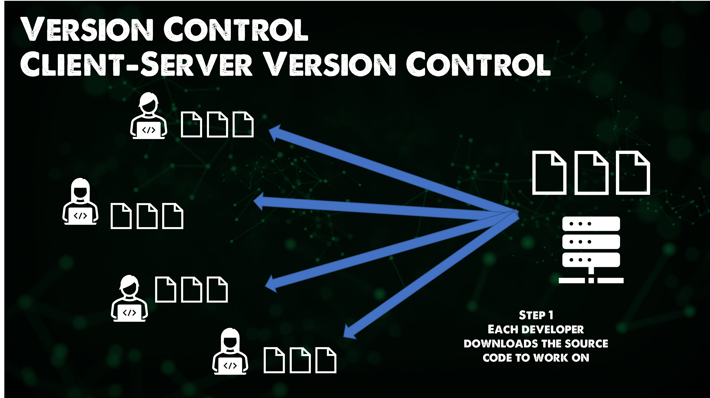

## Instalación y configuración de Git

Git es una herramienta multiplataforma de código abierto para el control de versiones. En la mayoría de entornos Linux viene instalado por defecto, pero de todas formas vamos a repasar la instalación y configuración.

Incluso si ya tienes git instalado en tu sistema es una buena idea asegurarse de que está actualizado.

### Instalación de Git

Como ya se ha mencionado Git es multiplataforma, vamos a ver Windows y Linux, pero también puedes encontrar macOS en la lista de [descargas](https://git-scm.com/book/en/v2/Getting-Started-Installing-Git)

Para [Windows](https://git-scm.com/download/win) podemos obtener nuestros instaladores desde el sitio oficial o también puedes usar `winget`, Windows Application Package Manager.

Antes de instalar nada vamos a ver qué versión tenemos en nuestra máquina Windows. Abre una ventana de PowerShell y ejecuta `git --version`.


También podemos comprobar nuestra versión en el [WSL](https://es.wikipedia.org/wiki/Subsistema_de_Windows_para_Linux) Ubuntu.


En el momento de escribir esto la última versión de Windows es `2.35.1` por lo que tenemos que actualizarla. Lo mismo con Linux.

Descargué el último instalador y ejecuté el asistente. Lo importante a tener en cuenta es que git desinstalará las versiones anteriores antes de instalar la última. Lo que significa que el proceso que se muestra a continuación es también el mismo proceso en su mayor parte como si estuviera instalando por primera vez.

Es una instalación muy sencilla. Una vez descargado haga doble clic y comience. Lea el acuerdo de licencia GNU. Pero recuerde que este es un software libre y de código abierto.


Ahora podemos elegir componentes adicionales que nos gustaría también instalar para asociar con git. En Windows, siempre me aseguro de instalar Git Bash ya que nos permite ejecutar scripts bash en Windows.


Podemos entonces elegir qué ejecutable SSH deseamos utilizar. 


Luego tenemos características experimentales que podemos habilitar, yo no las necesito así que no las habilito, siempre puedes volver a la instalación y habilitarlas más tarde.


Instalación completada, ahora podemos elegir abrir Git Bash y o las últimas notas de la versión.


La comprobación final es echar un vistazo en PowerShell la versión actual de git.


Super simple y ahora estamos en la última versión. 

En nuestra máquina Linux el proceso de actualización resulta más directo ejecutando el comando `sudo apt-get install git`.


También puedes añadir el repositorio git para las actualizaciones del software.

```shell
sudo add-apt-repository ppa:git-core/ppa -y
sudo apt-get update
sudo apt-get install git -yinstalaciones
git --version
```

### Configurando Git

Cuando usamos git por primera vez tenemos que definir algunas configuraciones,

- Nombre de usuario
- Correo electrónico
- Editor por defecto
- Fin de línea

Esto se puede hacer en tres niveles

- Sistema = Todos los usuarios
- Global = Todos los repositorios del usuario actual
- Local = El repositorio actual

Ejemplo:
```shell
git config --global user.name "Michael Cade"
git config --global user.email "Michael.Cade@90DaysOfDevOPs.com"
```
Dependiendo del sistema operativo se determinará el editor de texto por defecto. En  Ubuntu sin configurar el siguiente comando está utilizando nano. El siguiente comando cambiará esto a visual studio code.

```shell
git config --global core.editor "code --wait"
```

Podemos ver todas las configuraciones de git con el siguiente comando.

```shell
git config --global -e
```


En cualquier máquina este archivo se llamará `.gitconfig`. En Windows lo encontrarás en el directorio de la cuenta de usuario.


### Teoría Git

Mencioné en el post de ayer que había otros tipos de control de versiones y podemos dividirlos en dos tipos diferentes. Los que son Cliente-Servidor y los que son Distribuidos.

### Control de versiones Cliente-Servidor

Antes de que existiera git, el tipo de Cliente-Servidor era el método de facto para el control de versiones. Un ejemplo de esto sería [Apache Subversion](https://subversion.apache.org/) que es un sistema de control de versiones de código abierto fundado en el año 2000.

En este modelo de control de versiones Cliente-Servidor, el primer paso que da el desarrollador es descargar el código fuente y los archivos reales del servidor. Esto no elimina los conflictos, pero sí la complejidad de los conflictos y cómo resolverlos.



Ahora, por ejemplo, digamos que tenemos dos desarrolladores trabajando en los mismos archivos y uno gana la carrera y confirma o sube su archivo de nuevo al servidor en primer lugar con sus nuevos cambios. Cuando el segundo desarrollador va a actualizar tiene un conflicto.


Así que ahora el desarrollador tiene que tirar hacia abajo el primer cambio de código junto a su cheque y luego confirmar una vez que los conflictos se han resuelto.


### Control de versiones distribuido

Git no es el único sistema de control de versiones distribuido. Pero es en gran medida el defacto.

Algunos de los principales beneficios de Git son:

- Rápido
- Inteligente
- Flexible
- Seguro

A diferencia del modelo de control de versiones Cliente-Servidor, cada desarrollador descarga el repositorio fuente, es decir, todo. Historial de commits, todas las ramas, etc.


## Recursos

- [What is Version Control?](https://www.youtube.com/watch?v=Yc8sCSeMhi4)
- [Types of Version Control System](https://www.youtube.com/watch?v=kr62e_n6QuQ)
- [Git Tutorial for Beginners](https://www.youtube.com/watch?v=8JJ101D3knE&t=52s)
- [Git for Professionals Tutorial](https://www.youtube.com/watch?v=Uszj_k0DGsg)
- [Git and GitHub for Beginners - Crash Course](https://www.youtube.com/watch?v=RGOj5yH7evk&t=8s)
- [Complete Git and GitHub Tutorial](https://www.youtube.com/watch?v=apGV9Kg7ics)
- [En español] [Comandos Git](https://gitea.vergaracarmona.es/man-linux/comandos-git)
- [En español][Apuntes Curso de Git](https://vergaracarmona.es/wp-content/uploads/2022/10/Curso-git_vergaracarmona.es_.pdf) de [Juan Carlos Rubio](https://www.linkedin.com/in/juan-carlos-rubio-pineda/Curso-git_vergaracarmona-es).
- [En español] En los [apuntes](https://vergaracarmona.es/apuntes/) del traductor:
  - ["Instalar git en ubuntu"](https://vergaracarmona.es/instalar-git-en-ubuntu/)
  - ["Comandos de git"](https://vergaracarmona.es/comandos-de-git/)
  - ["Estrategias de fusión en git: Ship / Show / Ask"](https://vergaracarmona.es/estrategias-bifurcacion-git-ship-show-ask/)
  - ["Resolver conflictos en Git. Merge, Squash, Rebase o Pull"](https://vergaracarmona.es/merge-squash-rebase-pull/)
  - ["Borrar commits de git: reset, rebase y cherry-pick"](https://vergaracarmona.es/reset-rebase-cherry-pick/)

Nos vemos en el [Día 37](day37.md)
