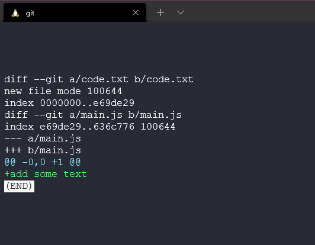
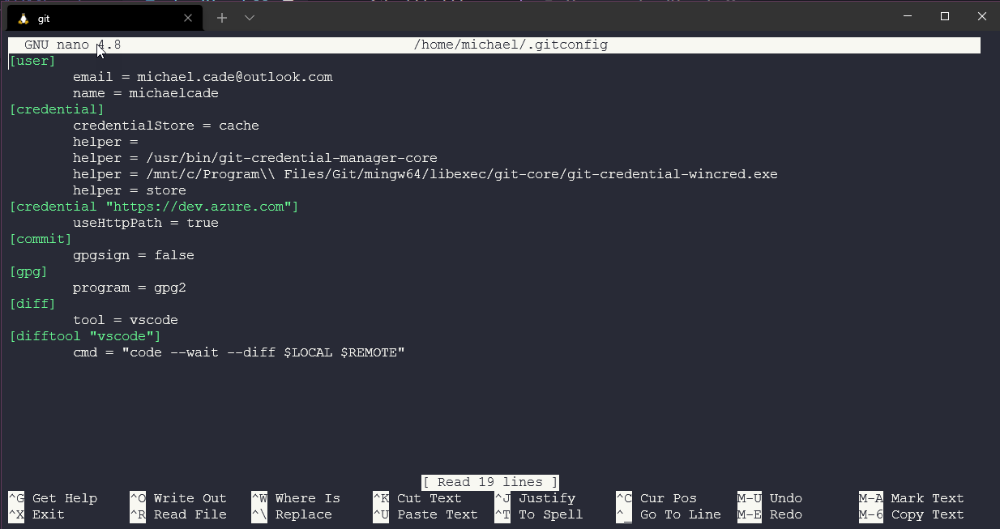
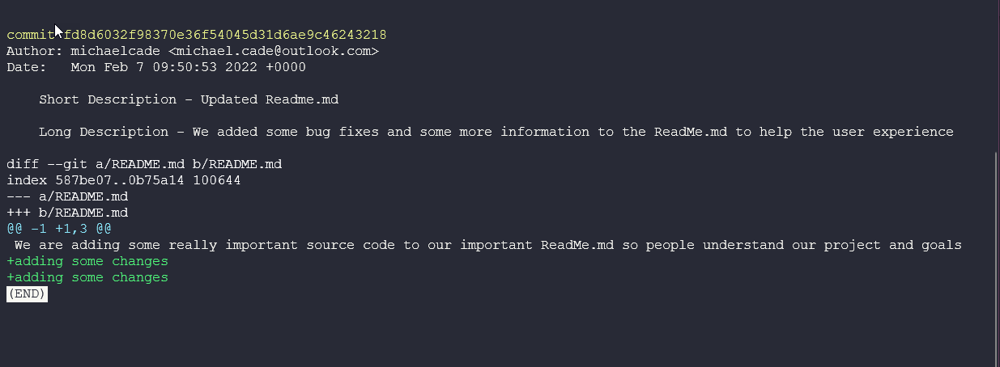
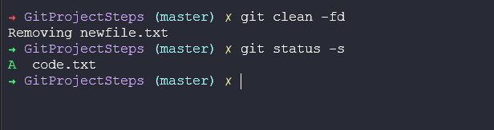
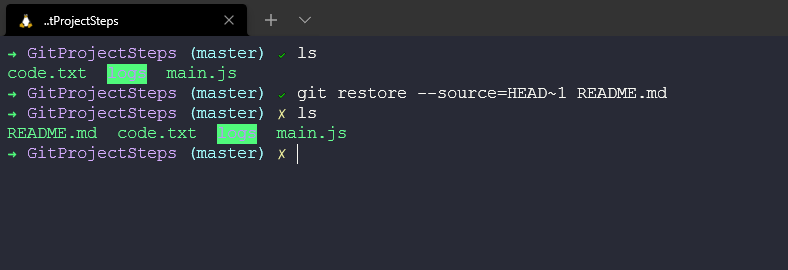

## Visualización, desescalado, descarte y restauración

Vamos a continuar donde lo dejamos ayer en torno a algunos de los comandos que tenemos con git y cómo aprovechar git con sus proyectos. Recuerde que no hemos tocado GitHub o cualquier otro servicio basado en git todavía, estamos viendo como mantener el control de los proyectos a nivel local por el momento, pero todos ellos serán útiles cuando empezamos a integrar esas herramientas.

### Viendo los Cambios Staged y Unstaged

Es una buena práctica asegurarse de ver el código preparado y no preparado antes de confirmar. Podemos hacerlo ejecutando el comando `git diff --staged`


Esto nos muestra todos los cambios que hemos hecho y todos los archivos nuevos que hemos añadido o borrado.

Los cambios en los archivos modificados se indican con `---` o `+++` puedes ver abajo que acabamos de añadir +añadir algo de texto debajo lo que significa que son nuevas líneas.



También podemos ejecutar `git diff` para comparar nuestra área de staging con nuestro directorio de trabajo. Si hacemos algunos cambios en nuestro archivo recién añadido code.txt y añadimos algunas líneas de texto.


Si luego ejecutamos `git diff` comparamos y vemos la salida de abajo.


### Herramientas visuales Diff

Para mí, lo anterior es algo confuso, así que prefiero utilizar una herramienta visual. Por nombrar algunas de ellas:

- KDiff3
- P4Merge
- WinMerge (Sólo Windows)
- VSCode

Para configurar esto en git ejecutamos el siguiente comando `git config --global diff.tool vscode`.

Vamos a ejecutar lo anterior y vamos a establecer algunos parámetros cuando lancemos VScode.


También podemos comprobar nuestra configuración con `git config --global -e`.



Podemos usar `git difftool` para abrir nuestra herramienta visual diff.


Esto abre nuestro editor VScode en la página diff y compara los dos. Veremos que sólo hemos modificado un archivo añadiendo una línea de código en el lado derecho.


Encuentro este método mucho más fácil para rastrear cambios y es algo similar a lo que veremos cuando busquemos en servicios basados en git como GitHub.

También podemos usar `git difftool --staged` para comparar el stage con los archivos confirmados.


Entonces podemos ver el ciclo a través de nuestros archivos cambiados antes de confirmar.


Estoy usando VScode como mi IDE y como la mayoría de los IDEs tienen esta funcionalidad incorporada. Es muy raro que necesites ejecutar estos comandos desde la terminal, aunque es útil si no tienes un IDE instalado por alguna razón.

### Viendo el Historial

Anteriormente hemos tocado `git log` que nos proporcionará una visión completa de todos los commits que hemos hecho en nuestro repositorio.


Cada commit tiene su cadena hexadecimal, única para el repositorio. Aquí puedes ver en qué rama estamos trabajando y también el autor, la fecha y el mensaje de confirmación.

También tenemos `git log --oneline` que nos devuelve una versión mucho más pequeña de la cadena hexadecimal que podemos usar en otros comandos `diff`. También tenemos sólo la descripción de una línea o el mensaje de commit.


Podemos revertir esto en un inicio con el primer commit ejecutando `git log --oneline --reverse` y ahora vemos nuestro primer commit en la parte superior de nuestra página.


### Ver un commit

Ser capaz de mirar el mensaje de confirmación es genial si has sido consciente de seguir las mejores prácticas y has añadido un mensaje de confirmación significativo, sin embargo, también existe el comando `git show` si queremos inspeccionar un commit concreto. Podemos utilizar `git log --oneline --reverse` para obtener una lista de nuestros commits. y luego podemos tomarlos y ejecutar `git show <commit ID>`.


La salida de ese comando se verá como abajo con el detalle del commit, autor y lo que cambió.



También podemos usar `git show HEAD~1` donde 1 es el número de pasos hacia atrás desde la versión actual a la que queremos volver.

Esto es genial si queremos algún detalle de nuestros archivos, pero si queremos listar todos los archivos de un árbol para todo el directorio de la instantánea. Podemos conseguirlo usando el comando `git ls-tree HEAD~1`, de nuevo retrocediendo una instantánea desde el último commit. Podemos ver abajo que tenemos dos blobs, estos indican archivos mientras que el árbol indicaría un directorio. También puedes ver commits y tags en esta información.


Podemos usar lo anterior para ver el contenido de nuestro archivo (blobs) usando el comando `git show`.


Entonces se mostrará el contenido de esa versión específica del archivo.


### Unstaging archivos

Habrá un momento en el que quizás haya usado `git add .` pero hay archivos que no desea confirmar en esa instantánea todavía. En este ejemplo he añadido newfile.txt a mi área de staging pero no estoy listo para confirmar este archivo así que voy a usar `git restore --staged newfile.txt` para deshacer el paso `git add`.


También podemos hacer lo mismo con archivos modificados como main.js y deshacer el commit, mira arriba tenemos una M en verde y abajo hemos deshecho esos cambios.


He encontrado este comando bastante útil durante los 90DaysOfDevOps ya que a veces trabajo antes de los días en los que siento que quiero hacer anotaciones para el día siguiente pero no quiero hacer commit y push al repositorio público de GitHub.

### Descartando Cambios Locales

A veces podemos hacer cambios pero no estamos contentos con esos cambios y queremos desecharlos. Vamos a utilizar el comando `git restore` de nuevo y vamos a poder restaurar archivos de nuestras snapshots o versiones anteriores. Podemos ejecutar `git restore .` contra nuestro directorio y restauraremos todo desde nuestra instantánea, pero observa que nuestro archivo no rastreado sigue presente. No hay ningún archivo anterior siendo rastreado llamado newfile.txt.


Ahora para eliminar newfile.txt o cualquier archivo no rastreado. Podemos usar `git clean` solo obtendremos una advertencia.


O si conocemos las consecuencias podemos ejecutar `git clean -fd` para forzar y eliminar todos los directorios.



### Restaurar un archivo a una versión anterior

Como hemos aludido, lo que Git nos puede ayudar es a restaurar copias de tus archivos desde tus instantáneas (esto no es una copia de seguridad, pero es un punto de restauración muy rápido). Es recomendable que también guardes copias de tu código en otros lugares utilizando una solución de copia de seguridad expresamente para esto.

Como ejemplo vamos a borrar nuestro archivo más importante en nuestro directorio, pero utilizando comandos basados en Unix para eliminar el directorio, no comandos de git.


Ahora no tenemos readme.md en nuestro directorio de trabajo. Podríamos haber usado `git rm readme.md` y esto se reflejaría en nuestra base de datos de git. Así que lo borramos también así para simular la eliminación por completo.


Ahora confirmemos esto con un mensaje y probemos que ya no tenemos nada en nuestro directorio de trabajo o área de preparación.


¡Se cometieron errores y ahora necesitamos recuperar ese archivo! 😱

Podríamos usar el comando `git undo` que deshará el último commit, pero ¿qué pasa si fue hace tiempo? Podemos usar nuestro comando `git log` para encontrar el commit concreto pero no queremos que todos los commits que haya por el medio se deshagan, así que vamos a especificar el fichero con el comando `git restore --source=HEAD~1 README.md` y restaurarlo desde nuestro snapshot.

Puedes ver que usando este proceso ahora tenemos el archivo de vuelta en nuestro directorio de trabajo 😅



Ahora tenemos un nuevo archivo no rastreado y podemos usar los comandos mencionados anteriormente para rastrear, preparar y comitear nuestros cambios.

### Rebase vs Merge

Este parece ser el mayor dolor de cabeza cuando se trata de Git, cuando usar rebase o merge en tus repositorios git.

Lo primero que hay que saber es que tanto `git rebase` como `git merge` resuelven el mismo problema. Ambos sirven para integrar cambios de una rama en otra rama. Sin embargo, lo hacen de formas diferentes.

Empecemos con una nueva característica en una nueva rama dedicada. La rama principal continúa con nuevos commits.


La opción fácil es usar `git merge feature main` que fusionará la rama principal en la rama feature.


La fusión es fácil porque no es destructiva. Las ramas existentes no se modifican. Sin embargo, esto también significa que la rama principal tendrá un commit de fusión irrelevante cada vez que necesites incorporar cambios de la rama principal. Si la main está muy ocupada o activa esto podría contaminar el historial de la rama feature.

Como opción alternativa, podemos volver a basar la rama de características en la rama principal utilizando:

```
git checkout feature
git rebase main
```

Esto mueve la rama feature (toda la rama feature) incorporando efectivamente todos los nuevos commits en la main. Pero, en lugar de usar un commit merge, rebasing reescribe la historia del proyecto creando nuevos commits para cada commit en la rama original.


El mayor beneficio de rebase es un historial del proyecto mucho más limpio. También elimina commits de fusión innecesarios. Si comparas las dos últimas imágenes, puedes seguir una historia del proyecto lineal mucho más limpia.

Aunque todavía no es una conclusión inevitable, la elección del historial más limpio también viene con desventajas, si no sigues [La regla de oro de rebasing](hhttps://www.atlassian.com/git/tutorials/merging-vs-rebasing#the-golden-rule-of-rebasing) y vuelves a escribir el historial del proyecto puede ser potencialmente catastrófico para su flujo de trabajo de colaboración. Y por otro lado, con menos importancia pero también presente, al realizar rebase se pierde el contexto proporcionado por un commit de fusión: no puedes ver cuándo se incorporaron realmente los cambios de la línea ascendente en la feature.

## Recursos

- [What is Version Control?](https://www.youtube.com/watch?v=Yc8sCSeMhi4)
- [Types of Version Control System](https://www.youtube.com/watch?v=kr62e_n6QuQ)
- [Git Tutorial for Beginners](https://www.youtube.com/watch?v=8JJ101D3knE&t=52s)
- [Git for Professionals Tutorial](https://www.youtube.com/watch?v=Uszj_k0DGsg)
- [Git and GitHub for Beginners - Crash Course](https://www.youtube.com/watch?v=RGOj5yH7evk&t=8s)
- [Complete Git and GitHub Tutorial](https://www.youtube.com/watch?v=apGV9Kg7ics)
- [Git cheatsheet](https://www.atlassian.com/git/tutorials/atlassian-git-cheatsheet)
- [Exploring the Git command line – A getting started guide](https://veducate.co.uk/exploring-the-git-command-line/)
- [En español] [Comandos Git](https://gitea.vergaracarmona.es/man-linux/comandos-git)
- [En español][Apuntes Curso de Git](https://vergaracarmona.es/wp-content/uploads/2022/10/Curso-git_vergaracarmona.es_.pdf) de [Juan Carlos Rubio](https://www.linkedin.com/in/juan-carlos-rubio-pineda/Curso-git_vergaracarmona-es).
- [En español] En los [apuntes](https://vergaracarmona.es/apuntes/) del traductor:
  - ["Instalar git en ubuntu"](https://vergaracarmona.es/instalar-git-en-ubuntu/)
  - ["Comandos de git"](https://vergaracarmona.es/comandos-de-git/)
  - ["Estrategias de fusión en git: Ship / Show / Ask"](https://vergaracarmona.es/estrategias-bifurcacion-git-ship-show-ask/)
  - ["Resolver conflictos en Git. Merge, Squash, Rebase o Pull"](https://vergaracarmona.es/merge-squash-rebase-pull/)
  - ["Borrar commits de git: reset, rebase y cherry-pick"](https://vergaracarmona.es/reset-rebase-cherry-pick/)

Nos vemos en el [Día 40](day40.md)
