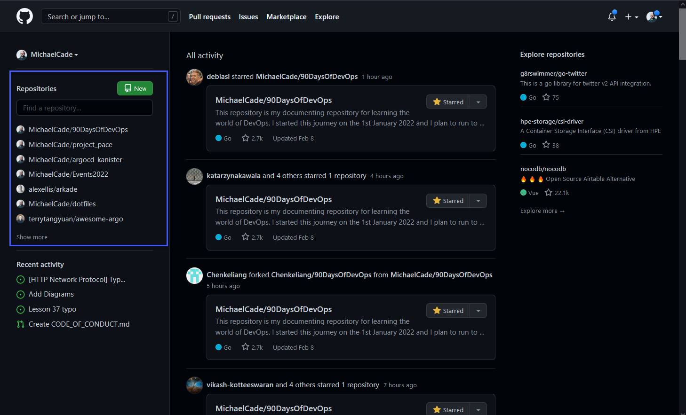
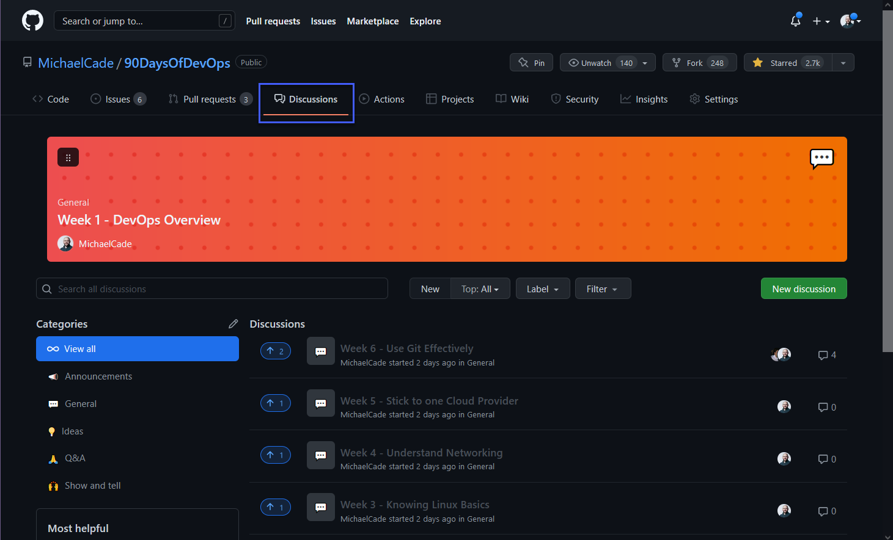

## Red social para el código

Explorando GitHub | GitLab | BitBucket 🚀

Hoy veremos algunos de los servicios basados en git de los que probablemente hemos oído hablar. Utilizaremos algunos de nuestros conocimientos adquiridos para mover copias de nuestros datos a cada uno de los principales servicios.

He llamado a esta sección "Red Social para el Código", ya verás por qué...

### GitHub

El más común es GitHub, un servicio de alojamiento basado en web para git. Es muy utilizado por los desarrolladores de software para almacenar código. Tienes la gestión del código fuente centralizada en un repositorio remoto y distribuida gracias a las características de control de versiones git, así como un montón de características adicionales. Permite a los equipos y colaboradores comunicarse fácilmente y proporciona un aspecto social a la codificación. Desde 2018 GitHub forma parte de Microsoft (A golpe de talonario).

GitHub fue fundada en 2007/2008. Con Más de 40 millones de usuarios en la plataforma a día de hoy.

Características principales de GitHub

- Repositorio de código
- Solicitudes de Pull
- Herramientas de gestión de proyectos - Issues
- Canalización CI / CD - Acciones GitHub

En términos de precios, GitHub tiene diferentes niveles de precios para sus usuarios. Puedes encontrar más información en [Pricing](https://github.com/pricing)

Aquí veremos tan solo el nivel gratuito.

Voy a utilizar mi cuenta de GitHub ya creada durante este tutorial, si no tienes una cuenta, en la página de apertura de GitHub hay una opción de registro y algunos pasos sencillos para configurarla.

### Página de inicio de GitHub

La primera vez que accedes a tu cuenta de GitHub aparece una página que contiene un montón de widgets que te dan opciones de dónde y qué te gustaría ver o hacer. En primer lugar tenemos "Toda la actividad", que te dará una visión de lo que está sucediendo con tus repositorios o actividad en general asociada a tu organización o cuenta.

A continuación, tenemos nuestros repositorios de código, ya sean propios o repositorios con los que hemos interactuado recientemente. También podemos crear rápidamente nuevos repositorios o buscar repositorios.

Luego tenemos nuestra actividad reciente, que para mí son temas y pull requests que he creado o contribuido recientemente.

En la parte derecha tenemos algunas referencias de repositorios en los que podríamos estar interesados, probablemente basados en tu actividad reciente o en tus propios proyectos.

Para ser honesto no suelo entrar en mi propia página de inicio, veo que el feed podría ser realmente útil para ayudar a interactuar mejor con la comunidad en ciertos proyectos.

A continuación, si queremos entrar en nuestro perfil de GitHub podemos navegar a la esquina superior derecha y en tu imagen, hay un desplegable que te permite navegar a través de tu cuenta. Desde aquí para acceder a tu Perfil selecciona "Tu Perfil"

A continuación, aparecerá tu página de perfil, por defecto, a menos que cambies tu configuración no vas a ver lo que yo tengo, he añadido alguna funcionalidad que muestra mis últimas entradas de blog en [vZilla](https://vzilla.co.uk) y también mis últimos vídeos en mi canal de [YouTube](https://m.youtube.com/c/MichaelCade1) Channel.

No vas a pasar mucho tiempo mirando tu perfil, pero esta es una buena página de perfil para compartir en tu red para que puedan ver los proyectos interesantes en los que estás trabajando.

Si quieres ver algunos ejemplos de páginas de inicio:
- Página del autor [Michael Cade](https://github.com/MichaelCade/MichaelCade)
- Página del traductor [manuelver](https://github.com/manuelver/manuelver) 

A continuación, podemos profundizar en el bloque de construcción de GitHub, los repositorios. Aquí vas a ver tus repositorios y si tienes repositorios privados también se mostrarán en esta larga lista.

El repositorio es muy importante en GitHub, así que elijo uno bastante movido últimamente para ejecutar algunas de las funciones básicas que podemos utilizar.

Desde la ventana anterior, he seleccionado el repositorio 90DaysOfDevOps. Se puede ver en esta vista que tenemos una gran cantidad de información, tenemos nuestra estructura de código principal en el centro mostrando nuestros archivos y carpetas que se almacenan en nuestro repositorio. Tenemos nuestro readme.md que se muestra en la parte inferior y le da más importancia al fichero, ya que es nuestra presentación del proyecto. A la derecha de la página, tenemos una sección con una descripción y propósito del proyecto. Luego tenemos un montón de información debajo de esto que muestra cuántas personas han destacado en el proyecto con una star, cuántas lo han visto y cuántas lo han bifurcado.

Si nos desplazamos un poco más abajo también veremos que tenemos Releases, estos son de la parte golang del desafío. No tenemos ningún paquete en nuestro proyecto en este momento, y también vemos a nuestros colaboradores listados. (Gracias comunidad por ayudar en mi ortografía y otras correcciones) Luego tenemos lenguajes utilizados.

En la parte superior de la página verás una lista de pestañas. Éstas pueden variar y pueden modificarse para mostrar sólo las que necesites. Aquí verás que no estoy usando todas y que debería quitarlas para asegurarme de que todo mi repositorio está ordenado y limpio.

En primer lugar tenemos la pestaña de código, de la que acabamos de hablar, pero estas pestañas están siempre disponibles cuando se navega a través de un repositorio, lo que es muy útil para que podamos saltar entre las secciones de forma rápida y sencilla. A continuación, tenemos la pestaña de problemas.

Las incidencias te permiten hacer un seguimiento de tu trabajo en GitHub, donde tiene lugar el desarrollo. En este repositorio específico se puede ver que tengo algunas cuestiones centradas en la adición de diagramas o errores tipográficos, pero también tenemos una cuestión que indica una necesidad o requisito para una versión china del repositorio.

Si esto fuera un repositorio de código, entonces este es un gran lugar para plantear inquietudes o problemas con los mantenedores, pero recuerde que debe ser consciente y detallado acerca de lo que está informando, y dar tantos detalles como sea posible.

La siguiente pestaña es Pull Requests. Permite informar a otros sobre los cambios que ha empujado a una rama en un repositorio. Aquí es donde alguien puede haber bifurcado el repositorio en otra rama, sea del mismo proyecto o de un fork, ha hecho cambios como correcciones de errores o mejoras de características o simplemente errores tipográficos, y luego ha solicitado que se fusionen esos cambios en la rama principal del proyecto.

Cubriremos el forking con más detalle más adelante.

La siguiente pestaña es bastante nueva, pero se ha creado para #90DaysOfDevOps porque no solo puede ayudar a guiar en el viaje por el contenido, sino que también ayuda a la comunidad a medida que caminan a través de su aprendizaje. Dentro hay grupos de discusión para cada sección del desafío para que quien quiera pueda entrar y comentar, a modo de foro.

La pestaña de Actions te permitirá construir, probar, desplegar código y mucho más. GitHub Actions lo veremos en la sección de CI/CD del desafío. Como info previa, es aquí donde podemos establecer automatizaciones de tareas repetitivas para que se hagan por si solas con un disparador.

Por ejemplo, en mi perfil principal de GitHub utilizo las Actions para obtener las últimas entradas del blog y vídeos de YouTube y mantener al día mi página de perfil Github.

Ya he mencionado que GitHub no es sólo un repositorio de código fuente, sino también una herramienta de gestión de proyectos. La pestaña Projects nos permite crear tablas de proyecto tipo kanban para que podamos vincular las incidencias y PRs para colaborar mejor en el proyecto y tener visibilidad/transparencia de las tareas.

La página wiki permite una hoja de ruta completa para el proyecto que se describe con el estado actual y, en general, documentar mejor el proyecto.

No es tan aplicable a este proyecto, pero la pestaña de Security está ahí para asegurarse de que los contribuyentes saben cómo hacer frente a ciertas tareas, podemos definir una política aquí, pero también complementos de escaneo de código para asegurarse de que su código, por ejemplo, no contiene variables de entorno con contraseñas.

Para mí la pestaña de Insights es genial ya que proporciona mucha información sobre el repositorio. Desde cuantificar la actividad que ha habido hasta los commits e issues, pasando también por informes sobre el tráfico del repositorio. Puedes ver una lista en el lado izquierdo que te permite entrar en gran detalle sobre las métricas del repositorio.

Por último, tenemos la pestaña Configuración donde podemos entrar en los detalles de cómo personalizar nuestro repositorio. Actualmente soy el único mantenedor del repositorio pero podríamos compartir esta responsabilidad aquí. Podemos definir integraciones, políticas de ramas y otras tareas.

Como se mencionó GitHub alberga millones de repositorios, en su mayoría son código fuente y estos pueden ser de acceso público o privado.

Hemos echado un vistazo súper rápido de GitHub, creo que se podría detallar mucho más, pero por ahora no somos comerciales de la herramienta, así que vamos a la parte técnica. 

### Forking

Voy a entrar más en Open-Source en la sesión de mañana, pero una gran parte de cualquier repositorio de código es la capacidad de colaborar con la comunidad. Pensemos en el escenario que quiero una copia de un repositorio porque quiero hacer algunos cambios en él, tal vez quiero corregir un error o tal vez quiero cambiar algo para utilizarlo para un caso de uso que tengo que tal vez no era el caso de uso previsto para el mantenedor original del código. Esto es lo que llamaríamos bifurcar un repositorio. Un fork es una copia de un repositorio. La bifurcación de un repositorio permite experimentar libremente con los cambios sin afectar al proyecto original.

Permíteme volver a la página de inicio después de iniciar sesión y ver uno de esos repositorios sugeridos.

Si hacemos click en ese repositorio vamos a obtener el mismo aspecto que acabamos de ver en el repositorio 90DaysOfDevOps.

Si nos fijamos a continuación tenemos 3 opciones:

- Watch - Se actualiza con los visitante al repositorio.
- Fork - Las copias del repositorio.
- Star - "Creo que tu proyecto es genial".

Vamos a darle a la opción fork para hacer una copia en la que trabajar. Si eres miembro de varias organizaciones entonces tendrás que elegir donde se realizará el fork, yo voy a elegir mi perfil.

Ahora ya tenemos nuestra copia del repositorio sobre la que podemos trabajar libremente y modificarla a nuestro antojo. Este sería el comienzo del proceso de pull request que mencionamos brevemente antes pero que cubriremos con más detalle mañana.

Ok, te oigo decir, pero ¿cómo puedo hacer cambios en este repositorio y el código si está en un sitio web? Bueno, puedes editarlo directamente en el página Github, pero no va a ser lo mismo que usar tu IDE favorito en local. Para obtener una copia de este repositorio en local vamos a realizar un clon del repositorio. Esto nos permitirá trabajar localmente y luego empujar/pushear nuestros cambios de nuevo en nuestra copia bifurcada en el repositorio remoto.

Tenemos varias opciones cuando se trata de obtener una copia de este código como se puede ver a continuación.

Hay una versión local disponible de GitHub Desktop que le da una aplicación de escritorio visual para realizar un seguimiento de los cambios y empujar/pushear y tirar/pullear los cambios entre el local y GitHub.

Para esta pequeña demostración, voy a utilizar la URL HTTPS.

Ahora, en nuestra máquina local, voy a navegar al directorio donde quiero descargar el repositorio y luego ejecutar `git clone url`.

Podemos llevarlo a VScode para hacer algunos cambios.

Vamos a hacer algunos cambios, quiero hacer un cambio en todos esos enlaces y sustituirlos por otra cosa.

Si nos fijamos de nuevo en GitHub y encontramos nuestro readme.md, deberías ser capaz de ver algunos cambios que he hecho en el archivo.

En esta etapa, esto podría estar completo y podríamos estar contentos con nuestro cambio, ya que somos las únicas personas que van a utilizar nuestro nuevo cambio, pero tal vez fue un cambio de error y si ese es el caso, entonces vamos a querer contribuir a través de un Pull Request para notificar a los mantenedores del repositorio original de nuestro cambio y ver si aceptan nuestros cambios.

Podemos hacer esto utilizando el botón de contribución que se muestra a continuación. Mañana con los flujos de trabajo Open-Source veremos más sobre esto.

Me han dicho muchos: ¿qué pasa con las otras opciones de repositorios remotos?

Bueno, voy a dejar algunos recursos que cubren los conceptos básicos para el resto de opciones. En tus viajes te encontrarás con GitLab y BitBucket, entre otros, y aunque son servicios basados en Git, tienen sus diferencias.

También encontrarás opciones alojadas, la más común es GitLab frente a GitHub Enterprise. El traductor recomienda la opcíon de código libre gitea.io.

## Recursos

- [Learn GitLab in 3 Hours | GitLab Complete Tutorial For Beginners](https://www.youtube.com/watch?v=8aV5AxJrHDg)
- [BitBucket Tutorials Playlist](https://www.youtube.com/watch?v=OMLh-5O6Ub8&list=PLaD4FvsFdarSyyGl3ooAm-ZyAllgw_AM5)
- [What is Version Control?](https://www.youtube.com/watch?v=Yc8sCSeMhi4)
- [Types of Version Control System](https://www.youtube.com/watch?v=kr62e_n6QuQ)
- [Git Tutorial for Beginners](https://www.youtube.com/watch?v=8JJ101D3knE&t=52s)
- [Git for Professionals Tutorial](https://www.youtube.com/watch?v=Uszj_k0DGsg)
- [Git and GitHub for Beginners - Crash Course](https://www.youtube.com/watch?v=RGOj5yH7evk&t=8s)
- [Complete Git and GitHub Tutorial](https://www.youtube.com/watch?v=apGV9Kg7ics)
- [Git cheatsheet](https://www.atlassian.com/git/tutorials/atlassian-git-cheatsheet)
- [En español] [Comandos Git](https://gitea.vergaracarmona.es/man-linux/comandos-git)
- [En español][Apuntes Curso de Git](https://vergaracarmona.es/wp-content/uploads/2022/10/Curso-git_vergaracarmona.es_.pdf) de [Juan Carlos Rubio](https://www.linkedin.com/in/juan-carlos-rubio-pineda/Curso-git_vergaracarmona-es).
- [En español] En los [apuntes](https://vergaracarmona.es/apuntes/) del traductor:
  - ["Instalar git en ubuntu"](https://vergaracarmona.es/instalar-git-en-ubuntu/)
  - ["Comandos de git"](https://vergaracarmona.es/comandos-de-git/)
  - ["Estrategias de fusión en git: Ship / Show / Ask"](https://vergaracarmona.es/estrategias-bifurcacion-git-ship-show-ask/)
  - ["Resolver conflictos en Git. Merge, Squash, Rebase o Pull"](https://vergaracarmona.es/merge-squash-rebase-pull/)
  - ["Borrar commits de git: reset, rebase y cherry-pick"](https://vergaracarmona.es/reset-rebase-cherry-pick/)
- [GitHub Profile README Generator](https://github.com/rahuldkjain/github-profile-readme-generator)

Nos vemos en el [Día 41](day41.md)
