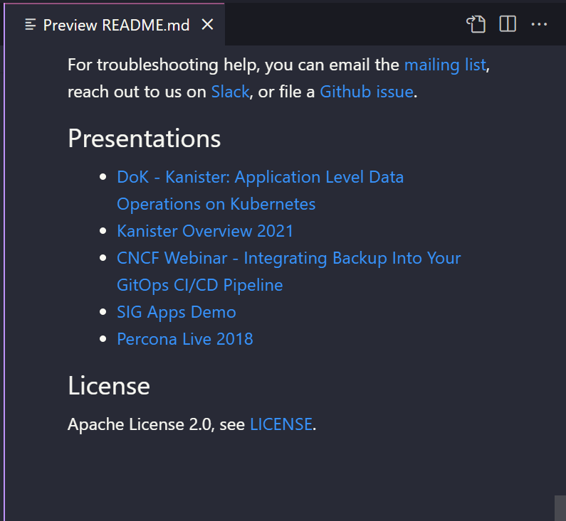
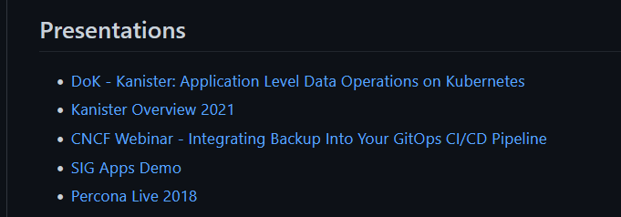
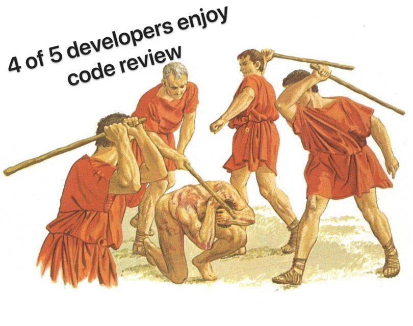

## El flujo de trabajo del Open Source

Esperemos que a través de las últimas 7 secciones de Git tengamos una mejor comprensión de lo que es git. También en GitHub cómo un servicio online que se integra con git para proporcionar un repositorio de código fuente, además de una forma en que la comunidad en general puede colaborar en el código y los proyectos abiertos.

Cuando pasamos a través de los fundamentos de GitHub fuimos a través del proceso de bifurcación de un proyecto al azar y hacer un cambio en nuestro repositorio local. Aquí queremos ir un paso más allá y contribuir a un proyecto de código abierto. 

Recuerda que contribuir no tiene por qué ser corregir errores o codificar características, sino que también puede ser documentación, traducción, propuestas de mejoras, etc. Todo ayuda a mejorar los proyectos comunitarios. Además permite ponerte manos a la obra con algunas de las funcionalidades de git que hemos cubierto o con las tecnologías que contienen los repositorios.

## Bifurcar un proyecto

Lo primero que tenemos que hacer es encontrar un proyecto en el que podamos contribuir. Recientemente he estado presentando en el [Proyecto Kanister](https://github.com/kanisterio/kanister) y me gustaría compartir mis presentaciones que ahora están en YouTube al fichero readme.md principal del proyecto.

En primer lugar, tenemos que bifurcar el proyecto como vimos en el día de ayer. Voy a navegar hasta el enlace mencionado y hacer un fork del repositorio.

Ahora tenemos nuestra copia de todo el repositorio.

En el archivo Readme.md las presentaciones originales listadas son solo estas dos por lo que vamos a aportar más.

## Clona a una máquina local

Ahora que tenemos nuestro fork podemos bajarlo a nuestra máquina local y empezar a editar los archivos. Usando el botón de código en nuestro repositorio podemos coger la URL y luego usar `git clone url` en un directorio en el que queramos colocar el repositorio. Personalmente, me gusta llamar al directorio con el mismo nombre del proyecto.

## Realizamos nuestros cambios

Tenemos nuestro proyecto en local así que podemos abrir VSCode o un IDE o editor de texto de nuestra elección para añadir las modificaciones.

El archivo readme.md está escrito en lenguaje markdown y como estoy modificando el proyecto de otra persona voy a seguir el formato del proyecto existente para añadir nuestro contenido. Quiero decir con esto que es importante seguir la línea editorial de un proyecto y hacer cambios que encajen con el proyecto para no dificurtar su futura lectura y la comprobación de cambios por el autor.

## Prueba tus cambios

Como buena práctica debemos probar nuestros cambios, esto tiene sentido total si se tratara de un cambio de código a una aplicación que desea asegurarse de que la aplicación sigue funcionando después de un cambio de código, así que también debemos asegurarnos de que la documentación tiene el formato y el aspecto correcto. Ni se te ocurra pedir cambios en una pull request con errores porque no se te aceptará y puede que en muchos casos simplemente seas ignorado.

En vscode podemos añadir un montón de plugins para previsualizar páginas markdown.

Personalmente utilizo [markdown](https://marketplace.visualstudio.com/items?itemName=starkwang.markdown) y [markdown all in one](https://marketplace.visualstudio.com/items?itemName=yzhang.markdown-all-in-one), que me permite previsualizar el archivo markdown y mucho más.

## Enviar los cambios a nuestro repositorio fork

No tenemos la autenticación para pushear cambios directamente al repositorio Kanister así que tenemos que tomar otra ruta. En el momento que estoy satisfecho con los cambios y lo he comprobado las veces necesarias para estar seguro que no tiene errores, podemos ejecutar los comandos git que ya tenemos en nuestro haber.

Ahora volvemos a GitHub para comprobar los cambios una vez más, no dejes de comprobarlo, los errores no vendrán por hacer las cosas mal, eso es normal, los errores vendrán por no comprobar las suficientes veces. En este punto, ya podemos contribuir al proyecto original.

Tiene buena pinta.

Ahora podemos volver a la parte superior de nuestro repositorio bifurcado para Kanister y podemos ver que estamos 1 commit por delante de la rama kanisterio:master.

A continuación, pulsamos el botón de contribuir resaltado arriba, la opción "Open Pull Request".

## Abrir un pull request

Atento, en la siguiente imagen hay bastantes cosas sucediendo, arriba a la izquierda puedes ver que estamos en el repositorio original master. Luego puedes ver lo que estamos comparando y que es el repositorio original y nuestro repositorio bifurcado. A continuación, tenemos un botón de crear pull request al que vamos a volver en breve. Tenemos nuestra único commit, pero si se tratara de más cambios se podrían ver todos los commits aquí. Vemos los cambios realizados en readme.md.

Hemos revisado los cambios anteriores y estamos listos para crear un pull request dándole al botón verde.

Entonces, dependiendo de cómo el mantenedor de un proyecto ha establecido su funcionalidad Pull Request, puede o no tener una plantilla que le da indicaciones sobre lo que el mantenedor quiere ver.

Aquí es donde puedes hacer una descripción significativa de lo que has hecho, clara y concisa, pero con suficiente detalle. Puedes ver que he hecho un simple resumen de cambios y he marcado documentación.

## Crear un pull request

Ya estamos listos para crear nuestro pull request. Después de pulsar "Create Pull Request" en la parte superior de la página obtendrás un resumen de tu pull request.

Desplazándote hacia abajo es probable que veas que sucede alguna automatización, en este caso, requerimos una revisión y algunas comprobaciones que se están llevando a cabo. Podemos ver que Travis CI está en progreso y una construcción ha comenzado y esto comprobará nuestra actualización, asegurándose de que no estamos rompiendo nada con nuestras adiciones antes de que se fusione.

Otra cosa a tener en cuenta aquí es que el rojo en la captura de pantalla anterior, puede parecer un poco desalentador, parece como si hubieras cometido errores. Nada más lejos, no te preocupes, no has roto nada, mi mayor consejo aquí es que este proceso está ahí para ayudarte a ti y a los mantenedores del proyecto. Si usted ha cometido un error, al menos desde mi experiencia, el mantenedor se pondrá en contacto y le aconsejará sobre qué hacer a continuación.

Este pull request es ahora público para que todo el mundo lo vea: [added Kanister presentation/resource #1237](https://github.com/kanisterio/kanister/pull/1237)

Con esto terminamos nuestro repaso a Git y GitHub. A continuación nos sumergiremos en los contenedores, que comienza con una visión general de cómo y por qué contenedores y también una mirada a la virtualización y cómo hemos llegado hasta aquí.

## Recursos

- [Learn GitLab in 3 Hours | GitLab Complete Tutorial For Beginners](https://www.youtube.com/watch?v=8aV5AxJrHDg)
- [BitBucket Tutorials Playlist](https://www.youtube.com/watch?v=OMLh-5O6Ub8&list=PLaD4FvsFdarSyyGl3ooAm-ZyAllgw_AM5)
- [What is Version Control?](https://www.youtube.com/watch?v=Yc8sCSeMhi4)
- [Types of Version Control System](https://www.youtube.com/watch?v=kr62e_n6QuQ)
- [Git Tutorial for Beginners](https://www.youtube.com/watch?v=8JJ101D3knE&t=52s)
- [Git for Professionals Tutorial](https://www.youtube.com/watch?v=Uszj_k0DGsg)
- [Git and GitHub for Beginners - Crash Course](https://www.youtube.com/watch?v=RGOj5yH7evk&t=8s)
- [Complete Git and GitHub Tutorial](https://www.youtube.com/watch?v=apGV9Kg7ics)
- [Git cheatsheet](https://www.atlassian.com/git/tutorials/atlassian-git-cheatsheet)
- [En español] [Comandos Git](https://gitea.vergaracarmona.es/man-linux/comandos-git)
- [En español][Apuntes Curso de Git](https://vergaracarmona.es/wp-content/uploads/2022/10/Curso-git_vergaracarmona.es_.pdf) de [Juan Carlos Rubio](https://www.linkedin.com/in/juan-carlos-rubio-pineda/Curso-git_vergaracarmona-es).
- [En español] En los [apuntes](https://vergaracarmona.es/apuntes/) del traductor:
  - ["Instalar git en ubuntu"](https://vergaracarmona.es/instalar-git-en-ubuntu/)
  - ["Comandos de git"](https://vergaracarmona.es/comandos-de-git/)
  - ["Estrategias de fusión en git: Ship / Show / Ask"](https://vergaracarmona.es/estrategias-bifurcacion-git-ship-show-ask/)
  - ["Resolver conflictos en Git. Merge, Squash, Rebase o Pull"](https://vergaracarmona.es/merge-squash-rebase-pull/)
  - ["Borrar commits de git: reset, rebase y cherry-pick"](https://vergaracarmona.es/reset-rebase-cherry-pick/)

Nos vemos en el [Día 42](day42.md)
