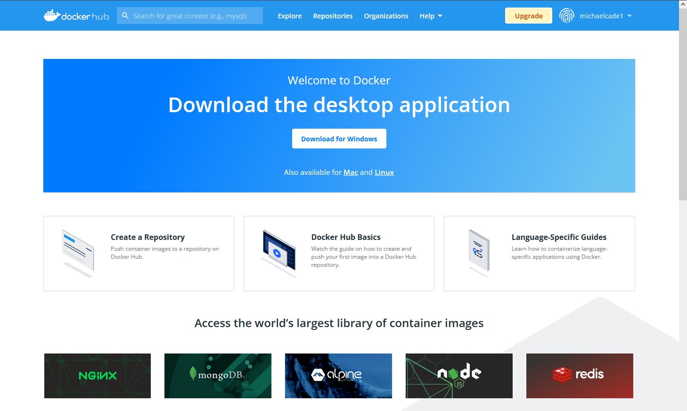
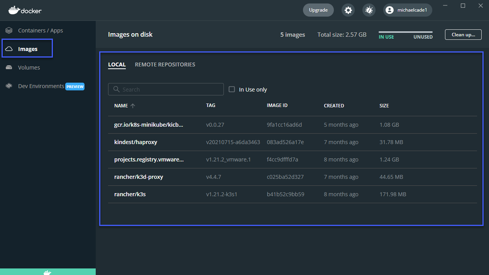

## Imágenes Docker y Manos a la Obra con Docker Desktop

Ahora tenemos Docker Desktop instalado en nuestro sistema. (Si estás ejecutando Linux, tienes más opciones pero no el GUI.)[Instalar Docker Engine en Ubuntu](https://docs.docker.com/engine/install/ubuntu/) (También está disponible para otras distribuciones.)

En este post, vamos a empezar con el despliegue de algunas imágenes en nuestro entorno. Una imagen Docker es un archivo utilizado para ejecutar código en un contenedor Docker. Las imágenes Docker actúan como un conjunto de instrucciones para construir un contenedor Docker, como una plantilla. Las imágenes Docker también actúan como el punto de partida cuando se utiliza Docker.

Ahora es un buen momento para crear tu cuenta en [DockerHub](https://hub.docker.com/)



DockerHub es un recurso centralizado para trabajar con Docker y sus componentes. Más comúnmente conocido como un registro para alojar imágenes Docker. Pero hay un montón de servicios adicionales que se pueden utilizar en parte con la automatización o integración en GitHub, así como el escaneo de seguridad.

Desplazándote hacia abajo una vez logueado verás una lista de imágenes de contenedores, es posible que veas imágenes de bases de datos MySQL, hello-world, etc. Piensa en estas como las imágenes de referencia, puede que sólo necesites una imagen de BBDD MySQL y la mejor sea utilizar la oficial, lo que significa que no es necesario crear una propia personalizada.


Podemos profundizar en la vista de imágenes disponibles y buscar por categorías, sistemas operativos y arquitecturas. Hay que destacar la Imagen Oficial, porque esta debería darte tranquilidad sobre su origen. Para nada recomiendo utilizar imágenes no oficiales, sobretodo en producción. En caso de que lo hagas, asegúrate al menos de que son de un editor verificado.


Por otra parte, podemos buscar una imagen específica, por ejemplo, WordPress podría ser una buena imagen de base que incluye todas las imágenes de contenedores relacionados que necesite la aplicación. Ten en cuenta que existe diferencias entre imagen oficial y editor verificado.
- **Imagen Oficial** - Las imágenes Oficiales de Docker son un conjunto curado de código abierto de Docker y repositorios de soluciones "drop-in".
- **Editor verificado** - Contenido Docker de alta calidad de editores verificados. Estos productos son publicados y mantenidos directamente por una entidad comercial.


### Explorando Docker Desktop

Tenemos Docker Desktop instalado en nuestro equipo windows. Si lo abres por primera vez verás algo similar a la imagen de abajo. Como puedes ver no tenemos ningún contenedor ejecutándose y nuestro motor docker está funcionando.


Debido a que esta no fue la primera instalación, tengo algunas imágenes ya descargadas y disponibles en mi sistema. Es probable que lo veas diferente.



En los repositorios remotos es donde encontrarás cualquier imagen de contenedor que hayas almacenado en tu docker hub. Puedes ver en la imagen de abajo que no tengo ninguna imagen.


Hay que confirmarlo en nuestro sitio dockerhub y confirmar que no tenemos repositorios allí.


A continuación, tenemos la pestaña Volumes. Si tienes contenedores que requieren persistencia será aquí donde podemos añadir estos volúmenes al sistema de archivos local o a un sistema de archivos compartido.


En el momento de escribir esto, también hay una pestaña de Entornos de Desarrollo, esto va a ayudarte a colaborar con tu equipo en lugar de moverte entre diferentes ramas de git. No vamos a cubrir esto.


Volviendo a la primera pestaña puedes ver que hay un comando que podemos ejecutar para iniciar el contenedor.  Ejecutamos en nuestro terminal:

```shell
docker run -d -p 80:80 docker/getting-started
```


Si comprobamos nuestro docker desktop veremos que ya tenemos un contenedor en ejecución.


Te habrás dado cuenta de que estoy usando WSL2. Para usarlo tendrás que asegurarte de que está activado en la configuración.


Si ahora comprobamos nuestra pestaña Imágenes deberías ver una imagen en uso llamada docker/getting-started.


De vuelta a la pestaña Contenedores/Apps, haz click en tu contenedor en ejecución. Verás los registros por defecto y en la parte superior tiene algunas opciones para elegir. En nuestro caso no va a ser una web que se ejecute en este contenedor por lo que vamos a elegir la apertura en el navegador.


Cuando pulsemos el botón de arriba, se abrirá una web que mostrará algo similar a lo que se muestra a continuación.

Este contenedor también tiene algunos detalles más sobre nuestros contenedores e imágenes.


Ya hemos ejecutado nuestro primer contenedor. Nada demasiado aterrador todavía. ¿Y si quisiéramos bajar una de las imágenes de contenedor de DockerHub? Podemos usar un contenedor docker llamado `hello world` para comprobarlo.

Me adelanté y detuve el contenedor de inicio, no es que esté ocupando una cantidad masiva de recursos, sino para mantener un orden mientras vemos algunos pasos más.

De vuelta en nuestro terminal vamos a seguir adelante y ejecutar `docker run hello-world` y a ver qué pasa.

Puedes ver que no teníamos la imagen localmente así que la bajamos y entonces tenemos un mensaje que está escrito en la imagen del contenedor con alguna información sobre lo que hizo para ponerse en marcha y algunos enlaces a puntos de referencia.


Sin embargo, si vamos y miramos en Docker Desktop ahora no tenemos ningún contenedor en ejecución, pero sí tenemos un contenedor que utilizó el mensaje hola-mundo, lo que significa que apareció, entregó el mensaje y luego se terminó.


Y para terminar vamos a comprobar la pestaña images de nuevo en la que tendremos una nueva imagen hello-world localmente, lo que significa que si ejecutamos de nuevo el comando `docker run hello-world` en nuestro terminal no tendríamos que descargar nada a menos de que cambie la versión.


El mensaje del contenedor hello-world nos planteó el reto de ejecutar algo un poco más ambicioso.

¡Reto aceptado!


Al ejecutar `docker run -it ubuntu bash` en nuestro terminal vamos a ejecutar una versión en un contenedor de Ubuntu, que no es una copia completa del sistema operativo. Puedes encontrar más información sobre esta imagen en particular en [DockerHub](https://hub.docker.com/_/ubuntu)

Puedes ver a continuación cuando ejecutamos el comando que ahora tenemos un símbolo del sistema interactivo (`-it`) y tenemos un shell bash en nuestro contenedor.


Tenemos una shell bash pero no tenemos mucho más, piensa que la imagen de este contenedor pesa menos de 30MB.


Pero con esta imagen podemos, por ejemplo:
- Instalar todo el software que necesitemos usando nuestro gestor de paquetes apt.
- Actualizar nuestra imagen de contenedor
- Crear un nuevo contenedor a partir de esta imagen
- Utilizar el contenedor interactivo para pruebas.

Y todo lo que imaginemos.


He instalado algún software en el contenedor, he elegido un ejemplo muy malo aquí ya que `pinta` es un editor de imágenes de más de 200 MB, pero espero que entiendas a dónde voy con esto. Esto aumentaría el tamaño de nuestro contenedor considerablemente pero aún así, vamos a estar en unos MB sin llegar al GB.


Quería que esto te diera una visión general de Docker Desktop y el mundo no tan aterrador de los contenedores cuando lo desglosas con casos de uso simples. Ahora tenemos que ver algo de redes, de seguridad y otras opciones mínimas que necesitamos de base. 

## Recursos

- [TechWorld with Nana - Docker Tutorial for Beginners](https://www.youtube.com/watch?v=3c-iBn73dDE)
- [Programming with Mosh - Docker Tutorial for Beginners](https://www.youtube.com/watch?v=pTFZFxd4hOI)
- [Docker Tutorial for Beginners - What is Docker? Introduction to Containers](https://www.youtube.com/watch?v=17Bl31rlnRM&list=WL&index=128&t=61s)
- [WSL 2 with Docker getting started](https://www.youtube.com/watch?v=5RQbdMn04Oc)
- [En español] En los [apuntes](https://vergaracarmona.es/apuntes/) del traductor:
  - [Preparación de entorno de pruebas local para docker](https://vergaracarmona.es/preparacion-de-entorno-de-pruebas-local-para-docker/)
  - [Uso básico de docker](https://vergaracarmona.es/uso-basico-de-docker/)
  - [Una breve historia sobre contenedores](https://vergaracarmona.es/breve-historia-de-contenedores/)
  - [Desplegar con docker-compose los servicios Traefik y Portainer](https://vergaracarmona.es/desplegar-con-docker-compose-los-servicios-traefik-y-portainer/)

Nos vemos en el [Día 45](day45.md)
