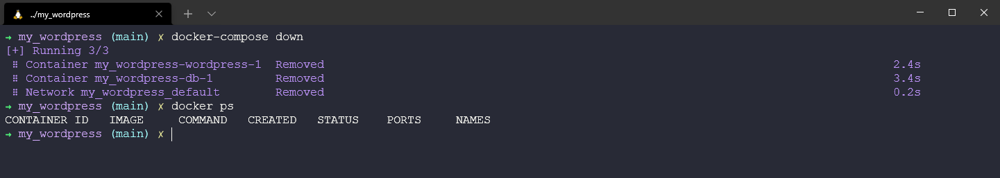

## Docker Compose

La capacidad de ejecutar un contenedor puede ser muy grande si tienes una imagen auto-contenida que tiene todo lo que necesita para su caso de uso único. Donde las cosas se ponen interesantes es cuando estás buscando construir múltiples aplicaciones entre diferentes imágenes de contenedores. Por ejemplo, si tuvieras un sitio web front-end, pero requiere una base de datos back-end podría poner todo en un contenedor, aunque lo más eficiente es tener un contenedor propio para la base de datos.

Aquí es donde entra en juego Docker compose, una herramienta que permite ejecutar aplicaciones más complejas en varios contenedores. Con el beneficio de ser capaz de utilizar un único archivo y comando para hacer girar su aplicación. El ejemplo que voy a mostrar en este día es de [Docker QuickStart sample apps (Quickstart: Compose and WordPress)](https://docs.docker.com/samples/wordpress/).

Veremos cómo:

- Usar Docker Compose para traer WordPress y una instancia separada de MySQL.
- Utilizar un archivo YAML que se llamará `docker-compose.yml`.
- Construir el proyecto
- Configurar WordPress a través de un navegador
- Apagar y limpiar

###  Instalar Docker Compose

Como se ha mencionado Docker Compose es una herramienta, si estás en macOS o Windows entonces compose está incluido en tu instalación de Docker Desktop, así como en las últimas versiones de docker para linux. Sin embargo, es posible que desees ejecutar tus contenedores con una versión de docker más antigua, en cuyo caso puedes instalarlo siguiendo estas instrucciones [Install Docker Compose](https://docs.docker.com/compose/install/)

Para confirmar que tenemos `docker-compose` instalado en nuestro sistema podemos abrir un terminal y simplemente escribir el comando anterior. En la últimas versiones se está dejando de usar el guión medio: `docker compose`.


### Docker-Compose.yml (YAML)

Lo siguiente de lo que hablar es de como construir el fichero docker-compose.yml, pero realmente es más importante de que hablemos un poco de YAML, en general.

YAML casi podría tener su propio día en #90DaysOfDevOps, ya que lo vas a encontrar en muchos lugares diferentes. Pero en general "YAML es un lenguaje de serialización de datos amigable para todos los lenguajes de programación", al igual que JSON o TOML.

Se utiliza habitualmente para archivos de configuración y en algunas aplicaciones en las que se almacenan o transmiten datos. Sin duda te habrás encontrado con archivos XML que suelen ofrecer ese mismo archivo de configuración. YAML proporciona una sintaxis mínima pero está orientado a esos mismos casos de uso.

YAML no es un lenguaje de marcas, como se ha mencionado es un lenguaje de serialización y ha ido ganando popularidad en los últimos años. Las capacidades de serialización de objetos lo convierten en un sustituto viable de lenguajes como JSON.

El acrónimo YAML era la abreviatura de Yet Another Markup Language. Pero los mantenedores lo renombraron a YAML Ain't Markup Language para poner más énfasis en sus características orientadas a los datos.

De todos modos, volvamos al archivo docker-compose.yml. Este es un archivo de configuración de lo que queremos hacer cuando se trata de múltiples contenedores que se despliegan en nuestro único sistema.

Directamente desde el tutorial vinculado anteriormente se puede ver el contenido del archivo se parece a esto:

```
version: "3.9"

services:
  DB:
    image: mysql:5.7
    volumes:
      - db_data:/var/lib/mysql
    restart: always
    environment:
      MYSQL_ROOT_PASSWORD: somewordpress
      MYSQL_DATABASE: wordpress
      MYSQL_USER: wordpress
      MYSQL_PASSWORD: wordpress

  wordpress:
    depends_on:
      - db
    image: wordpress:latest
    volumes:
      - wordpress_data:/var/www/html
    ports:
      - "8000:80"
    restart: always
    environment:
      WORDPRESS_DB_HOST: db
      WORDPRESS_DB_USER: wordpress
      WORDPRESS_DB_PASSWORD: wordpress
      WORDPRESS_DB_NAME: wordpress
volumes:
  db_data: {}
  wordpress_data: {}
```

Declaramos una versión y luego una gran parte de este archivo docker-compose.yml se compone de nuestros servicios, tenemos un servicio DB y un servicio de WordPress. Puedes ver que cada uno de ellos tiene una imagen definida con una etiqueta de versión asociada. Ahora también estamos introduciendo el estado en nuestra configuración a diferencia de nuestros primeros paseos, pero ahora vamos a crear volúmenes para que podamos almacenar nuestras bases de datos allí.

Luego tenemos algunas variables de entorno como contraseñas y nombres de usuario. Estos archivos pueden llegar a ser muy complicados, pero el archivo de configuración YAML simplifica su aspecto general.

### Construir el proyecto

A continuación podemos volver a nuestro terminal y podemos utilizar algunos comandos con nuestra herramienta docker-compose. Asegurate de estar ubicado en el directorio donde se encuentra el archivo docker-compose.yml.

Desde el terminal, podemos simplemente ejecutar `docker-compose up -d` esto iniciará el proceso de extracción de las imágenes y la puesta en marcha de su aplicación multi-contenedor.

La `-d` en este comando significa modo separado, lo que significa que el comando Run estará en segundo plano.


Si ahora ejecutamos el comando `docker ps`, podemos ver que tenemos 2 contenedores ejecutándose, uno es WordPress y el otro es MySQL.


A continuación, podemos verificar que tenemos WordPress funcionando abriendo un navegador y yendo a `http://localhost:8000`. Deberías ver la página de configuración de WordPress.


Podemos ejecutar la configuración de WordPress, y luego podemos empezar a construir nuestro sitio web como mejor nos parezca en la consola de abajo.


Si a continuación abrimos una nueva pestaña y navegamos a la misma dirección que antes `http://localhost:8000` veremos ahora un sencillo tema por defecto con el título de nuestro sitio "90DaysOfDevOps" y a continuación un post de ejemplo.


Antes de hacer ningún cambio, abre Docker Desktop y navega hasta la pestaña de volúmenes y aquí verás dos volúmenes asociados a nuestros contenedores, uno para WordPress y otro para DB.


Mi tema actual de wordpress es "Twenty Twenty-Two" y quiero cambiarlo por "Twenty Twenty". De vuelta en el dashboard podemos hacer esos cambios.


También voy a añadir un nuevo post a mi sitio, y aquí abajo se ve la última versión de nuestro nuevo sitio.


### Limpiar o no limpiar

Si ahora usáramos el comando `docker-compose down` esto bajaría nuestros contenedores. Pero dejará nuestros volúmenes en su sitio.



Podemos confirmar en Docker Desktop que nuestros volúmenes siguen ahí.


Si luego queremos volver a poner las cosas en marcha, podemos ejecutar el comando `docker up -d` desde el mismo directorio y ya tenemos nuestra aplicación de nuevo en marcha.


A continuación, navegamos en nuestro navegador a la misma dirección de `http://localhost:8000` y observamos que nuestro nuevo post y nuestro cambio de tema siguen en su lugar.


Si queremos deshacernos de los contenedores y de esos volúmenes, al ejecutar `docker-compose down --volumes` también destruiremos los volúmenes.


Ahora cuando usemos `docker-compose up -d` de nuevo estaremos arrancando, sin embargo, las imágenes seguirán siendo locales en nuestro sistema por lo que no será necesario volver a extraerlas del repositorio de DockerHub.

Sé que cuando empecé a bucear en docker-compose y sus capacidades estaba confundido en cuanto las diferencias con otras herramientas de orquestación de contenedores como Kubernetes. Por ahora lo que hemos hecho en esta breve demostración se centra en un host que tenemos WordPress y DB se ejecuta en la máquina de escritorio local. No tenemos múltiples máquinas virtuales o múltiples máquinas físicas, tampoco podemos escalar fácilmente hacia arriba y hacia abajo los requisitos de nuestra aplicación.

En la sección de Kubernetes despejaremos algunas dudas, por ahora tenemos algunos días más de Contenedores en general.

Este es también un gran recurso para muestras de aplicaciones docker-compose con múltiples integraciones.  [Awesome-Compose](https://github.com/docker/awesome-compose)

En el repositorio hay un gran ejemplo que desplegará un Elasticsearch, Logstash, y Kibana (ELK) en single-node. Podrás encontrar los ficheros en la carpeta [Containers](2022/Days/Containers/elasticsearch-logstash-kibana/). Si tienes esta carpeta en local, tan solo navega hasta allí y usa `docker-compose up -d`.


Podrás comprobar que tenemos esos contenedores en ejecución con `docker ps`. Estos mantendrán el mismo entorno que en mi pc. 


Ahora podemos abrir un navegador para cada uno de los contenedores:


Como en la anterior práctica, para eliminar todo podemos usar el comando `docker-compose down`.

## Recursos

- [TechWorld with Nana - Docker Tutorial for Beginners](https://www.youtube.com/watch?v=3c-iBn73dDE)
- [Programming with Mosh - Docker Tutorial for Beginners](https://www.youtube.com/watch?v=pTFZFxd4hOI)
- [Docker Tutorial for Beginners - What is Docker? Introduction to Containers](https://www.youtube.com/watch?v=17Bl31rlnRM&list=WL&index=128&t=61s)
- [WSL 2 with Docker getting started](https://www.youtube.com/watch?v=5RQbdMn04Oc)
- [Blog on getting started building a docker image](https://stackify.com/docker-build-a-beginners-guide-to-building-docker-images/)
- [Docker documentation for building an image](https://docs.docker.com/develop/develop-images/dockerfile_best-practices/)
- [YAML Tutorial: Everything You Need to Get Started in Minute](https://www.cloudbees.com/blog/yaml-tutorial-everything-you-need-get-started)
- [En español] En los [apuntes](https://vergaracarmona.es/apuntes/) del traductor:
  - [Preparación de entorno de pruebas local para docker](https://vergaracarmona.es/preparacion-de-entorno-de-pruebas-local-para-docker/)
  - [Uso básico de docker](https://vergaracarmona.es/uso-basico-de-docker/)
  - [Una breve historia sobre contenedores](https://vergaracarmona.es/breve-historia-de-contenedores/)
  - [Desplegar con docker-compose los servicios Traefik y Portainer](https://vergaracarmona.es/desplegar-con-docker-compose-los-servicios-traefik-y-portainer/)
  - [Comparando TOML, JSON y YAML](https://vergaracarmona.es/comparando-toml-json-y-yaml/)

Nos vemos en el [Día 47](day47.md)
