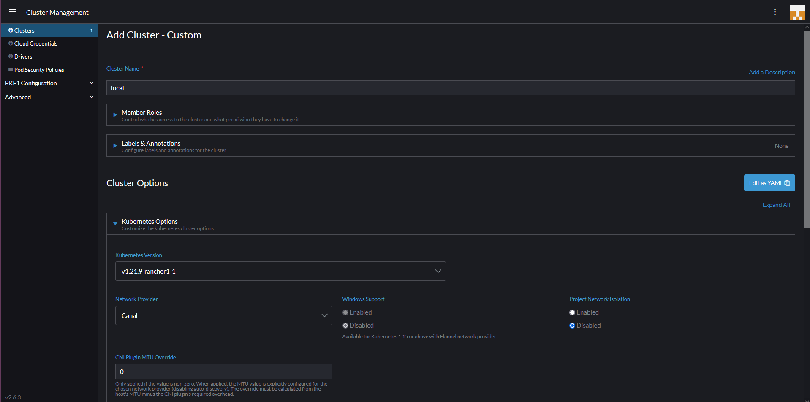

## Visión general de Rancher - Práctica

En esta sección vamos a echar un vistazo a Rancher. Hasta ahora, todo lo que hemos hecho ha sido en la línea de comandos (CLI) y usando `kubectl`, pero tenemos algunas buenas interfaces de usuario (UI) y herramientas de gestión de múltiples clústeres para proporcionar a nuestros equipos de operaciones una buena visibilidad de la gestión de nuestros clústeres.

Según su [sitio web](https://rancher.com/):

> Rancher es una pila de software completa para equipos que adoptan contenedores. Aborda los desafíos operativos y de seguridad de la gestión de múltiples clústeres de Kubernetes en cualquier infraestructura, al tiempo que proporciona a los equipos de DevOps herramientas integradas para ejecutar cargas de trabajo en contenedores.

Rancher nos permite implementar clústeres de Kubernetes de nivel de producción desde casi cualquier ubicación, y luego proporciona autenticación centralizada, control de acceso y observabilidad. Mencioné en una sección anterior que hay casi una abrumadora cantidad de opciones cuando se trata de Kubernetes y dónde se debería o podría ejecutar, pero con Rancher no importa dónde estén.

### Implementar Rancher

Lo primero que debemos hacer es implementar Rancher en nuestra estación de trabajo local. Hay algunas formas y ubicaciones que puedes elegir para realizar este paso. En mi caso, quiero usar mi estación de trabajo local y ejecutar Rancher como un contenedor de Docker. Al ejecutar el siguiente comando, descargaremos una imagen de contenedor y luego tendremos acceso a la interfaz de usuario de Rancher.

También están disponibles otros métodos de implementación de Rancher. Puedes consultar la [Guía de inicio rápido de Rancher](https://rancher.com/docs/rancher/v2.6/en/quick-start-guide/deployment/).

`sudo docker run -d --restart=unless-stopped -p 80:80 -p 443:443 --privileged rancher/rancher`

Como puedes ver en nuestro Docker Desktop, tenemos un contenedor de Rancher en ejecución.


### Acceder a la interfaz de usuario de Rancher

Con el contenedor anterior en ejecución, deberíamos poder acceder a él a través de una página web. Acceder a `https://localhost` nos mostrará una página de inicio de sesión como se muestra a continuación.


Sigue las instrucciones a continuación para obtener la contraseña requerida. Como estoy usando Windows, elegí usar bash para Windows debido al comando `grep` necesario.


Luego podemos tomar la contraseña anterior e iniciar sesión. La siguiente página es donde podemos definir una nueva contraseña.


Una vez que hayamos hecho lo anterior, iniciaremos sesión y podremos ver nuestra pantalla de inicio. Como parte de la implementación de Rancher, también veremos un clúster local de K3s creado.


### un recorrido rápido por rancher

Lo primero que veremos es nuestro clúster K3S implementado localmente. Como se muestra a continuación, obtendremos una buena visualización de lo que está sucediendo dentro de nuestro clúster. Esta es la implementación predeterminada y aún no hemos implementado nada en este clúster. Podemos ver que está compuesto por 1 nodo y tiene 5 implementaciones. También podemos ver algunas estadísticas sobre pods, núcleos y memoria.


En el menú de la izquierda, también tenemos una pestaña "Apps & Marketplace" (Aplicaciones y Mercado). Esto nos permite elegir las aplicaciones que queremos ejecutar en nuestros clústeres. Como se mencionó anteriormente, Rancher nos brinda la capacidad de ejecutar o administrar varios clústeres diferentes. Con el marketplace, podemos implementar nuestras aplicaciones de manera muy sencilla.


Otra cosa importante es que, si necesitamos acceder a cualquier clúster administrado por Rancher, podemos abrir una shell de kubectl en el clúster seleccionado.


### Crear un nuevo clúster

En las últimas dos sesiones, hemos creado un clúster de minikube localmente y hemos utilizado Vagrant con VirtualBox para crear un clúster de Kubernetes de 3 nodos. Con Rancher, también podemos crear clústeres. En la [carpeta Rancher](Kubernetes/Rancher) encontrarás archivos adicionales de Vagrant que crearán los mismos 3 nodos, pero sin los pasos para crear nuestro clúster de Kubernetes (queremos que Rancher lo haga por nosotros).

Sin embargo, es necesario tener Docker instalado y actualizar el sistema operativo. Aún verás que se ejecuta el script common.sh en cada uno de nuestros nodos. Esto también instalará Kubeadm, Kubectl, etc., pero no ejecutará los comandos de Kubeadm para crear y unir nuestros nodos en un clúster.

Podemos ir a la ubicación de nuestra carpeta de Vagrant y simplemente ejecutar vagrant up para comenzar el proceso de creación de nuestras 3 máquinas virtuales en VirtualBox.


Ahora que tenemos nuestros nodos o máquinas virtuales en su lugar y listos, podemos usar Rancher para crear nuestro nuevo clúster de Kubernetes. La primera pantalla para crear tu clúster te ofrece algunas opciones sobre dónde se encuentra tu clúster, es decir, si estás utilizando servicios administrados de Kubernetes en la nube pública, vSphere o cualquier otra opción integrada.


eleccionaremos "custom" ya que no estamos utilizando una de las plataformas integradas. La página de apertura es donde puedes definir el nombre de tu clúster (dice "local" a continuación, pero no puedes usar "local"; nuestro clúster se llama "vagrant"). Aquí puedes definir las versiones de Kubernetes, los proveedores de red y algunas otras opciones de configuración para poner en marcha tu clúster de Kubernetes.



La siguiente página te proporcionará el código de registro que debe ejecutarse en cada uno de tus nodos con los servicios apropiados habilitados: etcd, control-plane y worker. Para nuestro nodo maestro, queremos habilitar etcd y control-plane, por lo que el comando se muestra a continuación.


```
sudo docker run -d --privileged --restart=unless-stopped --net=host -v /etc/kubernetes:/etc/kubernetes -v /var/run:/var/run  rancher/rancher-agent:v2.6.3 --server https://10.0.0.1 --token mpq8cbjjwrj88z4xmf7blqxcfmwdsmq92bmwjpphdkklfckk5hfwc2 --ca-checksum a81944423cbfeeb92be0784edebba1af799735ebc30ba8cbe5cc5f996094f30b --etcd --controlplane
```

Si la configuración de la red está correctamente, deberías ver rápidamente lo siguiente en tu panel de Rancher, lo que indica que el primer nodo maestro se está registrando y se está creando el clúster.


Luego, podemos repetir el proceso de registro para cada uno de los nodos de trabajo con el siguiente comando, y después de algún tiempo, tendrás tu clúster funcionando y podrás aprovechar el mercado para implementar tus aplicaciones.

```
sudo docker run -d --privileged --restart=unless-stopped --net=host -v /etc/kubernetes:/etc/kubernetes -v /var/run:/var/run  rancher/rancher-agent:v2.6.3 --server https://10.0.0.1 --token mpq8cbjjwrj88z4xmf7blqxcfmwdsmq92bmwjpphdkklfckk5hfwc2 --ca-checksum a81944423cbfeeb92be0784edebba1af799735ebc30ba8cbe5cc5f996094f30b --worker
```


Durante las últimas 3 sesiones, hemos utilizado diferentes formas para poner en marcha un clúster de Kubernetes. En los días restantes, vamos a centrarnos en el lado de la aplicación de la plataforma, que es posiblemente el aspecto más importante. Analizaremos los servicios y la capacidad de aprovisionar y utilizar nuestros servicios en Kubernetes.

Me han informado que los requisitos para el inicio de los nodos de Rancher requieren que esas VM tengan 4 GB de RAM o entrarán en un bucle de reinicio. Desde entonces, he actualizado los nodos de trabajo, ya que tenían 2 GB.

## Recursos

Si tienes recursos GRATUITOS que has utilizado, por favor, siéntete libre de agregarlos aquí mediante una solicitud de extracción (PR) al repositorio, y estaré encantado de incluirlos.

- [Kubernetes Documentation](https://kubernetes.io/docs/home/)
- [TechWorld with Nana - Kubernetes Tutorial for Beginners [FULL COURSE in 4 Hours]](https://www.youtube.com/watch?v=X48VuDVv0do)
- [TechWorld with Nana - Kubernetes Crash Course for Absolute Beginners](https://www.youtube.com/watch?v=s_o8dwzRlu4)
- [Kunal Kushwaha - Kubernetes Tutorial for Beginners | What is Kubernetes? Architecture Simplified!](https://www.youtube.com/watch?v=KVBON1lA9N8)

Nos vemos en el [Día 54](day54.md)
