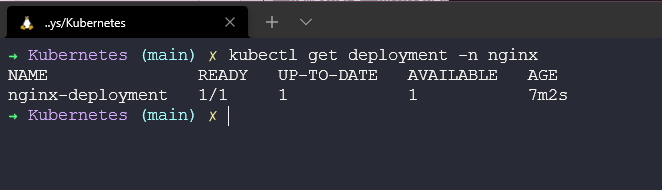

## Implementación de aplicaciones en Kubernetes

Ahora finalmente vamos a implementar algunas aplicaciones en nuestros clústeres, algunos podrían decir que esta es la razón por la cual Kubernetes existe, para la entrega de aplicaciones.

La idea aquí es que podemos tomar nuestras imágenes de contenedor y desplegarlas como pods en nuestro clúster de Kubernetes para aprovechar Kubernetes como un orquestador de contenedores.

### Implementación de aplicaciones en Kubernetes

Existen varias formas en las que podemos implementar nuestras aplicaciones en nuestro clúster de Kubernetes, cubriremos dos de los enfoques más comunes que son archivos YAML y gráficos Helm.

Utilizaremos nuestro clúster minikube para estas implementaciones de aplicaciones. Repasaremos algunos de los componentes o bloques de construcción de Kubernetes mencionados anteriormente.

En esta sección y la sección de Contenedores, hemos discutido las imágenes y los beneficios de Kubernetes, y cómo podemos manejar fácilmente la escala en esta plataforma.

En este primer paso, simplemente vamos a crear una aplicación sin estado dentro de nuestro clúster minikube. Utilizaremos la aplicación sin estado de facto estándar en nuestra primera demostración: `nginx`. Configuraremos una Implementación (Deployment), que nos proporcionará nuestros pods, y luego también crearemos un servicio que nos permitirá acceder al servidor web simple alojado por el pod de nginx. Todo esto estará contenido en un espacio de nombres.


### Creating the YAML

Creación del archivo YAML

En la primera demostración, queremos definir todo lo que hacemos con YAML. Podríamos tener una sección completa sobre YAML, pero voy a pasar por alto esto y dejar algunos recursos al final que cubrirán YAML en más detalle.

Podemos crear lo siguiente como un archivo YAML o podemos dividir esto en cada aspecto de nuestra aplicación, es decir, podrían ser archivos separados para el espacio de nombres, la implementación y la creación del servicio, pero en este archivo, a continuación, separamos esto usando `---` en un solo archivo. Puede encontrar este archivo ubicado [aquí](Kubernetes) (File name:- nginx-stateless-demo.YAML)

```Yaml
apiVersion: v1
kind: Namespace
metadata:
  name: nginx
  "labels": {
    "name": "nginx"
  }
---
apiVersion: apps/v1
kind: Deployment
metadata:
  name: nginx-deployment
  namespace: nginx
spec:
  selector:
    matchLabels:
      app: nginx
  replicas: 1
  template:
    metadata:
      labels:
        app: nginx
    spec:
      containers:
      - name: nginx
        image: nginx
        ports:
        - containerPort: 80
---
apiVersion: v1
kind: Service
metadata:
  name: nginx-service
  namespace: nginx
spec:
  selector:
    app: nginx-deployment
  ports:
    - protocol: TCP
      port: 80
      targetPort: 80
```

### Verificando nuestro clúster

Antes de implementar cualquier cosa, debemos asegurarnos de que no tengamos ningún espacio de nombres existente llamado `nginx`. Podemos hacer esto ejecutando el comando kubectl get namespace y como puedes ver a continuación, no tenemos un espacio de nombres llamado `nginx`.


### Hora de implementar nuestra aplicación

Ahora estamos listos para implementar nuestra aplicación en nuestro clúster de minikube, este mismo proceso funcionará en cualquier otro clúster de Kubernetes.

Necesitamos navegar hasta la ubicación de nuestro archivo YAML y luego podemos ejecutar kubectl `create -f nginx-stateless-demo.yaml`, lo que te mostrará que se han creado 3 objetos, y tenemos un espacio de nombres, una implementación y un servicio.


Ejecutemos el comando nuevamente para ver nuestros espacios de nombres disponibles en nuestro clúster `kubectl get namespace` y ahora puedes ver que tenemos nuestro nuevo espacio de nombres.


Si luego verificamos nuestro espacio de nombres para los pods usando `kubectl get pods -n nginx`, verás que tenemos 1 pod en estado listo y en ejecución.


También podemos verificar que nuestro servicio se haya creado ejecutando `kubectl get service -n nginx`.


Finalmente, podemos verificar nuestra implementación, la implementación es donde y cómo mantenemos nuestra configuración deseada.



Lo anterior requiere algunos comandos que vale la pena conocer, pero también puedes usar `kubectl get all -n nginx` para ver todo lo que implementamos con ese archivo YAML.


Observarás que también tenemos un replicaset en la implementación. En nuestra implementación, definimos cuántas réplicas de nuestra imagen nos gustaría implementar. Inicialmente se estableció en 1, pero si quisiéramos escalar rápidamente nuestra aplicación, podemos hacerlo de varias formas.

Podemos editar nuestro archivo usando `kubectl edit deployment nginx-deployment -n nginx`, lo cual abrirá un editor de texto dentro de tu terminal y te permitirá modificar tu implementación.


Al guardar lo anterior en tu editor de texto dentro de la terminal, si no hubo problemas y se utilizó el formato correcto, deberías ver que se implementan réplicas adicionales en tu espacio de nombres.


También podemos realizar un cambio en el número de réplicas utilizando `kubectl scale deployment nginx-deployment --replicas=10 -n nginx`.


Del mismo modo, podemos utilizar este método para reducir la escala de nuestra aplicación nuevamente a 1 si deseamos utilizar cualquiera de los dos métodos. Yo utilicé la opción de edición, pero también puedes usar el comando de escala mencionado anteriormente.


Espero que aquí puedas ver el caso de uso. No solo es extremadamente rápido iniciar y detener las cosas, sino que también tenemos la capacidad de escalar rápidamente nuestras aplicaciones hacia arriba y hacia abajo. Si esto fuera un servidor web, podríamos escalar durante los momentos de alta demanda y reducirlo cuando la carga sea baja.

### Exponiendo nuestra aplicación

Pero ¿cómo accedemos a nuestro servidor web?

Si observas arriba nuestro servicio, verás que no hay una IP externa disponible, por lo que no podemos abrir un navegador web y esperar que esté ahí mágicamente. Para acceder, tenemos algunas opciones.

**ClusterIP** - La IP que ves es un ClusterIP, que se encuentra en una red interna del clúster. Solo los elementos dentro del clúster pueden acceder a esta IP.

**NodePort** - Expone el servicio en el mismo puerto de cada uno de los nodos seleccionados en el clúster utilizando NAT.

**LoadBalancer** - Crea un balanceador de carga externo en la nube actual. Estamos utilizando minikube, pero si has creado tu propio clúster de Kubernetes, como lo hicimos en VirtualBox, necesitarías implementar un balanceador de carga como metallb en tu clúster para proporcionar esta funcionalidad.

**Port-Forward** - También tenemos la capacidad de reenvío de puertos, lo que te permite acceder e interactuar con los procesos internos del clúster de Kubernetes desde tu localhost. Esta opción solo se utiliza para pruebas y solución de problemas.

Ahora tenemos algunas opciones para elegir. Minikube tiene algunas limitaciones o diferencias, podríamos simplemente ejecutar el siguiente comando para redirigir nuestro acceso utilizando nuestra estación de trabajo local.

`kubectl port-forward deployment/nginx-deployment -n nginx 8090:80`


Ten en cuenta que cuando ejecutas el comando anterior, esta terminal ya no es utilizable, ya que actúa como reenvío de puertos a tu máquina local y puerto.


Ahora vamos a explicar específicamente con Minikube cómo podemos exponer nuestra aplicación. También podemos usar minikube para crear una URL y conectarnos a un servicio [Más detalles](https://minikube.sigs.k8s.io/docs/commands/service/)

En primer lugar, eliminaremos nuestro servicio usando `kubectl delete service nginx-service -n nginx`

A continuación, crearemos un nuevo servicio utilizando `kubectl expose deployment nginx-deployment --name nginx-service --namespace nginx --port=80 --type=NodePort`. Observa que aquí estamos usando "expose" y cambiamos el tipo a NodePort.


Finalmente, en una nueva terminal, ejecuta `minikube --profile='mc-demo' service nginx-service --URL -n nginx` para crear un túnel para nuestro servicio.


Abre un navegador o haz clic en el enlace en tu terminal.


### Helm

Helm es otra forma en la que podemos implementar nuestras aplicaciones. Conocido como "el administrador de paquetes para Kubernetes". Puedes obtener más información [aquí](https://helm.sh/).

Helm es un administrador de paquetes para Kubernetes. Se podría considerar que Helm es el equivalente de Kubernetes a yum o apt. Helm implementa gráficos, que puedes pensar como una aplicación empaquetada. Es un modelo para los recursos de tu aplicación preconfigurada, que se pueden implementar como un gráfico fácil de usar. Luego, puedes implementar otra versión del gráfico con un conjunto diferente de configuraciones.

Tienen un sitio web donde puedes explorar todos los gráficos de Helm disponibles y, por supuesto, puedes crear los tuyos propios. La documentación también es clara y concisa, no es tan abrumadora como cuando escuché el término "helm" por primera vez junto con todas las demás palabras nuevas en este espacio.

Es muy sencillo poner en marcha o instalar Helm. Simplemente puedes encontrar los binarios y los enlaces de descarga aquí, para prácticamente todas las distribuciones, incluyendo dispositivos Raspberry Pi arm64.

O puedes utilizar un script de instalación, la ventaja aquí es que se descargará e instalará la última versión de Helm.


```Shell
curl -fsSL -o get_helm.sh https://raw.githubusercontent.com/helm/helm/master/scripts/get-helm-3

chmod 700 get_helm.sh

./get_helm.sh
```

Finalmente, también existe la opción de utilizar un administrador de paquetes para el administrador de aplicaciones, como Homebrew para Mac, Chocolatey para Windows, apt para Ubuntu/Debian, snap y pkg también.

Hasta ahora, Helm parece ser la forma preferida de descargar e instalar diferentes aplicaciones de prueba en tu clúster.

Un buen recurso para enlazar aquí sería [ArtifactHUB](https://artifacthub.io/), que es un recurso para encontrar, instalar y publicar paquetes de Kubernetes. También quiero mencionar [KubeApps](https://kubeapps.com/), que es una interfaz de usuario para mostrar gráficos de Helm.

## Recursos

Si tienes recursos GRATUITOS que has utilizado, siéntete libre de agregarlos aquí mediante un PR al repositorio y estaré encantado de incluirlos.

- [Kubernetes Documentation](https://kubernetes.io/docs/home/)
- [TechWorld with Nana - Kubernetes Tutorial for Beginners [FULL COURSE in 4 Hours]](https://www.youtube.com/watch?v=X48VuDVv0do)
- [TechWorld with Nana - Kubernetes Crash Course for Absolute Beginners](https://www.youtube.com/watch?v=s_o8dwzRlu4)
- [Kunal Kushwaha - Kubernetes Tutorial for Beginners | What is Kubernetes? Architecture Simplified!](https://www.youtube.com/watch?v=KVBON1lA9N8)
- [Guía Helm](https://gitea.vergaracarmona.es/man-linux/Guia-Tutorial-kubernetes/src/branch/main/guias/05-helm.md)
- [Ejecutar Charts de Helm con helmfile](https://vergaracarmona.es/ejecutar-charts-de-helm-con-helmfile/)
- [Helm Umbrella Charts](https://vergaracarmona.es/helm-umbrella-charts/)
- [Apuntes de curso Helm](https://vergaracarmona.es/wp-content/uploads/2022/12/Curso_Helm_vergaracarmona.es_.pdf)

Nos vemos en el [Día 55](day55.md)
