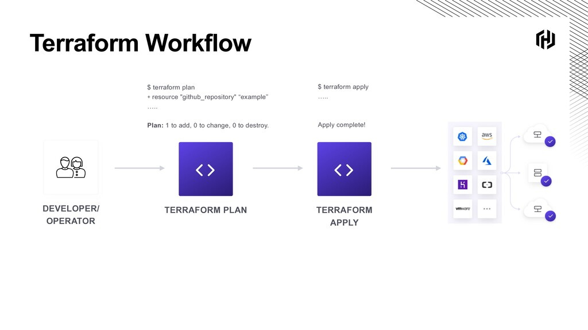

## Una introducción a Terraform

"Terraform es una herramienta para construir, cambiar y versionar infraestructura de manera segura y eficiente".

La cita anterior es de HashiCorp, la empresa detrás de Terraform.

"Terraform es una herramienta de código abierto para infraestructura como código que proporciona un flujo de trabajo de CLI consistente para gestionar cientos de servicios en la nube. Terraform codifica las API de la nube en archivos de configuración declarativos".

HashiCorp tiene un excelente recurso en [HashiCorp Learn](https://learn.hashicorp.com/terraform?utm_source=terraform_io&utm_content=terraform_io_hero) que cubre todos sus productos y ofrece demos paso a paso cuando intentas lograr algo con Infraestructura como Código.

Todos los proveedores de la nube y las plataformas locales generalmente nos brindan acceso a consolas de administración que nos permiten crear nuestros recursos a través de una interfaz de usuario. En general, estas plataformas también proporcionan acceso a la CLI o API para crear los mismos recursos, pero con una API podemos aprovisionarlos rápidamente.

Infraestructura como Código nos permite conectarnos a esas APIs para implementar nuestros recursos en el estado deseado.

Otras herramientas, aunque no exclusivas ni exhaustivas, se enumeran a continuación. Si tienes otras herramientas, por favor compártelas mediante una PR.

| Específicas de la nube          | Agnósticas de la nube |
| ------------------------------- | --------------------- |
| AWS CloudFormation              | Terraform             |
| Azure Resource Manager          | Pulumi                |
| Google Cloud Deployment Manager |                       |

Esta es otra razón por la cual utilizamos Terraform, queremos ser agnósticos a las nubes y plataformas que deseamos utilizar para nuestras demos y en general.

## Descripción general de Terraform

Terraform es una herramienta centrada en el aprovisionamiento. Terraform es una CLI que proporciona capacidades para poder aprovisionar entornos de infraestructura complejos. Con Terraform, podemos definir requisitos de infraestructura complejos que existen localmente o de forma remota (en la nube). Terraform no solo nos permite construir cosas inicialmente, sino también mantener y actualizar esos recursos durante su ciclo de vida.

Aquí vamos a cubrir los aspectos principales, pero para obtener más detalles y muchos recursos, puedes dirigirte a [terraform.io](https://www.terraform.io/).

### Escribir

Terraform nos permite crear archivos de configuración declarativos que construirán nuestros entornos. Los archivos se escriben utilizando el lenguaje de configuración de HashiCorp (HCL), que permite descripciones concisas de recursos utilizando bloques, argumentos y expresiones. Por supuesto, estudiaremos estos en detalle al implementar máquinas virtuales (VMs), contenedores y en Kubernetes.

### Planificar

La capacidad de verificar que los archivos de configuración mencionados anteriormente desplegarán lo que queremos ver, utilizando funciones específicas de la CLI de Terraform para probar ese plan antes de desplegar o cambiar cualquier cosa. Recuerda que Terraform es una herramienta continua para tu infraestructura. Si deseas cambiar aspectos de tu infraestructura, debes hacerlo a través de Terraform para que quede registrado todo en el código.

### Aplicar

Una vez que estés satisfecho, puedes continuar y aplicar esta configuración a los numerosos proveedores disponibles en Terraform. Puedes ver una gran cantidad de proveedores disponibles [aquí](https://registry.terraform.io/browse/providers).

Otra cosa que mencionar es que también hay módulos disponibles, y esto es similar a las imágenes de contenedores en el sentido de que estos módulos han sido creados y compartidos públicamente, por lo que no tienes que crearlos una y otra vez, solo puedes reutilizar las mejores prácticas para implementar un recurso de infraestructura específico de la misma manera en todas partes. Puedes encontrar los módulos disponibles [aquí](https://registry.terraform.io/browse/modules).

El flujo de trabajo de Terraform se ve así: (_tomado del sitio de Terraform_)

### Terraform vs Vagrant

Durante este desafío, hemos utilizado Vagrant, que resulta ser otra herramienta de código abierto de HashiCorp que se centra en los entornos de desarrollo.

- Vagrant es una herramienta enfocada en la gestión de entornos de desarrollo.

- Terraform es una herramienta para construir infraestructura.

Se puede encontrar una excelente comparación de las dos herramientas aquí en el [sitio oficial de HashiCorp](https://www.vagrantup.com/intro/vs/terraform).

## Instalación de Terraform

La instalación de Terraform no tiene mucho misterio.

Terraform es multiplataforma y puedes ver a continuación que en mi máquina Linux tenemos varias opciones para descargar e instalar la CLI.

Usando `arkade` para instalar Terraform, arkade es una práctica herramienta que te permite obtener las herramientas, aplicaciones y clis que necesitas en tu sistema. Un simple `arkade get terraform` permitirá actualizar Terraform si está disponible, o este mismo comando también instalará la CLI de Terraform.

Vamos a profundizar más en HCL y luego comenzaremos a utilizar Terraform para crear algunos recursos de infraestructura en diversas plataformas.

## Recursos

He enumerado muchos recursos a continuación y creo que este tema ha sido cubierto tantas veces en otros lugares. Si tienes recursos adicionales, asegúrate de enviar una solicitud de extracción (PR) con tus recursos y estaré encantado de revisarlos y agregarlos a la lista.

- [What is Infrastructure as Code? Difference of Infrastructure as Code Tools](https://www.youtube.com/watch?v=POPP2WTJ8es)
- [Terraform Tutorial | Terraform Course Overview 2021](https://www.youtube.com/watch?v=m3cKkYXl-8o)
- [Terraform explained in 15 mins | Terraform Tutorial for Beginners](https://www.youtube.com/watch?v=l5k1ai_GBDE)
- [Terraform Course - From BEGINNER to PRO!](https://www.youtube.com/watch?v=7xngnjfIlK4&list=WL&index=141&t=16s)
- [HashiCorp Terraform Associate Certification Course](https://www.youtube.com/watch?v=V4waklkBC38&list=WL&index=55&t=111s)
- [Terraform Full Course for Beginners](https://www.youtube.com/watch?v=EJ3N-hhiWv0&list=WL&index=39&t=27s)
- [KodeKloud - Terraform for DevOps Beginners + Labs: Complete Step by Step Guide!](https://www.youtube.com/watch?v=YcJ9IeukJL8&list=WL&index=16&t=11s)
- [Terraform Simple Projects](https://terraform.joshuajebaraj.com/)
- [Terraform Tutorial - The Best Project Ideas](https://www.youtube.com/watch?v=oA-pPa0vfks)
- [Awesome Terraform](https://github.com/shuaibiyy/awesome-terraform)
- [Herramientas para Terraform](https://vergaracarmona.es/herramientas-para-terraform/)

Nos vemos en el [Día 58](day58.md)
