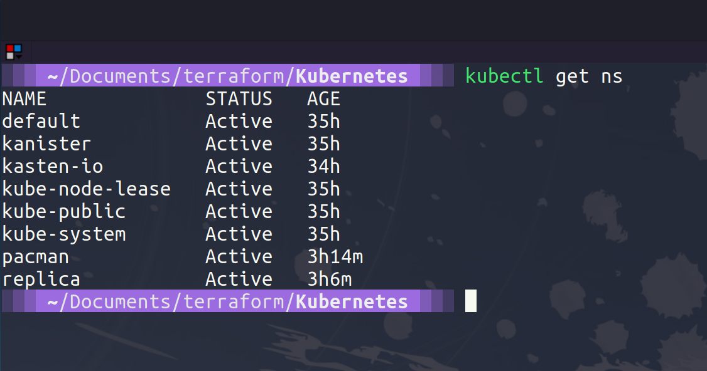

## Kubernetes y entornos múltiples

Hasta ahora, durante esta sección sobre infraestructura como código, hemos visto cómo implementar máquinas virtuales, aunque sea en VirtualBox, pero la premisa es la misma: definimos en código cómo queremos que se vea nuestra máquina virtual y luego la implementamos. Lo mismo ocurre con los contenedores de Docker, y en esta sesión vamos a ver cómo Terraform se puede utilizar para interactuar con los recursos admitidos por Kubernetes.

He estado utilizando Terraform para implementar mis clústeres de Kubernetes con fines de demostración en los 3 principales proveedores de nube, y puedes encontrar el repositorio [tf_k8deploy](https://github.com/MichaelCade/tf_k8deploy)

Sin embargo, también puedes usar Terraform para interactuar con objetos dentro del clúster de Kubernetes. Esto podría ser utilizando el [proveedor de Kubernetes](https://registry.terraform.io/providers/hashicorp/kubernetes/latest/docs) o el [ proveedor de Helm](https://registry.terraform.io/providers/hashicorp/helm/latest) para gestionar las implementaciones de tus gráficos.

Ahora podríamos usar `kubectl`, como hemos mostrado en secciones anteriores. Pero hay algunos beneficios al usar Terraform en tu entorno de Kubernetes:

- Flujo de trabajo unificado: si has utilizado Terraform para implementar tus clústeres, puedes utilizar el mismo flujo de trabajo y herramienta para implementar dentro de tus clústeres de Kubernetes.
- Gestión del ciclo de vida: Terraform no es solo una herramienta de aprovisionamiento, también permite realizar cambios, actualizaciones y eliminaciones.

## Demostración simple de Kubernetes

Similar a la demostración que creamos en la última sesión, ahora podemos implementar NGINX en nuestro clúster de Kubernetes. Aquí usaré minikube nuevamente con fines de demostración. Creamos nuestro archivo `Kubernetes.tf` y puedes encontrarlo en la [carpeta](2022/Days/IaC/Kubernetes/Kubernetes.tf)

En ese archivo, vamos a definir nuestro proveedor de Kubernetes, vamos a apuntar a nuestro archivo `kubeconfig`, crear un espacio de nombres llamado "nginx" y luego crearemos una implementación que contiene 2 réplicas y, finalmente, un servicio.

```
terraform {
  required_providers {
    kubernetes = {
      source  = "hashicorp/kubernetes"
      version = ">= 2.0.0"
    }
  }
}
provider "kubernetes" {
  config_path = "~/.kube/config"
}
resource "kubernetes_namespace" "test" {
  metadata {
    name = "nginx"
  }
}
resource "kubernetes_deployment" "test" {
  metadata {
    name      = "nginx"
    namespace = kubernetes_namespace.test.metadata.0.name
  }
  spec {
    replicas = 2
    selector {
      match_labels = {
        app = "MyTestApp"
      }
    }
    template {
      metadata {
        labels = {
          app = "MyTestApp"
        }
      }
      spec {
        container {
          image = "nginx"
          name  = "nginx-container"
          port {
            container_port = 80
          }
        }
      }
    }
  }
}
resource "kubernetes_service" "test" {
  metadata {
    name      = "nginx"
    namespace = kubernetes_namespace.test.metadata.0.name
  }
  spec {
    selector = {
      app = kubernetes_deployment.test.spec.0.template.0.metadata.0.labels.app
    }
    type = "NodePort"
    port {
      node_port   = 30201
      port        = 80
      target_port = 80
    }
  }
}
```

Lo primero que tenemos que hacer en nuestra nueva carpeta de proyecto es ejecutar el comando `terraform init`.


Y antes de ejecutar el comando `terraform apply`, permíteme mostrarte que no tenemos espacios de nombres.



Cuando ejecutamos nuestro comando apply, esto creará esos 3 nuevos recursos: el espacio de nombres, la implementación y el servicio dentro de nuestro clúster de Kubernetes.


Ahora podemos echar un vistazo a los recursos implementados en nuestro clúster.


Ahora, debido a que estamos usando minikube, como habrás visto en la sección anterior, tiene sus limitaciones cuando intentamos trabajar con la red de Docker para el ingreso. Pero si simplemente emitimos el comando `kubectl port-forward -n nginx svc/nginx 30201:80` y abrimos un navegador en `http://localhost:30201/`, deberíamos ver nuestra página de NGINX.


Si quieres probar demos más detalladas con Terraform y Kubernetes, la [web de HashiCorp Learn](https://learn.hashicorp.com/tutorials/terraform/kubernetes-provider) es fantástico para seguir.

### Entornos múltiples

Si quisiéramos tomar cualquiera de las demos que hemos visto pero ahora queremos tener entornos de producción, de preparación y de desarrollo específicos que se vean iguales y aprovechen este código, hay dos enfoques para lograrlo con Terraform:

- `terraform workspaces`: secciones con nombre múltiples dentro de un único backend.
- Estructura de archivos: el diseño de directorios proporciona separación y los módulos proporcionan reutilización.

Cada uno de los enfoques tiene sus pros y sus contras.

### terraform workspaces

Pros

-Fácil de comenzar.
-Expresión terraform.workspace conveniente.
-Minimiza la duplicación de código.

Contras

- Propenso a errores humanos (estábamos tratando de eliminar esto al usar TF).
- El estado se almacena en el mismo backend.
- El código base no muestra de manera inequívoca las configuraciones de implementación.

### Estructura de archivos

Pros

- Aislamiento de backends:
  - Mejora de la seguridad.
  - Disminución del potencial de errores humanos.
- El código base representa completamente el estado implementado.

Contras

- Se requiere la ejecución de varios terraform apply para aprovisionar los entornos.
- Mayor duplicación de código, pero se puede minimizar con módulos.

## Recursos

He enumerado muchos recursos a continuación y creo que este tema se ha cubierto muchas veces, así que si tienes recursos adicionales, asegúrate de enviar una solicitud de extracción (PR) con tus recursos y estaré encantado de revisarlos y agregarlos a la lista.

- [What is Infrastructure as Code? Difference of Infrastructure as Code Tools](https://www.youtube.com/watch?v=POPP2WTJ8es)
- [Terraform Tutorial | Terraform Course Overview 2021](https://www.youtube.com/watch?v=m3cKkYXl-8o)
- [Terraform explained in 15 mins | Terraform Tutorial for Beginners](https://www.youtube.com/watch?v=l5k1ai_GBDE)
- [Terraform Course - From BEGINNER to PRO!](https://www.youtube.com/watch?v=7xngnjfIlK4&list=WL&index=141&t=16s)
- [HashiCorp Terraform Associate Certification Course](https://www.youtube.com/watch?v=V4waklkBC38&list=WL&index=55&t=111s)
- [Terraform Full Course for Beginners](https://www.youtube.com/watch?v=EJ3N-hhiWv0&list=WL&index=39&t=27s)
- [KodeKloud - Terraform for DevOps Beginners + Labs: Complete Step by Step Guide!](https://www.youtube.com/watch?v=YcJ9IeukJL8&list=WL&index=16&t=11s)
- [Terraform Simple Projects](https://terraform.joshuajebaraj.com/)
- [Terraform Tutorial - The Best Project Ideas](https://www.youtube.com/watch?v=oA-pPa0vfks)
- [Awesome Terraform](https://github.com/shuaibiyy/awesome-terraform)
- [Herramientas para Terraform](https://vergaracarmona.es/herramientas-para-terraform/)

Nos vemos en el [Día 62](day62.md)
