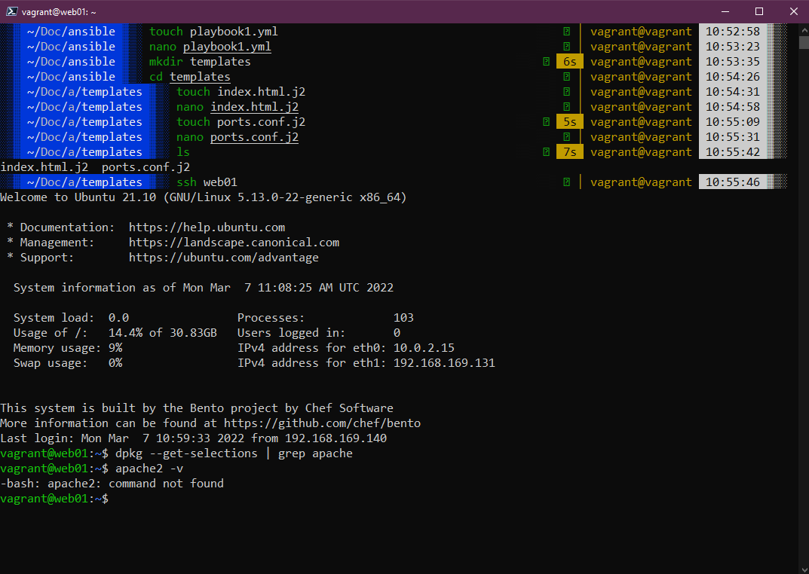

### Playbooks de Ansible

En esta sección vamos a echar un vistazo a la principal razón que yo puedo ver al menos para usar Ansible, me refiero a lo genial que es tomar un solo comando y ejecutarlo en muchos servidores diferentes para realizar tareas simples como reiniciar una larga lista de servidores y evitar la molestia de tener que conectarse a cada uno individualmente.

Pero, ¿qué pasa con tomar un sistema operativo sin configurar y declarar el software y los servicios que queremos que se ejecuten en ese sistema, y asegurarnos de que todos se ejecuten en ese estado deseado?

Aquí es donde entran en juego los playbooks de Ansible. Un playbook nos permite tomar nuestro grupo de servidores y realizar tareas de configuración e instalación en ese grupo.

### Formato de playbook

Playbook > Plays > Tasks

Para aquellos que vienen de un fondo deportivo, es posible que hayan oído el término "playbook" (libro de jugadas). Un playbook le dice al equipo cómo van a jugar, compuesto por varias jugadas y tareas. Si pensamos en las jugadas como las partes del juego o deporte y las tareas están asociadas a cada jugada, podemos tener varias tareas que componen una jugada, y en el playbook podemos tener varias jugadas diferentes.

Estos playbooks se escriben en YAML (YAML ain't markup language). Encontrarás muchas secciones que hemos cubierto hasta ahora, especialmente Contenedores y Kubernetes, que presentan archivos de configuración con formato YAML.

Echemos un vistazo a un playbook simple llamado "playbook.yml".

```Yaml
- name: Simple Play
  hosts: localhost
  connection: local
  tasks:
    - name: Ping me
      ping:
    - name: print os
      debug:
        msg: "{{ ansible_os_family }}"
```
Puedes encontrar el archivo anterior [aquí](days/../Configmgmt/simple_play.yml). Si luego usamos el comando ansible-playbook simple_play.yml, seguiremos los siguientes pasos.


Puedes ver que ocurrió la primera tarea de "recolección de pasos", ¿pero no la activamos o la solicitamos? Este módulo se llama automáticamente en los playbooks para recopilar variables útiles sobre los hosts remotos. [ansible.builtin.setup](https://docs.ansible.com/ansible/latest/collections/ansible/builtin/setup_module.html)

Nuestra segunda tarea fue configurar un ping, no es un ping ICMP, sino un script de Python que devuelve "pong" cuando hay conectividad exitosa con el host remoto o local. [ansible.builtin.ping](https://docs.ansible.com/ansible/latest/collections/ansible/builtin/ping_module.html)

Luego, nuestra tercera o segunda tarea definida (ya que la primera se ejecuta a menos que la desactives) fue imprimir un mensaje que nos dice cuál es nuestro sistema operativo. En esta tarea estamos utilizando condicionales. Podríamos ejecutar este playbook en todos los tipos diferentes de sistemas operativos, y esto devolvería el nombre del sistema operativo. Simplemente estamos mostrando este mensaje para mayor comodidad, pero podríamos agregar una tarea para hacer algo como esto:

```Yaml
tasks:
  - name: "shut down Debian flavoured systems"
    command: /sbin/shutdown -t now
    when: ansible_os_family == "Debian"
```

### Vagrant para configurar nuestro entorno

Vamos a utilizar Vagrant para configurar nuestro entorno de nodos. Mantendré esto en 4 nodos, pero puedes ver que fácilmente podría ser 300 o 3000, y esta es la potencia de Ansible y otras herramientas de administración de configuración para configurar tus servidores.

Puedes encontrar el archivo aquí  ([Vagrantfile](Configmgmt/Vagrantfile))

```Vagrant
Vagrant.configure("2") do |config|
  servers=[
    {
      :hostname => "db01",
      :box => "bento/ubuntu-21.10",
      :ip => "192.168.169.130",
      :ssh_port => '2210'
    },
    {
      :hostname => "web01",
      :box => "bento/ubuntu-21.10",
      :ip => "192.168.169.131",
      :ssh_port => '2211'
    },
    {
      :hostname => "web02",
      :box => "bento/ubuntu-21.10",
      :ip => "192.168.169.132",
      :ssh_port => '2212'
    },
    {
      :hostname => "loadbalancer",
      :box => "bento/ubuntu-21.10",
      :ip => "192.168.169.134",
      :ssh_port => '2213'
    }

  ]

config.vm.base_address = 600

  servers.each do |machine|

    config.vm.define machine[:hostname] do |node|
      node.vm.box = machine[:box]
      node.vm.hostname = machine[:hostname]

      node.vm.network :public_network, bridge: "Intel(R) Ethernet Connection (7) I219-V", ip: machine[:ip]
      node.vm.network "forwarded_port", guest: 22, host: machine[:ssh_port], id: "ssh"

      node.vm.provider :virtualbox do |v|
        v.customize ["modifyvm", :id, "--memory", 2048]
        v.customize ["modifyvm", :id, "--name", machine[:hostname]]
      end
    end
  end

end
```

Utiliza el comando `vagrant up` para iniciar estas máquinas virtuales en VirtualBox. Es posible que puedas agregar más memoria y también puedes definir una dirección `private_network` diferente para cada máquina, pero esto funciona en mi entorno. Recuerda que nuestra máquina de control es el escritorio de Ubuntu que implementamos durante la sección de Linux.

Si tienes limitaciones de recursos, también puedes ejecutar `vagrant up web01 web02` para iniciar solo los servidores web que estamos utilizando aquí.

### Configuración del host de Ansible

Ahora que tenemos nuestro entorno listo, podemos verificar Ansible y, para ello, utilizaremos nuestro escritorio de Ubuntu (también podrías usar cualquier máquina Linux de tu red con acceso a la red a continuación) como nuestro control. También vamos a agregar los nuevos nodos a nuestro grupo en el archivo de hosts de Ansible. Puedes pensar en este archivo como un inventario. Una alternativa a este archivo podría ser otro archivo de inventario que se llame como parte de tu comando de Ansible con '`-i filename`'. Esto podría ser útil en lugar de usar el archivo de hosts, ya que puedes tener archivos diferentes para diferentes entornos, como producción, prueba y puesta en escena. Como estamos utilizando el archivo de hosts predeterminado, no necesitamos especificarlo, ya que este sería el valor predeterminado utilizado.

He agregado lo siguiente al archivo de hosts predeterminado:

```Text
[control]
ansible-control

[proxy]
loadbalancer

[webservers]
web01
web02

[database]
db01

```


Antes de continuar, queremos asegurarnos de que podemos ejecutar un comando en nuestros nodos. Ejecutemos `ansible nodes -m command -a hostname`. Este comando simple probará que tenemos conectividad y nos mostrará los nombres de host.

También ten en cuenta que he agregado estos nodos e IPs a mi nodo de control Ubuntu dentro del archivo `/etc/hosts` para garantizar la conectividad. Es posible que también necesitemos hacer una configuración SSH para cada nodo desde la caja de Ubuntu.

```Text
192.168.169.140 ansible-control
192.168.169.130 db01
192.168.169.131 web01
192.168.169.132 web02
192.168.169.133 loadbalancer
```


En esta etapa, queremos configurar las claves SSH entre nuestro nodo de control y los nodos del servidor. Esto es lo que haremos a continuación. Otra forma podría ser agregar variables en el archivo de hosts para especificar el nombre de usuario y la contraseña. Recomiendo no hacer esto, ya que nunca será una mejor práctica.

Para configurar SSH y compartirlo entre tus nodos, sigue los pasos a continuación. Se te pedirá las contraseñas (`vagrant`) y es posible que debas presionar `y` varias veces para aceptar.

`ssh-keygen`


`ssh-copy-id localhost`


Ahora, si tienes todas tus máquinas virtuales encendidas, puedes ejecutar `ssh-copy-id web01 && ssh-copy-id web02 && ssh-copy-id loadbalancer && ssh-copy-id db01`. Esto te pedirá tu contraseña, en nuestro caso, nuestra contraseña es `vagrant`.

No estoy ejecutando todas mis máquinas virtuales y solo estoy ejecutando los servidores web, así que escribí `ssh-copy-id web01 && ssh-copy-id web02`.


Antes de ejecutar cualquier playbook, me gusta asegurarme de tener conectividad simple con mis grupos, así que he ejecutado `ansible webservers -m ping` para probar la conectividad.


### Nuestro primer playbook "real" de Ansible

Nuestro primer playbook de Ansible va a configurar nuestros servidores web. Los hemos agrupado en nuestro archivo de hosts bajo el grupo [webservers].

Antes de ejecutar nuestro playbook, podemos confirmar que web01 y web02 no tienen Apache instalado. La parte superior de la captura de pantalla a continuación muestra la estructura de carpetas y archivos que he creado dentro de mi controlador de Ansible para ejecutar este playbook. Tenemos el `playbook1.yml`, luego en la carpeta de plantillas tenemos los archivos `index.html.j2` y `ports.conf.j2`. Puedes encontrar estos archivos en la carpeta mencionada anteriormente en el repositorio.

¿SSH a web01 para comprobar si tenemos Apache instalado?



Puedes ver que en la captura de pantalla anterior no tenemos Apache instalado en nuestro web01, así que podemos solucionarlo ejecutando el playbook a continuación.

```Yaml
- hosts: webservers
  become: yes
  vars:
    http_port: 8000
    https_port: 4443
    html_welcome_msg: "Hello 90DaysOfDevOps"
  tasks:
  - name: ensure apache is at the latest version
    apt:
      name: apache2
      state: latest

  - name: write the apache2 ports.conf config file
    template:
      src: templates/ports.conf.j2
      dest: /etc/apache2/ports.conf
    notify:
    - restart apache

  - name: write a basic index.html file
    template:
      src: templates/index.html.j2
      dest: /var/www/html/index.html
    notify:
    - restart apache

  - name: ensure apache is running
    service:
      name: apache2
      state: started

  handlers:
    - name: restart apache
      service:
        name: apache2
        state: restarted
```

Desglosemos el playbook anterior:

- `- hosts: webservers:` esto indica que nuestro grupo en el que se ejecutará este playbook es un grupo llamado webservers.
- `become: yes`: significa que el usuario que ejecuta el playbook se convertirá en root en los sistemas remotos. Se te pedirá la contraseña de root.
- Luego tenemos `vars` y esto define algunas variables de entorno que queremos en todos nuestros servidores web.

A continuación, comenzamos nuestras tareas:

- La tarea 1 es asegurarse de que Apache se ejecute en la última versión.
- La tarea 2 es escribir el archivo de configuración `ports.conf` de Apache desde nuestra fuente encontrada en la carpeta de plantillas.
- La tarea 3 es crear un archivo `index.html` básico.
- La tarea 4 es asegurarse de que Apache esté en ejecución.

Finalmente, tenemos una sección de handlers, [Handlers: Ejecutando operaciones en caso de cambio](https://docs.ansible.com/ansible/latest/user_guide/playbooks_handlers.html).

"A veces, quieres que una tarea se ejecute solo cuando se realiza un cambio en una máquina. Por ejemplo, es posible que desees reiniciar un servicio si una tarea actualiza la configuración de ese servicio, pero no si la configuración no ha cambiado. Ansible utiliza handlers para abordar este caso de uso. Los handlers son tareas que solo se ejecutan cuando se les notifica. Cada handler debe tener un nombre único a nivel global".

En este punto, es posible que estés pensando que hemos implementado 5 máquinas virtuales (incluido nuestro equipo de escritorio Ubuntu, que actúa como nuestro Control de Ansible). Los otros sistemas entrarán en juego durante el resto de esta sección.

### Ejecutando nuestro Playbook

Ahora estamos listos para ejecutar nuestro playbook en nuestros nodos. Para ejecutar nuestro playbook, podemos usar el comando `ansible-playbook playbook1.yml`. Hemos definido los hosts en los que se ejecutará nuestro playbook dentro del playbook y este recorrerá las tareas que hemos definido.

Cuando el comando esté completo, obtendremos una salida que muestra nuestras plays y tareas. Esto puede llevar algún tiempo. Como se puede ver en la imagen de abajo, esto tomó un tiempo para instalar nuestro estado deseado.


Luego, podemos verificar esto al acceder a un nodo y comprobar si tenemos el software instalado en nuestro nodo.


Para redondear esto, como hemos implementado dos servidores web independientes con lo anterior, ahora podemos navegar a las respectivas IPs que hemos definido y obtener nuestro nuevo sitio web.


Vamos a construir sobre este playbook a medida que avanzamos en el resto de esta sección. También me interesa tomar nuestro escritorio Ubuntu y ver si podríamos configurar nuestras aplicaciones y configuraciones usando Ansible, por lo que también podríamos abordar esto. Viste que podemos usar el host local en nuestros comandos, también podemos ejecutar playbooks en nuestro host local, por ejemplo.

Otra cosa a tener en cuenta es que realmente solo estamos trabajando con máquinas virtuales Ubuntu, pero Ansible es agnóstico con respecto a los sistemas de destino. Las alternativas que mencionamos anteriormente para administrar tus sistemas podrían ser servidor por servidor (no escalable cuando tienes un gran número de servidores y también es complicado incluso con 3 nodos). También podemos usar scripts de shell, que cubrimos en la sección de Linux, pero estos nodos son potencialmente diferentes, por lo que sí se puede hacer, pero luego alguien necesita mantener y administrar esos scripts. Ansible es gratuito y facilita mucho las cosas en comparación con tener que utilizar un script especializado.

## Recursos

- [What is Ansible](https://www.youtube.com/watch?v=1id6ERvfozo)
- [Ansible 101 - Episode 1 - Introduction to Ansible](https://www.youtube.com/watch?v=goclfp6a2IQ)
- [NetworkChuck - You need to learn Ansible right now!](https://www.youtube.com/watch?v=5hycyr-8EKs&t=955s)
- [Your complete guide to Ansible](https://www.youtube.com/playlist?list=PLnFWJCugpwfzTlIJ-JtuATD2MBBD7_m3u)
- [Chef vs Puppet vs Ansible vs Saltstack](https://vergaracarmona.es/chef-vs-puppet-vs-ansible-vs-saltstack/)

La última lista de reproducción del anterior listado es de donde provienen gran parte del código e ideas de esta sección, es un recurso excelente con una guía en formato de video.

Nos vemos en el [Día 66](day66.md)
