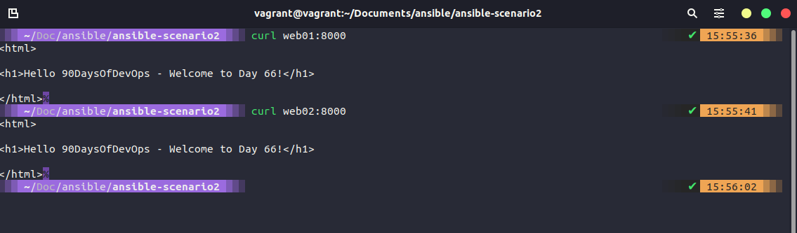

## Ansible Playbooks (Continuación)

En nuestra última sección, comenzamos creando nuestro pequeño laboratorio utilizando un archivo Vagrantfile para implementar 4 máquinas, y utilizamos la máquina Linux que creamos en esa sección como nuestro sistema de control de Ansible.

También ejecutamos algunos escenarios de playbooks y al final teníamos un playbook que convertía nuestros servidores web individuales web01 y web02.


### Manteniendo las cosas ordenadas

Antes de adentrarnos en la automatización y el despliegue, debemos cubrir la capacidad de mantener nuestro playbook limpio y ordenado, y cómo podemos separar nuestras tareas y handlers en subcarpetas.

Vamos a copiar nuestras tareas en sus archivos dentro de una carpeta.


```Yaml
- name: ensure apache is at the latest version
  apt: name=apache2 state=latest

- name: write the apache2 ports.conf config file
  template:
    src=templates/ports.conf.j2
    dest=/etc/apache2/ports.conf
  notify: restart apache

- name: write a basic index.html file
  template:
    src: templates/index.html.j2
    dest: /var/www/html/index.html
  notify:
  - restart apache

- name: ensure apache is running
  service:
    name: apache2
    state: started
```

Y lo mismo para los handlers

```Yaml
- name: restart apache
  service:
    name: apache2
    state: restarted
```

Luego, en nuestro playbook, que ahora se llama playbook2.yml, nos referimos a estos archivos. Todos ellos se pueden encontrar en [ansible-scenario2](Days/../Configmgmt/ansible-scenario2/)

Puedes probar esto en tu máquina de control. Si has copiado los archivos del repositorio, deberías haber notado un cambio en "escribir un archivo "index.html" básico".


Veamos qué cambio simple hice. Usando `curl web01:8000`



Acabamos de organizar nuestro playbook y comenzamos a separar áreas que podrían hacer que un playbook sea muy abrumador a gran escala.

### Roles y Ansible Galaxy

En este momento, hemos implementado 4 máquinas virtuales y hemos configurado 2 de ellas como nuestros servidores web, pero tenemos algunas funciones más específicas, como un servidor de base de datos y un equilibrador de carga o proxy. Para hacer esto y organizar nuestro repositorio, podemos usar roles en Ansible.

Para hacer esto, utilizaremos el comando `ansible-galaxy`, que sirve para gestionar roles de Ansible en repositorios compartidos.


Vamos a utilizar `ansible-galaxy` para crear un rol para Apache2, donde colocaremos nuestras especificaciones para nuestros servidores web.


El comando anterior `ansible-galaxy init roles/apache2` creará la estructura de carpetas que se muestra arriba. Nuestro siguiente paso es mover nuestras tareas y plantillas existentes a las carpetas relevantes en la nueva estructura.


Copiar y pegar es fácil para mover esos archivos, pero también necesitamos hacer un cambio en tasks/main.yml para que apunte a apache2_install.yml.

También necesitamos cambiar nuestro playbook para que haga referencia a nuestro nuevo rol. En playbook1.yml y playbook2.yml, determinamos nuestras tareas y handlers de diferentes maneras, ya que los cambiamos entre las dos versiones. Necesitamos cambiar nuestro playbook para usar este rol de la siguiente manera:

```Yaml
- hosts: webservers
  become: yes
  vars:
    http_port: 8000
    https_port: 4443
    html_welcome_msg: "Hello 90DaysOfDevOps - Welcome to Day 66!"
  roles:
    - apache2
```


Ahora podemos ejecutar nuestro playbook nuevamente, esta vez con el nuevo nombre de playbook `ansible-playbook playbook3.yml`. Notarás la advertencia de depreciación, podemos solucionarlo después.


Ok, a pesar de la advertencia de depreciación, nuestro playbook se ejecutó, pero ahora debemos corregir nuestros métodos. Para hacerlo, he cambiado la opción de inclusión (include) en tasks/main.yml para que ahora sea import_tasks, como se muestra a continuación.


Puedes encontrar estos archivos en [ansible-scenario3](Days/Configmgmt/ansible-scenario3)

También vamos a crear algunos roles más mientras usamos ansible-galaxy, vamos a crear:

- common = para todos nuestros servidores (`ansible-galaxy init roles/common`)
- nginx = para nuestro equilibrador de carga (`ansible-galaxy init roles/nginx`)


Voy a dejarlo aquí y en la próxima sesión, comenzaremos a trabajar en esos otros nodos que hemos implementado pero aún no hemos hecho nada con ellos.

## Recursos

- [What is Ansible](https://www.youtube.com/watch?v=1id6ERvfozo)
- [Ansible 101 - Episode 1 - Introduction to Ansible](https://www.youtube.com/watch?v=goclfp6a2IQ)
- [NetworkChuck - You need to learn Ansible right now!](https://www.youtube.com/watch?v=5hycyr-8EKs&t=955s)
- [Your complete guide to Ansible](https://www.youtube.com/playlist?list=PLnFWJCugpwfzTlIJ-JtuATD2MBBD7_m3u)
- [Chef vs Puppet vs Ansible vs Saltstack](https://vergaracarmona.es/chef-vs-puppet-vs-ansible-vs-saltstack/)

La última lista de reproducción mencionada anteriormente es de donde provienen gran parte del código e ideas de esta sección, es un recurso excelente con una guía en formato de video.

Nos vemos en el [Día 67](day67.md)
