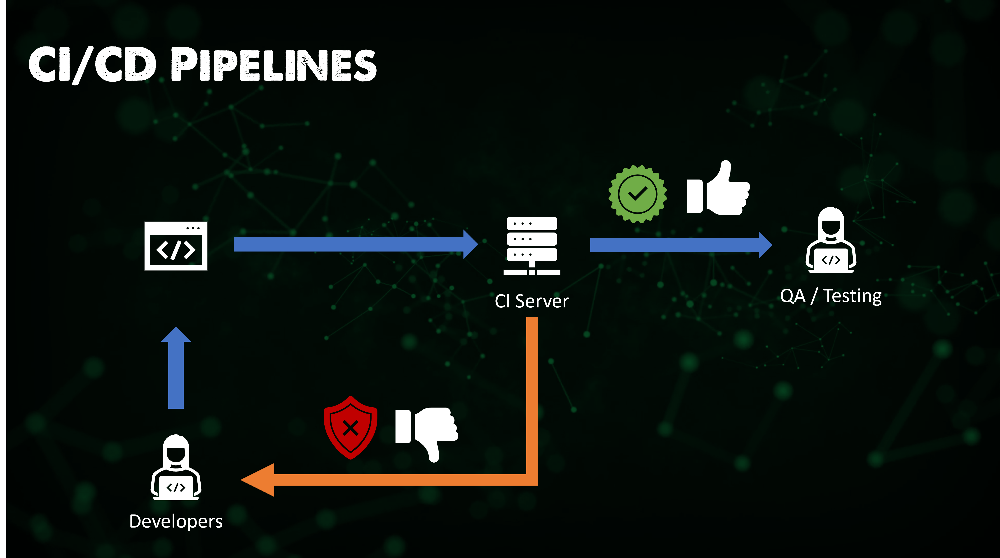

## ¿Qué es Jenkins?

Jenkins es una herramienta de integración continua que permite el desarrollo, prueba e implementación continua de código recién creado.

Existen dos formas de lograr esto: mediante compilaciones nocturnas o desarrollo continuo. La primera opción es que nuestros desarrolladores estén trabajando durante todo el día en sus tareas y, al final del día, envían sus cambios al repositorio de código fuente. Luego, durante la noche, ejecutamos nuestras pruebas unitarias y compilamos el software. Esto podría considerarse como la forma antigua de integrar todo el código.

La otra opción y la preferida es que nuestros desarrolladores sigan enviando sus cambios al código fuente, y cuando se haya realizado ese envío de código, se inicia un proceso de compilación de forma continua.

Los métodos anteriores significan que, con desarrolladores distribuidos en todo el mundo, no tenemos un momento fijo cada día en el que tengamos que dejar de enviar nuestros cambios de código. Aquí es donde Jenkins entra en juego como el servidor de CI para controlar esas pruebas y procesos de compilación.

Sé que estamos hablando de Jenkins aquí, pero también quiero agregar algunos más para investigar más adelante y entender por qué considero que Jenkins es el más popular en general, qué pueden hacer los demás en comparación con Jenkins.

- **TravisCI:** un servicio de integración continua alojado y distribuido utilizado para compilar y probar proyectos de software alojados en GitHub.
- **Bamboo:** puede ejecutar múltiples compilaciones en paralelo para una compilación más rápida, tiene funcionalidad integrada para conectarse a repositorios y ofrece tareas de compilación para Ant y Maven.
- **Buildbot:** es un marco de trabajo de código abierto para automatizar los procesos de compilación, prueba y lanzamiento de software. Está escrito en Python y admite la ejecución distribuida y en paralelo de trabajos en múltiples plataformas.
- **Apache Gump**: específico para proyectos de Java, diseñado para compilar y probar esos proyectos de Java cada noche. Asegura que todos los proyectos sean compatibles tanto a nivel de API como de funcionalidad.

Debido a que ahora nos vamos a centrar en Jenkins, es importante destacar que Jenkins también es de código abierto, al igual que todas las herramientas mencionadas anteriormente, y es un servidor de automatización escrito en Java. Se utiliza para automatizar el proceso de desarrollo de software mediante la integración continua y facilita la entrega continua.

### Características de Jenkins

Como probablemente puedas esperar, Jenkins tiene muchas características que abarcan muchas áreas.

**Fácil instalación**: Jenkins es un programa basado en Java autocontenido listo para ejecutarse con paquetes para los sistemas operativos Windows, macOS y Linux.

**Fácil configuración**: configuración sencilla a través de una interfaz web que incluye verificaciones de errores y ayuda incorporada.

**Complementos**: hay muchos complementos disponibles en el Centro de actualizaciones e integran muchas herramientas en la cadena de herramientas de CI / CD.

**Extensible**: además de los complementos disponibles, Jenkins puede ser ampliado mediante esa arquitectura de complementos, lo que brinda opciones casi infinitas para su uso.

**Distribuido**: Jenkins distribuye fácilmente el trabajo en múltiples máquinas, lo que ayuda a acelerar las compilaciones, pruebas e implementaciones en varias plataformas.

### Pipeline de Jenkins

Seguramente has visto este pipeline, pero se ha utilizado de manera más general y no hemos hablado de herramientas específicas.

Vas a enviar código a Jenkins, que construirá tu aplicación con todas las pruebas automatizadas, y luego lanzará e implementará ese código cuando se complete cada paso. Jenkins es lo que permite la automatización de este proceso.

### Arquitectura de Jenkins

En primer lugar, y sin querer reinventar la rueda, la [Documentación de Jenkins](https://www.jenkins.io/doc/developer/architecture/) siempre es el lugar para comenzar, pero también voy a compartir aquí mis notas y aprendizajes.

Jenkins se puede instalar en muchos sistemas operativos diferentes, como Windows, Linux y macOS, pero también se puede implementar como un contenedor de Docker y dentro de Kubernetes. [Instalación de Jenkins](https://www.jenkins.io/doc/book/installing/)

Conforme avancemos, es posible que veamos cómo instalar Jenkins en un clúster de minikube para simular la implementación en Kubernetes. Sin embargo, esto dependerá de los escenarios que preparemos en el resto de la sección.

Ahora vamos a desglosar la siguiente imagen.

Paso 1: Los desarrolladores envían cambios al repositorio de código fuente.

Paso 2: Jenkins verifica el repositorio a intervalos regulares y extrae cualquier código nuevo.

Paso 3: Un servidor de compilación compila el código en un ejecutable. En este ejemplo, utilizamos Maven como servidor de compilación bien conocido. Otro tema para cubrir.

Paso 4: Si la compilación falla, se envía retroalimentación a los desarrolladores.

Paso 5: Luego, Jenkins implementa la aplicación compilada en el servidor de pruebas. En este ejemplo, utilizamos Selenium como servidor de pruebas bien conocido. Otro tema para cubrir.

Paso 6: Si las pruebas fallan, se envía retroalimentación a los desarrolladores.

Paso 7: Si las pruebas son exitosas, podemos implementar en producción.

Este ciclo es continuo, lo que permite actualizar las aplicaciones en minutos en lugar de horas, días, meses y años.

Hay mucho más en la arquitectura de Jenkins si lo necesitas. Tiene una capacidad de maestro-esclavo que permite que un maestro distribuya las tareas al entorno de esclavos de Jenkins.

Por si te interesa, como Jenkins es de código abierto, habrá muchas empresas que requieren soporte. CloudBees es la versión empresarial de Jenkins que brinda soporte y posiblemente otras funcionalidades para los clientes empresariales que pagan.

Un ejemplo de esto en un cliente es Bosch. Puedes verlo en el [estudio de caso de Bosch](https://assets.ctfassets.net/vtn4rfaw6n2j/case-study-boschpdf/40a0b23c61992ed3ee414ae0a55b6777/case-study-bosch.pdf).

Voy a buscar un ejemplo paso a paso de una aplicación que podamos utilizar para recorrer el proceso con Jenkins y también usar otras herramientas.

## Recursos

- [Jenkins is the way to build, test, deploy](https://youtu.be/_MXtbjwsz3A)
- [Jenkins.io](https://www.jenkins.io/)
- [ArgoCD](https://argo-cd.readthedocs.io/en/stable/)
- [ArgoCD Tutorial for Beginners](https://www.youtube.com/watch?v=MeU5_k9ssrs)
- [What is Jenkins?](https://www.youtube.com/watch?v=LFDrDnKPOTg)
- [Complete Jenkins Tutorial](https://www.youtube.com/watch?v=nCKxl7Q_20I&t=3s)
- [GitHub Actions](https://www.youtube.com/watch?v=R8_veQiYBjI)
- [GitHub Actions CI/CD](https://www.youtube.com/watch?v=mFFXuXjVgkU)

Nos vemos en el [Día 72](day72.md)
