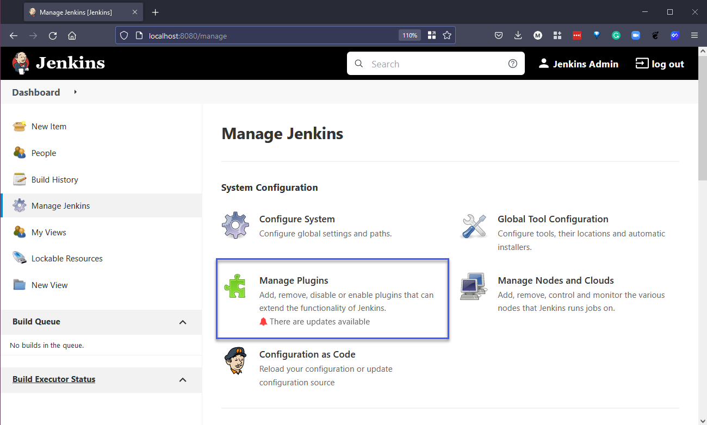
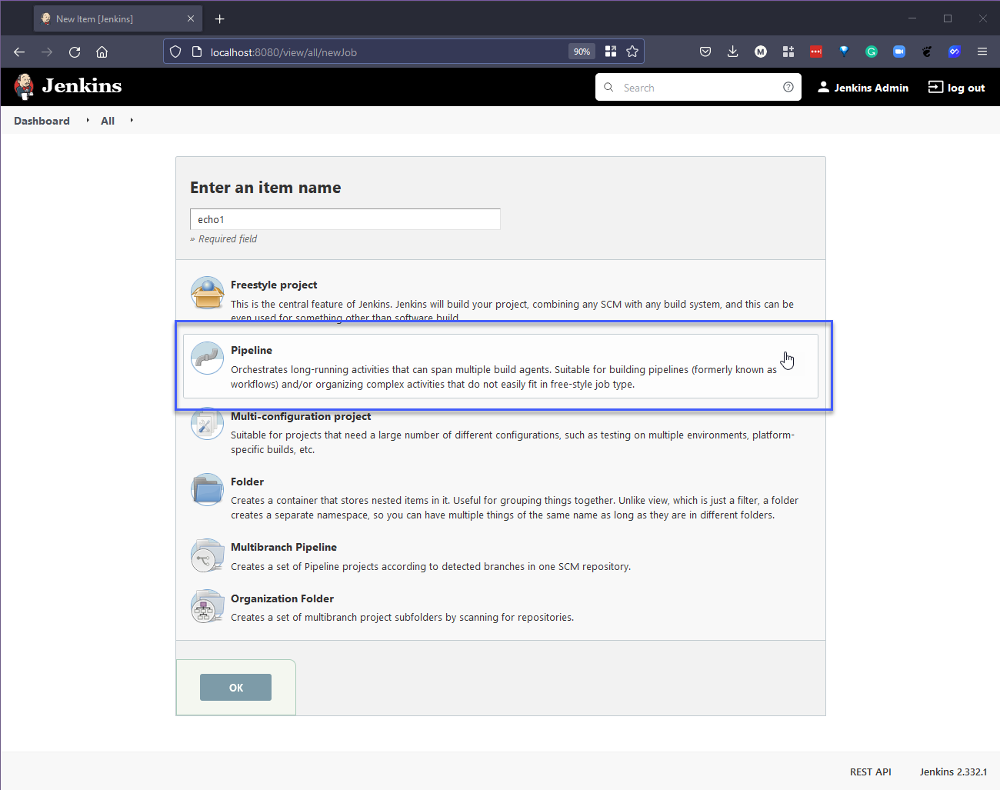

## Aprendiendo Jenkins en la práctica

El plan de hoy es practicar con Jenkins y hacer algo como parte de nuestro flujo de integración continua (CI), revisando algunos ejemplos de bases de código que podemos utilizar.

### ¿Qué es un pipeline?

Antes de comenzar, es importante entender qué es un pipeline en el contexto de la integración continua (CI). Ya cubrimos esto en la sesión anterior con la siguiente imagen.


Queremos automatizar los procesos o pasos anteriores para obtener un resultado, lo cual implica tener una aplicación implementada que luego podamos enviar a nuestros clientes y usuarios finales.

Este proceso automatizado nos permite tener control de versiones hasta llegar a nuestros usuarios y clientes. Cada cambio, mejora de características, corrección de errores, etc., pasa por este proceso automatizado para confirmar que todo está bien, con la menor intervención manual posible, y asegurarnos de que nuestro código sea bueno.

Este proceso implica construir el software de manera confiable y repetible, y avanzar con el software construido (llamado "build") a través de múltiples etapas de prueba e implementación.

Un pipeline de Jenkins se define en un archivo de texto llamado Jenkinsfile, que debe ser incluido en un repositorio de control de código fuente. También se conoce como "Pipeline as code" (pipeline como código), y se puede comparar con "Infrastructure as code" (infraestructura como código), que cubrimos hace algunas semanas.

[Definición de Pipeline de Jenkins](https://www.jenkins.io/doc/book/pipeline/#ji-toolbar)

### Implementación de Jenkins

Me divertí implementando Jenkins. Notarás en la [documentación](https://www.jenkins.io/doc/book/installing/) que hay muchas opciones para instalar Jenkins.

Dado que tengo minikube a mano y lo hemos usado varias veces, quería usarlo también para esta tarea (¡y además es gratuito!). Aunque los pasos proporcionados en la [Instalación en Kubernetes](https://www.jenkins.io/doc/book/installing/kubernetes/) me llevaron a un callejón sin salida y no logré poner todo en funcionamiento, puedes comparar ambos métodos cuando documente los pasos aquí.

El primer paso es iniciar nuestro clúster de minikube con el comando `minikube start`.


He agregado una carpeta con toda la configuración YAML y los valores que se pueden encontrar [aquí](CICD/Jenkins). Ahora que tenemos nuestro clúster, podemos ejecutar lo siguiente para crear nuestro espacio de nombres de Jenkins: `kubectl create -f jenkins-namespace.yml`


Utilizaremos Helm para implementar Jenkins en nuestro clúster, tal como lo cubrimos en la sección de Kubernetes. Primero necesitamos agregar el repositorio de Helm de jenkinsci con el comando `helm repo add jenkinsci https://charts.jenkins.io`, luego actualizamos nuestros charts con `helm repo update`.


La idea detrás de Jenkins es que guardará el estado de sus pipelines. Puedes ejecutar la instalación de Helm anterior sin persistencia, pero si esos pods se reinician, cambian o modifican, se perderán todas las pipelines o configuraciones que hayas realizado. Crearemos un volumen para la persistencia utilizando el archivo jenkins-volume.yml y el comando `kubectl apply -f jenkins-volume.yml`.


También necesitamos una cuenta de servicio que podemos crear utilizando el archivo YAML y el siguiente comando: `kubectl apply -f jenkins-sa.yml`


En este punto, estamos listos para implementar el chart utilizando Helm. Primero definiremos nuestro chart utilizando `chart=jenkinsci/jenkins` , y luego lo implementaremos con el siguiente comando, donde jenkins-values.yml contiene la persistencia y las cuentas de servicio que implementamos anteriormente en nuestro clúster: `helm install jenkins -n jenkins -f jenkins-values.yml $chart`


En este punto, nuestros pods descargarán la imagen, pero el pod no tendrá acceso al almacenamiento, por lo que no se puede iniciar ninguna configuración para poner en funcionamiento Jenkins.

Aquí es donde la documentación no me ayudó mucho para entender lo que necesitaba suceder. Pero podemos ver que no tenemos permiso para iniciar nuestra instalación de Jenkins.


Para solucionar lo anterior o resolverlo, debemos asegurarnos de proporcionar acceso o los permisos adecuados para que nuestros pods de Jenkins puedan escribir en la ubicación que hemos sugerido. Podemos hacer esto utilizando el comando `minikube ssh` , que nos llevará al contenedor de Docker de minikube en el que estamos ejecutando, y luego utilizando `sudo chown -R 1000:1000 /data/jenkins-volume`, podemos asegurarnos de que tengamos permisos establecidos en nuestro volumen de datos.


El proceso anterior debería solucionar los pods, pero si no, puedes forzar la actualización de los pods con el comando `kubectl delete pod jenkins-0 -n jenkins`. En este punto, deberías tener 2/2 pods en ejecución llamados jenkins-0.


Ahora necesitamos nuestra contraseña de administrador, que podemos obtener con el siguiente comando: `kubectl exec --namespace jenkins -it svc/jenkins -c jenkins -- /bin/cat /run/secrets/chart-admin-password && echo`


Ahora abre una nueva terminal, ya que vamos a utilizar el comando `port-forward` para permitirnos acceder desde nuestro equipo de trabajo. Ejecuta el siguiente comando:  `kubectl --namespace jenkins port-forward svc/jenkins 8080:8080`


Ahora deberíamos poder abrir un navegador y acceder a `http://localhost:8080`, autenticándonos con el nombre de usuario "admin" y la contraseña que obtuvimos en el paso anterior.


Cuando nos hayamos autenticado, nuestra página de bienvenida de Jenkins debería lucir así:


Desde aquí, te sugiero ir a "Manage Jenkins" y verás "Manage Plugins" que tendrá algunas actualizaciones disponibles. Selecciona todos esos plugins y elige "Download now and install after restart" (Descargar ahora e instalar después de reiniciar).



Si deseas ir aún más lejos y automatizar la implementación de Jenkins utilizando un script de shell, este gran repositorio fue compartido conmigo en Twitter: [mehyedes/nodejs-k8s](https://github.com/mehyedes/nodejs-k8s/blob/main/docs/automated-setup.md)

### Jenkinsfile

Ahora que hemos implementado Jenkins en nuestro clúster de Kubernetes, podemos regresar y pensar en este Jenkinsfile.

Cada Jenkinsfile probablemente comenzará así, que es donde definirías los pasos de tu canalización. En este caso, tienes Build > Test > Deploy. Pero no estamos haciendo nada más que usar el comando `echo` para mostrar las etapas específicas.

```
Jenkinsfile (Declarative Pipeline)

pipeline {
    agent any

    stages {
        stage('Build') {
            steps {
                echo 'Building..'
            }
        }
        stage('Test') {
            steps {
                echo 'Testing..'
            }
        }
        stage('Deploy') {
            steps {
                echo 'Deploying....'
            }
        }
    }
}
```

En nuestro panel de control de Jenkins, selecciona "New Item" (Nuevo elemento), dale un nombre al elemento, yo usaré "echo1" y sugeriré que se trata de una Pipeline.



Haz clic en "Ok" y luego verás las pestañas (General, Build Triggers, Advanced Project Options y Pipeline). Para una prueba sencilla, solo nos interesa Pipeline. Bajo Pipeline, puedes agregar un script. Copiemos y peguemos el script anterior en el cuadro.

Como mencionamos anteriormente, esto no hará mucho, pero nos mostrará las etapas de nuestra Build > Test > Deploy.


Haz clic en "Save" (Guardar). Ahora podemos ejecutar nuestra compilación usando el botón "build now" resaltado a continuación.


También deberíamos abrir una terminal y ejecutar `kubectl get pods -n jenkins` para ver qué sucede allí.


Bien, cosas muy simples, pero ahora podemos ver que nuestra implementación e instalación de Jenkins funcionan correctamente y podemos comenzar a ver los bloques de construcción de la canalización de CI aquí.

En la próxima sección, construiremos una Jenkins Pipeline.

## Recursos

- [Jenkins is the way to build, test, deploy](https://youtu.be/_MXtbjwsz3A)
- [Jenkins.io](https://www.jenkins.io/)
- [ArgoCD](https://argo-cd.readthedocs.io/en/stable/)
- [ArgoCD Tutorial for Beginners](https://www.youtube.com/watch?v=MeU5_k9ssrs)
- [What is Jenkins?](https://www.youtube.com/watch?v=LFDrDnKPOTg)
- [Complete Jenkins Tutorial](https://www.youtube.com/watch?v=nCKxl7Q_20I&t=3s)
- [GitHub Actions](https://www.youtube.com/watch?v=R8_veQiYBjI)
- [GitHub Actions CI/CD](https://www.youtube.com/watch?v=mFFXuXjVgkU)

Nos vemos en el [Día 73](day73.md)
