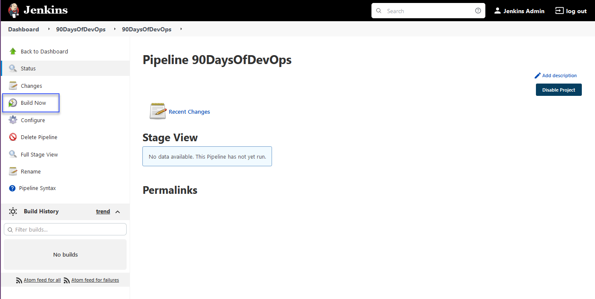

## Construyendo una canalización de Jenkins

En la última sección, implementamos Jenkins en nuestro clúster de Minikube y configuramos una canalización muy básica de Jenkins, que en realidad no hacía mucho más que mostrar las etapas de una canalización.

También es posible que hayas visto que hay algunos scripts de ejemplo disponibles para ejecutar en la creación de la canalización de Jenkins.


El primer script de demostración es "Declarative (Kubernetes)" y puedes ver las etapas a continuación.

```Yaml
// Uses Declarative syntax to run commands inside a container.
pipeline {
    agent {
        kubernetes {
            // Rather than inline YAML, in a multibranch Pipeline you could use: yamlFile 'jenkins-pod.yaml'
            // Or, to avoid YAML:
            // containerTemplate {
            //     name 'shell'
            //     image 'ubuntu'
            //     command 'sleep'
            //     args 'infinity'
            // }
            yaml '''
apiVersion: v1
kind: Pod
spec:
  containers:
  - name: shell
    image: ubuntu
    command:
    - sleep
    args:
    - infinity
'''
            // Can also wrap individual steps:
            // container('shell') {
            //     sh 'hostname'
            // }
            defaultContainer 'shell'
        }
    }
    stages {
        stage('Main') {
            steps {
                sh 'hostname'
            }
        }
    }
}
```

A continuación, puedes ver el resultado de lo que sucede cuando se ejecuta esta canalización.


### Creación del trabajo

#### Objetivos

- Crear una aplicación simple y almacenarla en un repositorio público de GitHub:  [https://github.com/scriptcamp/kubernetes-kaniko.git](https://github.com/scriptcamp/kubernetes-kaniko.git)

- Usar Jenkins para construir nuestra imagen de contenedor Docker y enviarla a Docker Hub (para esto, usaremos un repositorio privado).

Para lograr esto en nuestro clúster de Kubernetes que se ejecuta en Minikube o usando Minikube, necesitamos utilizar algo llamado [Kaniko](https://github.com/GoogleContainerTools/kaniko#running-kaniko-in-a-kubernetes-cluster). Aunque si estás utilizando Jenkins en un clúster de Kubernetes real o lo estás ejecutando en un servidor, entonces puedes especificar un agente que te permitirá ejecutar los comandos de construcción de Docker y cargarlos en DockerHub.

Con lo anterior en mente, también vamos a implementar un secreto en Kubernetes con nuestras credenciales de GitHub.

```Shell
kubectl create secret docker-registry dockercred \
    --docker-server=https://index.docker.io/v1/ \
    --docker-username=<dockerhub-username> \
    --docker-password=<dockerhub-password>\
    --docker-email=<dockerhub-email>
```

Quiero compartir otro gran recurso de [DevOpsCube.com](https://devopscube.com/build-docker-image-kubernetes-pod/) que repasa gran parte de lo que vamos a cubrir aquí.

### Agregar credenciales a Jenkins

Sin embargo, si estás en un sistema de Jenkins diferente al nuestro, es probable que desees definir tus credenciales dentro de Jenkins y luego usarlas varias veces en tus canalizaciones y configuraciones. Podemos hacer referencia a estas credenciales en las canalizaciones utilizando el ID que determinamos al crearlas. Ya he creado una entrada de usuario para DockerHub y GitHub.

En primer lugar, selecciona "Manage Jenkins" y luego "Manage Credentials".


Verás en el centro de la página, Stores scoped to Jenkins, haz clic en Jenkins aquí.


A continuación, selecciona Global Credentials (Unrestricted).


Luego, en la parte superior izquierda, verás "Add Credentials".


Completa los detalles de tu cuenta y luego selecciona OK. Recuerda que el ID es al que te referirás cuando quieras llamar a esta credencial. Mi consejo también es que utilices un acceso con token específico en lugar de contraseñas.


Para GitHub, deberías usar un [Personal Access Token](https://vzilla.co.uk/vzilla-blog/creating-updating-your-github-personal-access-token)

No encontré muy intuitivo el proceso para crear estas cuentas, así que aunque no las estemos utilizando, quería compartir el proceso ya que no está claro en la interfaz de usuario.

### Construcción de la canalización

Hemos implementado nuestras credenciales de DockerHub como un secreto en nuestro clúster de Kubernetes, el cual llamaremos para implementar nuestro despliegue de Docker en la etapa de DockerHub de nuestra canalización.

El script de la canalización es el siguiente, esto a su vez podría convertirse en nuestro Jenkinsfile ubicado en nuestro repositorio de GitHub, que también puedes ver que se enumera en la etapa "Get the project" de la canalización.

```Yaml
podTemplate(yaml: '''
    apiVersion: v1
    kind: Pod
    spec:
      containers:
      - name: maven
        image: maven:3.8.1-jdk-8
        command:
        - sleep
        args:
        - 99d
      - name: kaniko
        image: gcr.io/kaniko-project/executor:debug
        command:
        - sleep
        args:
        - 9999999
        volumeMounts:
        - name: kaniko-secret
          mountPath: /kaniko/.docker
      restartPolicy: Never
      volumes:
      - name: kaniko-secret
        secret:
            secretName: dockercred
            items:
            - key: .dockerconfigjson
              path: config.json
''') {
  node(POD_LABEL) {
    stage('Get the project') {
      git url: 'https://github.com/scriptcamp/kubernetes-kaniko.git', branch: 'main'
      container('maven') {
        stage('Test the project') {
          sh '''
          echo pwd
          '''
        }
      }
    }

    stage('Build & Test the Docker Image') {
      container('kaniko') {
        stage('Deploy to DockerHub') {
          sh '''
            /kaniko/executor --context `pwd` --destination michaelcade1/helloworld:latest
          '''
        }
      }
    }

  }
}
```

Para iniciar las cosas en el panel de Jenkins, debemos seleccionar "New Item".


A continuación, vamos a darle un nombre a nuestro elemento, seleccionar "Pipeline" y luego hacer clic en "OK".


No vamos a seleccionar ninguna de las opciones generales o desencadenadores de construcción, pero puedes probar con ellas, ya que hay algunas programaciones e otras configuraciones interesantes que podrían ser útiles.


Solo estamos interesados en la pestaña "Pipeline" al final.


En la definición de la canalización, vamos a copiar y pegar el script de la canalización que se muestra arriba en la sección de Script y hacer clic en Guardar.


A continuación, seleccionaremos la opción "Build Now" en el lado izquierdo de la página.



Debes esperar un corto período de tiempo, menos de un minuto, y deberías ver en el estado las etapas que definimos anteriormente en nuestro script.


Lo más importante es que si nos dirigimos a DockerHub, verifiquemos que tenemos una nueva compilación.


En general, llevó un tiempo descubrirlo, pero quería seguir adelante para ponerlo en práctica y trabajar en un escenario que cualquiera pueda seguir utilizando Minikube y con acceso a GitHub y DockerHub.

El repositorio de DockerHub que utilicé para esta demostración era privado. Pero en la siguiente sección, quiero avanzar en algunas de estas etapas y hacer que hagan algo en lugar de simplemente imprimir pwd y ejecutar algunas pruebas y etapas de compilación.

## Recursos

- [Jenkins is the way to build, test, deploy](https://youtu.be/_MXtbjwsz3A)
- [Jenkins.io](https://www.jenkins.io/)
- [ArgoCD](https://argo-cd.readthedocs.io/en/stable/)
- [ArgoCD Tutorial for Beginners](https://www.youtube.com/watch?v=MeU5_k9ssrs)
- [What is Jenkins?](https://www.youtube.com/watch?v=LFDrDnKPOTg)
- [Complete Jenkins Tutorial](https://www.youtube.com/watch?v=nCKxl7Q_20I&t=3s)
- [GitHub Actions](https://www.youtube.com/watch?v=R8_veQiYBjI)
- [GitHub Actions CI/CD](https://www.youtube.com/watch?v=mFFXuXjVgkU)

Nos vemos en el [Día 74](day74.md)
