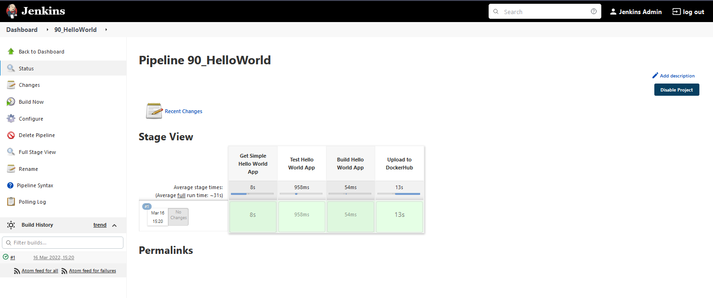

# Hello World - Jenkinsfile App Pipeline

En la sección anterior, creamos una canalización simple en Jenkins que enviaba nuestra imagen de Docker desde nuestro Dockerfile en un repositorio público de GitHub a nuestro repositorio privado de DockerHub.

En esta sección, queremos llevar esto un paso más allá y lograr lo siguiente con nuestra aplicación simple.

## Objetivo

- Dockerfile (Hola Mundo)
- Jenkinsfile
- Canalización de Jenkins para activarse cuando se actualice el repositorio de GitHub
- Utilizar el repositorio de GitHub como fuente.
- Ejecutar etapas de Clonar/Obtener Repositorio, Compilar, Probar, Desplegar
- Desplegar en DockerHub con números de versión incrementales
- Meta de estiramiento para implementar en nuestro clúster de Kubernetes (esto implicará otro trabajo y un repositorio de manifiestos que use credenciales de GitHub)

### Paso Uno

Tenemos nuestro [repositorio de GitHub](https://github.com/MichaelCade/Jenkins-HelloWorld). Actualmente contiene nuestro Dockerfile y nuestro index.html.

Con lo anterior, esto es lo que estábamos utilizando como nuestra fuente en nuestra canalización. Ahora queremos agregar ese script de la canalización de Jenkins también a nuestro repositorio de GitHub.

Ahora, en nuestro panel de Jenkins, vamos a crear una nueva canalización, pero en lugar de pegar nuestro script, vamos a usar "Pipeline script from SCM". Luego, vamos a utilizar las opciones de configuración que se muestran a continuación.

A modo de referencia, vamos a utilizar `https://github.com/MichaelCade/Jenkins-HelloWorld.git` como la URL del repositorio.

En este punto, podríamos guardar y aplicar, y luego podríamos ejecutar manualmente nuestra canalización, construyendo nuestra nueva imagen de Docker que se cargará en nuestro repositorio de DockerHub.

Sin embargo, también quiero asegurarme de establecer un programa que, cada vez que se cambie nuestro repositorio o nuestro código fuente, se active una construcción. Podríamos usar webhooks o podríamos usar una extracción programada.

Esto es una consideración importante, porque si estás utilizando recursos costosos en la nube para mantener tu canalización y tienes muchos cambios en tu repositorio de código, incurrirás en muchos costos. Sabemos que este es un entorno de demostración, por eso estoy utilizando la opción "poll scm". (Además, creo que al usar Minikube no tengo la capacidad de utilizar webhooks).

Una cosa que he cambiado desde la sesión de ayer es que ahora quiero cargar mi imagen en un repositorio público, que en este caso sería michaelcade1/90DaysOfDevOps. Mi Jenkinsfile ya tiene este cambio. Y de las secciones anteriores, he eliminado cualquier imagen de contenedor de demostración existente.

Retrocediendo aquí, creamos nuestra canalización y luego, como se mostró anteriormente, agregamos nuestra configuración.

En este momento, nuestra canalización nunca se ha ejecutado y la vista de etapas se verá algo como esto.

Ahora vamos a desencadenar el botón "Build Now" y nuestra vista de etapas mostrará nuestras etapas.

Si luego vamos a nuestro repositorio de DockerHub, deberíamos tener 2 nuevas imágenes de Docker. Deberíamos tener un ID de compilación 1 y un latest porque por cada compilación que creamos en función de "Cargar en DockerHub" enviamos una versión utilizando la variable de entorno Jenkins Build_ID y también emitimos un latest.

Vamos a hacer una actualización en nuestro archivo index.html en nuestro repositorio de GitHub, como se muestra a continuación. Te dejo que averigües qué decía la versión 1 del index.html.

Si volvemos a Jenkins y seleccionamos "Build Now" nuevamente, veremos si nuestra compilación #2 es exitosa.

Luego, echamos un vistazo rápido a DockerHub, y podemos ver que tenemos nuestra versión etiquetada 2 y nuestra etiqueta latest.

Es importante tener en cuenta que he agregado a mi clúster de Kubernetes un secreto que me permite acceder y autenticarme para enviar mis compilaciones de Docker a DockerHub. Si estás siguiendo estos pasos, debes repetir este proceso para tu cuenta y también hacer un cambio en el Jenkinsfile asociado con mi repositorio y cuenta.

## Recursos

- [Jenkins is the way to build, test, deploy](https://youtu.be/_MXtbjwsz3A)
- [Jenkins.io](https://www.jenkins.io/)
- [ArgoCD](https://argo-cd.readthedocs.io/en/stable/)
- [ArgoCD Tutorial for Beginners](https://www.youtube.com/watch?v=MeU5_k9ssrs)
- [What is Jenkins?](https://www.youtube.com/watch?v=LFDrDnKPOTg)
- [Complete Jenkins Tutorial](https://www.youtube.com/watch?v=nCKxl7Q_20I&t=3s)
- [GitHub Actions](https://www.youtube.com/watch?v=R8_veQiYBjI)
- [GitHub Actions CI/CD](https://www.youtube.com/watch?v=mFFXuXjVgkU)

Nos vemos en el [Día 75](day75.md)
