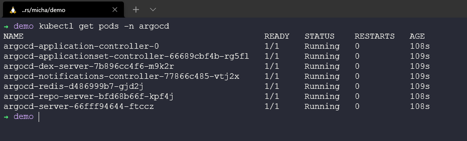

## Descripción general de ArgoCD

"Argo CD es una herramienta declarativa de entrega continua basada en GitOps para Kubernetes".

Aquí, el control de versiones es clave. ¿Alguna vez has realizado un cambio en tu entorno sobre la marcha y no tienes recuerdo de ese cambio, pero como las luces están encendidas y todo está en verde, sigues adelante? ¿Alguna vez has hecho un cambio y has roto todo o parte de todo? Es posible que hayas sabido que realizaste el cambio y que puedes revertir rápidamente ese cambio, ese script defectuoso o error ortográfico. Ahora, ¿has hecho esto a gran escala y tal vez no hayas sido tú o tal vez no se haya encontrado de inmediato, y ahora el negocio está sufriendo? Por lo tanto, el control de versiones es importante. No solo eso, sino que "las definiciones de aplicaciones, configuraciones y entornos deben ser declarativos y tener control de versiones". Además de esto (que proviene de ArgoCD), también mencionan que "la implementación de aplicaciones y la gestión del ciclo de vida deben ser automatizadas, auditables y fáciles de entender".

Desde un fondo de operaciones, pero habiendo experimentado mucho con la infraestructura como código, este es el siguiente paso para asegurarse de que todas esas cosas buenas se manejen a lo largo del camino con flujos de trabajo de implementación/entrega continua.

[¿Qué es ArgoCD?](https://argo-cd.readthedocs.io/en/stable/)

### Implementando ArgoCD

Vamos a utilizar nuestro confiable clúster local de Kubernetes minikube nuevamente para esta implementación.

```Shell
kubectl create namespace argocd
kubectl apply -n argocd -f https://raw.githubusercontent.com/argoproj/argo-cd/stable/manifests/install.yaml
```


Asegúrate de que todos los pods de ArgoCD estén activos y en ejecución con `kubectl get pods -n argocd`



Además, verifiquemos todo lo que implementamos en el namespace con `kubectl get all -n argocd`


Cuando todo esto se vea bien, debemos considerar acceder a esto a través del reenvío de puertos. Usa el comando `kubectl port-forward svc/argocd-server -n argocd 8080:443` en una nueva terminal.

Luego abre un nuevo navegador web y dirígete a `https://localhost:8080`


Para iniciar sesión, necesitarás un nombre de usuario admin y luego obtén tu contraseña creada utilizando el comando `kubectl -n argocd get secret argocd-initial-admin-secret -o jsonpath="{.data.password}" | base64 -d && echo`


Una vez que hayas iniciado sesión, tendrás tu lienzo de CD en blanco.


### Implementando nuestra aplicación

Ahora que tenemos ArgoCD en funcionamiento, podemos comenzar a usarlo para implementar nuestras aplicaciones desde nuestros repositorios de Git, así como también Helm.

La aplicación que quiero implementar es Pac-Man, sí, has oído bien, el famoso juego y algo que uso en muchas demostraciones cuando se trata de gestión de datos, esta no será la última vez que veamos a [Pac-Man](https://github.com/MichaelCade/pacman-tanzu.git).

Puedes encontrar el repositorio de Pac-Man aquí.

En lugar de pasar por cada paso utilizando capturas de pantalla, pensé que sería más fácil crear un video tutorial que cubra los pasos tomados para la implementación de esta aplicación en particular.

[Demo de ArgoCD - 90DaysOfDevOps](https://www.youtube.com/watch?v=w6J413_j0hA)

Nota: Durante el video, hay un servicio que nunca se satisface porque la salud de la aplicación es "healthy". Esto se debe a que el tipo de balanceador de carga establecido para el servicio Pacman está pendiente. En Minikube, no tenemos un balanceador de carga configurado. Si deseas probar esto, puedes cambiar el YAML del servicio a ClusterIP y utilizar el reenvío de puertos para jugar al juego.

Esto concluye la sección de canalizaciones de CI/CD. Siento que hay mucho enfoque en esta área en la industria en este momento, y también escucharás términos como GitOps relacionados con las metodologías utilizadas en CI/CD en general.

La siguiente sección en la que nos adentraremos se trata de la Observabilidad, otro concepto o área que no es nueva, pero que es cada vez más importante a medida que miramos nuestros entornos de manera diferente.

## Recursos

- [Jenkins is the way to build, test, deploy](https://youtu.be/_MXtbjwsz3A)
- [Jenkins.io](https://www.jenkins.io/)
- [ArgoCD](https://argo-cd.readthedocs.io/en/stable/)
- [ArgoCD Tutorial for Beginners](https://www.youtube.com/watch?v=MeU5_k9ssrs)
- [What is Jenkins?](https://www.youtube.com/watch?v=LFDrDnKPOTg)
- [Complete Jenkins Tutorial](https://www.youtube.com/watch?v=nCKxl7Q_20I&t=3s)
- [GitHub Actions](https://www.youtube.com/watch?v=R8_veQiYBjI)
- [GitHub Actions CI/CD](https://www.youtube.com/watch?v=mFFXuXjVgkU)

Nos vemos en el [Día 77](day77.md)
