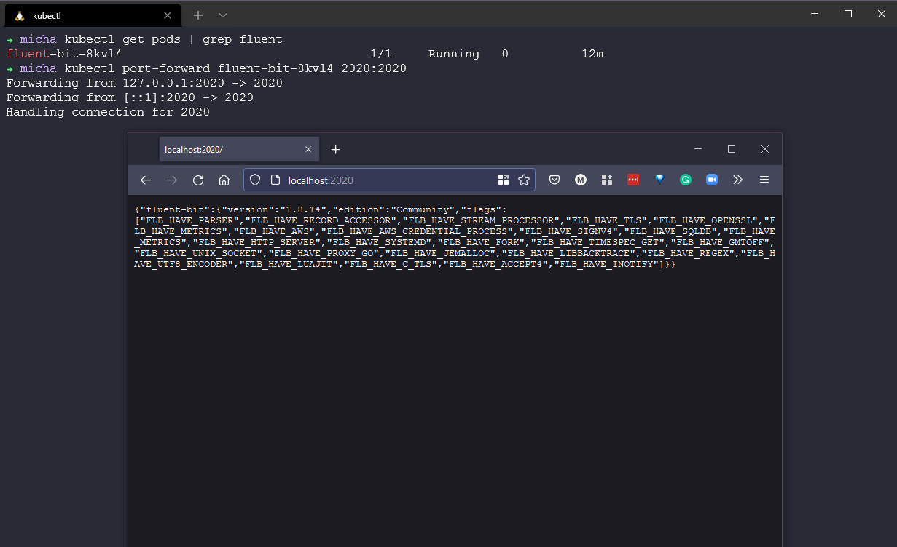

## Fluentd y FluentBit

Otro recolector de datos que quería explorar como parte de esta sección de observabilidad era [Fluentd](https://docs.fluentd.org/). Es una capa de registro unificada de código abierto.

Fluentd tiene cuatro características clave que lo hacen adecuado para construir canalizaciones de registro limpias y confiables:

Registro unificado con JSON: Fluentd intenta estructurar los datos en la medida de lo posible como JSON. Esto permite unificar todos los aspectos del procesamiento de datos de registro: recolección, filtrado, almacenamiento en búfer y envío de registros desde múltiples fuentes y destinos. El procesamiento de datos aguas abajo es mucho más fácil con JSON, ya que tiene suficiente estructura para ser accesible sin imponer esquemas rígidos.

Arquitectura modular: Fluentd tiene un sistema de complementos flexible que permite a la comunidad ampliar su funcionalidad. Más de 300 complementos contribuidos por la comunidad conectan docenas de fuentes de datos con docenas de destinos de datos, manipulando los datos según sea necesario. Al usar complementos, puedes aprovechar mejor tus registros de inmediato.

Requisitos mínimos de recursos: Un recolector de datos debe ser liviano para que funcione cómodamente en una máquina ocupada. Fluentd está escrito en una combinación de C y Ruby y requiere recursos mínimos del sistema. La instancia básica se ejecuta con 30-40 MB de memoria y puede procesar 13,000 eventos/segundo/núcleo.

Confiabilidad incorporada: Nunca debería haber pérdida de datos. Fluentd admite almacenamiento en búfer basado en memoria y en archivos para evitar la pérdida de datos entre nodos. Fluentd también admite conmutación por error robusta y se puede configurar para tener alta disponibilidad.

[Instalación de Fluentd](https://docs.fluentd.org/quickstart#step-1-installing-fluentd)

### ¿Cómo registran los datos las aplicaciones?

- Escribir en archivos. Archivos `.log` (difícil de analizar sin una herramienta y a gran escala).
- Registrar directamente en una base de datos (cada aplicación debe configurarse con el formato correcto).
- Aplicaciones de terceros (NodeJS, NGINX, PostgreSQL).

Por eso queremos una capa de registro unificada.

FluentD permite los tres tipos de datos de registro mencionados anteriormente y nos brinda la capacidad de recolectar, procesar y enviar esos datos a un destino, como enviar los registros a bases de datos Elastic, MongoDB o Kafka, por ejemplo.

Cualquier dato, desde cualquier fuente de datos, puede enviarse a FluentD, y se puede enviar a cualquier destino. FluentD no está limitado a ninguna fuente o destino en particular.

En mi investigación sobre Fluentd, me encontré con Fluent Bit como otra opción, y parece que si estás buscando implementar una herramienta de registro en tu entorno de Kubernetes, Fluent Bit te proporcionaría esa capacidad, aunque Fluentd también se puede implementar en contenedores y servidores.

[Fluentd y Fluent Bit](https://docs.fluentbit.io/manual/about/fluentd-and-fluent-bit)

Fluentd y Fluent Bit utilizarán complementos de entrada para transformar esos datos al formato de Fluent Bit, luego tendremos complementos de salida hacia el objetivo de salida, como Elasticsearch.

También podemos usar etiquetas y coincidencias entre configuraciones.

No veo una buena razón para usar Fluentd, y parece que Fluent Bit es la mejor manera de comenzar. Aunque se pueden usar juntos en algunas arquitecturas.

### Fluent Bit en Kubernetes

Fluent Bit en Kubernetes se implementa como un DaemonSet, lo que significa que se ejecutará en cada nodo del clúster. Cada pod de Fluent Bit en cada nodo leerá cada contenedor en ese nodo y recopilará todos los registros disponibles. También recopilará los metadatos del servidor de API de Kubernetes.

Las anotaciones de Kubernetes se pueden utilizar en el archivo de configuración YAML de nuestras aplicaciones.

En primer lugar, podemos implementarlo desde el repositorio de valores de Fluent utilizando el comando `helm repo add fluent https://fluent.github.io/helm-charts` y luego instalarlo usando el comando `helm install fluent-bit fluent/fluent-bit`.


En mi clúster, también estoy ejecutando Prometheus en mi espacio de nombres predeterminado (con fines de prueba). Debemos asegurarnos de que nuestro pod de fluent-bit esté en funcionamiento. Podemos hacer esto usando el comando `kubectl get all | grep fluent`, que mostrará nuestro pod, servicio y DaemonSet que mencionamos anteriormente.


Para que Fluent Bit sepa de dónde obtener los registros, tenemos un archivo de configuración. En esta implementación de Kubernetes de Fluent Bit, tenemos un ConfigMap que se asemeja al archivo de configuración.


Ese ConfigMap se verá algo así:


```
Name:         fluent-bit
Namespace:    default
Labels:       app.kubernetes.io/instance=fluent-bit
              app.kubernetes.io/managed-by=Helm
              app.kubernetes.io/name=fluent-bit
              app.kubernetes.io/version=1.8.14
              helm.sh/chart=fluent-bit-0.19.21
Annotations:  meta.helm.sh/release-name: fluent-bit
              meta.helm.sh/release-namespace: default

Data
====
custom_parsers.conf:
----
[PARSER]
    Name docker_no_time
    Format json
    Time_Keep Off
    Time_Key time
    Time_Format %Y-%m-%dT%H:%M:%S.%L

fluent-bit.conf:
----
[SERVICE]
    Daemon Off
    Flush 1
    Log_Level info
    Parsers_File parsers.conf
    Parsers_File custom_parsers.conf
    HTTP_Server On
    HTTP_Listen 0.0.0.0
    HTTP_Port 2020
    Health_Check On

[INPUT]
    Name tail
    Path /var/log/containers/*.log
    multiline.parser docker, cri
    Tag kube.*
    Mem_Buf_Limit 5MB
    Skip_Long_Lines On

[INPUT]
    Name systemd
    Tag host.*
    Systemd_Filter _SYSTEMD_UNIT=kubelet.service
    Read_From_Tail On

[FILTER]
    Name Kubernetes
    Match kube.*
    Merge_Log On
    Keep_Log Off
    K8S-Logging.Parser On
    K8S-Logging.Exclude On

[OUTPUT]
    Name es
    Match kube.*
    Host elasticsearch-master
    Logstash_Format On
    Retry_Limit False

[OUTPUT]
    Name es
    Match host.*
    Host elasticsearch-master
    Logstash_Format On
    Logstash_Prefix node
    Retry_Limit False

Events:  <none>
```

Ahora podemos redirigir el puerto de nuestro pod a nuestra máquina local para asegurarnos de tener conectividad. En primer lugar, obtén el nombre de tu pod con `kubectl get pods | grep fluent` y luego usa `kubectl port-forward fluent-bit-8kvl4 2020:2020` para abrir un navegador web en `http://localhost:2020/`.



También encontré este excelente artículo de Medium que cubre más sobre [Fluent Bit](https://medium.com/kubernetes-tutorials/exporting-kubernetes-logs-to-elasticsearch-using-fluent-bit-758e8de606af).

## Recursos

- [Understanding Logging: Containers & Microservices](https://www.youtube.com/watch?v=MMVdkzeQ848)
- [The Importance of Monitoring in DevOps](https://www.devopsonline.co.uk/the-importance-of-monitoring-in-devops/)
- [Understanding Continuous Monitoring in DevOps?](https://medium.com/devopscurry/understanding-continuous-monitoring-in-devops-f6695b004e3b)
- [DevOps Monitoring Tools](https://www.youtube.com/watch?v=Zu53QQuYqJ0)
- [Top 5 - DevOps Monitoring Tools](https://www.youtube.com/watch?v=4t71iv_9t_4)
- [How Prometheus Monitoring works](https://www.youtube.com/watch?v=h4Sl21AKiDg)
- [Introduction to Prometheus monitoring](https://www.youtube.com/watch?v=5o37CGlNLr8)
- [Promql cheat sheet with examples](https://www.containiq.com/post/promql-cheat-sheet-with-examples)
- [Log Management for DevOps | Manage application, server, and cloud logs with Site24x7](https://www.youtube.com/watch?v=J0csO_Shsj0)
- [Log Management what DevOps need to know](https://devops.com/log-management-what-devops-teams-need-to-know/)
- [What is ELK Stack?](https://www.youtube.com/watch?v=4X0WLg05ASw)
- [Fluentd simply explained](https://www.youtube.com/watch?v=5ofsNyHZwWE&t=14s)
- [Fluent Bit explained | Fluent Bit vs Fluentd](https://www.youtube.com/watch?v=B2IS-XS-cc0)

Nos vemos en el [Día 82](day82.md)
