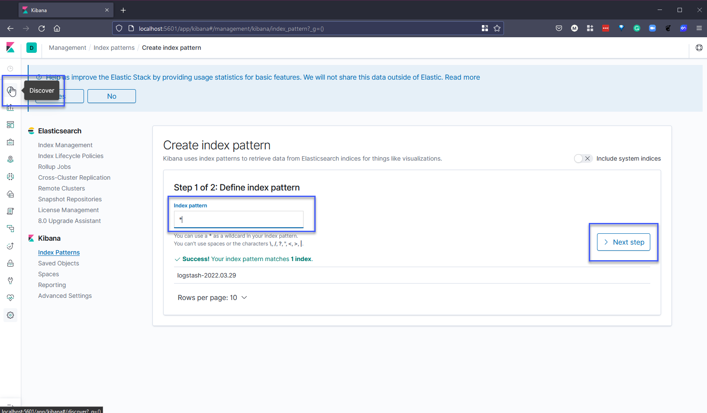

## Pila EFK

En la sección anterior, hablamos sobre la pila ELK, que utiliza Logstash como el recolector de registros en la pila. En la pila EFK, reemplazamos Logstash por FluentD o FluentBit.

Nuestra misión en esta sección es monitorear los registros de nuestro clúster de Kubernetes utilizando EFK.

### Descripción general de EFK

Desplegaremos lo siguiente en nuestro clúster de Kubernetes.

La pila EFK es una colección de 3 software que se agrupan juntos, e incluyen:

- Elasticsearch: una base de datos NoSQL que se utiliza para almacenar datos y proporciona una interfaz para buscar y consultar registros.

- Fluentd: Fluentd es un recolector de datos de código abierto para una capa de registro unificada. Fluentd te permite unificar la recopilación y el consumo de datos para un mejor uso y comprensión de los datos.

- Kibana: una interfaz para administrar y estadísticas de registros. Es responsable de leer información de Elasticsearch.

### Implementando EFK en Minikube

Utilizaremos nuestro confiable clúster de minikube para implementar nuestra pila EFK. Comencemos iniciando un clúster con el comando `minikube start` en nuestro sistema. Estoy utilizando un sistema operativo Windows con WSL2 habilitado.

He creado un archivo llamado [efk-stack.yaml](Days/Monitoring/../../Monitoring/EFK%20Stack/efk-stack.yaml) que contiene todo lo que necesitamos para implementar la pila EFK en nuestro clúster. Usando el comando `kubectl create -f efk-stack.yaml`, podemos ver que todo se está implementando.

Dependiendo de tu sistema y si ya has ejecutado esto antes y tienes las imágenes descargadas, ahora deberías ver los pods en estado "Ready" antes de continuar. Puedes verificar el progreso con el siguiente comando: `kubectl get pods -n kube-logging -w`. Esto puede tardar unos minutos.

El comando anterior nos permite mantener un ojo en las cosas, pero me gusta asegurarme de que todo esté bien ejecutando simplemente el siguiente comando: `kubectl get pods -n kube-logging`, para asegurarme de que todos los pods estén en funcionamiento.

Una vez que todos nuestros pods estén en funcionamiento y en esta etapa, deberíamos ver:

- 3 pods asociados con Elasticsearch
- 1 pod asociado con Fluentd
- 1 pod asociado con Kibana

También podemos usar `kubectl get all -n kube-logging` para mostrar todo en nuestro espacio de nombres. Como se explicó anteriormente, Fluentd se implementa como un DaemonSet, Kibana como un deployment y Elasticsearch como un statefulset.

Ahora que todos nuestros pods están en funcionamiento, podemos abrir una nueva terminal y usar el comando port-forward para acceder al panel de control de Kibana. Ten en cuenta que el nombre de tu pod será diferente al comando que se muestra aquí. `kubectl port-forward kibana-84cf7f59c-v2l8v 5601:5601 -n kube-logging`

Ahora podemos abrir un navegador y acceder a esta dirección, `http://localhost:5601`. Verás la siguiente pantalla o es posible que veas una pantalla de datos de muestra o continuar y configurarla tú mismo. De cualquier manera, echa un vistazo a esos datos de prueba, es lo que cubrimos cuando vimos la pila ELK en una sesión anterior.

A continuación, necesitamos hacer clic en la pestaña "Discover" en el menú izquierdo y agregar "*" como nuestro patrón de índice. Continúa con el siguiente paso haciendo clic en "Next step".

En el paso 2 de 2, vamos a usar la opción @timestamp del menú desplegable, ya que esto filtrará nuestros datos por tiempo. Cuando hagas clic en "Create pattern", es posible que tarde unos segundos en completarse.

Si volvemos a la pestaña "Discover" después de unos segundos, deberíamos empezar a ver datos provenientes de nuestro clúster de Kubernetes.

Ahora que tenemos la pila EFK en funcionamiento y estamos recopilando registros de nuestro clúster de Kubernetes a través de Fluentd, también podemos explorar otras fuentes que podemos elegir. Si navegas a la pantalla de inicio haciendo clic en el logotipo de Kibana en la parte superior izquierda, verás la misma página que vimos cuando iniciamos sesión por primera vez.

Podemos agregar APM, datos de registro, datos métricos y eventos de seguridad de otros complementos o fuentes.

Si seleccionamos "Add log data", veremos que tenemos muchas opciones sobre dónde obtener nuestros registros. Puedes ver que Logstash se menciona allí, lo cual es parte de la pila ELK.

En los datos métricos, verás que puedes agregar fuentes para Prometheus y muchos otros servicios.

### APM (Monitoreo del rendimiento de aplicaciones)

También existe la opción de recopilar APM (Monitoreo del rendimiento de aplicaciones), que recopila métricas de rendimiento detalladas y errores desde el interior de tu aplicación. Te permite monitorear el rendimiento de miles de aplicaciones en tiempo real.

No profundizaré en APM aquí, pero puedes obtener más información en la [web de Elastic](https://www.elastic.co/observability/application-performance-monitoring).

## Recursos

- [Understanding Logging: Containers & Microservices](https://www.youtube.com/watch?v=MMVdkzeQ848)
- [The Importance of Monitoring in DevOps](https://www.devopsonline.co.uk/the-importance-of-monitoring-in-devops/)
- [Understanding Continuous Monitoring in DevOps?](https://medium.com/devopscurry/understanding-continuous-monitoring-in-devops-f6695b004e3b)
- [DevOps Monitoring Tools](https://www.youtube.com/watch?v=Zu53QQuYqJ0)
- [Top 5 - DevOps Monitoring Tools](https://www.youtube.com/watch?v=4t71iv_9t_4)
- [How Prometheus Monitoring works](https://www.youtube.com/watch?v=h4Sl21AKiDg)
- [Introduction to Prometheus monitoring](https://www.youtube.com/watch?v=5o37CGlNLr8)
- [Promql cheat sheet with examples](https://www.containiq.com/post/promql-cheat-sheet-with-examples)
- [Log Management for DevOps | Manage application, server, and cloud logs with Site24x7](https://www.youtube.com/watch?v=J0csO_Shsj0)
- [Log Management what DevOps need to know](https://devops.com/log-management-what-devops-teams-need-to-know/)
- [What is ELK Stack?](https://www.youtube.com/watch?v=4X0WLg05ASw)
- [Fluentd simply explained](https://www.youtube.com/watch?v=5ofsNyHZwWE&t=14s)

Nos vemos en el [Día 83](day83.md)
