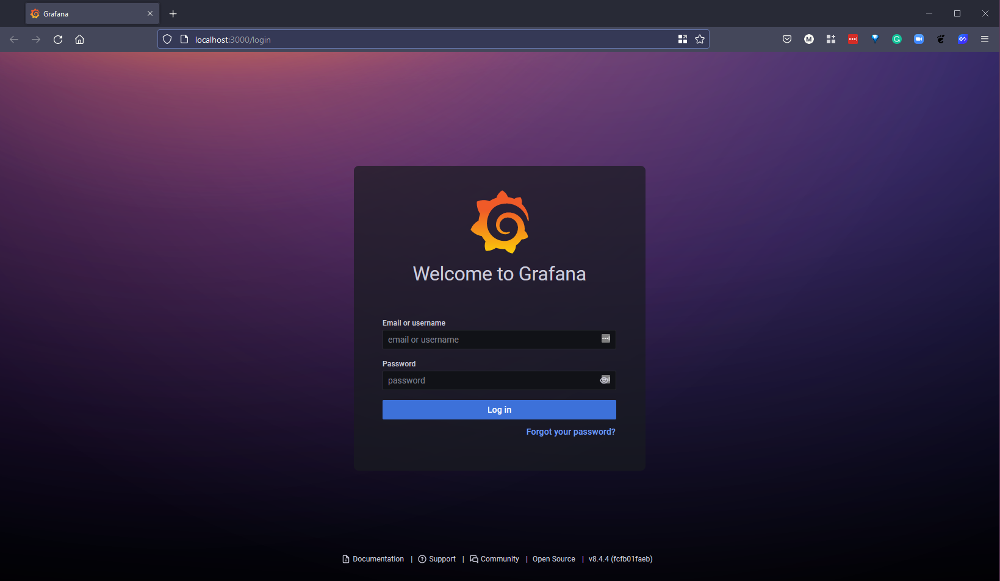
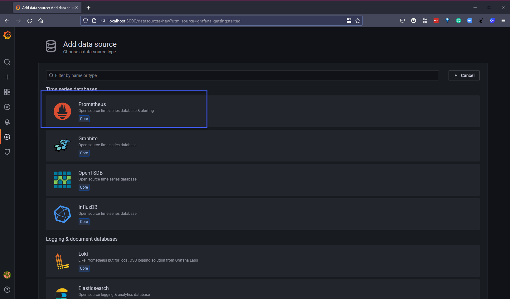
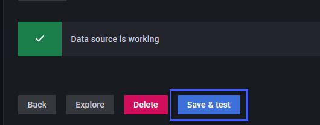
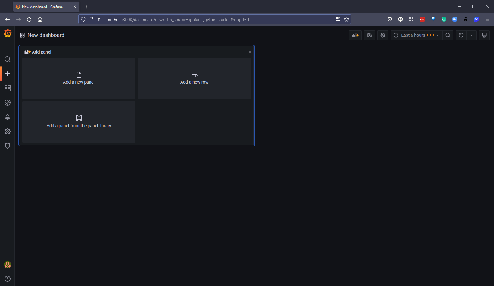

## Visualización de datos: Grafana

Hemos visto mucho de Kibana en esta sección sobre Observabilidad. Sin embargo, también debemos dedicar algo de tiempo a hablar sobre Grafana. Aunque no son iguales y no compiten directamente entre sí.

La característica principal de Kibana es la consulta y el análisis de datos. Los usuarios pueden buscar datos indexados en Elasticsearch mediante varios métodos para encontrar eventos específicos o cadenas dentro de sus datos, con el fin de realizar análisis de causa raíz y diagnósticos. Basándose en estas consultas, los usuarios pueden utilizar las funciones de visualización de Kibana, que les permiten visualizar datos de diversas formas, utilizando gráficos, tablas, mapas geográficos y otros tipos de visualizaciones.

Grafana comenzó como un fork de Kibana y su objetivo era brindar soporte para métricas, es decir, monitoreo, ya que en ese momento Kibana no lo proporcionaba.

Grafana es una herramienta de visualización de datos gratuita y de código abierto. A menudo vemos Prometheus y Grafana juntos en el campo, pero también es posible ver Grafana junto a Elasticsearch y Graphite.

La diferencia clave entre las dos herramientas es que una se centra en el registro (logging) y la otra en el monitoreo (monitoring). Comenzamos la sección hablando sobre el monitoreo con Nagios, luego pasamos a Prometheus y luego al registro, donde cubrimos las pilas ELK y EFK.

Grafana se ocupa de analizar y visualizar métricas, como el uso de la CPU del sistema, la memoria, el disco y la utilización de E/S. La plataforma no permite la consulta de datos en texto completo. Kibana se ejecuta sobre Elasticsearch y se utiliza principalmente para analizar mensajes de registro.

Como ya hemos descubierto con Kibana, es bastante fácil de implementar y también tenemos la opción de dónde implementarlo. Esto es lo mismo para Grafana.

Ambas herramientas admiten la instalación en Linux, Mac, Windows, Docker o la construcción desde el código fuente.

Sin duda existen otras herramientas, pero Grafana es una herramienta que he visto en plataformas virtuales, en la nube y en plataformas nativas de la nube, por lo que quería cubrirla en esta sección.

### Implementación de Prometheus Operator + Grafana

Ya hemos hablado de Prometheus en esta sección, pero dado que a menudo se utilizan juntos, quería configurar un entorno que nos permita ver al menos qué métricas se pueden mostrar en una visualización. Sabemos que es importante monitorear nuestros entornos, pero revisar esas métricas solo en Prometheus o cualquier herramienta de métricas sería engorroso y no escalable. Ahí es donde entra Grafana y nos brinda la visualización interactiva de esas métricas recopiladas y almacenadas en la base de datos de Prometheus.

Con esa visualización, podemos crear gráficos personalizados, gráficos y alertas para nuestro entorno. En este recorrido, utilizaremos nuestro clúster minikube.

Vamos a comenzar clonando esto en nuestro sistema local. Utiliza `git clone https://github.com/prometheus-operator/kube-prometheus.git` y `cd kube-prometheus`.


El primer paso es crear nuestro namespace (namespace) dentro de nuestro clúster minikube  `kubectl create -f manifests/setup`. Si no has estado siguiendo las secciones anteriores, puedes usar `minikube start` para iniciar un nuevo clúster aquí.


A continuación, vamos a implementar todo lo que necesitamos para nuestra demostración utilizando el comando `kubectl create -f manifests/`. Como puedes ver, esto desplegará muchos recursos diferentes en nuestro clúster.


Luego, debemos esperar a que nuestras cápsulas (pods) se inicien y estén en estado de ejecución. Podemos utilizar el comando `kubectl get pods -n monitoring -w` para supervisar las cápsulas.


Cuando todo esté en ejecución, podemos verificar que todas las cápsulas estén en estado de ejecución y saludables utilizando el comando `kubectl get pods -n monitoring`.


Con la implementación, hemos desplegado varios servicios que utilizaremos más adelante en la demostración. Puedes verificar estos servicios utilizando el comando `kubectl get svc -n monitoring`.


Finalmente, verifiquemos todos los recursos implementados en nuestro nuevo namespace de monitoreo utilizando el comando `kubectl get all -n monitoring`.


Abre una nueva terminal y ahora estamos listos para acceder a nuestra herramienta Grafana y comenzar a recopilar y visualizar algunas de nuestras métricas. El comando a utilizar es `kubectl --namespace monitoring port-forward svc/grafana 3000`.


Abre un navegador y ve a http://localhost:3000, se te solicitará un nombre de usuario y una contraseña.



El nombre de usuario y la contraseña predeterminados son:

```
Username: admin
Password: admin
```

Sin embargo, se te pedirá que proporciones una nueva contraseña al iniciar sesión por primera vez. La pantalla inicial o la página de inicio que verás te mostrará áreas para explorar, así como algunos recursos útiles para familiarizarte con Grafana y sus capacidades. Observa los widgets "Add your first data source" (Agregar tu primera fuente de datos) y "create your first dashboard" (crear tu primer panel), que utilizaremos más adelante.


Verás que ya hay una fuente de datos de Prometheus agregada a nuestras fuentes de datos de Grafana. Sin embargo, debido a que estamos utilizando minikube, también necesitamos redirigir el puerto de Prometheus para que esté disponible en nuestro localhost. Abre una nueva terminal y ejecuta el siguiente comando: `kubectl --namespace monitoring port-forward svc/prometheus-k8s 9090`. Si ahora ingresamos en el widget "Add your first data source" en la página de inicio de Grafana, seleccionaremos Prometheus desde allí.



Para nuestra nueva fuente de datos, podemos utilizar la dirección http://localhost:9090 y también debemos cambiar el menú desplegable a "Browser" como se muestra a continuación.


En la parte inferior de la página, ahora podemos hacer clic en "Save & Test" (Guardar y probar). Esto debería mostrarnos el resultado que se muestra a continuación si la redirección de puerto para Prometheus está funcionando.



Vuelve a la página de inicio y busca la opción "Create your first dashboard" (Crear tu primer panel) y selecciona "Add a new panel" (Agregar un nuevo panel).



Verás que ya estamos recopilando información de nuestra fuente de datos de Grafana. Sin embargo, nos gustaría recopilar métricas de nuestra fuente de datos de Prometheus. Selecciona el menú desplegable de fuente de datos y elige nuestra fuente de datos recién creada "Prometheus-1".


Si luego seleccionas "Metrics browser" (Explorador de métricas), verás una larga lista de métricas recopiladas de Prometheus relacionadas con nuestro clúster minikube.


Para la demostración, voy a buscar una métrica que nos proporcione alguna información sobre los recursos del sistema. `cluster:node_cpu:ratio{}` nos proporciona algunos detalles sobre los nodos de nuestro clúster y demuestra que esta integración está funcionando.


Una vez que estés satisfecho con esta visualización, puedes hacer clic en el botón "Apply" (Aplicar) en la esquina superior derecha y luego agregar este gráfico a tu panel. Puedes agregar más gráficos y otros tipos de visualizaciones que necesites.


Sin embargo, podemos aprovechar miles de paneles creados previamente que podemos usar para no tener que reinventar la rueda.


Si buscamos "Kubernetes", veremos una larga lista de paneles preconstruidos entre los que podemos elegir.


Hemos elegido el panel "Kubernetes API Server" y hemos cambiado la fuente de datos para adaptarla a nuestra nueva fuente de datos "Prometheus-1", y podemos ver algunas de las métricas que se muestran a continuación.


### Alertas

También podrías aprovechar el administrador de alertas que hemos implementado para enviar alertas a Slack u otras integraciones. Para hacer esto, deberías redirigir el puerto del servicio alertmanager utilizando los siguientes detalles:

`kubectl --namespace monitoring port-forward svc/alertmanager-main 9093
http://localhost:9093`

Esto concluye nuestra sección sobre todo lo relacionado con la observabilidad. Personalmente, he encontrado que esta sección ha destacado lo amplio de este tema, pero igualmente lo importante que es para nuestros roles. Ya sea métricas, registros o trazas, necesitarás tener una buena idea de lo que está sucediendo en nuestros entornos amplios en el futuro, especialmente cuando pueden cambiar de manera tan drástica con toda la automatización que ya hemos cubierto en las otras secciones.

A continuación, vamos a echar un vistazo a la gestión de datos y cómo los principios de DevOps también deben considerarse cuando se trata de la gestión de datos.

## Recursos

- [Understanding Logging: Containers & Microservices](https://www.youtube.com/watch?v=MMVdkzeQ848)
- [The Importance of Monitoring in DevOps](https://www.devopsonline.co.uk/the-importance-of-monitoring-in-devops/)
- [Understanding Continuous Monitoring in DevOps?](https://medium.com/devopscurry/understanding-continuous-monitoring-in-devops-f6695b004e3b)
- [DevOps Monitoring Tools](https://www.youtube.com/watch?v=Zu53QQuYqJ0)
- [Top 5 - DevOps Monitoring Tools](https://www.youtube.com/watch?v=4t71iv_9t_4)
- [How Prometheus Monitoring works](https://www.youtube.com/watch?v=h4Sl21AKiDg)
- [Introduction to Prometheus monitoring](https://www.youtube.com/watch?v=5o37CGlNLr8)
- [Promql cheat sheet with examples](https://www.containiq.com/post/promql-cheat-sheet-with-examples)
- [Log Management for DevOps | Manage application, server, and cloud logs with Site24x7](https://www.youtube.com/watch?v=J0csO_Shsj0)
- [Log Management what DevOps need to know](https://devops.com/log-management-what-devops-teams-need-to-know/)
- [What is ELK Stack?](https://www.youtube.com/watch?v=4X0WLg05ASw)
- [Fluentd simply explained](https://www.youtube.com/watch?v=5ofsNyHZwWE&t=14s)

Nos vemos en el [Día 84](day84.md)
