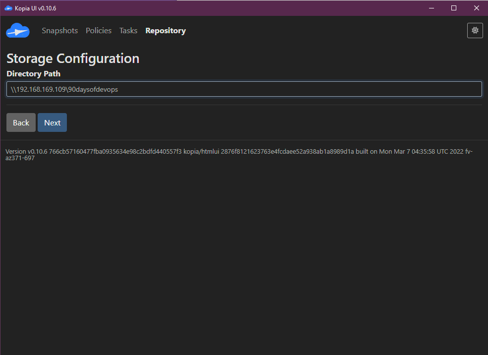
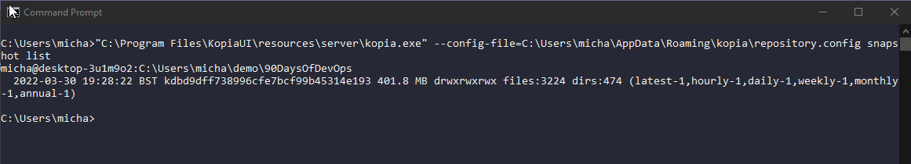
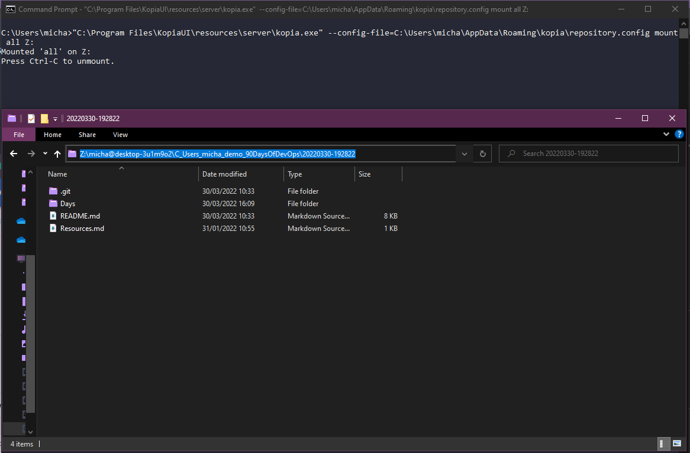

## Backup de todas las plataformas

Durante todo este desafío, discutimos muchas plataformas y entornos diferentes. Una cosa que todos ellos tienen en común es que necesitan algún nivel de protección de datos.

La protección de datos ha existido durante muchos años, pero la cantidad de datos que tenemos hoy en día y el valor que estos datos aportan significa que debemos asegurarnos de no solo ser resilientes ante fallas de infraestructura teniendo múltiples nodos y alta disponibilidad en las aplicaciones, sino que también debemos considerar que necesitamos una copia de esos datos, esos datos importantes, en un lugar seguro si ocurriera un escenario de falla.

Hoy en día escuchamos mucho sobre delitos cibernéticos y ransomware, y no me malinterpretes, esta es una gran amenaza y sostengo que serás atacado por ransomware. No se trata de si sucederá, sino de cuándo sucederá. Por lo tanto, hay aún más razón para asegurarte de que tus datos estén protegidos cuando llegue ese momento. Sin embargo, la causa más común de pérdida de datos no es el ransomware ni los delitos cibernéticos, ¡sino simplemente la eliminación accidental!

Todos lo hemos hecho, hemos eliminado algo que no deberíamos haber eliminado y hemos sentido un arrepentimiento instantáneo.

Con toda la tecnología y automatización de la que hemos hablado durante el desafío, el requisito de proteger cualquier dato con estado o incluso una configuración sin estado compleja aún está presente, independientemente de la plataforma.

¡Pero deberíamos poder realizar esa protección de datos teniendo en cuenta la automatización y poder integrarla en nuestros flujos de trabajo.

Si analizamos lo que es un backup:

*"En tecnología de la información, un backup o copia de seguridad de datos es una copia de los datos de la computadora que se toma y se almacena en otro lugar para que se pueda usar para restaurar el original después de un evento de pérdida de datos. El verbo que se refiere al proceso de hacer esto es "respaldar", mientras que el sustantivo y el adjetivo son "backup"."*

Si lo desglosamos a la forma más simple, un backup es una copia y pegado de datos en una nueva ubicación. En pocas palabras, podría hacer un backup en este momento copiando un archivo de mi unidad C: a mi unidad D:, y luego tendría una copia en caso de que algo le sucediera a la unidad C: o si se editara incorrectamente algún archivo. Podría volver a la copia que tengo en la unidad D:. Ahora, si mi computadora muere, donde están tanto las unidades C: como D:, entonces no estoy protegido, por lo que debo considerar una solución o una copia de los datos fuera de mi sistema, tal vez en una unidad NAS en mi casa. Pero luego, ¿qué sucede si algo le sucede a mi casa? Tal vez necesite considerar almacenarlo en otro sistema en otra ubicación, tal vez la nube sea una opción. Quizás podría almacenar una copia de mis archivos importantes en varios lugares para mitigar el riesgo de falla.

### Metodología de backup 3-2-1

Ahora parece un buen momento para hablar sobre la regla 3-2-1 o metodología de backup. Hice una [charla rápida](https://www.youtube.com/watch?v=5wRt1bJfKBw) que aborda este tema.

Ya hemos mencionado anteriormente algunas de las razones extremas por las que necesitamos proteger nuestros datos, pero a continuación se enumeran algunas más:

Esto nos permite hablar sobre la metodología 3-2-1. Mi primera copia o backup de mis datos debería estar lo más cerca posible de mi sistema de producción, la razón de esto se basa en la velocidad de recuperación y nuevamente volvemos al punto original sobre la eliminación accidental, que será la razón más común para la recuperación. Pero quiero almacenar eso en un segundo medio adecuado fuera del sistema original o de producción.

Luego, queremos asegurarnos de enviar una copia de nuestros datos externamente o fuera del sitio, y aquí es donde entra en juego una segunda ubicación, ya sea otra casa, edificio, centro de datos o la nube pública.

### Responsabilidad del backup

Probablemente hayamos escuchado todos los mitos cuando se trata de no tener que hacer backups, como "Todo es sin estado". Quiero decir, si todo es sin estado, ¿qué negocio tenemos? ¿sin bases de datos? ¿documentos de Word? Existe un nivel de responsabilidad en cada persona dentro de la empresa para asegurarse de estar protegidos, pero es probable que los equipos de operaciones sean los responsables de proporcionar el proceso de backup para las aplicaciones y datos críticos para la misión.

Otro buen ejemplo es "La alta disponibilidad es mi backup, hemos incorporado varios nodos en nuestro clúster, ¡no hay forma de que esto falle!". Excepto cuando se comete un error en la base de datos y se replica en todos los nodos del clúster, o si hay un incendio, inundación o escenario de sangre que significa que el clúster ya no está disponible y, con él, los datos importantes. No se trata de ser obstinados, sino de ser conscientes de los datos y los servicios. Absolutamente todos deberían tener en cuenta la alta disponibilidad y la tolerancia a fallos en su arquitectura, pero eso no sustituye la necesidad de backup.

La replicación también puede parecer que nos proporciona una copia externa de los datos y tal vez ese clúster mencionado anteriormente esté distribuido en varias ubicaciones. Sin embargo, el primer error accidental aún se replicaría allí. Pero nuevamente, el requisito de backup debe ir junto con la replicación de la aplicación o la replicación del sistema dentro del entorno.

Ahora bien, con todo lo dicho, también se puede llegar al extremo opuesto y enviar copias de los datos a demasiadas ubicaciones, lo que no solo aumentará los costos, sino que también aumentará el riesgo de ser atacado, ya que tu superficie de exposición ahora se ha ampliado enormemente.

De todos modos, ¿quién se encarga del backup? Será diferente en cada empresa, pero alguien debería encargarse de comprender los requisitos de backup. ¡Pero también comprender el plan de recuperación!

### A nadie le importa hasta que a todos les importa

El backup es un ejemplo perfecto: a nadie le importa el backup hasta que necesita restaurar algo. Además del requisito de hacer copias de seguridad de nuestros datos, también debemos considerar cómo restaurarlos.

En nuestro ejemplo de documento de texto, estamos hablando de archivos muy pequeños, por lo que la capacidad de copiar de un lado a otro es fácil y rápida. Pero si hablamos de archivos de más de 100 GB, esto llevará tiempo. Además, debemos considerar el nivel al que necesitamos recuperarnos, por ejemplo, si tomamos una máquina virtual.

Tenemos toda la máquina virtual, tenemos el sistema operativo, la instalación de la aplicación y, si se trata de un servidor de bases de datos, también tendremos algunos archivos de la base de datos. Si cometemos un error e insertamos la línea de código incorrecta en nuestra base de datos, probablemente no necesitemos restaurar toda la máquina virtual, sino que queremos ser más precisos en lo que recuperamos.

### Escenario de backup

Ahora quiero comenzar a construir un escenario para proteger algunos datos, específicamente, quiero proteger algunos archivos en mi máquina local (en este caso, Windows, pero la herramienta que voy a usar no solo es gratuita y de código abierto, sino también multiplataforma). Me gustaría asegurarme de que estén respaldados en un dispositivo NAS que tengo localmente en mi hogar, pero también en un depósito de almacenamiento de objetos en la nube.

Quiero hacer una copia de seguridad de estos datos importantes, que resulta ser el repositorio para los "90DaysOfDevOps", que sí, también se envía a GitHub, que probablemente es donde estás leyendo esto ahora, pero ¿qué pasaría si mi máquina muriera y GitHub estuviera caído? ¿Cómo podría alguien leer el contenido, pero también cómo podría restaurar esos datos en otro servicio?

Hay muchas herramientas que pueden ayudarnos a lograr esto, pero voy a utilizar una herramienta llamada [Kopia](https://kopia.io/), una herramienta de backup de código abierto que nos permitirá cifrar, deduplicar y comprimir nuestras copias de seguridad y enviarlas a muchos lugares.

Puedes encontrar las versiones para descargar [aquí](https://github.com/kopia/kopia/releases). En el momento de escribir esto, estaré usando la versión 0.10.6.

### Instalación de Kopia

Existen una interfaz de línea de comandos (CLI) y una interfaz gráfica de usuario (GUI) de Kopia. Usaremos la GUI, pero debes saber que también puedes usar una versión de CLI para aquellos servidores Linux que no tienen una GUI.

Usaré `KopiaUI-Setup-0.10.6.exe`.

La instalación es muy rápida y luego, cuando abres la aplicación, te da la opción de seleccionar el tipo de almacenamiento que deseas utilizar como repositorio de backup.

### Configuración de un repositorio

En primer lugar, nos gustaría configurar un repositorio utilizando nuestro dispositivo NAS local y lo haremos mediante SMB, aunque también podríamos usar NFS, creo.

En la siguiente pantalla, vamos a definir una contraseña, que se utilizará para cifrar el contenido del repositorio.

Ahora que hemos configurado el repositorio, podemos iniciar una instantánea ad hoc para comenzar a escribir datos en él.

Lo primero que debemos hacer es ingresar la ruta de lo que queremos capturar en la instantánea, y en nuestro caso, queremos hacer una copia de nuestra carpeta `90DaysOfDevOps`. Volveremos a la programación más adelante.

Podemos definir la retención de nuestra instantánea.

Tal vez hay archivos o tipos de archivo que deseamos excluir.

Si quisiéramos definir una programación, podríamos hacerlo en esta próxima pantalla. Cuando creas esta instantánea, esta es la página de apertura para definirla.

Y verás que aquí se pueden manejar varios otros ajustes.

Selecciona "Snapshot now" y los datos se escribirán en tu repositorio.

### backup externo a S3

Con Kopia, parece que solo podemos tener un repositorio configurado a la vez a través de la interfaz gráfica. Sin embargo, a través de la interfaz gráfica, podemos ser creativos y tener varios archivos de configuración de repositorio para elegir y lograr nuestro objetivo de tener una copia local y externa en un almacenamiento de objetos.

El almacenamiento de objetos que elegiré para enviar mis datos será Google Cloud Storage. Primero inicié sesión en mi cuenta de Google Cloud Platform y creé un depósito de almacenamiento. Ya tenía instalado el SDK de Google Cloud en mi sistema y al ejecutar el comando `gcloud auth application-default login` me autenticé con mi cuenta.

Luego usé la CLI de Kopia para mostrarme el estado actual de mi repositorio después de agregar nuestro repositorio SMB en los pasos anteriores. Hice esto usando el comando `"C:\Program Files\KopiaUI\resources\server\kopia.exe" --config-file=C:\Users\micha\AppData\Roaming\kopia\repository.config repository status`.

Ahora estamos listos para reemplazar, para la demostración, la configuración del repositorio. Lo que probablemente haríamos si quisiéramos una solución a largo plazo para ambos repositorios es crear un archivo `smb.config` y un archivo `object.config` y ejecutar ambos comandos para enviar nuestras copias de los datos a cada ubicación. Para agregar nuestro repositorio, ejecutamos el comando `"C:\Program Files\KopiaUI\resources\server\kopia.exe" --config-file=C:\Users\micha\AppData\Roaming\kopia\repository.config repository create gcs --bucket 90daysofdevops`.

El comando anterior tiene en cuenta que el depósito de Google Cloud Storage que creamos se llama `90daysofdevops`.

Ahora que hemos creado nuestro nuevo repositorio, podemos ejecutar nuevamente el comando `"C:\Program Files\KopiaUI\resources\server\kopia.exe" --config-file=C:\Users\micha\AppData\Roaming\kopia\repository.config repository`

Lo siguiente que debemos hacer es crear una instantánea y enviarla a nuestro repositorio recién creado. Usando el comando `"C:\Program Files\KopiaUI\resources\server\kopia.exe" --config-file=C:\Users\micha\AppData\Roaming\kopia\repository.config kopia snapshot create "C:\Users\micha\demo\90DaysOfDevOps"`, podemos iniciar este proceso. Como se puede ver en el navegador a continuación, nuestro depósito de Google Cloud Storage ahora tiene archivos de Kopia basados en nuestra copia de seguridad.

Con el proceso anterior, podemos cumplir con nuestro requisito de enviar nuestros datos importantes a 2 ubicaciones diferentes, una de las cuales está fuera del sitio en Google Cloud Storage, y por supuesto, aún tenemos nuestra copia de producción de nuestros datos en un tipo de medio diferente.

### Restauración

La restauración es otra consideración y es muy importante. Kopia nos brinda la capacidad de restaurar no solo en la ubicación existente, sino también en una ubicación nueva.

Si ejecutamos el comando `"C:\Program Files\KopiaUI\resources\server\kopia.exe" --config-file=C:\Users\micha\AppData\Roaming\kopia\repository.config snapshot list`, esto enumerará las instantáneas que tenemos actualmente en nuestro repositorio configurado (GCS).

Luego, podemos montar esas instantáneas directamente desde GCS utilizando el comando `"C:\Program Files\KopiaUI\resources\server\kopia.exe" --config-file=C:\Users\micha\AppData\Roaming\kopia\repository.config mount all Z:`.

También podríamos restaurar el contenido de la instantánea usando `kopia snapshot restore kdbd9dff738996cfe7bcf99b45314e193`.

Los comandos anteriores son muy largos y esto se debe a que estaba utilizando la versión KopiaUI de kopia.exe, como se explica al principio de la guía, puedes descargar kopia.exe y colocarlo en una ruta para que solo tengas que usar el comando `kopia`.

En la próxima sesión, nos enfocaremos en proteger las cargas de trabajo dentro de Kubernetes.

## Recursos

- [Kubernetes Backup and Restore made easy!](https://www.youtube.com/watch?v=01qcYSck1c4&t=217s)
- [Kubernetes Backups, Upgrades, Migrations - with Velero](https://www.youtube.com/watch?v=zybLTQER0yY)
- [7 Database Paradigms](https://www.youtube.com/watch?v=W2Z7fbCLSTw&t=520s)
- [Disaster Recovery vs. Backup: What's the difference?](https://www.youtube.com/watch?v=07EHsPuKXc0)
- [Veeam Portability & Cloud Mobility](https://www.youtube.com/watch?v=hDBlTdzE6Us&t=3s)

Nos vemos en el [Día 87](day87.md)
