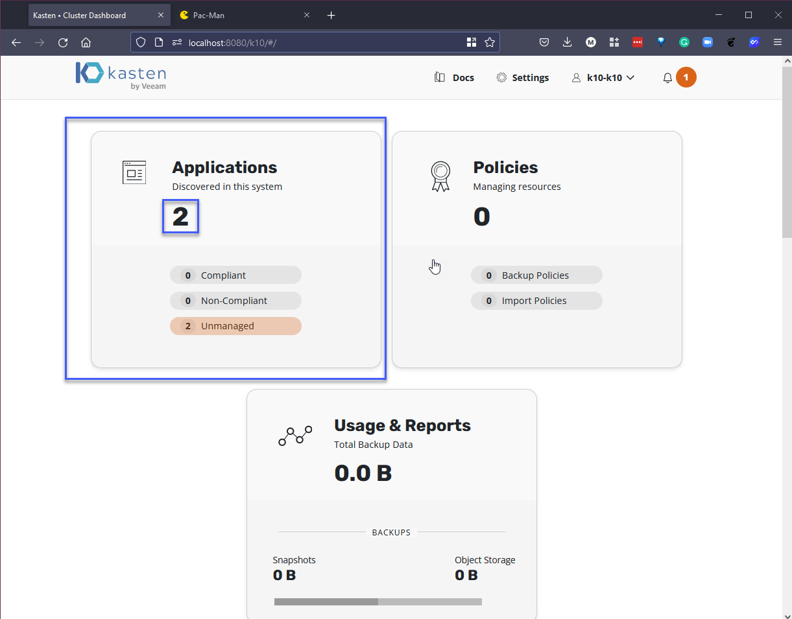
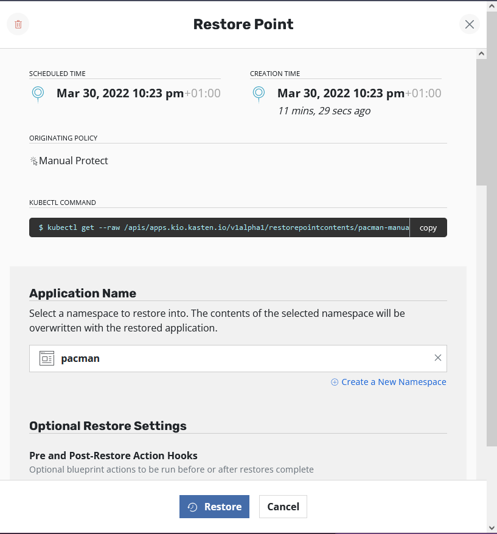
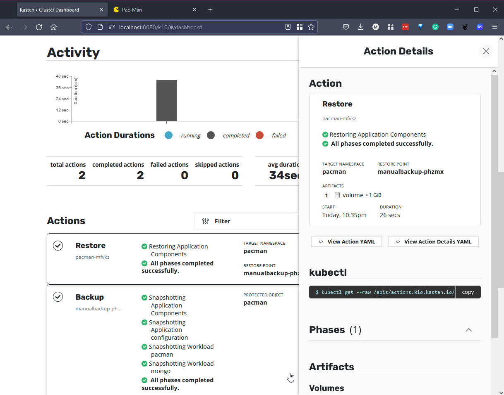

## Respaldo y Recuperación Práctica

En la última sesión, hablamos sobre [Kopia](https://kopia.io/), una herramienta de respaldo de código abierto que utilizamos para extraer algunos datos importantes a un NAS local y a un almacenamiento de objetos basado en la nube.

En esta sección, vamos a adentrarnos en el mundo del respaldo de Kubernetes. Es una plataforma que cubrimos anteriormente en el [panorama general](Days/day49.md): Kubernetes durante el desafío.

Nuevamente, utilizaremos nuestro clúster minikube, pero esta vez vamos a aprovechar algunos de los complementos disponibles.

### Configuración del clúster de Kubernetes

Para configurar nuestro clúster minikube, emitiremos el siguiente comando: `minikube start --addons volumesnapshots,csi-hostpath-driver --apiserver-port=6443 --container-runtime=containerd -p 90daysofdevops --kubernetes-version=1.21.2`. Observarás que estamos utilizando `volumesnapshots` y `csi-hostpath-driver`, ya que haremos un uso completo de ellos cuando realicemos nuestros respaldos.

En este punto, sé que aún no hemos implementado Kasten K10, pero queremos emitir el siguiente comando cuando tu clúster esté activo para anotar la clase de volumesnapshot, de modo que Kasten K10 pueda utilizarla.

```Shell
kubectl annotate volumesnapshotclass csi-hostpath-snapclass \
    k10.kasten.io/is-snapshot-class=true
```

También vamos a cambiar la storageclass predeterminada de la storageclass predeterminada estándar a la storageclass de csi-hostpath utilizando lo siguiente.

```Shell
kubectl patch storageclass csi-hostpath-sc -p '{"metadata": {"annotations":{"storageclass.kubernetes.io/is-default-class":"true"}}}'

kubectl patch storageclass standard -p '{"metadata": {"annotations":{"storageclass.kubernetes.io/is-default-class":"false"}}}'
```


### Implementar Kasten K10

Agrega el repositorio de Helm de Kasten.
```shell
helm repo add kasten https://charts.kasten.io/
```

Aquí también podríamos usar arkade kasten install k10, pero para la demostración, seguiremos los siguientes pasos. [Más detalles](https://blog.kasten.io/kasten-k10-goes-to-the-arkade)

Crea el espacio de nombres y despliega K10. Ten en cuenta que esto tomará aproximadamente 5 minutos.

```shell
helm install k10 kasten/k10 --namespace=kasten-io --set auth.tokenAuth.enabled=true --set injectKanisterSidecar.enabled=true --set-string injectKanisterSidecar.namespaceSelector.matchLabels.k10/injectKanisterSidecar=true --create-namespace
```

Puedes observar cómo se inician los pods ejecutando el siguiente comando.
```shell
kubectl get pods -n kasten-io -w
```

Reenvía el puerto para acceder al panel de control de K10. Abre una nueva terminal y ejecuta el siguiente comando.
```shell
kubectl --namespace kasten-io port-forward service/gateway 8080:8000
```

El panel de control de Kasten estará disponible en `http://127.0.0.1:8080/k10/#/`


Para autenticarte en el panel de control, ahora necesitamos obtener el token, que podemos obtener con los siguientes comandos.

```Shell
TOKEN_NAME=$(kubectl get secret --namespace kasten-io|grep k10-k10-token | cut -d " " -f 1)
TOKEN=$(kubectl get secret --namespace kasten-io $TOKEN_NAME -o jsonpath="{.data.token}" | base64 --decode)

echo "Token value: "
echo $TOKEN
```


Ahora toma este token e ingrésalo en tu navegador, luego se te solicitará un correo electrónico y el nombre de la empresa.


Luego accederás al panel de control de Kasten K10.


### Implementar nuestra aplicación persistente

Utiliza la aplicación persistente que usamos en la sección de Kubernetes.


Puedes encontrar el archivo de configuración YAML para esta aplicación aquí-> [pacman-stateful-demo.yaml](Kubernetes/pacman-stateful-demo.yaml)


Podemos utilizar `kubectl get all -n pacman` para verificar que nuestros pods se estén iniciando.


En una nueva terminal, reenviemos el frontend de Pacman. `kubectl port-forward svc/pacman 9090:80 -n pacman`

Abre otra pestaña en tu navegador e ingresa a http://localhost:9090/


Tómate el tiempo para acumular algunas puntuaciones altas en la base de datos MongoDB de la parte posterior de la aplicación.


### Proteger nuestras puntuaciones altas

Ahora tenemos algunos datos críticos en nuestra base de datos y no queremos perderlos. Podemos utilizar Kasten K10 para proteger toda esta aplicación.

Si volvemos a la pestaña del panel de control de Kasten K10, verás que el número de aplicaciones ha aumentado de 1 a 2 con la adición de nuestra aplicación Pacman a nuestro clúster de Kubernetes.



Si haces clic en la tarjeta de Aplicaciones, verás las aplicaciones descubiertas automáticamente en nuestro clúster.


Con Kasten K10, podemos aprovechar los snapshots basados en almacenamiento y también exportar nuestras copias a opciones de almacenamiento de objetos.

Para la demostración, crearemos un snapshot de almacenamiento manual en nuestro clúster y luego agregaremos algunos datos incorrectos a nuestras puntuaciones altas para simular un error accidental. ¿O será intencional?

En primer lugar, podemos utilizar la opción de snapshot manual a continuación.


Para la demostración, dejaré todo como está por defecto.


De vuelta en el panel de control, obtendrás un informe de estado sobre el trabajo a medida que se ejecuta y, cuando se complete, debería aparecer como exitoso como este.

### Escenario de error

Ahora podemos hacer ese cambio fatal a nuestros datos críticos simplemente agregando un cambio incorrecto y preescrito a nuestra aplicación.

Como puedes ver a continuación, tenemos dos entradas que probablemente no queremos en nuestra base de datos de producción crítica.


### Restaurar los datos

Esta es una demostración sencilla y de alguna manera no realista, aunque ¿has visto lo fácil que es eliminar bases de datos?

Ahora queremos que la lista de puntuaciones altas luzca un poco más limpia, como estaba antes de que se cometieran los errores.

En la tarjeta de Aplicaciones y en la pestaña de Pacman, ahora tenemos 1 punto de restauración que podemos utilizar para restaurar.


Cuando selecciones la opción de restauración, verás todos los snapshots asociados y las exportaciones de esa aplicación.


Selecciona esa restauración y aparecerá una ventana lateral, mantendremos la configuración predeterminada y haremos clic en restaurar.



Confirma que deseas realizar esto.


Luego puedes volver al panel de control y ver el progreso de la restauración. Deberías ver algo como esto.



Pero lo más importante, ¿cómo se ve nuestra lista de puntuaciones altas en nuestra aplicación crítica? Deberás volver a iniciar el reenvío de puertos hacia Pacman como mencionamos anteriormente.


Una demostración muy simple y que apenas rasca la superficie de lo que Kasten K10 puede lograr en términos de copias de seguridad. Crearé contenido de video más detallado sobre algunas de estas áreas en el futuro. También utilizaremos Kasten K10 para destacar algunas de las otras áreas prominentes en la gestión de datos cuando se trata de la recuperación ante desastres y la movilidad de tus datos.

A continuación, echaremos un vistazo a la consistencia de la aplicación.

## Recursos

- [Kubernetes Backup and Restore made easy!](https://www.youtube.com/watch?v=01qcYSck1c4&t=217s)
- [Kubernetes Backups, Upgrades, Migrations - with Velero](https://www.youtube.com/watch?v=zybLTQER0yY)
- [7 Database Paradigms](https://www.youtube.com/watch?v=W2Z7fbCLSTw&t=520s)
- [Disaster Recovery vs. Backup: What's the difference?](https://www.youtube.com/watch?v=07EHsPuKXc0)
- [Veeam Portability & Cloud Mobility](https://www.youtube.com/watch?v=hDBlTdzE6Us&t=3s)

Nos vemos en el [Día 88](day88.md)
