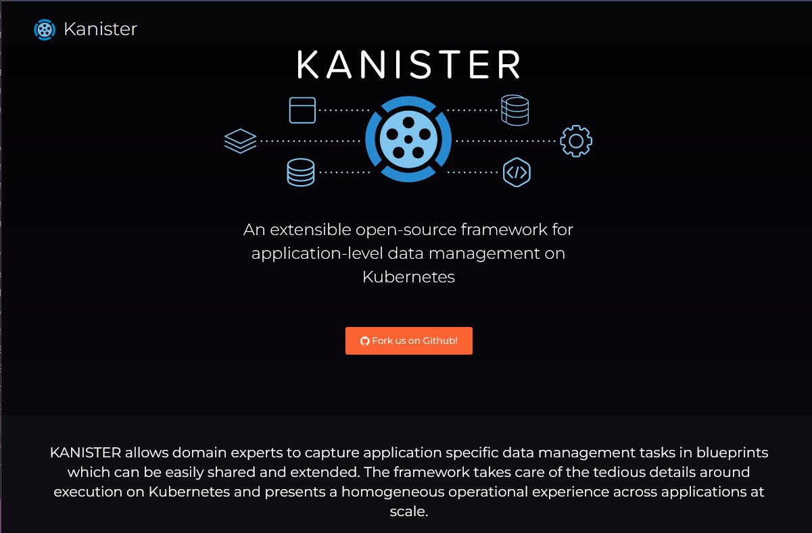

## Copias de seguridad enfocadas en aplicaciones

Ya hemos dedicado tiempo a hablar sobre servicios de datos o aplicaciones intensivas en datos, como las bases de datos en [Día 85](day85.md). Para estos servicios de datos, debemos considerar cómo gestionamos la consistencia, especialmente cuando se trata de la consistencia de la aplicación.

En esta publicación, profundizaremos en ese requisito de proteger de manera consistente los datos de la aplicación.

Para hacer esto, nuestra herramienta elegida será [Kanister](https://kanister.io/).



### Introducción a Kanister

Kanister es un proyecto de código abierto de Kasten que nos permite gestionar (hacer copias de seguridad y restaurar) los datos de la aplicación en Kubernetes. Puedes implementar Kanister como una aplicación Helm en tu clúster de Kubernetes.

Kanister utiliza recursos personalizados de Kubernetes. Los recursos personalizados principales que se instalan al implementar Kanister son:

- `Profile` (perfil): es un lugar de destino para almacenar tus copias de seguridad y recuperarlas. Por lo general, esto será un almacenamiento de objetos.
- `Blueprint` (diseño): los pasos que se deben seguir para hacer una copia de seguridad y restaurar la base de datos se deben mantener en el blueprint.
- `ActionSet` (conjunto de acciones): es el movimiento para mover nuestra copia de seguridad objetivo a nuestro perfil, así como las acciones de restauración.

### Ejecución paso a paso

Antes de comenzar, debemos echar un vistazo al flujo de trabajo que Kanister sigue para proteger los datos de la aplicación. En primer lugar, implementamos nuestro controlador mediante Helm en nuestro clúster de Kubernetes. Kanister se ejecuta en su propio espacio de nombres (namespace). A continuación, tomamos nuestro Blueprint, del cual hay muchos blueprints respaldados por la comunidad disponibles. Cubriremos esto en más detalle en breve. Luego, tenemos nuestra carga de trabajo de la base de datos.


A continuación, creamos nuestro ActionSet.


El ActionSet nos permite ejecutar las acciones definidas en el blueprint contra el servicio de datos específico.


A su vez, el ActionSet utiliza las funciones de Kanister (KubeExec, KubeTask, Resource Lifecycle) y envía nuestra copia de seguridad a nuestro repositorio de destino (Profile).


Si la acción se completa o falla, el estado respectivo se actualiza en el ActionSet.


### Implementación de Kanister

Una vez más, utilizaremos el clúster minikube para lograr esta copia de seguridad de la aplicación. Si todavía lo tienes en ejecución desde la sesión anterior, podemos seguir usándolo.

En el momento de escribir esto, estamos en la versión de imagen 0.75.0. Con el siguiente comando de Helm, instalaremos Kanister en nuestro clúster de Kubernetes:
```sh
helm install kanister --namespace kanister kanister/kanister-operator --set image.tag=0.75.0 --create-namespace
```


Podemos usar kubectl get pods -n kanister para asegurarnos de que el pod esté en funcionamiento y también podemos verificar que las definiciones de recursos personal.


### Despliegue de una base de datos

Desplegar MySQL mediante Helm:

```Shell
APP_NAME=my-production-app
kubectl create ns ${APP_NAME}
helm repo add bitnami https://charts.bitnami.com/bitnami
helm install mysql-store bitnami/mysql --set primary.persistence.size=1Gi,volumePermissions.enabled=true --namespace=${APP_NAME}
kubectl get pods -n ${APP_NAME} -w
```


Rellenar la base de datos de MySQL con datos iniciales y ejecutar lo siguiente:

```Shell
MYSQL_ROOT_PASSWORD=$(kubectl get secret --namespace ${APP_NAME} mysql-store -o jsonpath="{.data.mysql-root-password}" | base64 --decode)
MYSQL_HOST=mysql-store.${APP_NAME}.svc.cluster.local
MYSQL_EXEC="mysql -h ${MYSQL_HOST} -u root --password=${MYSQL_ROOT_PASSWORD} -DmyImportantData -t"
echo MYSQL_ROOT_PASSWORD=${MYSQL_ROOT_PASSWORD}
```

### Crear un CLIENTE de MySQL

Ejecutaremos otra imagen de contenedor para actuar como nuestro cliente:

```Shell
APP_NAME=my-production-app
kubectl run mysql-client --rm --env APP_NS=${APP_NAME} --env MYSQL_EXEC="${MYSQL_EXEC}" --env MYSQL_ROOT_PASSWORD=${MYSQL_ROOT_PASSWORD} --env MYSQL_HOST=${MYSQL_HOST} --namespace ${APP_NAME} --tty -i --restart='Never' --image  docker.io/bitnami/mysql:latest --command -- bash
```

```Shell
Note: if you already have an existing MySQL client pod running, delete with the command

kubectl delete pod -n ${APP_NAME} mysql-client
```

### Agregar datos a MySQL

```Shell
echo "create database myImportantData;" | mysql -h ${MYSQL_HOST} -u root --password=${MYSQL_ROOT_PASSWORD}
MYSQL_EXEC="mysql -h ${MYSQL_HOST} -u root --password=${MYSQL_ROOT_PASSWORD} -DmyImportantData -t"
echo "drop table Accounts" | ${MYSQL_EXEC}
echo "create table if not exists Accounts(name text, balance integer); insert into Accounts values('nick', 0);" |  ${MYSQL_EXEC}
echo "insert into Accounts values('albert', 112);" | ${MYSQL_EXEC}
echo "insert into Accounts values('alfred', 358);" | ${MYSQL_EXEC}
echo "insert into Accounts values('beatrice', 1321);" | ${MYSQL_EXEC}
echo "insert into Accounts values('bartholomew', 34);" | ${MYSQL_EXEC}
echo "insert into Accounts values('edward', 5589);" | ${MYSQL_EXEC}
echo "insert into Accounts values('edwin', 144);" | ${MYSQL_EXEC}
echo "insert into Accounts values('edwina', 233);" | ${MYSQL_EXEC}
echo "insert into Accounts values('rastapopoulos', 377);" | ${MYSQL_EXEC}
echo "select * from Accounts;" |  ${MYSQL_EXEC}
exit
```

Deberías poder ver algunos datos como se muestra a continuación.


### Crear perfil Kanister

Kanister proporciona una CLI, `kanctl`, y otra utilidad, `kando`, que se utiliza para interactuar con tu proveedor de almacenamiento de objetos desde el blueprint y ambas utilidades.

[Descarga de la CLI](https://docs.kanister.io/tooling.html#tooling)

He creado un bucket de AWS S3 que utilizaremos como destino de nuestro perfil y ubicación de restauración. Voy a utilizar variables de entorno para mostrar los comandos que ejecuto con kanctl para crear nuestro perfil Kanister.
```sh
kanctl create profile s3compliant --access-key $ACCESS_KEY --secret-key $SECRET_KEY --bucket $BUCKET --region eu-west-2 --namespace my-production-app
```


### Blueprint

No te preocupes, no necesitas crear uno desde cero a menos que tu servicio de datos no esté listado aquí en los [Ejemplos de Kanister](https://github.com/kanisterio/kanister/tree/master/examples), pero, por supuesto, las contribuciones de la comunidad son la forma en que este proyecto gana visibilidad.

El blueprint que utilizaremos será el siguiente:

```Shell
apiVersion: cr.kanister.io/v1alpha1
kind: Blueprint
metadata:
  name: mysql-blueprint
actions:
  backup:
    outputArtifacts:
      mysqlCloudDump:
        keyValue:
          s3path: "{{ .Phases.dumpToObjectStore.Output.s3path }}"
    phases:
    - func: KubeTask
      name: dumpToObjectStore
      objects:
        mysqlSecret:
          kind: Secret
          name: '{{ index .Object.metadata.labels "app.kubernetes.io/instance" }}'
          namespace: '{{ .StatefulSet.Namespace }}'
      args:
        image: ghcr.io/kanisterio/mysql-sidecar:0.75.0
        namespace: "{{ .StatefulSet.Namespace }}"
        command:
        - bash
        - -o
        - errexit
        - -o
        - pipefail
        - -c
        - |
          s3_path="/mysql-backups/{{ .StatefulSet.Namespace }}/{{ index .Object.metadata.labels "app.kubernetes.io/instance" }}/{{ toDate "2006-01-02T15:04:05.999999999Z07:00" .Time  | date "2006-01-02T15-04-05" }}/dump.sql.gz"
          root_password="{{ index .Phases.dumpToObjectStore.Secrets.mysqlSecret.Data "mysql-root-password" | toString }}"
          mysqldump --column-statistics=0 -u root --password=${root_password} -h {{ index .Object.metadata.labels "app.kubernetes.io/instance" }} --single-transaction --all-databases | gzip - | kando location push --profile '{{ toJson .Profile }}' --path ${s3_path} -
          kando output s3path ${s3_path}
  restore:
    inputArtifactNames:
    - mysqlCloudDump
    phases:
    - func: KubeTask
      name: restoreFromBlobStore
      objects:
        mysqlSecret:
          kind: Secret
          name: '{{ index .Object.metadata.labels "app.kubernetes.io/instance" }}'
          namespace: '{{ .StatefulSet.Namespace }}'
      args:
        image: ghcr.io/kanisterio/mysql-sidecar:0.75.0
        namespace: "{{ .StatefulSet.Namespace }}"
        command:
        - bash
        - -o
        - errexit
        - -o
        - pipefail
        - -c
        - |
          s3_path="{{ .ArtifactsIn.mysqlCloudDump.KeyValue.s3path }}"
          root_password="{{ index .Phases.restoreFromBlobStore.Secrets.mysqlSecret.Data "mysql-root-password" | toString }}"
          kando location pull --profile '{{ toJson .Profile }}' --path ${s3_path} - | gunzip | mysql -u root --password=${root_password} -h {{ index .Object.metadata.labels "app.kubernetes.io/instance" }}
  delete:
    inputArtifactNames:
    - mysqlCloudDump
    phases:
    - func: KubeTask
      name: deleteFromBlobStore
      args:
        image: ghcr.io/kanisterio/mysql-sidecar:0.75.0
        namespace: "{{ .Namespace.Name }}"
        command:
        - bash
        - -o
        - errexit
        - -o
        - pipefail
        - -c
        - |
          s3_path="{{ .ArtifactsIn.mysqlCloudDump.KeyValue.s3path }}"
          kando location delete --profile '{{ toJson .Profile }}' --path ${s3_path}
```

Para agregar esto, utilizaremos el comando `kubectl create -f mysql-blueprint.yml -n kanister`.


### Crear nuestro ActionSet y proteger nuestra aplicación

Ahora realizaremos una copia de seguridad de los datos de MySQL utilizando un ActionSet que define la copia de seguridad para esta aplicación. Crea un ActionSet en el mismo namespace que el controlador.
```sh
kubectl get profiles.cr.kanister.io -n my-production-app
```

Este comando nos mostrará el perfil que creamos anteriormente. Podemos tener múltiples perfiles configurados aquí, por lo que podemos usar perfiles específicos para diferentes ActionSets.

Luego, crearemos nuestro ActionSet con el siguiente comando utilizando `kanctl`:
```sh
kanctl create actionset --action backup --namespace kanister --blueprint mysql-blueprint --statefulset my-production-app/mysql-store --profile my-production-app/s3-profile-dc5zm --secrets mysql=my-production-app/mysql-store
```

En el comando anterior, estamos definiendo el blueprint que agregamos al namespace, el statefulset en nuestro namespace `my-production-app` y también los secretos para acceder a la aplicación MySQL.


Verifica el estado del ActionSet utilizando el nombre del ActionSet con el siguiente comando: kubectl --namespace kanister describe actionset backup-qpnqv.

Finalmente, podemos confirmar que ahora tenemos datos en nuestro bucket de AWS S3.


### Restauración

Necesitamos causar algún daño antes de poder restaurar algo, podemos hacer esto eliminando nuestra tabla, tal vez fue un accidente, tal vez no lo fue.

Conéctate a nuestro pod de MySQL.

```Shell
APP_NAME=my-production-app
kubectl run mysql-client --rm --env APP_NS=${APP_NAME} --env MYSQL_EXEC="${MYSQL_EXEC}" --env MYSQL_ROOT_PASSWORD=${MYSQL_ROOT_PASSWORD} --env MYSQL_HOST=${MYSQL_HOST} --namespace ${APP_NAME} --tty -i --restart='Never' --image  docker.io/bitnami/mysql:latest --command -- bash
```

Puedes ver que nuestra base de datos importantdata está ahí con `echo "SHOW DATABASES;" | ${MYSQL_EXEC}`.

Luego, para eliminarla, ejecutamos `echo "DROP DATABASE myImportantData;" | ${MYSQL_EXEC}`.

Y confirmamos que se haya eliminado con algunos intentos de mostrar nuestra base de datos.


Ahora podemos usar Kanister para restaurar nuestros datos importantes utilizando el comando `kubectl get actionset -n kanister` para encontrar el nombre del ActionSet que tomamos anteriormente. Luego, crearemos un ActionSet de restauración para restaurar nuestros datos usando `kanctl create actionset -n kanister --action restore --from "backup-qpnqv`".


Podemos confirmar que nuestros datos están de vuelta en nuestro pod de MySQL.

```Shell
APP_NAME=my-production-app
kubectl run mysql-client --rm --env APP_NS=${APP_NAME} --env MYSQL_EXEC="${MYSQL_EXEC}" --env MYSQL_ROOT_PASSWORD=${MYSQL_ROOT_PASSWORD} --env MYSQL_HOST=${MYSQL_HOST} --namespace ${APP_NAME} --tty -i --restart='Never' --image  docker.io/bitnami/mysql:latest --command -- bash
```

Ahora estamos dentro del Cliente de MySQL, podemos ejecutar `echo "SHOW DATABASES;" | ${MYSQL_EXEC}` y podemos ver que la base de datos está de vuelta. También podemos ejecutar `echo "select * from Accounts;" | ${MYSQL_EXEC}` para verificar el contenido de la base de datos y nuestros datos importantes están restaurados.


En la próxima publicación, veremos la Recuperación de Desastres dentro de Kubernetes.

## Recursos

- [Kanister Overview - An extensible open-source framework for app-lvl data management on Kubernetes](https://www.youtube.com/watch?v=wFD42Zpbfts)
- [Application Level Data Operations on Kubernetes](https://community.cncf.io/events/details/cncf-cncf-online-programs-presents-cncf-live-webinar-kanister-application-level-data-operations-on-kubernetes/)
- [Kubernetes Backup and Restore made easy!](https://www.youtube.com/watch?v=01qcYSck1c4&t=217s)
- [Kubernetes Backups, Upgrades, Migrations - with Velero](https://www.youtube.com/watch?v=zybLTQER0yY)
- [7 Database Paradigms](https://www.youtube.com/watch?v=W2Z7fbCLSTw&t=520s)
- [Disaster Recovery vs. Backup: What's the difference?](https://www.youtube.com/watch?v=07EHsPuKXc0)
- [Veeam Portability & Cloud Mobility](https://www.youtube.com/watch?v=hDBlTdzE6Us&t=3s)

Nos vemos en el [Día 89](day89.md)
