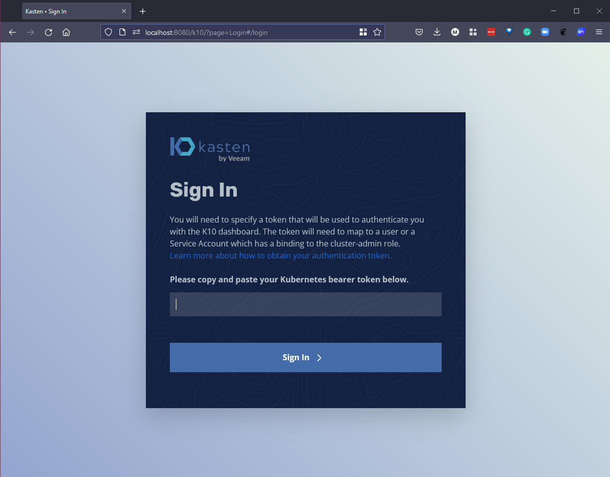
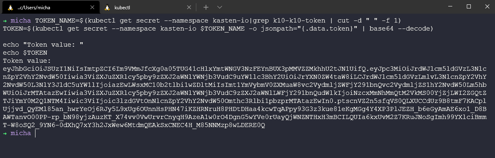
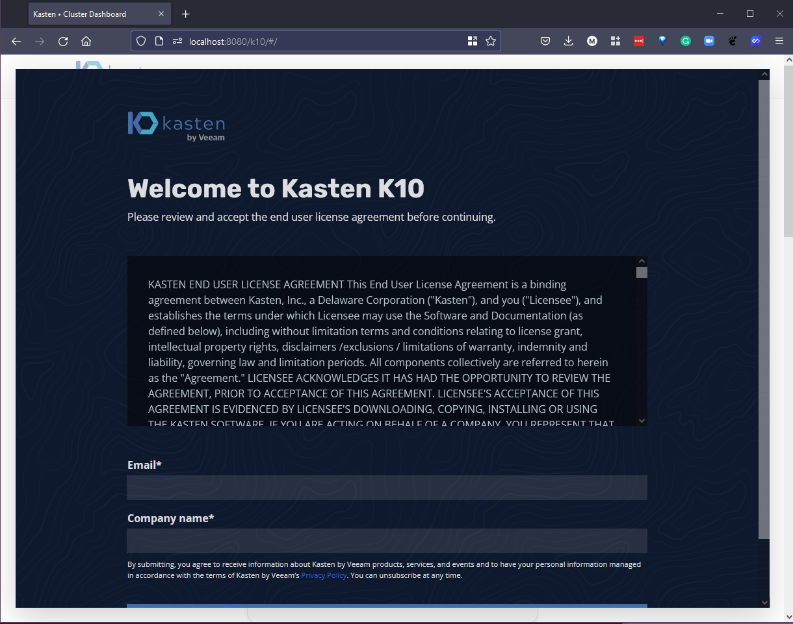

## Recuperación de desastres

Ya hemos mencionado cómo diferentes escenarios de falla requerirán diferentes requisitos de recuperación. Cuando se trata de escenarios de incendio, inundación y sangre, podemos considerarlos como situaciones de desastre en las que es posible que necesitemos que nuestras cargas de trabajo estén en funcionamiento en una ubicación completamente diferente lo más rápido posible, o al menos con objetivos de tiempo de recuperación cercanos a cero (RTO).

Esto solo se puede lograr a gran escala cuando se automatiza la replicación de la pila de aplicaciones completa en un entorno de espera.

Esto permite una conmutación por error rápida entre regiones en la nube, proveedores de nube o entre infraestructura local y en la nube.

Siguiendo con el tema hasta ahora, nos vamos a concentrar en cómo se puede lograr esto utilizando Kasten K10 utilizando el clúster de minikube que implementamos y configuramos hace algunas sesiones.

Luego crearemos otro clúster de minikube con Kasten K10 también instalado para actuar como nuestro clúster de espera, que en teoría podría ser cualquier ubicación.

Kasten K10 también tiene funcionalidad incorporada para asegurar que si algo le sucede al clúster de Kubernetes en el que se está ejecutando, los datos del catálogo se repliquen y estén disponibles en un nuevo clúster [Recuperación de desastres de K10](https://docs.kasten.io/latest/operating/dr.html).

### Agregar almacenamiento de objetos a K10

Lo primero que debemos hacer es agregar un bucket de almacenamiento de objetos como ubicación de destino para que nuestras copias de seguridad se almacenen. Esto no solo actúa como una ubicación externa, sino que también podemos aprovecharlo como nuestros datos de origen para la recuperación de desastres.

He limpiado el bucket de S3 que creamos para la demostración de Kanister en la última sesión.

Reenvíe el puerto para acceder al panel de control de K10. Abra una nueva terminal y ejecute el siguiente comando:
```bash
kubectl --namespace kasten-io port-forward service/gateway 8080:8000
```

El panel de control de Kasten estará disponible en `http://127.0.0.1:8080/k10/#/`



Para autenticarse en el panel de control, ahora necesitamos el token que podemos obtener con los siguientes comandos.

```Shell
TOKEN_NAME=$(kubectl get secret --namespace kasten-io|grep k10-k10-token | cut -d " " -f 1)
TOKEN=$(kubectl get secret --namespace kasten-io $TOKEN_NAME -o jsonpath="{.data.token}" | base64 --decode)

echo "Token value: "
echo $TOKEN
```



Ahora tomamos este token y lo ingresamos en nuestro navegador. Luego se le pedirá un correo electrónico y el nombre de la empresa.



Luego obtendremos acceso al panel de control de Kasten K10.


Ahora que volvemos al panel de control de Kasten K10, podemos agregar nuestro perfil de ubicación. Seleccione "Configuración" en la parte superior de la página y luego "Nuevo perfil".


Desde la imagen a continuación, puedes ver que tenemos una opción cuando se trata de la ubicación de este perfil. Vamos a seleccionar Amazon S3 y agregaremos nuestras credenciales de acceso sensibles, región y nombre del bucket.


Si nos desplazamos hacia abajo en la ventana de creación del Nuevo perfil, veremos que también podemos habilitar copias de seguridad inmutables que aprovechan la API de bloqueo de objetos de S3. Para esta demostración, no vamos a utilizar eso.


Haz clic en "Guardar perfil" y ahora puedes ver nuestro perfil de ubicación recién creado o agregado como se muestra a continuación.


### Crear una política para proteger la aplicación Pac-Man en el almacenamiento de objetos

En la sesión anterior, creamos solo una instantánea ad hoc de nuestra aplicación Pac-Man, por lo tanto, necesitamos crear una política de respaldo que envíe nuestras copias de seguridad de la aplicación a nuestra ubicación de almacenamiento de objetos recién creada.

Si regresas al panel de control y seleccionas la tarjeta de Política, verás una pantalla como se muestra a continuación. Selecciona "Crear nueva política".


Primero, podemos darle a nuestra política un nombre útil y una descripción. También podemos definir la frecuencia de respaldo. Para fines de demostración, estoy usando "bajo demanda".


A continuación, queremos habilitar las copias de seguridad a través de exportaciones de instantáneas, lo que significa que queremos enviar nuestros datos a nuestro perfil de ubicación. Si tienes varios perfiles, puedes seleccionar a cuál de ellos quieres enviar tus copias de seguridad.


A continuación, seleccionamos la aplicación por nombre o etiquetas. Voy a elegir por nombre y todos los recursos.


En la configuración avanzada, no vamos a usar ninguna de estas opciones, pero según nuestro [recorrido de Kanister de ayer](https://github.com/MichaelCade/90DaysOfDevOps/blob/main/Days/day88.md), también podemos aprovechar Kanister como parte de Kasten K10 para obtener copias coherentes de la aplicación de nuestros datos.


Finalmente, selecciona "Crear política" y ahora verás la política en nuestra ventana de Políticas.


En la parte inferior de la política creada, tendrás "Mostrar detalles de importación". Necesitamos esta cadena para poder importarla en nuestro clúster de espera. Copia esto en algún lugar seguro por ahora.


Antes de continuar, solo necesitamos seleccionar "ejecutar una vez" para que se envíe una copia de seguridad a nuestro bucket de almacenamiento de objetos.


A continuación, la captura de pantalla muestra el respaldo y la exportación exitosos de nuestros datos.


### Crear un nuevo clúster MiniKube e implementar K10

Luego, necesitamos implementar un segundo clúster de Kubernetes y esto puede ser cualquier versión admitida de Kubernetes, incluido OpenShift. Para fines educativos, utilizaremos la versión gratuita de MiniKube con un nombre diferente.

Usando el comando `minikube start --addons volumesnapshots,csi-hostpath-driver --apiserver-port=6443 --container-runtime=containerd -p standby --kubernetes-version=1.21.2`, podemos crear nuestro nuevo clúster.


Luego, podemos implementar Kasten K10 en este clúster utilizando el siguiente comando:

```Shell
helm install k10 kasten/k10 --namespace=kasten-io --set auth.tokenAuth.enabled=true --set injectKanisterSidecar.enabled=true --set-string injectKanisterSidecar.namespaceSelector.matchLabels.k10/injectKanisterSidecar=true --create-namespace
```

Esto llevará un tiempo, pero mientras tanto, podemos utilizar el comando `kubectl get pods -n kasten-io -w` para seguir el progreso de nuestros pods hasta que estén en estado de ejecución.

Vale la pena señalar que, debido a que estamos usando MiniKube, nuestra aplicación se ejecutará cuando ejecutemos nuestra política de importación. Sin embargo, algo que cubriremos en la última sesión es la movilidad y la transformación.

Una vez que los pods estén en ejecución, podemos seguir los pasos que realizamos en los pasos anteriores en el otro clúster.

Reenvía el puerto para acceder al panel de control de K10. Abre una nueva terminal y ejecuta el siguiente comando:
```Shell
kubectl --namespace kasten-io port-forward service/gateway 8080:8000
```

El panel de control de Kasten estará disponible en http://127.0.0.1:8080/k10/#/


Para autenticar en el panel de control, ahora necesitamos el token que podemos obtener con los siguientes comandos:

```Shell
TOKEN_NAME=$(kubectl get secret --namespace kasten-io|grep k10-k10-token | cut -d " " -f 1)
TOKEN=$(kubectl get secret --namespace kasten-io $TOKEN_NAME -o jsonpath="{.data.token}" | base64 --decode)

echo "Token value: "
echo $TOKEN
```


Ahora tomamos este token y lo ingresamos en nuestro navegador, luego se te pedirá un correo electrónico y el nombre de la empresa.


Luego obtenemos acceso al panel de control de Kasten K10.


### Importar Pac-Man en el nuevo clúster MiniKube

En este punto, ahora podemos crear una política de importación en ese clúster de espera y conectarnos a las copias de seguridad de almacenamiento de objetos y determinar qué y cómo queremos que se vea.

Primero, agregamos nuestro perfil de ubicación que revisamos anteriormente en el otro clúster. Aquí mostramos el modo oscuro para mostrar la diferencia entre nuestro sistema de producción y nuestra ubicación de espera para recuperación ante desastres.


Ahora volvemos al panel de control y a la pestaña de políticas para crear una nueva política.


Crea la política de importación según la imagen siguiente. Cuando esté completa, podemos crear una política. Aquí hay opciones para restaurar después de la importación y algunas personas podrían querer esta opción, esto se irá y se restaurará en nuestro clúster de espera al completarse. También podemos cambiar la configuración de la aplicación mientras se restaura, y esto es lo que he documentado en [Día 90](day90.md).


Seleccioné importar bajo demanda, pero puedes programar el momento en que deseas que ocurra esta importación. Debido a esto, voy a ejecutarlo una vez.


A continuación, puedes ver el trabajo exitoso de la política de importación.


Si volvemos al panel de control y seleccionamos la tarjeta de "Aplicaciones", luego podemos seleccionar el menú desplegable donde ves "Eliminado" y veremos nuestra aplicación aquí. Selecciona "Restaurar".


Aquí podemos ver los puntos de restauración que tenemos disponibles; este fue el trabajo de copia de seguridad que ejecutamos en el clúster principal para nuestra aplicación Pac-Man.


No voy a cambiar ninguno de los valores predeterminados, ya que quiero cubrir esto con más detalle en la próxima sesión.


Cuando presiones "Restaurar", te pedirá confirmación.


A continuación, podemos ver que estamos en el clúster de espera y si verificamos nuestros pods, veremos que nuestra aplicación se está ejecutando.


Luego podemos redirigir el puerto (en entornos de producción reales, no necesitarías este paso para acceder a la aplicación, estarías utilizando el enrutamiento).


A continuación, echaremos un vistazo a la movilidad y transformación de aplicaciones.

## Recursos

- [Kubernetes Backup and Restore made easy!](https://www.youtube.com/watch?v=01qcYSck1c4&t=217s)
- [Kubernetes Backups, Upgrades, Migrations - with Velero](https://www.youtube.com/watch?v=zybLTQER0yY)
- [7 Database Paradigms](https://www.youtube.com/watch?v=W2Z7fbCLSTw&t=520s)
- [Disaster Recovery vs. Backup: What's the difference?](https://www.youtube.com/watch?v=07EHsPuKXc0)
- [Veeam Portability & Cloud Mobility](https://www.youtube.com/watch?v=hDBlTdzE6Us&t=3s)

Nos vemos en el [Día 90](day90.md)
