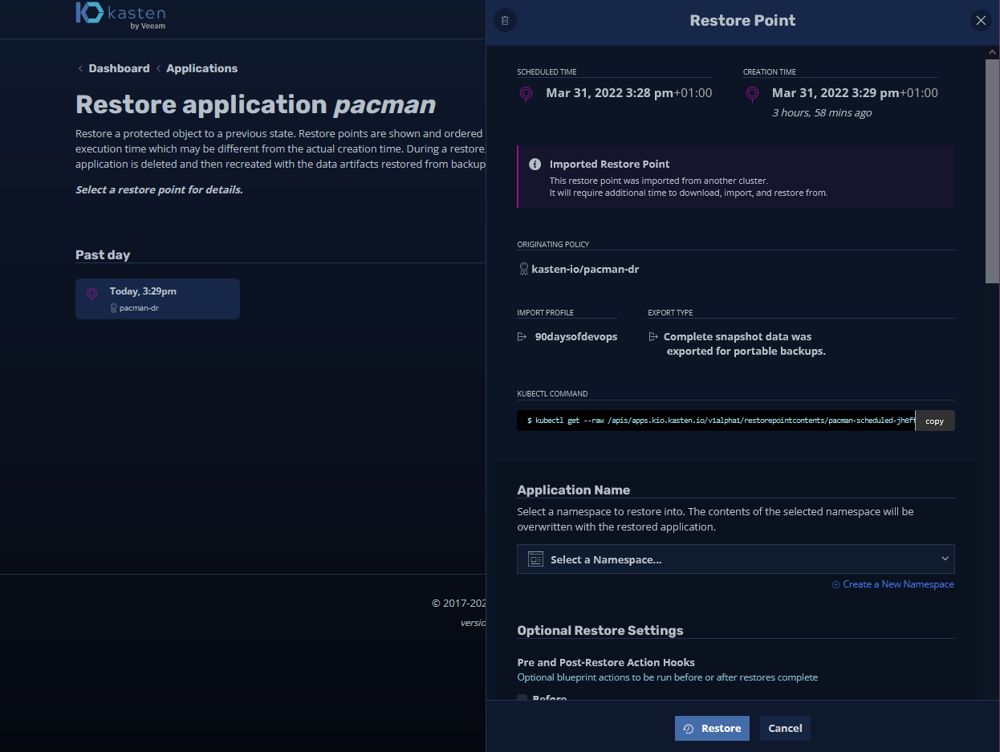

## Movilidad de datos y aplicaciones

Día 90 del desafío #90DaysOfDevOps. En esta última sesión, cubriré la movilidad de nuestros datos y aplicaciones. Me enfocaré específicamente en Kubernetes, pero el requisito de movilidad se aplica tanto dentro de plataformas como entre ellas, y es algo que cada vez se demanda más en el campo.

El caso de uso es "quiero mover mi carga de trabajo, aplicación y datos de una ubicación a otra" por muchas razones diferentes, como el costo, el riesgo o para brindar un mejor servicio a la empresa.

En esta sesión, vamos a tomar nuestra carga de trabajo y vamos a ver cómo mover una carga de trabajo de Kubernetes de un clúster a otro, pero al hacerlo, vamos a cambiar cómo está nuestra aplicación en la ubicación de destino.

Se utilizan muchas de las características que hemos revisado en [Recuperación de desastres](day89.md).

### **El requisito**

Nuestro clúster actual de Kubernetes no puede manejar la demanda y nuestros costos están aumentando rápidamente. Es una decisión empresarial que queremos mover nuestro clúster de producción de Kubernetes a nuestra ubicación de recuperación ante desastres, que se encuentra en una nube pública diferente que nos permitirá expandirnos pero a un costo más bajo. También podríamos aprovechar algunos de los servicios nativos de la nube disponibles en la nube de destino.

Nuestra aplicación crítica para la misión actual (Pac-Man) tiene una base de datos (MongoDB) y se ejecuta en un almacenamiento lento. Nos gustaría pasar a un nivel de almacenamiento más nuevo y rápido.

La interfaz de usuario actual de Pac-Man (NodeJS) no escala muy bien y nos gustaría aumentar el número de pods disponibles en la nueva ubicación.

### Llegando a eso

Ya tenemos nuestra descripción y, de hecho, ya tenemos nuestras importaciones llegando al clúster de Kubernetes de recuperación ante desastres.

El primer trabajo que debemos hacer es eliminar la operación de restauración que realizamos en el Día 89 para las pruebas de recuperación ante desastres.

Podemos hacer esto usando `kubectl delete ns pacman` en el clúster "standby" de minikube.

Para comenzar, vaya al panel de control de Kasten K10 y seleccione la tarjeta "Applications". En el menú desplegable, elija "Removed" (Eliminado).

Luego obtendremos una lista de los puntos de restauración disponibles. Seleccionaremos el que está disponible, ya que contiene nuestros datos críticos para la misión. (En este ejemplo, solo tenemos un punto de restauración único).

Cuando trabajamos en el proceso de recuperación ante desastres, dejamos todo como predeterminado. Sin embargo, estas opciones adicionales de restauración están ahí si tienes un proceso de recuperación ante desastres que requiere la transformación de tu aplicación. En este caso, necesitamos cambiar nuestro almacenamiento y el número de réplicas.

Selecciona la opción "Aplicar transformaciones a los recursos restaurados".

Resulta que los dos ejemplos incorporados para la transformación que queremos realizar son justo lo que necesitamos para nuestros requisitos.

El primer requisito es que en nuestro clúster principal estábamos utilizando una clase de almacenamiento llamada `csi-hostpath-sc`, y en nuestro nuevo clúster nos gustaría usar `standard`, por lo que podemos hacer ese cambio aquí.

Se ve bien, pulsa el botón de crear transformación en la parte inferior.

El siguiente requisito es que nos gustaría escalar nuestra implementación de la interfaz de usuario de Pac-Man a "5".

Si estás siguiendo, deberías ver ambas transformaciones como se muestra a continuación.

Ahora puedes ver en la siguiente imagen que vamos a restaurar todos los artefactos enumerados a continuación. Si quisieras, también podríamos ser más detallados sobre lo que queremos restaurar. Pulsa el botón "Restore" (Restaurar).

Una vez más, se nos pedirá que confirmemos las acciones.

Lo último que se mostrará ahora es que si volvemos a la terminal y observamos nuestro clúster, verás que ahora tenemos 5 pods para los pods de Pacman y nuestra clase de almacenamiento ahora está configurada como estándar en lugar de csi-hostpath-sc.

Se pueden lograr muchas opciones diferentes a través de la transformación. Esto no solo abarca la migración, sino también los escenarios de recuperación ante desastres, pruebas y desarrollo, y más.

### API y automatización

No he hablado sobre la capacidad de aprovechar la API y automatizar algunas de estas tareas, pero estas opciones están presentes y a lo largo de la interfaz de usuario se proporcionan comandos para aprovechar las API en tareas de automatización.

Lo importante a tener en cuenta acerca de Kasten K10 es que, al implementarlo, se despliega dentro del clúster de Kubernetes y luego se puede llamar a través de la API de Kubernetes.

Esto concluye la sección sobre almacenar y proteger tus datos.

## Recursos

- [Kubernetes Backup and Restore made easy!](https://www.youtube.com/watch?v=01qcYSck1c4&t=217s)
- [Kubernetes Backups, Upgrades, Migrations - with Velero](https://www.youtube.com/watch?v=zybLTQER0yY)
- [7 Database Paradigms](https://www.youtube.com/watch?v=W2Z7fbCLSTw&t=520s)
- [Disaster Recovery vs. Backup: What's the difference?](https://www.youtube.com/watch?v=07EHsPuKXc0)
- [Veeam Portability & Cloud Mobility](https://www.youtube.com/watch?v=hDBlTdzE6Us&t=3s)

### **Cierre**

Al finalizar este desafío, quiero seguir solicitando comentarios para asegurarme de que la información siempre sea relevante y este actualizada.

También aprecio que hay muchos temas sobre los que no pude profundizar o no pude cubrir en profundidad en relación con los temas de DevOps.

Esto significa que el próximo año seguramente se vuelva a hacer otra edicción con otros 90 días de contenido y ejercicios prácticos para trabajar.

### ¿Qué sigue?

En primer lugar, un descanso de la escritura por un tiempo. Comencé este desafío el 1 de enero de 2022 y lo terminé el 31 de marzo de 2022 a las 19:50 BST. Ha sido agotador. Pero como he dicho durante mucho tiempo, si este contenido ayuda a una persona, siempre vale la pena aprender en público.

Tengo algunas ideas sobre qué hacer a continuación y con suerte, esto tendrá vida más allá de un repositorio de GitHub, y podremos crear un libro electrónico e incluso un libro físico.

También sé que necesitamos revisar cada publicación y asegurarnos de que todo esté gramaticalmente correcto antes de hacer que algo así suceda. Si alguien sabe cómo convertir el markdown en impresión o en un libro electrónico, agradecería mucho los comentarios.

Como siempre, sigan enviando issues y Pull Request.

Gracias!

@MichaelCade1

- [GitHub](https://github.com/MichaelCade)
- [Twitter](https://twitter.com/MichaelCade1)

Traducción por Manuel

- [GitHub](https://github.com/manuelver)
- [Web](https://vergaracarmona.es)
