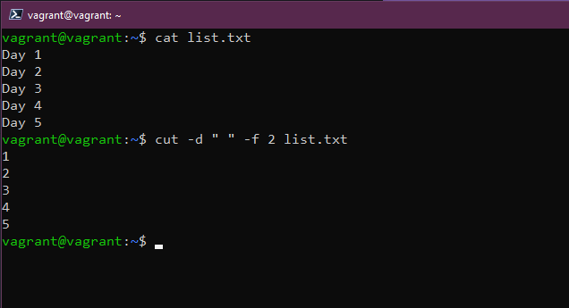

## DevOpsのためのLinuxコマンド

[昨日](day14.md)、私たちはターミナルで多くの時間を費やしてコマンドを実行することになるだろうと書きました。

また、Vagrant でプロビジョニングした VM で `vagrant ssh` を使って、私たちのマシンにアクセスできることを述べました。プロビジョニングしたのと同じディレクトリにいる必要があります。

SSHではユーザー名とパスワードは不要です。Virtual Boxのコンソールにログインする場合のみ必要です。

このディレクトリは以下のようになります。


## コマンド

もちろん、ここですべてのコマンドをカバーすることはできません。これらのコマンドをカバーするドキュメントは何ページもありますが、ターミナルで特定のコマンドのオプションを理解する必要がある場合、マニュアルを短くした `man` ページがあります。この記事で触れた各コマンドについて、このページを使ってさらに詳しいオプションを確認することができます。`man man`を実行すると、マニュアルページのヘルプが表示されます。マニュアルページから抜けるには、`q`を押してください。


`sudo` Windows や右クリックの `管理者として実行` に慣れているなら、`sudo` はまさにこれだと考えることができます。このコマンドでコマンドを実行すると、`root`として実行することになり、コマンドを実行する前にパスワードの入力が要求されます。


アプリケーションやサービスをインストールするような単発の作業では `sudo コマンド` が必要かもしれませんが、いくつかの作業があり、しばらくの間 `sudo` として生活したい場合はどうすればいいでしょうか。この場合、`sudo su` を使用します。`sudo` と同じように、一度入力すると `root` パスワードを要求されます。私たちのようなテスト用VMでは問題ありませんが、長時間`root`として動き回るのは大変なことです。この高い位置から抜け出すには、単に `exit` と入力してください。


私はいつも `clear` を使っています。`clear` コマンドはその名の通り、それまでのコマンドをすべて消去し、プロンプトを一番上に持ってきて、きれいなワークスペースにします。Windows では .mdprompt にある `cls` がそうだと思います。


まず最初に `mkdir` を使ってシステム内にフォルダーを作成します。次のコマンドで、ホームディレクトリに Day15 という名前のフォルダを作成することができます。


`cd` を使用すると、ディレクトリを変更することができます。新しく作成したディレクトリに移動するには、 `cd Day15` タブを使用して、使用可能なディレクトリを自動で補完することができます。もし、最初に作ったディレクトリに戻りたい場合は、 `cd ..` を使用します。


`rmdir` でディレクトリを削除できます。`rmdir Day15` を実行すると、フォルダが削除されます (フォルダに何も入っていない場合のみ動作することに注意してください)。


私たちは皆、ファイルシステムの奥深くにあるディレクトリまで移動し、どこにいるのかわからなくなったことがあると思います。pwd` は作業ディレクトリを表示します。pwd はパスワードのように見えますが、print working directory の略です。


フォルダやディレクトリを作成する方法は知っていますが、ファイルを作成するにはどうしたらよいのでしょうか？ファイルを作るには `touch` コマンドを使います。例えば、`touch Day15` と実行すると、ファイルが作成されます。mkdir` は無視してください、後でまた見ることになります。


このコマンドは、カレントディレクトリにあるすべてのファイルとフォルダーをリストアップしてくれます。先ほど作成したファイルが見えるかどうか見てみましょう。


Linux システムでファイルを探すにはどうしたらいいのでしょうか？`locate` を使うと、ファイルシステムを検索することができます。もし `locate Day15` を使うと、そのファイルの場所が報告されます。ボーナスラウンドとして、もしファイルが存在することが分かっているのに空白の結果が返ってきたら、 `sudo updatedb` を実行して、ファイルシステム内のすべてのファイルのインデックスを作成して、もう一度 `locate` を実行してみてください。もし `locate` がない場合は、次のコマンドでインストールすることができます ( `sudo apt install mlocate` )。


ある場所から別の場所にファイルを移動するのはどうでしょうか。`mv`を使うとファイルを移動することができます。例：`mv Day15 90DaysOfDevOps` は 90DaysOfDevOps フォルダにファイルを移動します。


ファイルを移動させましたが、今度は別の名前に変えたいとしたらどうしますか？それはまた `mv` コマンドを使えばいいのです...。`mv day15 day15` を使って大文字にしたり、`mv day15 AnotherDay` を使って完全に変更することができます。


もう十分なので、ファイルやディレクトリを削除してしまいましょう。単純に `rm AnotherDay` を実行すると、ファイルが削除されます。また、`rm -R` もよく使います。これはフォルダや場所を再帰的に操作してくれます。また、`rm -R -f` を使って、すべてのファイルを強制的に削除することもできます。ネタバレ `rm -R -f /` を実行したら、sudo を追加して、あなたのシステムに別れを告げることができます......!


これまでファイルの移動について見てきましたが、単にあるフォルダから別のフォルダにファイルをコピーしたい場合はどうすればいいでしょうか。簡単に言うと、`mv`コマンドに非常に似ていますが、`cp`を使用するので、`cp Day15 Desktop`と言うことができます。


フォルダとファイルを作成しましたが、実際にはまだ中身を入れていません。中身を入れるにはいくつかの方法がありますが、簡単な方法は `echo` を使うことです。また、`echo "Commands are fun!" を使ってファイルに追加することもできます。>> Day15`


もう一つ、よく使うコマンドを紹介しましょう。`cat` は concatenate の略です。ファイルの中身を見るには、`cat Day15`を使う。設定ファイルを素早く読むのに最適だ。


もし、長い複雑な設定ファイルを持っていて、すべての行を読むよりも早く何かを見つけたい場合、 `grep` はあなたの味方です。これは、 `cat Day15 | grep "#90DaysOfDevOps"` のように特定の単語を探すためにファイルを検索することを可能にしてくれます。


私のように `clear` コマンドをよく使う場合、以前に実行したコマンドを見逃すことがあります。そのような場合は、`history` を使って以前に実行したコマンドをすべて確認することができます。history -c` を実行すると、履歴を削除することができます。

また、 `history` を実行したときに、特定のコマンドを選択したい場合は、 `!3` を使用すると、リストの3番目のコマンドを選択することができます。

また、`history | grep "Command` を使って、特定のものを検索することもできます。

サーバー上で、あるコマンドがいつ実行されたかを追跡するために、履歴ファイル内の各コマンドに日付と時刻を追加すると便利な場合があります。

次のシステム変数がこの動作を制御します。

```
HISTTIMEFORMAT="%d-%m-%Y %T "
```

bash_profileに簡単に追加することができます。

```
echo 'export HISTTIMEFORMAT="%d-%m-%Y %T "' >> ~/.bash_profile
```

そのため、履歴ファイルが大きくなっても大丈夫です。

```
echo 'export HISTSIZE=100000' >> ~/.bash_profile
echo 'export HISTFILESIZE=10000000' >> ~/.bash_profile
```


パスワードを変更する必要がありますか？passwd` はパスワードを変更することができます。このようにパスワードを追加したとき、それが非表示になっていると `history` に表示されないことに注意してください。しかし、コマンドに `-p PASSWORD` が含まれていると、 `history` に表示されるようになります。


また、新しいユーザーをシステムに追加したいと思うかもしれません。そのためには `useradd` コマンドを使用してユーザーを追加します。


グループを作成するためには `sudo` が必要で、`sudo groupadd DevOps` を使用します。
そして、新しいユーザーをそのグループに追加したい場合は、`sudo usermod -a -G DevOps` を実行することでこれを行うことができます。


ユーザーを `sudo` グループに追加するにはどうすればいいのでしょうか。このようなことが起こるのは非常に稀ですが、これを行うには、`usermod -a -G sudo NewUser` とします。

### アクセス権

read, write, executeは、Linuxシステム上のすべてのファイルやフォルダーに与えられている権限です。

全リストです。

- 0 = None `---`
- 1 = Execute only `--X`
- 2 = Write only `-W-`
- 3 = Write & Exectute `-WX`
- 4 = Read Only `R--`
- 5 = Read & Execute `R-X`
- 6 = Read & Write `RW-`
- 7 = Read, Write & Execute `RWX`

また、`777`や`775`も表示されますが、これらは上記のリストと同じ番号を表し、それぞれが**User - Group - Everyone**を表しています。

ファイルを見てみましょう。ls -al Day15` 上記3つのグループが表示され、ユーザーとグループは読み込みと書き込みが可能ですが、Everyoneは読み込みのみです。


`chmod` を使ってこれを変更することができます。バイナリをたくさん作っていて、そのバイナリを実行できるようにする必要がある場合、これを行うことになるでしょう。`chmod 750 Day15` これで `ls -al Day15` が実行されます。もしこれをフォルダ全体に対して実行したい場合は、 `-R` を使って再帰的に実行できます。


ファイルの所有者を変更するにはどうすればいいでしょうか？この操作には `chown` が使えます。例えば、`Day15` の所有者をユーザ `vagrant` から `NewUser` に変更したい場合は、`sudo chown NewUser Day15` を実行します。この場合も `-R` が使用できます。


このコマンドが本当に役に立つのは、特定のデータだけが必要な出力があるときです。 たとえば、`who` を実行すると情報が書かれた行が表示されますが、名前だけが必要かもしれません。`who | awk '{print $1}'` を実行すると、その最初の列のリストだけを得ることができます。 


もし、標準入力からデータのストリームを読み込もうとしているなら、コマンドラインを生成して実行します。つまり、あるコマンドの出力を受け取り、それを別のコマンドの引数として渡すことができるのです。`xargs` はこのような場合に便利なツールです。例えば、システム上のすべてのLinuxユーザアカウントのリストが欲しい場合、次のように実行できます。`cut -d: -f1 < /etc/passwd`を実行すると、以下のような長いリストが得られます。


もしこのリストをコンパクトにしたい場合は、次のようなコマンドで `xargs` を使用することで実現できます。


また、`cut`コマンドについても触れていませんが、これはファイルの各行からセクションを削除することができます。これは、ファイルの各行からセクションを削除することができます。バイト位置、文字、フィールドによって行の一部をカットするために使用することができます。`cut -d " " -f 2 list.txt` コマンドを使えば、最初の文字を削除して、数字だけを表示させることができます。このコマンドは非常に多くの組み合わせが可能で、私はこれまで、手動でデータを素早く抽出できたはずなのに、このコマンドを使おうとして多くの時間を費やしてきたと思います。



また、あるコマンドを入力した後、そのコマンドに満足できず、もう一度やり直したい場合は、control + cを押すだけで、その行がキャンセルされ、新しくやり直すことができます。

## リソース

- [Learn the Linux Fundamentals - Part 1](https://www.youtube.com/watch?v=kPylihJRG70)
- [Linux for hackers (don't worry you don't need be a hacker!)](https://www.youtube.com/watch?v=VbEx7B_PTOE)

[16日目](day16.md)でお会いしましょう。

WindowsやmacOSではUIを操作するのは簡単ですが、Linuxサーバーではそれがなく、全てターミナルで行います。


