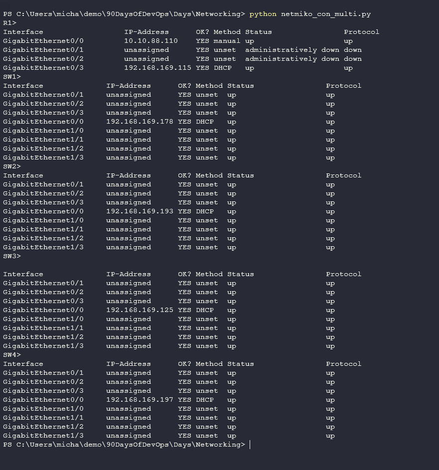

## Pythonとネットワークのハンズオン

ネットワークの基礎の最後のセクションでは、[Day 26](day26.md) で作成したラボ環境を使って、いくつかの自動化タスクとツールをカバーするつもりです。

クライアントからデバイスに接続するために、SSHトンネルを使用する予定です。クライアントとデバイスの間に作成された SSH トンネルは暗号化されています。SSHについては、[Day18](day18.md)のLinuxセクションでも取り上げました。

## 仮想エミュレート環境にアクセスする

EVE-NGネットワーク内にワークステーションが必要で、そこにPythonをインストールしたLinuxボックスを配置して自動化を行うか([Resource for setting up Linux inside EVE-NG](https://www.youtube.com/watch?v=3Qstk3zngrY)) 、私のようにワークステーションからアクセスするクラウドを定義することができます。


これを行うには、キャンバスを右クリックして、ネットワークを選択し、「Management(Cloud0)」を選択して、ホームネットワークに橋渡しします。


しかし、このネットワーク内には何もないので、新しいネットワークから各機器への接続を追加する必要があります。(私のネットワークの知識はもっと注意が必要で、この次のステップを一番上のルーターに行い、この1本のケーブルを通して残りのネットワークに接続することができるような気がします?)

その後、各機器にログインし、クラウドが入る部分に該当するインターフェースに対して、以下のコマンドを実行しました。

```
enable
config t
int gi0/0
ip add dhcp 
no sh 
exit 
exit
sh ip int br
```

最後のステップでは、ホームネットワークからDHCPアドレスを取得します。私のデバイスのネットワークリストは以下の通りです。

| Node        | IP Address  | Home Network IP  |
| ----------- | ----------- | -----------      |
| Router      | 10.10.88.110| 192.168.169.115  |
| Switch1     | 10.10.88.111| 192.168.169.178  |
| Switch2     | 10.10.88.112| 192.168.169.193  |
| Switch3     | 10.10.88.113| 192.168.169.125  |
| Switch4     | 10.10.88.114| 192.168.169.197  |

### ネットワーク機器に SSH 接続する

以上で、ワークステーションを使用してホームネットワーク上のデバイスに接続できるようになりました。私は Putty を使っていますが、git bash のような他のターミナルも使えるので、デバイスに SSH 接続することができます。

以下は、ルーターに SSH 接続しているところです。(R1)


### Python を使ってデバイスから情報を収集する

Python をどのように活用するかの最初の例は、すべてのデバイスから情報を収集することです。特に、それぞれのデバイスに接続して、インターフェースの構成と設定を提供する簡単なコマンドを実行できるようにしたいのです。このスクリプトは [netmiko_con_multi.py] (Networking/netmiko_con_multi.py) に保存されています。

このスクリプトを実行すると、全てのデバイスの各ポートのコンフィギュレーションを見ることができます。



このスクリプトを作成すれば、すべての設定を一元的に管理し、すばやく理解することができますので、さまざまなデバイスをたくさんお持ちの場合に便利です。

### Python を使ってデバイスを設定する

このシナリオでは、`SW1`と`SW2`の間にトランクされたポートがありますが、これが多くの同じスイッチ間で行われるとしたら、設定を変更するために各スイッチに手動で接続する必要がなく、自動化したいと思います。

これを実現するために [netmiko_sendchange.py] (Networking/netmiko_sendchange.py) を使用することができます。これは SSH で接続し、`SW1` の変更を実行し、`SW2` にも変更を加えます。


今、コードを見ると、メッセージが表示され、`sending configuration to device` と表示されますが、これが起こったという確認はありません。このスクリプトに追加のコードを追加して、スイッチのチェックと検証を行うか、あるいは、このスクリプトを前に修正して、これを表示させます。[netmiko_con_multi_vlan.py](Networking/netmiko_con_multi_vlan.py)


### デバイス設定のバックアップ

もう一つの使用例として、ネットワーク設定を取得し、バックアップしていることを確認します。backup.txt](Networking/backup.txt) にバックアップしたいIPアドレスを入力する必要があります。

スクリプトを実行すると、以下のように表示されるはずです。


それは私がpythonで簡単なprintスクリプトを書いているだけかもしれないので、バックアップファイルも見せるべきですね。


### Paramiko

広く使われているSSH用のPythonモジュールです。GitHubの公式リンク[こちら](https://github.com/paramiko/paramiko)で詳細を見ることができます。

このモジュールは `pip install paramiko` コマンドでインストールすることができます。


Pythonのシェルに入り、paramikoモジュールをインポートすることで、インストールを確認することができます。


### Netmiko

netmiko モジュールはネットワークデバイスに特化しており、paramiko は SSH 接続全般を扱うより広範なツールです。

上記で paramiko と共に使用した Netmiko は `pip install netmiko` でインストールすることができます。

Netmikoは多くのネットワークベンダやデバイスをサポートしています。サポートされているデバイスの一覧は[GitHub Page](https://github.com/ktbyers/netmiko#supports)で見ることができます。

### その他のモジュール

まだ見ていないモジュールもありますが、ネットワークの自動化に関して、より多くの機能を提供します。

netaddr` は IP アドレスを操作するために使用され、インストールは `pip install netaddr` で簡単にできます。

xlrd` を使うと、スクリプトがエクセルのワークブックを読み込んで、行と列をマトリックスに変換することができます。モジュールをインストールするには `pip install xlrd` を実行してください。

ネットワークオートメーションの使用例として、まだ調べていないものがありますが、[ここ](https://github.com/ktbyers/pynet/tree/master/presentations/dfwcug/examples)で見ることができます。

ネットワークは、私がしばらく触れていない分野の一つで、まだまだカバーすべきことがたくさんありますが、私のメモと共有されたリソースが誰かの役に立つことを願っています。

## リソース

- [Free Course: Introduction to EVE-NG](https://www.youtube.com/watch?v=g6B0f_E0NMg)
- [EVE-NG - Creating your first lab](https://www.youtube.com/watch?v=9dPWARirtK8)
- [3 Necessary Skills for Network Automation](https://www.youtube.com/watch?v=KhiJ7Fu9kKA&list=WL&index=122&t=89s)
- [Computer Networking full course](https://www.youtube.com/watch?v=IPvYjXCsTg8)
- [Practical Networking](http://www.practicalnetworking.net/)
- [Python Network Automation](https://www.youtube.com/watch?v=xKPzLplPECU&list=WL&index=126)

私はネットワークエンジニアではないので、ここで使用している例のほとんどは、無料ではありませんが、ネットワークオートメーションの理解に役立つシナリオのいくつかを使用しているこの広範な書籍から来ました。

- [Hands-On Enterprise Automation with Python (Book)](https://www.packtpub.com/product/hands-on-enterprise-automation-with-python/9781788998512)

[28日目](day28.md)では、クラウドコンピューティングについて調べ始め、この話題と何が利用可能かについて、よく理解し基礎知識を得るために、お会いしましょう。
