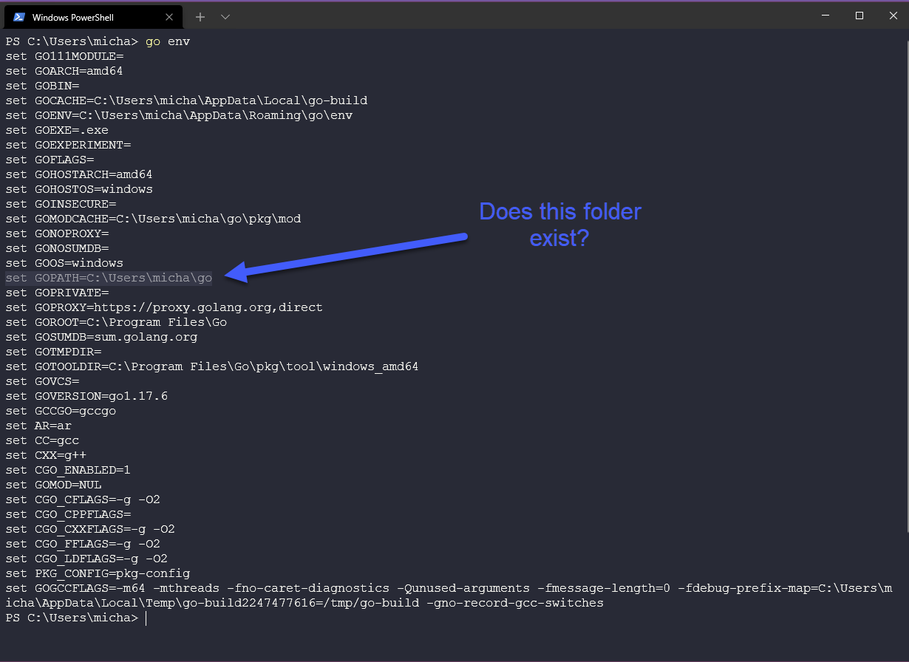
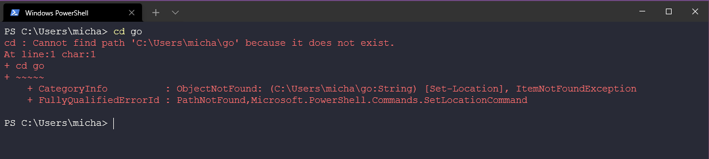
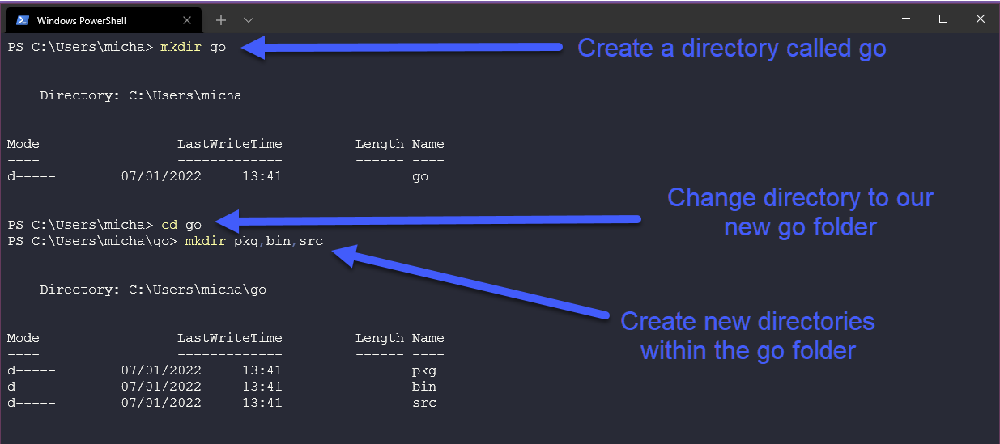
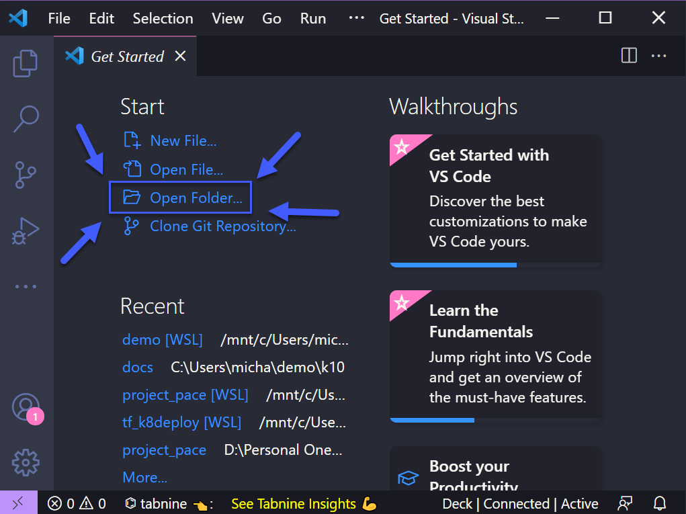
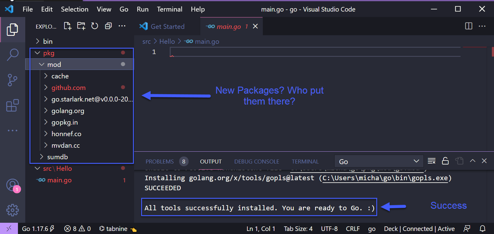
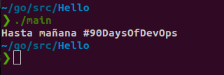

## Configurando seu ambiente DevOps para Go & Hello World

Antes de entrarmos em alguns dos fundamentos do Go, devemos instalá-lo em nossa estação de trabalho e fazer o que cada módulo de "aprendizado de programação 101" nos ensina: criar o aplicativo Hello World. Como este irá percorrer as etapas para instalar o Go em sua estação de trabalho, tentaremos documentar o processo em imagens para que as pessoas possam acompanhar facilmente.

Em primeiro lugar, vamos para [go.dev/dl](https://go.dev/dl/) e você será saudado com algumas opções disponíveis para downloads.


Se chegamos até aqui, você provavelmente sabe qual sistema operacional da estação de trabalho está executando, então selecione o download apropriado e então podemos começar a instalar. Estou usando o Windows para este passo a passo, basicamente, a partir da próxima tela, podemos deixar todos os padrões no lugar por enquanto. **_(observarei que no momento em que este artigo foi escrito, esta era a versão mais recente, portanto as capturas de tela podem estar desatualizadas)_**


Observe também que se você tiver uma versão mais antiga do Go instalada, você terá que removê-la antes de instalar. O Windows a possui integrada ao instalador e irá removê-la e instalá-la como uma só.

Depois de terminar, você deve abrir um prompt de comando/terminal e queremos verificar se temos o Go instalado. Se você não obtiver o resultado que vemos abaixo, o Go não está instalado e você precisará refazer seus passos.

`go version`


A seguir, queremos verificar nosso ambiente para Go. É sempre bom verificar se seus diretórios de trabalho estão configurados corretamente, como você pode ver abaixo, precisamos ter certeza de que você tem o seguinte diretório em seu sistema.



Você checou? Você está acompanhando? Você provavelmente obterá algo como o abaixo se tentar navegar até lá.



Ok, vamos criar esse diretório para facilitar. Vou usar o comando mkdir em meu terminal PowerShell. Também precisamos criar 3 pastas dentro da pasta Go, como você verá abaixo.



Agora temos que instalar o Go e temos nosso diretório de trabalho Go pronto para ação. Agora precisamos de um ambiente de desenvolvimento integrado (IDE). Agora existem muitos disponíveis que você pode usar, mas o mais comum e o que eu uso é o Visual Studio Code ou Code. Você pode aprender mais sobre IDEs [aqui](https://www.youtube.com/watch?v=vUn5akOlFXQ).

Se você ainda não baixou e instalou o VSCode em sua estação de trabalho, poderá fazê-lo acessando [aqui](https://code.visualstudio.com/download). Como você pode ver abaixo, você tem diferentes opções de sistema operacional.


Da mesma forma que na instalação do Go, vamos baixar e instalar e manter os padrões. Depois de concluído, você pode abrir o VSCode, selecionar Abrir arquivo e navegar até nosso diretório Go que criamos acima.



Você pode receber um pop-up sobre confiança, leia-o se quiser e clique em Sim, confie nos autores. (Eu não sou responsável mais tarde se você começar a abrir coisas em que não confia!)

Agora você deve ver as três pastas que também criamos anteriormente e o que queremos fazer agora é clicar com o botão direito na pasta src e criar uma nova pasta chamada `Hello`


Coisas muito fáceis que eu diria até agora? Agora vamos criar nosso primeiro Programa Go sem entender nada do que colocaremos nesta próxima fase.

Em seguida, crie um arquivo chamado `main.go` na sua pasta `Hello`. Assim que você pressionar enter no main.go você será perguntado se deseja instalar a extensão Go e também os pacotes. Você também pode verificar aquele arquivo pkg vazio que fizemos alguns passos atrás e perceber que devemos ter alguns novos pacotes aí agora?



Agora vamos colocar este aplicativo Hello World em funcionamento, copie o código a seguir em seu novo arquivo main.go e salve-o.

```
package main

import "fmt"

func main() {
    fmt.Println("Hello #90DaysOfDevOps")
}
```

Compreendo que o que foi dito acima pode não fazer sentido algum, mas abordaremos mais sobre funções, pacotes e muito mais posteriormente. Por enquanto, vamos executar nosso aplicativo. De volta ao terminal e à nossa pasta Hello podemos agora verificar se tudo está funcionando. Usando o comando abaixo podemos verificar se nosso programa de aprendizagem genérico está funcionando.

```
go run main.go
```


Mas não termina aí, e se agora quisermos pegar nosso programa e executá-lo em outras máquinas Windows? Podemos fazer isso construindo nosso binário usando o seguinte comando

```
go build main.go
```


Se executarmos isso, veríamos a mesma saída:

```bash
$ ./main.exe
Hello #90DaysOfDevOps
```

## Resources

- [Pesquisa de desenvolvedores StackOverflow 2021](https://insights.stackoverflow.com/survey/2021)
- [Por que estamos escolhendo Golang para aprender](https://www.youtube.com/watch?v=7pLqIIAqZD4&t=9s)
- [Jake Wright - Aprenda Go em 12 minutos](https://www.youtube.com/watch?v=C8LgvuEBraI&t=312s)
- [Techworld with Nana - Curso completo de Golang - 3 horas e 24 minutos](https://www.youtube.com/watch?v=yyUHQIec83I)
- [**PAGO** Nigel Poulton Pluralsight - Fundamentos do Go - 3 horas e 26 minutos](https://www.pluralsight.com/courses/go-fundamentals)
- [FreeCodeCamp - Aprenda Programação Go - Tutorial Golang para Iniciantes](https://www.youtube.com/watch?v=YS4e4q9oBaU&t=1025s)
- [Hitesh Choudhary - Lista de reprodução completa](https://www.youtube.com/playlist?list=PLRAV69dS1uWSR89FRQGZ6q9BR2b44Tr9N)

Vejo você no [Dia 9](day09.md).


