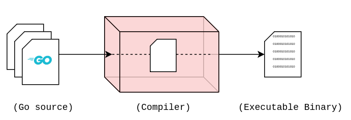
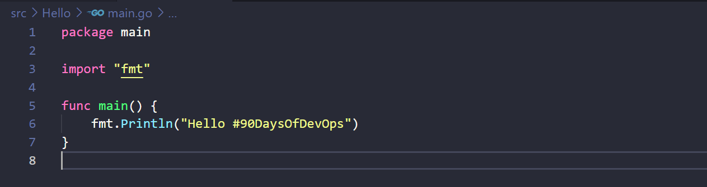
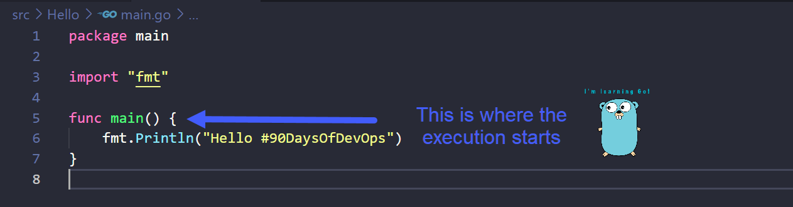

## Vamos explicar o código Hello World

### Como funciona o Go

No [Dia 8](day08.md) explicamos como instalar o Go em sua estação de trabalho e, em seguida, criamos nosso primeiro aplicativo Go.

Nesta seção, examinaremos mais profundamente o código e entenderemos mais algumas coisas sobre a linguagem Go.

### O que é Compilar?

Antes de entrarmos nas [6 linhas do código Hello World](../../Days/Go/hello.go) precisamos entender um pouco sobre Compilação.

Linguagens de programação que comumente usamos, como Python, Java, Go e C++, são linguagens de alto nível. O que significa que elas são legíveis por humanos, mas quando uma máquina está tentando executar um programa, ela precisa estar em uma forma que a máquina possa entender. Temos que traduzir nosso código legível por humanos em código de máquina, que é chamado de compilação.

Acima você pode ver o que fizemos no [Dia 8](day08.md) aqui, criamos um simples Hello World main.go e então usamos o comando `go build main.go` para compilar nosso executável.

### O que são pacotes?

Um pacote é uma coleção de arquivos de origem no mesmo diretório que são compilados juntos. Podemos simplificar ainda mais, um pacote é um monte de arquivos .go no mesmo diretório. Lembra da nossa pasta Hello do dia 8? Se e quando você entrar em programas Go mais complexos, poderá descobrir que possui pasta1, pasta2 e pasta3 contendo diferentes arquivos.go que compõem seu programa com vários pacotes.

Usamos pacotes para podermos reutilizar o código de outras pessoas, não precisamos escrever tudo do zero. Talvez estejamos querendo uma calculadora como parte de nosso programa, você provavelmente poderia encontrar um pacote Go existente que contém as funções matemáticas que você pode importar para seu código, economizando muito tempo e esforço no longo prazo.

Go incentiva você a organizar seu código em pacotes para que seja fácil reutilizar e manter o código-fonte.

### Hello #90DaysOfDevOps Linha por linha

Agora vamos dar uma olhada no nosso arquivo Hello #90DaysOfDevOps main.go e percorrer as linhas.

Na primeira linha você tem o `package main` o que significa que este arquivo pertence a um pacote chamado main. Todos os arquivos .go precisam pertencer a um pacote, eles também devem ter `package something` na linha de abertura.

Um pacote pode ter o nome que você desejar. Temos que chamar este de `main` porque ele é o ponto de partida do programa que estará neste pacote, isso é uma regra. (Preciso entender mais sobre esta regra?)

Sempre que quisermos compilar e executar nosso código temos que informar à máquina onde a execução precisa começar. Fazemos isso escrevendo uma função chamada main. A máquina irá procurar uma função chamada main para encontrar o ponto de entrada do programa.

Uma função é um bloco de código que pode realizar alguma tarefa específica e ser usado em todo o programa.

Você pode declarar uma função com qualquer nome usando `func` mas, neste caso, precisamos nomeá-la como `main`, pois é aqui que o código começa.

A seguir veremos a linha 3 do nosso código, a importação, isso significa que você deseja trazer outro pacote para o seu programa principal. fmt É um pacote padrão usado aqui fornecido por Go, este pacote contém a função `Println()` e como importamos isso podemos usar isso na linha 6. Existem vários pacotes padrão que você pode incluir em seu programa e aproveitá-los ou reutilizá-los em seu código, evitando o incômodo de ter que escrevê-lo do zero. [Biblioteca Go Standard](https://pkg.go.dev/std)

o `Println()` que temos aqui é uma forma de escrever a saída padrão no terminal onde quer que o executável tenha sido executado com sucesso. Sinta-se à vontade para alterar a mensagem entre ().

### TLDR

- **Line 1** = Este arquivo estará no pacote chamado `main` e precisa ser chamado de `main` porque inclui o ponto de entrada do programa.
- **Line 3** = Para usarmos o `Println()` temos que importar o pacote fmt para usar isso na linha 6.
- **Line 5** = O ponto de partida real, é a função `main`.
- **Line 6** = Isso nos permitirá imprimir "Hello #90DaysOfDevOps" em nosso sistema.

## Recursos

- [Pesquisa de desenvolvedores StackOverflow 2021](https://insights.stackoverflow.com/survey/2021)
- [Por que escolhemos Golang para aprender](https://www.youtube.com/watch?v=7pLqIIAqZD4&t=9s)
- [Jake Wright - Aprenda Go em 12 minutos](https://www.youtube.com/watch?v=C8LgvuEBraI&t=312s)
- [Techworld with Nana - Curso completo de Golang - 3 horas e 24 minutos](https://www.youtube.com/watch?v=yyUHQIec83I)
- [**NÃO GRATUITO** Nigel Poulton Pluralsight - Go Fundamentos - 3 horas e 26 minutos](https://www.pluralsight.com/courses/go-fundamentals)
- [FreeCodeCamp - Aprenda Programação Go - Tutorial Golang para Iniciantes](https://www.youtube.com/watch?v=YS4e4q9oBaU&t=1025s)
- [Hitesh Choudhary - Playlist completa](https://www.youtube.com/playlist?list=PLRAV69dS1uWSR89FRQGZ6q9BR2b44Tr9N)

Vejo você no [Dia 10](day10.md).
