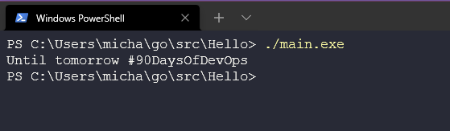

## Configurar tu entorno DevOps para Go y Hello World

o dilini bilgisayarınıza kurmadan önce "Go öğrenme 101" modülünün her biri tarafından öğretilen "Hello World" uygulamasını oluşturmak için adımları takip etmek gerekmektedir.

Go'nun kurulum sürecini belgelemek ve takip etmeyi kolaylaştırmak için görsellerle birlikte belgeleme yapacağız. (Ekran görüntüleri, bu satırları yazıldığı sırada mevcut olan en son sürümde alınmış olsalar bile güncel olmayabilir.)

İlk olarak, [go.dev/dl](https://go.dev/dl/) adresine gideceğiz ve farklı işletim sistemleri için mevcut olan indirme seçeneklerini göreceğiz.


Muhtemelen kurulum yapmak istediğiniz bilgisayarın hangi işletim sistemini kullandığını biliyorsunuz, bu yüzden uygun indirmeyi seçin ve ardından kurmaya başlayabiliriz. Bu kılavuz için Windows kullanıyorum, temel olarak kurulum sihirbazında tüm varsayılan değerleri bırakabiliriz.


Ayrıca, daha önce kurulu bir Go sürümünüz varsa, yeni bir sürümü yüklemek için önce onu kaldırmanız gerekebilir. Windows, bu seçeneği kurulum sihirbazında sunar, böylece kaldırmayı ve aynı anda yüklemeyi yapabilirsiniz.

Tamamlandıktan sonra, bir komut istemi veya terminal (Windows'ta CMD veya PowerShell) açmalısınız ve Go kurulumunun başarılı bir şekilde yapıldığını kontrol etmek için aşağıdaki komutu kullanarak sürümü kontrol edebilirsiniz:

```shell
go version
```

Eğer aşağıdaki resimde gördüğümüz çıktıyı alamazsanız, Go kurulmamış demektir ve hata bulmak için adımlarınızı geriye doğru takip etmeniz gerekecektir." Türkçe çevirisi: Eğer aşağıdaki resimde gördüğümüz çıktıyı alamazsanız, Go kurulu değil demektir ve hatayı bulmak için adımlarınızı geriye doğru kontrol etmeniz gerekecektir.


Şimdi Go ortamımızı kontrol edeceğiz. Çalışma dizinlerinizin doğru şekilde yapılandırıldığından emin olmak her zaman iyidir. Aşağıda gördüğünüz gibi, aşağıdaki dizinin sistemde bulunduğundan emin olmamız gerekiyor.


Kontrol ettin mi? İzlemeye devam ediyor musun? Muhtemelen oraya gitmeye çalışırsan aşağıda gösterildiği gibi bir şey elde edersin. (Windows'tan)


Linux'ta, dizin aşağıdaki komutla oluşturulur:

```shell
sudo apt install golang
```
Bu yapıya sahip olarak:
```shell
#input
tree go -L 3

#output
go
└── pkg
    └── mod
        ├── cache
        ├── cloud.google.com
        ├── github.com
        ├── go.etcd.io
        ├── golang.org
        ├── google.golang.org
        ├── gopkg.in
        ├── go.starlark.net@v0.0.0-20200306205701-8dd3e2ee1dd5
        ├── helm.sh
        ├── k8s.io
        ├── oras.land
        └── sigs.k8s.io
```

Tamam, Windows'ta bu dizini oluşturmalıyız. PowerShell'de mkdir komutuyla kolayca yapılabilir. Ayrıca, Go klasörü içinde 3 klasör oluşturmamız gerekiyor, aşağıda da görebileceğiniz gibi.

```shell
mkdir go

cd go

mkdir pkg,bin,src
```


Go zaten yüklü ve çalışma dizinimiz aksiyon için hazır. Şimdi entegre bir geliştirme ortamına (IDE) ihtiyacımız var. Kullanabileceğiniz birçok seçenek var, ancak en yaygın olanı ve yazarın kullandığı Visual Studio Code veya Code'dur. (Çevirmen aynı zamanda vscode'u kullanıyor, ancak uzak makinelerde Vim daha iyi bir seçenek olabilir.) IDE'ler hakkında daha fazla bilgi edinebilirsiniz.

Eğer henüz bilgisayarınıza VSCode'u indirip kurmadıysanız, buradan yapabilirsiniz. Göreceğiniz gibi farklı işletim sistemleri için seçenekleriniz olacak. [burdan](https://code.visualstudio.com/download). 


Go'nun kurulumuyla aynı şekilde, varsayılan ayarları kullanarak VSCode'u indirecek, kuracak ve güncel tutacağız. Tamamlandıktan sonra VSCode'u açabilir, 'Dosya Aç' seçeneğini seçebilir ve daha önce oluşturduğumuz Go dizinine gezinebilirsiniz.


Muhtemelen güvenlikle ilgili bir açılır pencereyle karşılaşabilirsiniz, okuyun ve sonra yazarlara güvenmek için Evet düğmesine tıklamanızı düşünüyorsanız onaylayın. (Bu rehberde daha sonra güvenmemeniz gereken şeyleri açmaya başlarsanız sorumluluk kabul etmiyoruz).

Şimdi daha önce oluşturduğumuz üç klasörü görmelisiniz. src klasörüne sağ tıklayın ve yeni bir klasör oluşturun. Klasörün adını 'turkce çeviri' olarak adlandıralım `Hello`.


Şu ana kadar her şey çok kolay, hatta çok kolay denebilir. Şimdi hiçbir şey anlamadan ilk Go programımızı oluşturacağız.

Hello klasörü içinde `main.go` adında bir dosya oluşturuyoruz `Hello`. main.go'ya Enter tuşuna bastığınızda Go uzantısını ve aynı zamanda paketleri yüklemek isteyip istemediğinizi soracaktır. Bu paketleri birkaç adım önce yaptığımız boş pkg dosyasında kontrol edebilir ve içeride yeni paketler olduğunu fark edebilirsiniz.


Şimdi bu `Hello World` uygulamasını çalıştıralım, aşağıdaki kodu yeni main.go dosyanıza kopyalayın ve kaydedin

```go
package main

import "fmt"

func main() {
    fmt.Println("Hello #90DaysOfDevOps")
}
```

Anladığınız üzere, yukarıdaki kodun herhangi bir anlam ifade etmediği durumlar olabilir, ancak önümüzdeki günlerde fonksiyonlar, paketler ve diğer konular hakkında daha fazla bilgi edineceğiz. Şimdilik uygulamamızı çalıştıralım.

Terminalde `Hello` klasörüne dönerek her şeyin düzgün çalıştığını kontrol edebiliriz. Aşağıdaki komutu kullanarak genel öğrenme programımızın çalışıp çalışmadığını kontrol edebiliriz.

```shell
go run main.go
```
Programımız bize Merhaba diyecektir.


Ancak burada bitmiyor, şimdi programımızı başka Windows makinelerinde çalıştırmak istiyorsak ne yapabiliriz? Aşağıdaki komutu kullanarak bir ikili dosya oluşturarak bunu yapabiliriz.

```shell
go build main.go
```


Bunu çalıştırırsak, aynı çıktıyı görürüz.

```shell
#input
./main.exe

#output
Hello #90DaysOfDevOps
```

## Recursos

- [StackOverflow 2021 Developer Survey](https://insights.stackoverflow.com/survey/2021)
- [Why we are choosing Golang to learn](https://www.youtube.com/watch?v=7pLqIIAqZD4&t=9s)
- [Jake Wright - Learn Go in 12 minutes](https://www.youtube.com/watch?v=C8LgvuEBraI&t=312s)
- [Techworld with Nana - Golang full course - 3 hours 24 mins](https://www.youtube.com/watch?v=yyUHQIec83I)
- [**NOT FREE** Nigel Poulton Pluralsight - Go Fundamentals - 3 hours 26 mins](https://www.pluralsight.com/courses/go-fundamentals)
- [FreeCodeCamp - Learn Go Programming - Golang Tutorial for Beginners](https://www.youtube.com/watch?v=YS4e4q9oBaU&t=1025s)
- [Hitesh Choudhary - Complete playlist](https://www.youtube.com/playlist?list=PLRAV69dS1uWSR89FRQGZ6q9BR2b44Tr9N)

Gorusmek Uzere [Gun 9](day09.md).


