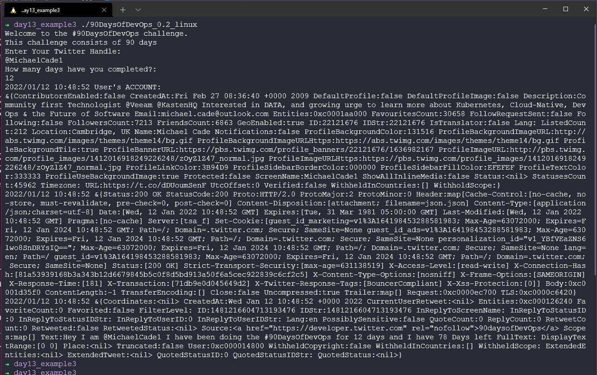

## Yeni Uygulamamızla İlerlemenizi Tweetleyin

Bugün bu programlama dilini incelediğimiz son gün. Go'nun yüzeyine henüz biraz bile değinmedik, ancak bu bir başlangıç. Şimdi, kendi başımıza daha fazla ilgilenmeli, heyecanlanmalı ve derinlemesine öğrenmeliyiz.

Ancak son günü uygulamamıza yeni bir özellik eklemek için kullanalım. Oluşturduğumuz paketleri kullanarak uygulamamızın sadece ilerlemenizi ekranda güncellemesini değil, aynı zamanda meydan okuma ayrıntılarını ve durumunuzu içeren bir tweet atmasını sağlayacağız. 😊


##  Tweet Atma Yeteneği Eklemek

Bunun çalışması için ilk yapmamız gereken, Twitter Geliştirici API'sine erişimimizi yapılandırmaktır.

[Twitter Gelistirme Platformuna Gidin](https://developer.twitter.com) na gidin ve Twitter kullanıcı adınız ve bilgilerinizle oturum açın. İçeri girdikten sonra, aşağıdaki gibi bir şey görmelisiniz, ancak daha önceden oluşturduğum uygulama olmadan.


Buradan daha yüksek bir erişim talep edebilirsiniz, bu biraz zaman alabilir.

Sonra "Projects & Apps" bölümünü seçerek kendi uygulamamızı oluşturmalıyız. Sınırlar, hesabınızın erişim düzeyine bağlıdır; essential ile sadece bir uygulama ve bir proje, elevated ile 3 uygulama sahip olabilirsiniz.


Uygulamanıza bir ad verin.


Sonra API token'larınızı alacaksınız. Bunları güvenli bir yerde saklamanız gerekiyor, çünkü daha sonra Go uygulamanızla kullanacağız. (Ekran görüntüsündeki tokenları kullanmaya çalışmayın, bu uygulama zaten silindi).


Şimdi uygulamamız oluşturuldu, (yukarıdaki örnekteki "test90" adı alındığı için uygulamanın adı değiştirildi, bu isimler benzersiz olmalıdır).


Önceden kaydettiğimiz anahtarlarımız tüketici anahtarlarımız olarak bilinir ve erişim belirteçlerimiz ve gizlilik bilgilerimiz de gereklidir. Bu bilgileri "Keys & Tokens" sekmesini kullanarak toplayabiliriz.


Şimdilik Twitter Geliştirici Portalı'nda işimiz bitti. Anahtarlarınızı güvende tuttuğunuzdan emin olun, çünkü daha sonra ihtiyacımız olacak.

## Go Twitter Bot

Unutmayın, uygulamamızda başlatacağımız kod, [day13_example1](Go/day13_example1.go) dosyasındaki koddur, ancak önce tweet'i göndermek için doğru kodun olduğunu kontrol etmemiz gerekiyor. 

Şimdi çıktımızı veya mesajımızı bir tweet olarak Twitter'a iletme kodunu düşünelim. [go-twitter](https://github.com/dghubble/go-twitter) kütüphanesini (Go için Twitter API'si için bir istemci kütüphanesi) kullanacağız.

Ana uygulamamıza koymadan önce, test etmek için `src` klasöründe go-twitter-bot adında yeni bir dizin oluşturun ve klasörde `go mod init github.com/michaelcade/go-Twitter-bot` komutunu çalıştırın, bu yeni bir `go.mod` dosyası oluşturacaktır. Şimdi yeni main.go dosyasını yazmaya başlayabilir ve deneyebiliriz.

Twitter Geliştirici Portalı'ndan aldığımız anahtarları, belirteçleri ve gizlilik bilgilerini kullanmamız gerekiyor. Bunları ortam değişkenlerimize ayarlayacağız. Bu, kullandığınız işletim sistemine bağlı olacaktır:

**Windows**

```cmd
set CONSUMER_KEY
set CONSUMER_SECRET
set ACCESS_TOKEN
set ACCESS_TOKEN_SECRET
```

**Linux / macOS**

```shell
export CONSUMER_KEY
export CONSUMER_SECRET
export ACCESS_TOKEN
export ACCESS_TOKEN_SECRET
```
Bu noktada, [day13_example2](Go/day13_example2.go) dosyasındaki kodu inceleyin. Burada, anahtarları, gizlilik bilgilerini ve belirteçleri tanımlamak için bir yapı kullanılıyor.

Ardından, bu kimlik bilgilerini analiz etmek ve Twitter API'siyle bağlantı kurmak için bir `func` bulunmaktadır.

Şimdi tweet gönderme zamanı! 🐦

```go
package main

import (
    // other imports
    "fmt"
    "log"
    "os"

    "github.com/dghubble/go-twitter/twitter"
    "github.com/dghubble/oauth1"
)

// Credentials stores all of our access/consumer tokens
// and secret keys needed for authentication against
// the twitter REST API.
type Credentials struct {
    ConsumerKey       string
    ConsumerSecret    string
    AccessToken       string
    AccessTokenSecret string
}

// getClient is a helper function that will return a twitter client
// that we can subsequently use to send tweets, or to stream new tweets
// this will take in a pointer to a Credential struct which will contain
// everything needed to authenticate and return a pointer to a twitter Client
// or an error
func getClient(creds *Credentials) (*twitter.Client, error) {
    // Pass in your consumer key (API Key) and your Consumer Secret (API Secret)
    config := oauth1.NewConfig(creds.ConsumerKey, creds.ConsumerSecret)
    // Pass in your Access Token and your Access Token Secret
    token := oauth1.NewToken(creds.AccessToken, creds.AccessTokenSecret)

    httpClient := config.Client(oauth1.NoContext, token)
    client := twitter.NewClient(httpClient)

    // Verify Credentials
    verifyParams := &twitter.AccountVerifyParams{
        SkipStatus:   twitter.Bool(true),
        IncludeEmail: twitter.Bool(true),
    }

    // we can retrieve the user and verify if the credentials
    // we have used successfully allow us to log in!
    user, _, err := client.Accounts.VerifyCredentials(verifyParams)
    if err != nil {
        return nil, err
    }

    log.Printf("User's ACCOUNT:\n%+v\n", user)
    return client, nil
}
func main() {
    fmt.Println("Go-Twitter Bot v0.01")
    creds := Credentials{
        AccessToken:       os.Getenv("ACCESS_TOKEN"),
        AccessTokenSecret: os.Getenv("ACCESS_TOKEN_SECRET"),
        ConsumerKey:       os.Getenv("CONSUMER_KEY"),
        ConsumerSecret:    os.Getenv("CONSUMER_SECRET"),
    }

    client, err := getClient(&creds)
    if err != nil {
        log.Println("Error getting Twitter Client")
        log.Println(err)
    }

    tweet, resp, err := client.Statuses.Update("A Test Tweet from the future, testing a #90DaysOfDevOps Program that tweets, tweet tweet", nil)
    if err != nil {
        log.Println(err)
    }
    log.Printf("%+v\n", resp)
    log.Printf("%+v\n", tweet)
}

```

Yukarıdaki işlem, bir hata mesajıyla birlikte başarısız olabilir veya herhangi bir mesaj olmadan başarılı olabilir. Başarılı olduğunda, kodda belirtilen mesajla bir tweet gönderilmiş olacaktır.

## Go-Twitter-Bot ile kendi uygulamamızı birleştirme

Şimdi bu iki parçayı `main.go` dosyamıza birleştirmemiz gerekiyor. Eminim ki orada biri daha iyi bir yol olduğunu söylüyor ve belki de birden fazla `.go` dosyası olabileceğini düşünüyorsunuzdur, bu daha mantıklı olabilir ama bu yöntem de çalışır.

Birleştirilmiş kod tabanını [day13_example3](Go/day13_example3.go) dosyasında görebilirsiniz, ancak aşağıda da gösterilecektir.

```go
package main

import (
    // other imports
    "fmt"
    "log"
    "os"

    "github.com/dghubble/go-twitter/twitter"
    "github.com/dghubble/oauth1"
)

// Credentials stores all of our access/consumer tokens
// and secret keys needed for authentication against
// the twitter REST API.
type Credentials struct {
    ConsumerKey       string
    ConsumerSecret    string
    AccessToken       string
    AccessTokenSecret string
}

// getClient is a helper function that will return a twitter client
// that we can subsequently use to send tweets, or to stream new tweets
// this will take in a pointer to a Credential struct which will contain
// everything needed to authenticate and return a pointer to a twitter Client
// or an error
func getClient(creds *Credentials) (*twitter.Client, error) {
    // Pass in your consumer key (API Key) and your Consumer Secret (API Secret)
    config := oauth1.NewConfig(creds.ConsumerKey, creds.ConsumerSecret)
    // Pass in your Access Token and your Access Token Secret
    token := oauth1.NewToken(creds.AccessToken, creds.AccessTokenSecret)

    httpClient := config.Client(oauth1.NoContext, token)
    client := twitter.NewClient(httpClient)

    // Verify Credentials
    verifyParams := &twitter.AccountVerifyParams{
        SkipStatus:   twitter.Bool(true),
        IncludeEmail: twitter.Bool(true),
    }

    // we can retrieve the user and verify if the credentials
    // we have used successfully allow us to log in!
    user, _, err := client.Accounts.VerifyCredentials(verifyParams)
    if err != nil {
        return nil, err
    }

    log.Printf("User's ACCOUNT:\n%+v\n", user)
    return client, nil
}
func main() {
    creds := Credentials{
        AccessToken:       os.Getenv("ACCESS_TOKEN"),
        AccessTokenSecret: os.Getenv("ACCESS_TOKEN_SECRET"),
        ConsumerKey:       os.Getenv("CONSUMER_KEY"),
        ConsumerSecret:    os.Getenv("CONSUMER_SECRET"),
    }
    {
        const DaysTotal int = 90
        var remainingDays uint = 90
        challenge := "#90DaysOfDevOps"

        fmt.Printf("Welcome to the %v challenge.\nThis challenge consists of %v days\n", challenge, DaysTotal)

        var TwitterName string
        var DaysCompleted uint

        // asking for user input
        fmt.Println("Enter Your Twitter Handle: ")
        fmt.Scanln(&TwitterName)

        fmt.Println("How many days have you completed?: ")
        fmt.Scanln(&DaysCompleted)

        // calculate remaining days
        remainingDays = remainingDays - DaysCompleted

        //fmt.Printf("Thank you %v for taking part and completing %v days.\n", TwitterName, DaysCompleted)
        //fmt.Printf("You have %v days remaining for the %v challenge\n", remainingDays, challenge)
        // fmt.Println("Good luck")

        client, err := getClient(&creds)
        if err != nil {
            log.Println("Error getting Twitter Client, this is expected if you did not supply your Twitter API tokens")
            log.Println(err)
        }

        message := fmt.Sprintf("Hey I am %v I have been doing the %v for %v days and I have %v Days left", TwitterName, challenge, DaysCompleted, remainingDays)
        tweet, resp, err := client.Statuses.Update(message, nil)
        if err != nil {
            log.Println(err)
        }
        log.Printf("%+v\n", resp)
        log.Printf("%+v\n", tweet)
    }

}
```

Sonuç olarak, bir tweet elde etmelisiniz, ancak çevre değişkenlerini sağlamadıysanız, aşağıdaki hatayı alırsınız.


Bunu düzelttikten sonra, başarılı bir şekilde terminaldeki çıktı aşağıdaki gibi olmalıdır:



Sonuçta oluşan tweet aşağıdaki gibi görünmelidir:


## Birden fazla işletim sistemi için nasıl derlenir?

Daha önce Go dili hakkında konuştuğumuzda "Birden Fazla İşletim Sistemi İçin Nasıl Derlenir?" diye sormuştuk.

Go'nun harika yanı, kolayca birçok farklı işletim sistemi için derlenebilmesidir. Tam bir listeyi aşağıdaki komutu çalıştırarak alabilirsiniz:

```
go tool dist list
```
Bugüne kadar `go build` komutlarını kullanmak harikaydı ve bu komutlar `GOOS` ve `GOARCH` çevre değişkenlerini kullanarak ana makineyi belirleyecek ve buna göre yürütülebilir dosyayı oluşturacaktır. Ancak aşağıdaki kodu örnek olarak kullanarak diğer işletim sistemleri için farklı ikili dosyalar da oluşturabiliriz.

```go
GOARCH=amd64 GOOS=darwin go build -o ${BINARY_NAME}_0.1_darwin main.go
GOARCH=amd64 GOOS=linux go build -o ${BINARY_NAME}_0.1_linux main.go
GOARCH=amd64 GOOS=windows go build -o ${BINARY_NAME}_0.1_windows main.go
GOARCH=arm64 GOOS=linux go build -o ${BINARY_NAME}_0.1_linux_arm64 main.go
GOARCH=arm64 GOOS=darwin go build -o ${BINARY_NAME}_0.1_darwin_arm64 main.go
```

Bu, yapılandırılmış tüm platformlar için istenen ikili dosyaları dizine verecektir.

Sonra, bu kodu alabilir ve her yeni özellik ve işlevsellik eklediğinizde ikili dosyaları oluşturmak için bir makefile oluşturabilirsiniz. [makefile](Go/makefile) dosyasına goz atın.

Bu, [repository](https://github.com/MichaelCade/90DaysOfDevOps/releases) üzerinde görebileceğiniz sürümleri oluşturmak için kullanılan şeydir.

## Kaynaklar

- [StackOverflow 2021 Developer Survey](https://insights.stackoverflow.com/survey/2021)
- [Why we are choosing Golang to learn](https://www.youtube.com/watch?v=7pLqIIAqZD4&t=9s)
- [Jake Wright - Learn Go in 12 minutes](https://www.youtube.com/watch?v=C8LgvuEBraI&t=312s)
- [Techworld with Nana - Golang full course - 3 hours 24 mins](https://www.youtube.com/watch?v=yyUHQIec83I)
- [**NOT FREE** Nigel Poulton Pluralsight - Go Fundamentals - 3 hours 26 mins](https://www.pluralsight.com/courses/go-fundamentals)
- [FreeCodeCamp - Learn Go Programming - Golang Tutorial for Beginners](https://www.youtube.com/watch?v=YS4e4q9oBaU&t=1025s)
- [Hitesh Choudhary - Complete playlist](https://www.youtube.com/playlist?list=PLRAV69dS1uWSR89FRQGZ6q9BR2b44Tr9N)
- [A great repo full of all things DevOps & exercises](https://github.com/bregman-arie/devops-exercises)
- [GoByExample - Example based learning](https://gobyexample.com/)
- [go.dev/tour/list](https://go.dev/tour/list)
- [go.dev/learn](https://go.dev/learn/)

Harika! 7 günlük programlama dili öğrenme sürecini tamamladınız. Zamanın hızla geçtiği ve herhangi bir baskı olmadan yeni kavramlar öğrendiğimiz bir süreç oldu. Gelecekteki profesyonel kariyeriniz için önemli bilgiler edindik. Öğrenilecek çok daha fazla şey var, umarım programlama dillerine, Go, Python veya seçtiğiniz diğer dillere çalışmaya devam edersiniz. Çünkü öğrendiklerinizin hepsini gelecekte kullanabilirsiniz, yeter ki klavyeye devam edin.

Şimdi, Linux'a odaklanacağız ve oradaki temel kavramlara bir göz atacağız🐧 

Gorusmek Uzere [Gun 14](day14.md).
