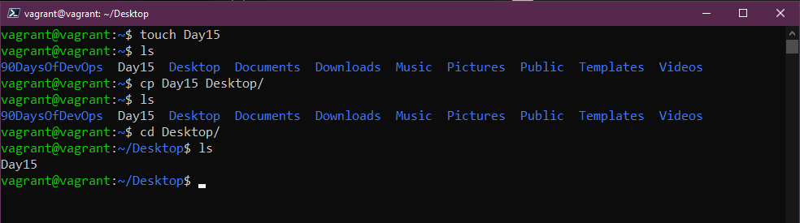

## DevOps için Linux Komutları (aslında hepsi)

[Dun](day14.md) birçok şey yapmak için terminalde çok zaman geçireceğimizi söylemiştik.

Ayrıca vagrant ile sağladığımız sanal makineye `vagrant ssh` kullanarak erişebileceğimizi ve buna karar verirseniz sanal makine konsoluna giriş yapmak için kullanıcı adı ve şifre girmeniz gerekeceğini belirtmiştik.

İşte aşağıda belirtilen yere ulaşmak istiyoruz:


## Komutlar

Bir saat içinde tüm komutları kapsamak imkansızdır, 7 gün boyunca her birini ele aldığımızda, bunları kapsayan sayfalar ve sayfalar dolusu belge vardır. Eğer terminalinizde belirli bir komutun seçeneklerini anlamak istiyorsanız, `man` sayfaları (kılavuzun kısaltması) size yardımcı olacaktır. Bu sayede bu yazıda ele aldığımız her bir komut için daha fazla seçenek bulmak için man komutunu kullanabiliriz. `man man` komutunu çalıştırarak manuel komutunun yardımını alabilirsiniz. Manuel sayfalarından çıkmak için `q` tuşuna basmanız gerekmektedir.


`sudo` -  Eğer Windows'ta `yönetici olarak çalıştır` düğmesine aşinasanız, `sudo'`nun buna benzer bir şey olduğunu düşünebilirsiniz, ancak tam olarak aynı değildir. Bir komutu sudo ile çalıştırdığınızda, komutu `root` olarak çalıştırıyorsunuz ve komutu çalıştırmadan önce parolanızı girmeniz istenecektir.


Uygulamaları veya hizmetleri yüklemek gibi belirli görevler için sudo komutunu kullanmanız gerekebilir, ancak bir süre boyunca sudo olarak çalışmak isterseniz ne yapmalısınız? İşte burada sudo su komutunu kullanabilirsiniz, bu size root kullanıcısı için bir kabuk verecektir. Bizim gibi bir test sanal makinesinde bu sorun değil, ancak uzun süre boyunca root olarak çalışmanız çok zor olurdu, kötü şeyler olabilir. Bu yükseltilmiş konumdan çıkmak için sadece `exit` yazmanız yeterlidir.


Sık sık `clear` komutunu kullanacaksınız. Tam olarak adında olduğu gibi, ekranı tüm önceki komutlardan temizler, imleci en üstte gösterir ve size hoş ve temiz bir çalışma alanı sağlar.


İşte sistemimizde bir şeyler oluşturabileceğimiz ve ardından bunları terminale görüntüleyebileceğimiz bazı komutları görelim. İlk olarak, mkdir komutunu kullanarak sistemimizde bir klasör oluşturabiliriz. Aşağıdaki komutla ana dizinde "Day15" adında bir klasör oluşturabiliriz: `mkdir Day15`


`cd` komutuyla dizini değiştirebiliriz. Yeni oluşturduğumuz dizine gitmek için `cd Day15` yazabiliriz. Ayrıca, kullanılabilir dizini otomatik olarak tamamlamak için de kullanabilirsiniz. Başlangıç noktasına dönmek için `cd ..` kullanabilirsiniz.


`rmdir` komutu, bir dizini silmemizi sağlar. `rmdir Day15` komutunu çalıştırırsak, klasör silinecektir (bu, klasörde herhangi bir şey olmadığı sürece çalışacaktır).


Sistem dosya sisteminin derinliklerine gidip nerede olduğumuzu bilmediğimiz durumlar hepimizin başına gelir. `pwd` komutunu kullanarak çalışma dizinimizi görebiliriz. 


Peki dosya nasıl oluşturabiliriz? `touch` komutunu kullanarak dosyalar oluşturabiliriz. Örneğin, `touch Day15` komutu bir dosya oluşturur. 


`ls` - bunu sıkça kullanacaksınız. Bu, mevcut dizindeki tüm dosyaları ve klasörleri listeler. Şimdi oluşturduğumuz dosyayı görebilir miyiz?


Linux sisteminizde dosyaları nasıl bulabilirsiniz? `locate`, dosya sistemimizde arama yapmamızı sağlar. `locate Day15` komutunu kullanırsak, dosyanın konumunu bildirir. Avantajı, dosyanın var olduğunu bildiğiniz halde boş bir sonuç aldıysanız, `sudo updatedb` komutunu çalıştırarak sistem dosya sistemine tüm dosyaları dizinleyebilir ve ardından `locate` komutunu yeniden çalıştırabilirsiniz. Eğer locate mevcut değilse, `sudo apt install mlocate` komutunu kullanarak yükleyebilirsiniz.


Dosyaları bir konumdan başka bir konuma taşımak için ne yapabiliriz? mv, dosyaları taşımanıza olanak sağlar. Örneğin, `mv Day15 90DaysOfDevOps` komutu, dosyanızı 90DaysOfDevOps klasörüne taşır.


"Day15" adlı dosyayı taşıdık, ancak şimdi onu başka bir isme yeniden adlandırmak istediğimizde ne olur? Yine mv komutunu kullanabiliriz... Evet, sadece `mv Day15` `day15` şeklinde kullanarak büyük harfe dönüştürebilir veya `mv day15 AnotherDay` şeklinde tamamen değiştirebiliriz. Şimdi ls komutunu kullanarak kontrol edin.


Yeterli oldu, şimdi dosyadan veya hatta varsa dizinden kurtulalım. rm komutunu kullanarak basitçe rm AnotherDay diyerek dosyayı silebiliriz. Ayrıca sıklıkla `rm -R` kullanacağız, bu komut bir dizin veya konum üzerinde ağaç şeklinde silme işlemi yapar. Tüm dosyaları zorla silmek için `rm -R -f` komutunu kullanabiliriz. Bir spoiler: `rm -R -f /` komutunu çalıştırırsanız, sudo ekleyin ve sistemle vedalaşabilirsiniz...!


Dosyaları taşımaktan bahsettik, peki ya sadece bir dosyayı başka bir klasöre kopyalamak istiyorsak, bunun için `mv` komutu gibi `cp` komutunu kullanabiliriz. Örneğin, `cp Day15 Desktop` diyerek dosyayı kopyalayabiliriz.



Klasörler ve dosyalar oluşturduk, ancak klasöre içerik eklemedik. Bunun için birkaç farklı yöntem var, ancak basit bir yol `echo` komutunu kullanmaktır. Ayrıca, sistem değişkenlerini belirlemek için terminalde birçok şeyi yazdırmak için de echo komutunu kullanabiliriz. echo `echo "Hello #90DaysOfDevOps" > Day15` komutunu kullanarak bir dosyaya metin ekleyebiliriz. Ayrıca, echo `"Komutlar eglenceldir!" >> Gun15` komutunu kullanarak dosyaya eklemeler yapabiliriz.


Sıkça kullanacağınız bir başka komut! `cat` kelimesi concatenate'in kısaltmasıdır. `cat Day15` komutunu kullanarak dosya içeriğini görüntüleyebiliriz. Yapılandırma dosyalarını hızlıca okumak için harika bir yöntem.


Uzun ve karmaşık bir yapılandırma dosyasına sahipseniz ve her satırı okumak yerine dosyada hızlı bir şekilde bir kelime bulmanız gerekiyorsa, grep komutu size yardımcı olur. Bu komut, belirli bir kelimeyi dosyada aramanıza olanak sağlar. `cat Day15 | grep "#90DaysOfDevOps"`.


Eğer benim gibi sıkça clear komutunu kullanan biriyseniz, önceden çalıştırdığınız bazı komutları kaçırabilirsiniz. Bu durumda history komutunu kullanarak daha önce çalıştırdığınız tüm komutları bulabilirsiniz. `history -c` komutu ise komut geçmişini temizleyecektir.

`history` komutunu çalıştırdığınızda ve belirli bir komut seçmek istediğinizde, listedeki üçüncü komutu seçmek için `!3` gibi bir ifade kullanabilirsiniz.

Ayrıca, `history | grep "Komut"` şeklinde bir ifade kullanarak belirli bir şeyi arayabilirsiniz.

Sunucularda, bir komutun ne zaman çalıştırıldığını takip etmek için her komuta tarih ve saat eklemek yararlı olabilir. Bu davranışı kontrol eden sistem değişkeni aşağıdaki gibidir:

```shell
HISTTIMEFORMAT="%d-%m-%Y %T "
```

"Bash_profile" dosyanıza kolaylıkla ekleyebilirsiniz:

```
echo 'export HISTTIMEFORMAT="%d-%m-%Y %T "' >> ~/.bash_profile
```

daha önce yaptığınız komutları daha uzun bir süre boyunca geriye dönük olarak gözden geçirebilmenizi sağlar.

```
echo 'export HISTSIZE=100000' >> ~/.bash_profile
echo 'export HISTFILESIZE=10000000' >> ~/.bash_profile
```


bir kişinin şifresini değiştirmek için `passwd` komutunu kullanabileceğini belirtmektedir. Bu şekilde şifrenizi değiştirirken, girdiğiniz şifre karakterleri gizli tutulur ve history (geçmiş) komutunda görüntülenmez. Ancak, komutunuzda `-p PASSWORD` gibi bir parametre kullanıyorsanız, bu şifre geçmişte görülebilir.


Aynı zamanda sisteme yeni kullanıcılar eklemek isteyebiliriz, bunu useradd komutuyla yapabiliriz. Kullanıcıyı eklemek için sudo komutunu kullanmamız gerekmektedir. Yeni bir kullanıcı eklemek için `sudo useradd NewUser` komutunu kullanabiliriz.


Bir grup oluşturmak için tekrar sudo kullanmamız gerekmektedir ve sudo groupadd DevOps komutunu kullanabiliriz. Ardından, yeni kullanıcıyı bu gruba eklemek istiyorsak `sudo usermod -a -G DevOps` komutunu kullanabiliriz. `-a` ekleme anlamına gelir ve `-G grup adını belirtir`."


Sudo grubuna kullanıcı eklemek için aşağıdaki komutu kullanabiliriz: `usermod -a -G sudo NewUser`

### Permissions(Yetkiler)

Okuma, yazma ve çalıştırma, Linux sistemimizdeki tüm dosya ve klasörlerde sahip olduğumuz izinlerdir

Tam bir liste şu şekildedir:

- 0 = Hiçbiri `---`
- 1 = Sadece calıştırma `--X`
- 2 = Sadece yazma `-W-`
- 3 = Yazma ve çalıştırma `-WX`
- 4 = Sadece okuma `R--`
- 5 = Okuma ve Calsıtırma `R-X`
- 6 = Okuma ve yazma `RW-`
- 7 =  Okuma, yazma ve çalıştırma `RWX`

Ayrıca `777` veya `775` gibi görürsünüz ve bunlar yukarıdaki listedeki aynı numaraları temsil eder, ancak her biri `Kullanıcı - Grup - Herkes`'i temsil eder.

Dosyamıza bir göz atalım. `ls -al Day15` komutunu kullanarak yukarıda bahsedilen 3 grup görülebilir, kullanıcı ve grup okuma ve yazma iznine sahipken herkes sadece okuma iznine sahiptir.


Bunu `chmod `kullanarak değiştirebiliriz. Sistemlerinizde ikili dosyalar oluşturuyorsanız bunu yapmanız gerekebilir, bu ikili dosyaların çalıştırılabilir olma yeteneğini vermeniz gerekebilir. Bir klasör için bunu yapmak isterseniz, bunu yapmak için R'yi kullanabilirsiniz.


Dosyanın sahibini değiştirmek için ne yapmalıyız? Bu işlem için `chown` kullanabiliriz. Day15 dosyamızın sahibini vagrant kullanıcısından NewUser kullanıcısına değiştirmek istiyorsak `sudo chown NewUser Day15` komutunu kullanabiliriz, yine `-R` kullanabiliriz.


Gerçek kullanımda awk adlı bir komutla karşılaşacaksınız. Belirli verileri yalnızca çıktıdan almanız gereken durumlarda kullanışlıdır. `who` komutunu çalıştırarak bilgiler içeren satırlar elde ediyoruz, ancak belki sadece isimlere ihtiyacımız var. Sadece ilk sütunu içeren bir liste elde etmek için `who | awk '{print $1}'` komutunu çalıştırabiliriz.


Eğer standart girişten veri akışlarını okumak ve komut satırlarını çalıştırmak istiyorsanız; yani bir komutun çıktısını alıp onu başka bir komutun argümanı olarak kullanmak istiyorsanız, xargs adlı bir araç işinize yarar. Örneğin, Linux sistemdeki tüm kullanıcı hesaplarının bir listesini elde etmek istiyorsanız, `cut -d: -f1 < /etc/passwd` komutunu çalıştırabilir ve aşağıda gördüğümüz uzun listeyi elde edebilirsiniz.


Eğer bu listeyi sıkıştırmak istiyorsanız, `xargs` kullanarak şu komutu kullanabilirsiniz: `cut -d: -f1 < /etc/passwd | sort | xargs`  


Önceki cut komutu, bir dosyanın her satırından bölümleri kaldırmamızı sağlar. Bir satırın bayt, karakter veya alan pozisyonlarına göre parçalanması için kullanılabilir. `cut -d " " -f 2 list.txt` komutuyla, elimizdeki ilk harfi kaldırabilir ve sadece sayıları görüntüleyebiliriz. Bu komutla burada kullanılabilecek birçok kombinasyon vardır ve manuel olarak verileri daha hızlı çekebilirdim diye düşünüyorum.


Ayrıca, bir komut yazdığınızda ve ondan memnun kalmazsanız ve yeniden başlamak isterseniz, sadece Ctrl + C tuşlarına basmanız yeterli olacaktır. Bu, o satırı iptal eder ve yeniden başlamanızı sağlar.

## Kaynaklar

- [Learn the Linux Fundamentals - Part 1](https://www.youtube.com/watch?v=kPylihJRG70)
- [Linux for hackers (don't worry you don't need to be a hacker!)](https://www.youtube.com/watch?v=VbEx7B_PTOE)
- [Webminal](https://www.webminal.org/) 

Nos vemos el [Día 16](day16.md)

Bu oldukça yoğun bir liste, ancak bu komutlar Linux sunucu yönetimi veya Linux masaüstü kullanımı gibi günlük işlerde sıkça kullanılır. Windows veya macOS'ta UI üzerinden gezinmek oldukça kolay olabilir, ancak gerçekten hızlı ve etkili olmak istiyorsanız, her şeyi terminal üzerinden yönetmek en doğru yol.